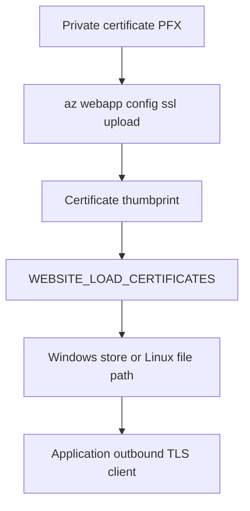

---
content_sources:
  diagrams:
    - id: outbound-client-certificates-flow
      type: flowchart
      source: mslearn-adapted
      mslearn_url: https://learn.microsoft.com/en-us/azure/app-service/configure-ssl-certificate-in-code
      based_on:
        - https://learn.microsoft.com/en-us/azure/app-service/configure-ssl-certificate
        - https://learn.microsoft.com/en-us/azure/app-service/app-service-key-vault-references
content_validation:
  status: verified
  last_reviewed: "2026-04-25"
  reviewer: ai-agent
  core_claims:
    - claim: "The az webapp config ssl upload command uploads a private PFX certificate to an App Service app."
      source: "https://learn.microsoft.com/en-us/cli/azure/webapp/config/ssl?view=azure-cli-latest"
      verified: true
    - claim: "WEBSITE_LOAD_CERTIFICATES exposes selected certificates to app code."
      source: "https://learn.microsoft.com/en-us/azure/app-service/configure-ssl-certificate-in-code"
      verified: true
    - claim: "On Windows-hosted apps, certificates are available in CurrentUser\\My, and on Linux containers private certificates are available under /var/ssl/private."
      source: "https://learn.microsoft.com/en-us/azure/app-service/configure-ssl-certificate-in-code"
      verified: true
    - claim: "Key Vault references can refresh to the latest version within 24 hours when the version is not pinned."
      source: "https://learn.microsoft.com/en-us/azure/app-service/app-service-key-vault-references"
      verified: true
---

# Outbound Client Certificates

Use this runbook when your App Service app must present its own client certificate to a downstream service for mutual TLS. The platform handles certificate upload and exposure to app code, but your application still must load the certificate and attach it to the outbound TLS client.

## Prerequisites

- Private certificate exported as password-protected `.pfx` / PKCS#12
- Permission to upload certificates and update app settings
- Target service that requires client-certificate authentication
- Variables set:
    - `$RG`
    - `$APP_NAME`

## When to Use

Use outbound client certificates when:

- A partner API requires certificate-based client authentication
- Internal APIs behind a gateway require mTLS from the caller
- The application must present a private certificate instead of bearer-token-based identity

## Procedure

<!-- diagram-id: outbound-client-certificates-flow -->


### 1) Upload the private certificate

```bash
az webapp config ssl upload \
  --resource-group $RG \
  --name $APP_NAME \
  --certificate-file ./client-cert.pfx \
  --certificate-password "<certificate-password>" \
  --output json
```

Capture the thumbprint from the command output or inspect uploaded certificates:

```bash
az webapp config ssl list \
  --resource-group $RG \
  --output json
```

### 2) Make the certificate available to code

Expose one certificate by thumbprint:

```bash
az webapp config appsettings set \
  --resource-group $RG \
  --name $APP_NAME \
  --settings WEBSITE_LOAD_CERTIFICATES="<thumbprint>" \
  --output json
```

Expose all uploaded certificates:

```bash
az webapp config appsettings set \
  --resource-group $RG \
  --name $APP_NAME \
  --settings WEBSITE_LOAD_CERTIFICATES="*" \
  --output json
```

!!! warning "Prefer explicit thumbprints over wildcard loading"
    `WEBSITE_LOAD_CERTIFICATES="*"` is convenient for testing, but explicit thumbprints reduce ambiguity and make certificate rotation easier to audit.

### 3) Know where the certificate appears at runtime

Runtime access differs by hosting OS:

| Hosting model | Where the certificate appears |
|---|---|
| Windows-hosted App Service | `CurrentUser\My` certificate store |
| Windows containers | `C:\appservice\certificates\...` paths or container certificate stores, depending on container model |
| Linux containers / built-in Linux | `/var/ssl/private` for private certificates and `/var/ssl/certs` for public certificates |

Useful environment variables in containers:

- `WEBSITE_PRIVATE_CERTS_PATH`
- `WEBSITE_PUBLIC_CERTS_PATH`
- `WEBSITE_INTERMEDIATE_CERTS_PATH`
- `WEBSITE_ROOT_CERTS_PATH`

### 4) Restart after changing certificate visibility

When you change thumbprints or add certificates after initial configuration, restart the app so the new certificate exposure is consistent for application code.

```bash
az webapp restart \
  --resource-group $RG \
  --name $APP_NAME
```

### 5) Plan rotation deliberately

Recommended rotation shape:

1. Upload the renewed certificate.
2. Add the new thumbprint to `WEBSITE_LOAD_CERTIFICATES` or switch to the new thumbprint.
3. Restart the app.
4. Validate outbound mTLS calls.
5. Remove the retired certificate after successful cutover.

For configuration indirection, use Key Vault references where appropriate and remember that unpinned references can refresh to the latest version within 24 hours.

!!! note
    Key Vault references help with configuration rotation, but the exact certificate-loading pattern still depends on how your app reads certificate material at runtime.

## Verification

Check the app setting:

```bash
az webapp config appsettings list \
  --resource-group $RG \
  --name $APP_NAME \
  --query "[?name=='WEBSITE_LOAD_CERTIFICATES']" \
  --output json
```

Check uploaded certificates:

```bash
az webapp config ssl list \
  --resource-group $RG \
  --query "[?hostNames==null].{thumbprint:thumbprint,subjectName:subjectName,expirationDate:expirationDate}" \
  --output json
```

Application-level verification:

- Windows code-based app can find the certificate in `CurrentUser\My`
- Windows container app can resolve the certificate from its documented container path or store model
- Linux app can open the expected file under `/var/ssl/private`
- The remote service accepts the outbound request and logs the expected client certificate identity

## Rollback / Troubleshooting

Common issues:

- Certificate not found in app code:
    - thumbprint mismatch in `WEBSITE_LOAD_CERTIFICATES`
    - app restart was skipped
    - wrong OS-specific lookup logic
- Upload succeeded but outbound calls still fail:
    - wrong certificate password at runtime for `.p12`
    - remote service does not trust the client certificate chain
    - app never attached the certificate to its HTTP or TLS client
- Rotation did not take effect:
    - app still references old thumbprint
    - certificate reference refresh window not yet elapsed

Rollback by restoring the previous thumbprint and restarting the app:

```bash
az webapp config appsettings set \
  --resource-group $RG \
  --name $APP_NAME \
  --settings WEBSITE_LOAD_CERTIFICATES="<previous-thumbprint>" \
  --output json

az webapp restart \
  --resource-group $RG \
  --name $APP_NAME
```

## See Also

- [Mutual TLS Architecture](../platform/mtls.md)
- [Incoming Client Certificates](./incoming-client-certificates.md)
- [Python mTLS Client Certificates Recipe](../language-guides/python/recipes/mtls-client-certificates.md)
- [.NET mTLS Client Certificates Recipe](../language-guides/dotnet/recipes/mtls-client-certificates.md)

## Sources

- [az webapp config ssl (Azure CLI) (Microsoft Learn)](https://learn.microsoft.com/en-us/cli/azure/webapp/config/ssl?view=azure-cli-latest)
- [Use TLS/SSL certificates in your application code in Azure App Service (Microsoft Learn)](https://learn.microsoft.com/en-us/azure/app-service/configure-ssl-certificate-in-code)
- [Add and manage TLS/SSL certificates in Azure App Service (Microsoft Learn)](https://learn.microsoft.com/en-us/azure/app-service/configure-ssl-certificate)
- [Use Key Vault references as app settings in Azure App Service (Microsoft Learn)](https://learn.microsoft.com/en-us/azure/app-service/app-service-key-vault-references)
