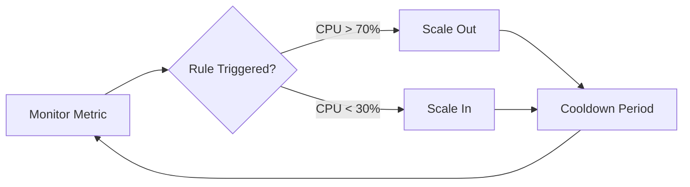

# Scaling Operations

Scale App Service capacity safely by combining vertical and horizontal scaling with autoscale rules, guardrails, and verification checks. This guide is language-agnostic and focuses on platform-level operations.



## Prerequisites

- Azure CLI authenticated (`az login`)
- Existing App Service Plan and Web App
- Metrics flowing to Azure Monitor
- Variables set in shell:
  - `RG`
  - `APP_NAME`
  - `PLAN_NAME`

## Main Content

### Understand Scale Up vs Scale Out

- **Scale up (vertical):** change plan SKU for more CPU/memory per instance
- **Scale out (horizontal):** increase worker instance count
- **Rule of thumb:**
  - scale up when single instance memory/CPU saturation occurs
  - scale out when traffic concurrency is the bottleneck

### Inspect Current Capacity

```bash
az appservice plan show \
  --resource-group $RG \
  --name $PLAN_NAME \
  --query "{sku:sku.name,capacity:sku.capacity,workers:numberOfWorkers,kind:kind}" \
  --output json
```

Sample output (PII-masked):

```json
{
  "sku": "S1",
  "capacity": 1,
  "workers": 1,
  "kind": "linux"
}
```

### Scale Up (Vertical Scaling)

Use scale up when one instance is consistently overloaded even at low concurrency.

```bash
az appservice plan update \
  --resource-group $RG \
  --name $PLAN_NAME \
  --sku P1V3 \
  --output json
```

After scaling up, verify effective SKU:

```bash
az appservice plan show \
  --resource-group $RG \
  --name $PLAN_NAME \
  --query "sku.name" \
  --output tsv
```

### Scale Out (Horizontal Scaling)

Use scale out to improve throughput and reduce queueing latency.

```bash
az appservice plan update \
  --resource-group $RG \
  --name $PLAN_NAME \
  --number-of-workers 3 \
  --output json
```

Check current worker count:

```bash
az appservice plan show \
  --resource-group $RG \
  --name $PLAN_NAME \
  --query "numberOfWorkers" \
  --output tsv
```

### Create Autoscale Baseline

Create autoscale settings on the **App Service Plan** resource.

```bash
PLAN_ID=$(az appservice plan show \
  --resource-group $RG \
  --name $PLAN_NAME \
  --query id \
  --output tsv)

az monitor autoscale create \
  --resource-group $RG \
  --resource $PLAN_ID \
  --resource-type Microsoft.Web/serverfarms \
  --name "autoscale-$PLAN_NAME" \
  --min-count 1 \
  --max-count 5 \
  --count 2 \
  --output json
```

Add CPU-based scale-out rule:

```bash
az monitor autoscale rule create \
  --resource-group $RG \
  --autoscale-name "autoscale-$PLAN_NAME" \
  --condition "Percentage CPU > 70 avg 10m" \
  --scale out 1 \
  --cooldown 10 \
  --output json
```

Add CPU-based scale-in rule:

```bash
az monitor autoscale rule create \
  --resource-group $RG \
  --autoscale-name "autoscale-$PLAN_NAME" \
  --condition "Percentage CPU < 35 avg 15m" \
  --scale in 1 \
  --cooldown 15 \
  --output json
```

### Add Schedule-Based Scaling

For predictable traffic windows, combine metric autoscale with schedules.

```bash
az monitor autoscale profile create \
  --resource-group $RG \
  --autoscale-name "autoscale-$PLAN_NAME" \
  --name "business-hours" \
  --min-count 2 \
  --max-count 8 \
  --count 3 \
  --recurrence "timezone=UTC days=Monday Tuesday Wednesday Thursday Friday hours=08 minutes=00" \
  --output json
```

!!! warning "Avoid aggressive scale-in"
    Keep scale-in thresholds conservative and cooldown periods longer than scale-out. Fast scale-in can cause oscillation and cold-instance penalties.

### Configure Safe Runtime Settings for Scale Events

Keep operational settings that improve scale behavior:

```bash
az webapp config appsettings set \
  --resource-group $RG \
  --name $APP_NAME \
  --settings \
    WEBSITE_HEALTHCHECK_MAXPINGFAILURES=10 \
    WEBSITES_CONTAINER_START_TIME_LIMIT=1800 \
  --output json
```

These settings help absorb startup variance during scale-out and reduce false unhealthy detection.

### Observe Autoscale Execution

```bash
az monitor autoscale show \
  --resource-group $RG \
  --name "autoscale-$PLAN_NAME" \
  --query "{enabled:enabled,profiles:profiles[].name,notifications:notifications}" \
  --output json
```

Recent autoscale activity:

```bash
az monitor activity-log list \
  --resource-group $RG \
  --max-events 20 \
  --offset 1d \
  --query "[?contains(operationName.value, 'Autoscale')].{time:eventTimestamp,status:status.value,operation:operationName.localizedValue}" \
  --output table
```

### Verification Checklist

1. Plan SKU matches expected tier
2. Worker count changes correctly under load
3. Autoscale profile is enabled
4. Activity log records scale actions
5. Application SLO remains within target during scale transitions

### Troubleshooting

#### Autoscale does not trigger

- Confirm metric namespace and condition syntax
- Check evaluation window (`avg 10m`) is long enough
- Verify min/max bounds are not preventing action

#### Scale actions trigger but performance remains poor

- Inspect dependency bottlenecks (database, downstream APIs)
- Verify health check endpoint is lightweight and reliable
- Confirm outbound networking path is not constrained

#### Scale-in causes transient errors

- Increase scale-in cooldown
- Lower scale-in aggressiveness
- Ensure the application tolerates instance recycling

## Advanced Topics

### Multi-signal Autoscale Design

CPU-only autoscale is often insufficient. Consider combined signals:

- CPU percentage
- Memory percentage
- HTTP queue length
- P95 latency

Use one signal for rapid scale-out and another for conservative scale-in.

### Regional Resilience and Capacity

For critical workloads, pair scaling with multi-region routing:

- Keep warm baseline capacity in secondary region
- Route with Front Door or Traffic Manager
- Test failover with production-like traffic replay

### Governance for Scaling Changes

- Restrict plan updates through RBAC
- Use change windows for SKU transitions
- Capture rationale in incident/change records

!!! info "Enterprise Considerations"
    Standardize autoscale profiles by environment (dev/test/prod), apply Azure Policy for minimum SKU and HTTPS controls, and audit scaling actions centrally through activity logs.

## Language-Specific Details

For language-specific operational guidance, see:
- [Node.js Guide](https://yeongseon.github.io/azure-appservice-nodejs-guide/)
- [Python Guide](https://yeongseon.github.io/azure-appservice-python-guide/)
- [Java Guide](https://yeongseon.github.io/azure-appservice-java-guide/)
- [.NET Guide](https://yeongseon.github.io/azure-appservice-dotnet-guide/)

## See Also

- [Operations Index](./index.md)
- [Health and Recovery](./health-recovery.md)
- [Cost Optimization](./cost-optimization.md)
- [Scale up an App Service plan (Microsoft Learn)](https://learn.microsoft.com/azure/app-service/manage-scale-up)
- [Azure Monitor autoscale (Microsoft Learn)](https://learn.microsoft.com/azure/azure-monitor/autoscale/autoscale-get-started)
