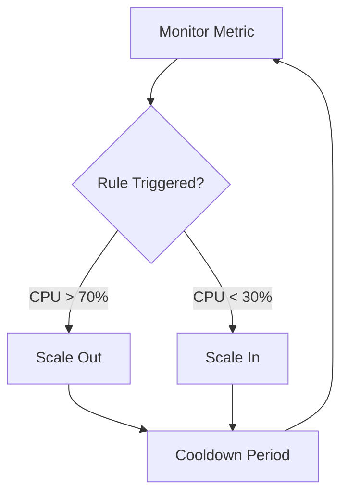

---
content_sources:
  diagrams:
    - id: autoscale-feedback-loop
      type: flowchart
      source: mslearn-adapted
      mslearn_url: https://learn.microsoft.com/en-us/azure/app-service/manage-scale-up
content_validation:
  status: verified
  last_reviewed: "2026-04-12"
  reviewer: agent
  core_claims:
    - claim: "Scale up changes the App Service Plan SKU for more CPU and memory per instance."
      source: "https://learn.microsoft.com/en-us/azure/app-service/manage-scale-up"
      verified: true
    - claim: "Scale out increases the number of worker instances in the App Service Plan."
      source: "https://learn.microsoft.com/en-us/azure/app-service/manage-scale-up"
      verified: true
    - claim: "Autoscale settings are created on the App Service Plan resource."
      source: "https://learn.microsoft.com/en-us/azure/app-service/manage-scale-up"
      verified: true
    - claim: "Schedule-based scaling can be combined with metric-based autoscale for predictable traffic windows."
      source: "https://learn.microsoft.com/en-us/azure/app-service/manage-scale-up"
      verified: true
---

# Scaling Operations

Scale App Service capacity safely by combining vertical and horizontal scaling with autoscale rules, guardrails, and verification checks. This guide is language-agnostic and focuses on platform-level operations.

<!-- diagram-id: autoscale-feedback-loop -->

```mermaid
flowchart TD
    Metric[Monitor Metric] --> Rule{Rule Triggered?}
    Rule -- CPU > 70% --> ScaleOut[Scale Out]
    Rule -- CPU < 30% --> ScaleIn[Scale In]

    ScaleOut --> Cooldown[Cooldown Period]
    ScaleIn --> Cooldown

    Cooldown --> Metric
```

## Prerequisites

- Azure CLI authenticated (`az login`)
- Existing App Service Plan and Web App
- Metrics flowing to Azure Monitor
- Variables set in shell:
    - `RG`
    - `APP_NAME`
    - `PLAN_NAME`

## When to Use

## Procedure

### Understand Scale Up vs Scale Out

- **Scale up (vertical):** change plan SKU for more CPU/memory per instance
- **Scale out (horizontal):** increase worker instance count
- **Rule of thumb:**
    - scale up when single instance memory/CPU saturation occurs
    - scale out when traffic concurrency is the bottleneck

### Inspect Current Capacity

```bash
az appservice plan show \
  --resource-group $RG \
  --name $PLAN_NAME \
  --query "{sku:sku.name,capacity:sku.capacity,workers:numberOfWorkers,kind:kind}" \
  --output json
```

| Flag | Description |
|---|---|
| `--resource-group $RG` | Targets the resource group that contains the App Service plan. |
| `--name $PLAN_NAME` | Selects the plan whose current scale settings you want to inspect. |
| `--query "{sku:sku.name,...}"` | Returns only the current SKU, configured capacity, worker count, and hosting kind from the plan response. |
| `--output json` | Formats the filtered capacity snapshot as JSON. |

Sample output (PII-masked):

```json
{
  "sku": "S1",
  "capacity": 1,
  "workers": 1,
  "kind": "linux"
}
```

### Scale Up (Vertical Scaling)

Use scale up when one instance is consistently overloaded even at low concurrency.

```bash
az appservice plan update \
  --resource-group $RG \
  --name $PLAN_NAME \
  --sku P1V3 \
  --output json
```

| Flag | Description |
|---|---|
| `--resource-group $RG` | Targets the resource group that contains the plan. |
| `--name $PLAN_NAME` | Selects the App Service plan to resize vertically. |
| `--sku P1V3` | Changes the plan to the `P1V3` SKU so each worker gets the compute and memory profile of that tier. |
| `--output json` | Returns the updated plan definition as JSON. |

After scaling up, verify effective SKU:

```bash
az appservice plan show \
  --resource-group $RG \
  --name $PLAN_NAME \
  --query "sku.name" \
  --output tsv
```

| Flag | Description |
|---|---|
| `--resource-group $RG` | Targets the resource group that contains the plan. |
| `--name $PLAN_NAME` | Selects the plan whose active SKU you want to confirm after scaling up. |
| `--query "sku.name"` | Returns only the plan SKU name from the control-plane response. |
| `--output tsv` | Prints the SKU name as plain text for quick shell verification. |

### Scale Out (Horizontal Scaling)

Use scale out to improve throughput and reduce queueing latency.

```bash
az appservice plan update \
  --resource-group $RG \
  --name $PLAN_NAME \
  --number-of-workers 3 \
  --output json
```

| Flag | Description |
|---|---|
| `--resource-group $RG` | Targets the resource group that contains the plan. |
| `--name $PLAN_NAME` | Selects the App Service plan to scale horizontally. |
| `--number-of-workers 3` | Sets the plan to run on three worker instances. |
| `--output json` | Returns the updated worker-count configuration as JSON. |

Check current worker count:

```bash
az appservice plan show \
  --resource-group $RG \
  --name $PLAN_NAME \
  --query "numberOfWorkers" \
  --output tsv
```

| Flag | Description |
|---|---|
| `--resource-group $RG` | Targets the resource group that contains the plan. |
| `--name $PLAN_NAME` | Selects the plan whose worker count you want to confirm. |
| `--query "numberOfWorkers"` | Returns only the active worker-instance count from the plan response. |
| `--output tsv` | Prints the worker count as plain text for quick verification. |

### Create Autoscale Baseline

Create autoscale settings on the **App Service Plan** resource.

```bash
PLAN_ID=$(az appservice plan show \
  --resource-group $RG \
  --name $PLAN_NAME \
  --query id \
  --output tsv)

az monitor autoscale create \
  --resource-group $RG \
  --resource $PLAN_ID \
  --resource-type Microsoft.Web/serverfarms \
  --name "autoscale-$PLAN_NAME" \
  --min-count 1 \
  --max-count 5 \
  --count 2 \
  --output json
```

| Command | Description |
|---|---|
| `PLAN_ID=$(az appservice plan show ...)` | Reads the App Service plan's Azure resource ID and stores it in `PLAN_ID` so the autoscale setting can target the correct server farm resource. |
| `az monitor autoscale create ...` | Creates the baseline autoscale setting on that App Service plan with minimum, maximum, and default worker counts. |

Add CPU-based scale-out rule:

```bash
az monitor autoscale rule create \
  --resource-group $RG \
  --autoscale-name "autoscale-$PLAN_NAME" \
  --condition "Percentage CPU > 70 avg 10m" \
  --scale out 1 \
  --cooldown 10 \
  --output json
```

| Flag | Description |
|---|---|
| `--resource-group $RG` | Targets the resource group that contains the autoscale setting. |
| `--autoscale-name "autoscale-$PLAN_NAME"` | Adds the rule to the named autoscale configuration for this plan. |
| `--condition "Percentage CPU > 70 avg 10m"` | Triggers scale-out when average CPU stays above 70 percent for 10 minutes. |
| `--scale out 1` | Increases the worker count by one instance when the rule fires. |
| `--cooldown 10` | Waits 10 minutes after the scale-out action before the rule can adjust capacity again. |
| `--output json` | Returns the created scale-out rule as JSON. |

Add CPU-based scale-in rule:

```bash
az monitor autoscale rule create \
  --resource-group $RG \
  --autoscale-name "autoscale-$PLAN_NAME" \
  --condition "Percentage CPU < 35 avg 20m" \
  --scale in 1 \
  --cooldown 15 \
  --output json
```

| Flag | Description |
|---|---|
| `--resource-group $RG` | Targets the resource group that contains the autoscale setting. |
| `--autoscale-name "autoscale-$PLAN_NAME"` | Adds the rule to the named autoscale configuration for this plan. |
| `--condition "Percentage CPU < 35 avg 20m"` | Triggers scale-in when average CPU stays below 35 percent for 20 minutes. |
| `--scale in 1` | Reduces the worker count by one instance when the rule fires. |
| `--cooldown 15` | Waits 15 minutes after the scale-in action before this rule can act again. |
| `--output json` | Returns the created scale-in rule as JSON. |

#### Portal view: Autoscale setting blade

[[[ shot("operations--scaling--01-autoscale-rules") ]]]

The Autoscale setting blade is the Portal surface where the `az monitor autoscale create` and `az monitor autoscale rule create` commands above land. Three details in this view are operationally critical: `Custom autoscale` is selected (the only mode that honors metric-based rules — `Manual scale` would ignore every rule defined below), the auto-generated `Default` scale condition is the implicit fallback that runs when no other condition matches, and the warning beneath `Rules` ("no rule(s) is defined") is exactly the gap the two `az monitor autoscale rule create` commands above (scale-out at CPU > 70% and scale-in at CPU < 35%) close. The `Instance limits` row currently reads `Minimum 1 / Maximum 1 / Default 1`, which is the single most common autoscale anti-pattern: every rule will fire but instance count never moves because the bounds are pinned to 1 — confirm `--min-count` and `--max-count` from the CLI command above are reflected here as 1 and 5 respectively before declaring the baseline complete.

### Add Schedule-Based Scaling

For predictable traffic windows, combine metric autoscale with schedules.

```bash
az monitor autoscale profile create \
  --resource-group $RG \
  --autoscale-name "autoscale-$PLAN_NAME" \
  --name "business-hours" \
  --min-count 2 \
  --max-count 8 \
  --count 3 \
  --recurrence "timezone=UTC days=Monday Tuesday Wednesday Thursday Friday hours=08 minutes=00" \
  --output json
```

| Flag | Description |
|---|---|
| `--resource-group $RG` | Targets the resource group that contains the autoscale setting. |
| `--autoscale-name "autoscale-$PLAN_NAME"` | Adds a scheduled profile to the existing autoscale configuration for this plan. |
| `--name "business-hours"` | Names the schedule profile that should apply during predictable traffic periods. |
| `--min-count 2` | Keeps at least two workers online while this profile is active. |
| `--max-count 8` | Allows the schedule profile to scale out to as many as eight workers. |
| `--count 3` | Sets three workers as the default capacity when the profile becomes active. |
| `--recurrence "timezone=UTC ..."` | Activates the profile at 08:00 UTC on weekdays. |
| `--output json` | Returns the created autoscale profile as JSON. |

!!! warning "Avoid aggressive scale-in"
    Keep scale-in thresholds conservative and cooldown periods longer than scale-out. Fast scale-in can cause oscillation and cold-instance penalties.

### Configure Safe Runtime Settings for Scale Events

Keep operational settings that improve scale behavior:

```bash
az webapp config appsettings set \
  --resource-group $RG \
  --name $APP_NAME \
  --settings \
    WEBSITE_HEALTHCHECK_MAXPINGFAILURES=10 \
    WEBSITES_CONTAINER_START_TIME_LIMIT=1800 \
  --output json
```

| Flag | Description |
|---|---|
| `--resource-group $RG` | Targets the resource group that contains the app. |
| `--name $APP_NAME` | Selects the web app whose runtime settings should support scale events. |
| `--settings WEBSITE_HEALTHCHECK_MAXPINGFAILURES=10 WEBSITES_CONTAINER_START_TIME_LIMIT=1800` | Raises the health-check failure threshold to 10 probes and gives containers up to 1800 seconds to finish starting before App Service treats startup as failed. |
| `--output json` | Returns the updated app settings payload as JSON. |

These settings help absorb startup variance during scale-out and reduce false unhealthy detection.

### Observe Autoscale Execution

```bash
az monitor autoscale show \
  --resource-group $RG \
  --name "autoscale-$PLAN_NAME" \
  --query "{enabled:enabled,profiles:profiles[].name,notifications:notifications}" \
  --output json
```

| Flag | Description |
|---|---|
| `--resource-group $RG` | Targets the resource group that contains the autoscale setting. |
| `--name "autoscale-$PLAN_NAME"` | Selects the autoscale configuration to inspect. |
| `--query "{enabled:enabled,profiles:profiles[].name,notifications:notifications}"` | Returns whether autoscale is enabled, the names of the configured profiles, and any notification settings. |
| `--output json` | Formats the filtered autoscale configuration as JSON. |

Recent autoscale activity:

```bash
az monitor activity-log list \
  --resource-group $RG \
  --max-events 20 \
  --offset 1d \
  --query "[?contains(operationName.value, 'Autoscale')].{time:eventTimestamp,status:status.value,operation:operationName.localizedValue}" \
  --output table
```

| Flag | Description |
|---|---|
| `--resource-group $RG` | Limits the activity-log search to events for resources in this resource group. |
| `--max-events 20` | Returns at most 20 recent activity-log records. |
| `--offset 1d` | Searches the last one day of activity-log history. |
| `--query "[?contains(operationName.value, 'Autoscale')].{time:eventTimestamp,...}"` | Filters the activity log to autoscale-related operations and projects each event to time, status, and localized operation name. |
| `--output table` | Prints the filtered activity events in a compact table. |

## Verification

1. Plan SKU matches expected tier
2. Worker count changes correctly under load
3. Autoscale profile is enabled
4. Activity log records scale actions
5. Application SLO remains within target during scale transitions

## Rollback / Troubleshooting

#### Autoscale does not trigger

- Confirm metric namespace and condition syntax
- Check evaluation window (`avg 10m`) is long enough
- Verify min/max bounds are not preventing action

#### Scale actions trigger but performance remains poor

- Inspect dependency bottlenecks (database, downstream APIs)
- Verify health check endpoint is lightweight and reliable
- Confirm outbound networking path is not constrained

#### Scale-in causes transient errors

- Increase scale-in cooldown
- Lower scale-in aggressiveness
- Ensure the application tolerates instance recycling

## Advanced Topics

### Multi-signal Autoscale Design

CPU-only autoscale is often insufficient. Consider combined signals:

- CPU percentage
- Memory percentage
- HTTP queue length
- P95 latency

Use one signal for rapid scale-out and another for conservative scale-in.

### Regional Resilience and Capacity

For critical workloads, pair scaling with multi-region routing:

- Keep warm baseline capacity in secondary region
- Route with Front Door or Traffic Manager
- Test failover with production-like traffic replay

### Governance for Scaling Changes

- Restrict plan updates through RBAC
- Use change windows for SKU transitions
- Capture rationale in incident/change records

!!! info "Enterprise Considerations"
    Standardize autoscale profiles by environment (dev/test/prod), apply Azure Policy for minimum SKU and HTTPS controls, and audit scaling actions centrally through activity logs.

## Language-Specific Details

For language-specific operational guidance, see:
- [Node.js Guide](../language-guides/nodejs/index.md)
- [Python Guide](../language-guides/python/index.md)
- [Java Guide](../language-guides/java/index.md)
- [.NET Guide](../language-guides/dotnet/index.md)

## See Also

- [Operations Index](./index.md)
- [Health and Recovery](./health-recovery.md)
- [Cost Optimization](./cost-optimization.md)
- [Scale up an App Service plan (Microsoft Learn)](https://learn.microsoft.com/en-us/azure/app-service/manage-scale-up)
- [Azure Monitor autoscale (Microsoft Learn)](https://learn.microsoft.com/en-us/azure/azure-monitor/autoscale/autoscale-get-started)

## Sources

- [Scale up an App Service plan (Microsoft Learn)](https://learn.microsoft.com/en-us/azure/app-service/manage-scale-up)
- [Azure Monitor autoscale (Microsoft Learn)](https://learn.microsoft.com/en-us/azure/azure-monitor/autoscale/autoscale-get-started)
