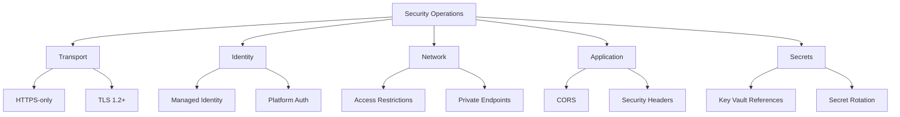

# Security Operations

Protect App Service workloads with layered controls: identity, authentication, transport security, network boundaries, and operational governance. This guide focuses on language-agnostic hardening steps.

## Prerequisites

- Existing Web App and App Service Plan
- Azure Entra tenant and permissions for identity/auth configuration
- Security ownership defined for app, platform, and network controls
- Variables set:
  - `RG`
  - `APP_NAME`

## Main Content



### Security Baseline Checklist

Apply these baseline controls first:

1. HTTPS-only enabled
2. Minimum TLS version enforced
3. Managed identity enabled
4. Access restrictions configured
5. Authentication policy chosen (platform and/or app)
6. Secrets stored outside application code

### Enforce HTTPS and TLS Minimum

```bash
az webapp update \
  --resource-group $RG \
  --name $APP_NAME \
  --https-only true \
  --output json

az webapp config set \
  --resource-group $RG \
  --name $APP_NAME \
  --min-tls-version 1.2 \
  --output json
```

Verify settings:

```bash
az webapp show \
  --resource-group $RG \
  --name $APP_NAME \
  --query "{httpsOnly:httpsOnly,state:state}" \
  --output json

az webapp config show \
  --resource-group $RG \
  --name $APP_NAME \
  --query "{minTlsVersion:minTlsVersion,ftpsState:ftpsState}" \
  --output json
```

### Enable System-Assigned Managed Identity

```bash
az webapp identity assign \
  --resource-group $RG \
  --name $APP_NAME \
  --output json
```

Retrieve principal ID:

```bash
az webapp identity show \
  --resource-group $RG \
  --name $APP_NAME \
  --query "{principalId:principalId,tenantId:tenantId,type:type}" \
  --output json
```

Sample output (PII-masked):

```json
{
  "principalId": "xxxxxxxx-xxxx-xxxx-xxxx-xxxxxxxxxxxx",
  "tenantId": "<tenant-id>",
  "type": "SystemAssigned"
}
```

### Configure Platform Authentication (App Service Auth)

Enable platform authentication with Entra ID:

```bash
az webapp auth update \
  --resource-group $RG \
  --name $APP_NAME \
  --enabled true \
  --action LoginWithAzureActiveDirectory \
  --output json
```

Alternatively configure provider-specific details:

```bash
az webapp auth microsoft update \
  --resource-group $RG \
  --name $APP_NAME \
  --client-id "<app-registration-client-id>" \
  --client-secret "<client-secret>" \
  --allowed-audiences "api://<app-registration-client-id>" \
  --output json
```

!!! warning "Protect client secrets"
    Never store client secrets in source control or plain-text operational notes. Prefer managed identity and secure secret stores whenever possible.

### Restrict Inbound Access by IP or Private Networking

```bash
az webapp config access-restriction add \
  --resource-group $RG \
  --name $APP_NAME \
  --rule-name AllowCorp \
  --action Allow \
  --ip-address 203.0.113.0/24 \
  --priority 100 \
  --output json

az webapp config access-restriction add \
  --resource-group $RG \
  --name $APP_NAME \
  --rule-name DenyAll \
  --action Deny \
  --ip-address 0.0.0.0/0 \
  --priority 2147483647 \
  --output json
```

### Secure Secrets and Configuration

Recommended controls:

- Store credentials in secure secret store services
- Use Key Vault references in app settings where possible
- Rotate secrets on a fixed schedule
- Audit secret access and failed retrieval events

Set Key Vault reference style app setting:

```bash
az webapp config appsettings set \
  --resource-group $RG \
  --name $APP_NAME \
  --settings "DB_PASSWORD=@Microsoft.KeyVault(SecretUri=https://kv-shared.vault.azure.net/secrets/db-password/)" \
  --output json
```

### Harden Publishing and Administrative Surfaces

Disable insecure FTP where policy requires:

```bash
az webapp config set \
  --resource-group $RG \
  --name $APP_NAME \
  --ftps-state Disabled \
  --output json
```

Prefer deployment through secure CI/CD identities and least privilege RBAC.

### Configure CORS

Set allowed origins for cross-origin requests:

```bash
az webapp cors add \
  --resource-group $RG \
  --name $APP_NAME \
  --allowed-origins "https://frontend.example.com" "https://admin.example.com" \
  --output json
```

View current CORS configuration:

```bash
az webapp cors show \
  --resource-group $RG \
  --name $APP_NAME \
  --output json
```

Remove a specific origin:

```bash
az webapp cors remove \
  --resource-group $RG \
  --name $APP_NAME \
  --allowed-origins "https://old-frontend.example.com" \
  --output json
```

!!! warning "Avoid wildcard origins with credentials"
    Setting `--allowed-origins "*"` allows any origin. When combined with App Service Authentication, this can expose tokens to unauthorized frontends. Always specify explicit origins in production.

!!! info "Platform CORS vs Application CORS"
    App Service platform CORS and application-level CORS middleware (e.g., Flask-CORS, Express cors) can conflict. Use one or the other, not both. If the platform handles CORS, disable it in your application code to avoid duplicate headers.

### Configure Security Headers

App Service does not set security headers by default. Add them via application code or web.config/custom startup.

Recommended production headers:

| Header | Recommended Value | Purpose |
|--------|------------------|---------|
| `Strict-Transport-Security` | `max-age=31536000; includeSubDomains` | Enforce HTTPS via HSTS |
| `X-Content-Type-Options` | `nosniff` | Prevent MIME sniffing |
| `X-Frame-Options` | `DENY` | Prevent clickjacking |
| `Content-Security-Policy` | `default-src 'self'` | Prevent XSS and injection |
| `Referrer-Policy` | `strict-origin-when-cross-origin` | Limit referrer leakage |
| `Permissions-Policy` | `camera=(), microphone=(), geolocation=()` | Restrict browser features |

Verify headers are present:

```bash
curl --silent --head "https://$APP_NAME.azurewebsites.net" | grep -iE "(strict-transport|x-content-type|x-frame|content-security|referrer-policy|permissions-policy)"
```

!!! info "Where to set headers"
    On Linux App Service, set headers in your application framework (Flask, Express, Spring, ASP.NET middleware). On Windows, you can also use `web.config` custom headers. For both, Azure Front Door can inject headers at the edge.

### Verification

Authentication and identity:

```bash
az webapp auth show \
  --resource-group $RG \
  --name $APP_NAME \
  --output json

az webapp identity show \
  --resource-group $RG \
  --name $APP_NAME \
  --output json
```

Access restrictions:

```bash
az webapp config access-restriction show \
  --resource-group $RG \
  --name $APP_NAME \
  --output json
```

Transport checks:

```bash
curl --silent --show-error --include "http://$APP_NAME.azurewebsites.net"
curl --silent --show-error --include "https://$APP_NAME.azurewebsites.net"
```

Expected:

- HTTP redirects to HTTPS
- TLS meets minimum baseline
- unauthorized requests challenged or denied by policy

### Troubleshooting

#### Authentication redirect loop

- verify allowed redirect URIs in app registration
- ensure hostnames match custom domain configuration
- confirm authentication policy aligns with reverse proxy setup

#### Managed identity access denied

- verify role assignments on target resource
- confirm principal ID used in role assignment is current
- allow propagation delay after role changes

#### Unexpected public access

- review access restriction priorities
- confirm deny-all rule exists
- verify private endpoint DNS resolution path

## Advanced Topics

### Defense-in-Depth Pattern

Combine:

- private inbound networking
- authentication at platform layer
- authorization in application layer
- managed identity for outbound resource access
- central policy enforcement

### Security Operations Cadence

Run periodic activities:

- monthly access review
- quarterly secret rotation verification
- recurring incident simulation for auth/network outage
- security baseline drift report

### Policy and Compliance at Scale

Use Azure Policy to enforce controls such as:

- HTTPS-only required
- minimum TLS version
- managed identity required
- diagnostic settings required

!!! info "Enterprise Considerations"
    Security posture improves when baseline configuration is enforced by policy and continuously audited, not only documented. Treat configuration drift as a security incident precursor.

## Language-Specific Details

For language-specific security patterns and auth integration:

- [Python Managed Identity](../language-guides/python/recipes/managed-identity.md)
- [Python Easy Auth](../language-guides/python/recipes/easy-auth.md)
- [Node.js Managed Identity](../language-guides/nodejs/recipes/managed-identity.md)
- [Node.js Easy Auth](../language-guides/nodejs/recipes/easy-auth.md)
- [Java Managed Identity](../language-guides/java/recipes/managed-identity.md)
- [Java Easy Auth](../language-guides/java/recipes/easy-auth.md)
- [.NET Managed Identity](../language-guides/dotnet/recipes/managed-identity.md)
- [.NET Easy Auth](../language-guides/dotnet/recipes/easy-auth.md)

## See Also

- [Operations Index](./index.md)
- [Authentication Architecture](../platform/authentication-architecture.md)
- [Security Architecture](../platform/security-architecture.md)
- [Networking](./networking.md)
- [Health and Recovery](./health-recovery.md)
- [App Service security overview (Microsoft Learn)](https://learn.microsoft.com/azure/app-service/overview-security)
- [Authentication and authorization (Microsoft Learn)](https://learn.microsoft.com/azure/app-service/overview-authentication-authorization)
- [Configure CORS (Microsoft Learn)](https://learn.microsoft.com/azure/app-service/app-service-web-tutorial-rest-api#enable-cors)
