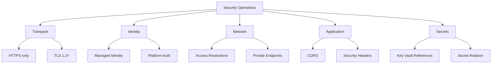

---
content_sources:
  diagrams:
    - id: security-operations-control-layers
      type: flowchart
      source: mslearn-adapted
      mslearn_url: https://learn.microsoft.com/en-us/azure/app-service/overview-security
      based_on:
        - https://learn.microsoft.com/en-us/azure/app-service/networking-features
content_validation:
  status: verified
  last_reviewed: "2026-04-12"
  reviewer: agent
  core_claims:
    - claim: "App Service supports enforcing HTTPS-only access."
      source: "https://learn.microsoft.com/en-us/azure/app-service/overview-security"
      verified: true
    - claim: "App Service supports configuring a minimum TLS version."
      source: "https://learn.microsoft.com/en-us/azure/app-service/overview-security"
      verified: true
    - claim: "App Service supports managed identities for apps."
      source: "https://learn.microsoft.com/en-us/azure/app-service/overview-security"
      verified: true
    - claim: "Access restrictions can be used to limit inbound traffic to an App Service app."
      source: "https://learn.microsoft.com/en-us/azure/app-service/networking-features"
      verified: true
    - claim: "App Service app settings can use Azure Key Vault references for secrets."
      source: "https://learn.microsoft.com/en-us/azure/app-service/app-service-key-vault-references"
      verified: true
---

# Security Operations

Protect App Service workloads with layered controls: identity, authentication, transport security, network boundaries, and operational governance. This guide focuses on language-agnostic hardening steps.

## Prerequisites

- Existing Web App and App Service Plan
- Azure Entra tenant and permissions for identity/auth configuration
- Security ownership defined for app, platform, and network controls
- Variables set:
    - `RG`
    - `APP_NAME`

## When to Use

## Procedure

<!-- diagram-id: security-operations-control-layers -->

```mermaid
flowchart TD
    A[Security Operations] --> B[Transport]
    A --> C[Identity]
    A --> D[Network]
    A --> E[Application]
    A --> F[Secrets]
    B --> B1[HTTPS-only]
    B --> B2[TLS 1.2+]
    C --> C1[Managed Identity]
    C --> C2[Platform Auth]
    D --> D1[Access Restrictions]
    D --> D2[Private Endpoints]
    E --> E1[CORS]
    E --> E2[Security Headers]
    F --> F1[Key Vault References]
    F --> F2[Secret Rotation]
```

### Security Baseline Checklist

Apply these baseline controls first:

1. HTTPS-only enabled
2. Minimum TLS version enforced
3. Managed identity enabled
4. Access restrictions configured
5. Authentication policy chosen (platform and/or app)
6. Secrets stored outside application code

### Enforce HTTPS and TLS Minimum

```bash
az webapp update \
  --resource-group $RG \
  --name $APP_NAME \
  --https-only true \
  --output json

az webapp config set \
  --resource-group $RG \
  --name $APP_NAME \
  --min-tls-version 1.2 \
  --output json
```

| Command | Description |
|---|---|
| `az webapp update ...` | Enforces HTTPS-only access on the web app so App Service redirects plain HTTP requests. |
| `az webapp config set ...` | Sets the site's minimum accepted TLS version to 1.2. |

Verify settings:

```bash
az webapp show \
  --resource-group $RG \
  --name $APP_NAME \
  --query "{httpsOnly:httpsOnly,state:state}" \
  --output json

az webapp config show \
  --resource-group $RG \
  --name $APP_NAME \
  --query "{minTlsVersion:minTlsVersion,ftpsState:ftpsState}" \
  --output json
```

| Command | Description |
|---|---|
| `az webapp show ...` | Retrieves the app resource so you can confirm HTTPS-only is enabled and the site is running. |
| `az webapp config show ...` | Retrieves the site configuration so you can confirm the enforced minimum TLS version and current FTPS state. |

### Enable System-Assigned Managed Identity

```bash
az webapp identity assign \
  --resource-group $RG \
  --name $APP_NAME \
  --output json
```

| Flag | Description |
|---|---|
| `--resource-group $RG` | Targets the resource group that contains the web app. |
| `--name $APP_NAME` | Enables a system-assigned managed identity on the selected app. |
| `--output json` | Returns the identity assignment result as JSON. |

Retrieve principal ID:

```bash
az webapp identity show \
  --resource-group $RG \
  --name $APP_NAME \
  --query "{principalId:principalId,tenantId:tenantId,type:type}" \
  --output json
```

| Flag | Description |
|---|---|
| `--resource-group $RG` | Targets the resource group that contains the app. |
| `--name $APP_NAME` | Selects the app whose managed-identity details you want to inspect. |
| `--query "{principalId:principalId,tenantId:tenantId,type:type}"` | Returns the managed identity object fields you typically need for RBAC work: principal ID, tenant ID, and identity type. |
| `--output json` | Formats the filtered identity object as JSON. |

Sample output (PII-masked):

```json
{
  "principalId": "xxxxxxxx-xxxx-xxxx-xxxx-xxxxxxxxxxxx",
  "tenantId": "<tenant-id>",
  "type": "SystemAssigned"
}
```

### Configure Platform Authentication (App Service Auth)

Enable platform authentication with Entra ID:

```bash
az webapp auth update \
  --resource-group $RG \
  --name $APP_NAME \
  --enabled true \
  --action LoginWithAzureActiveDirectory \
  --output json
```

| Flag | Description |
|---|---|
| `--resource-group $RG` | Targets the resource group that contains the app. |
| `--name $APP_NAME` | Selects the app where platform authentication should be enabled. |
| `--enabled true` | Turns on App Service Authentication for the web app. |
| `--action LoginWithAzureActiveDirectory` | Configures unauthenticated requests to use Microsoft Entra ID sign-in flow. |
| `--output json` | Returns the updated authentication configuration as JSON. |

Alternatively configure provider-specific details:

```bash
az webapp auth microsoft update \
  --resource-group $RG \
  --name $APP_NAME \
  --client-id "<app-registration-client-id>" \
  --client-secret "<client-secret>" \
  --allowed-audiences "api://<app-registration-client-id>" \
  --output json
```

| Flag | Description |
|---|---|
| `--resource-group $RG` | Targets the resource group that contains the app. |
| `--name $APP_NAME` | Selects the app whose Microsoft identity-provider settings you want to configure. |
| `--client-id "<app-registration-client-id>"` | Tells App Service which Entra app registration represents this application. |
| `--client-secret "<client-secret>"` | Supplies the secret App Service uses when it talks to the Entra identity provider on behalf of the app. |
| `--allowed-audiences "api://<app-registration-client-id>"` | Limits accepted tokens to the specified application audience. |
| `--output json` | Returns the updated provider-specific authentication settings as JSON. |

!!! warning "Protect client secrets"
    Never store client secrets in source control or plain-text operational notes. Prefer managed identity and secure secret stores whenever possible.

#### Portal view: Authentication blade (empty state)

[[[ shot("operations--security--01-authentication") ]]]

The Authentication blade in its empty state is the visual representation of the gap the `az webapp auth update` and `az webapp auth microsoft update` commands above close. When no provider has been configured, the platform performs no token validation at all — every request reaches the application regardless of identity, which is why this empty state should be considered a security finding for any production app that expects authenticated traffic. The `Add identity provider` button walks through the same provisioning the CLI performs but additionally surfaces app-registration creation, redirect-URI selection, and token-store toggles that are easy to misconfigure when scripted blind. After running the CLI commands above, return to this blade and confirm the empty state has been replaced by a configured provider row — the platform-authentication layer in the defense-in-depth control list further down depends on this Portal surface no longer reading "Add an identity provider".

### Restrict Inbound Access by IP or Private Networking

```bash
az webapp config access-restriction add \
  --resource-group $RG \
  --name $APP_NAME \
  --rule-name AllowCorp \
  --action Allow \
  --ip-address 203.0.113.0/24 \
  --priority 100 \
  --output json

az webapp config access-restriction add \
  --resource-group $RG \
  --name $APP_NAME \
  --rule-name DenyAll \
  --action Deny \
  --ip-address 0.0.0.0/0 \
  --priority 2147483647 \
  --output json
```

| Command | Description |
|---|---|
| `az webapp config access-restriction add ... --rule-name AllowCorp ...` | Adds an allow rule that permits traffic from the `203.0.113.0/24` corporate CIDR before lower-priority rules are evaluated. |
| `az webapp config access-restriction add ... --rule-name DenyAll ...` | Adds a lowest-priority catch-all deny rule so any source not matched by earlier allow rules is blocked. |

### Secure Secrets and Configuration

Recommended controls:

- Store credentials in secure secret store services
- Use Key Vault references in app settings where possible
- Rotate secrets on a fixed schedule
- Audit secret access and failed retrieval events

Set Key Vault reference style app setting:

```bash
az webapp config appsettings set \
  --resource-group $RG \
  --name $APP_NAME \
  --settings "DB_PASSWORD=@Microsoft.KeyVault(SecretUri=https://kv-shared.vault.azure.net/secrets/db-password/)" \
  --output json
```

| Flag | Description |
|---|---|
| `--resource-group $RG` | Targets the resource group that contains the app. |
| `--name $APP_NAME` | Selects the app that should read the database password from Key Vault. |
| `--settings "DB_PASSWORD=@Microsoft.KeyVault(...)"` | Sets the `DB_PASSWORD` app setting to a Key Vault reference so App Service resolves the secret value at runtime instead of storing the literal secret in the site config. |
| `--output json` | Returns the updated app settings payload as JSON. |

### Harden Publishing and Administrative Surfaces

Disable insecure FTP where policy requires:

```bash
az webapp config set \
  --resource-group $RG \
  --name $APP_NAME \
  --ftps-state Disabled \
  --output json
```

| Flag | Description |
|---|---|
| `--resource-group $RG` | Targets the resource group that contains the app. |
| `--name $APP_NAME` | Selects the app whose publishing surface you want to harden. |
| `--ftps-state Disabled` | Disables FTP/FTPS publishing access for the site. |
| `--output json` | Returns the updated site configuration as JSON. |

Prefer deployment through secure CI/CD identities and least privilege RBAC.

### Configure CORS

Set allowed origins for cross-origin requests:

```bash
az webapp cors add \
  --resource-group $RG \
  --name $APP_NAME \
  --allowed-origins "https://frontend.example.com" "https://admin.example.com" \
  --output json
```

| Flag | Description |
|---|---|
| `--resource-group $RG` | Targets the resource group that contains the app. |
| `--name $APP_NAME` | Selects the app whose platform CORS policy you want to update. |
| `--allowed-origins "https://frontend.example.com" "https://admin.example.com"` | Adds exactly these two origins to the platform-managed CORS allowlist. |
| `--output json` | Returns the updated CORS configuration as JSON. |

View current CORS configuration:

```bash
az webapp cors show \
  --resource-group $RG \
  --name $APP_NAME \
  --output json
```

| Flag | Description |
|---|---|
| `--resource-group $RG` | Targets the resource group that contains the app. |
| `--name $APP_NAME` | Selects the app whose current platform CORS configuration you want to inspect. |
| `--output json` | Returns the current CORS settings as JSON. |

Remove a specific origin:

```bash
az webapp cors remove \
  --resource-group $RG \
  --name $APP_NAME \
  --allowed-origins "https://old-frontend.example.com" \
  --output json
```

| Flag | Description |
|---|---|
| `--resource-group $RG` | Targets the resource group that contains the app. |
| `--name $APP_NAME` | Selects the app whose platform CORS allowlist you want to prune. |
| `--allowed-origins "https://old-frontend.example.com"` | Removes this specific origin from the allowed-origin list. |
| `--output json` | Returns the updated CORS configuration as JSON. |

!!! warning "Avoid wildcard origins with credentials"
    Setting `--allowed-origins "*"` allows any origin. When combined with App Service Authentication, this can expose tokens to unauthorized frontends. Always specify explicit origins in production.

!!! info "Platform CORS vs Application CORS"
    App Service platform CORS and application-level CORS middleware (e.g., Flask-CORS, Express cors) can conflict. Use one or the other, not both. If the platform handles CORS, disable it in your application code to avoid duplicate headers.

### Configure Security Headers

App Service does not set security headers by default. Add them via application code or web.config/custom startup.

Recommended production headers:

| Header | Recommended Value | Purpose |
|--------|------------------|---------|
| `Strict-Transport-Security` | `max-age=31536000; includeSubDomains` | Enforce HTTPS via HSTS |
| `X-Content-Type-Options` | `nosniff` | Prevent MIME sniffing |
| `X-Frame-Options` | `DENY` | Prevent clickjacking |
| `Content-Security-Policy` | `default-src 'self'` | Prevent XSS and injection |
| `Referrer-Policy` | `strict-origin-when-cross-origin` | Limit referrer leakage |
| `Permissions-Policy` | `camera=(), microphone=(), geolocation=()` | Restrict browser features |

Verify headers are present:

```bash
curl --silent --head "https://$APP_NAME.azurewebsites.net" | grep -iE "(strict-transport|x-content-type|x-frame|content-security|referrer-policy|permissions-policy)"
```

!!! info "Where to set headers"
    On Linux App Service, set headers in your application framework (Flask, Express, Spring, ASP.NET middleware). On Windows, you can also use `web.config` custom headers. For both, Azure Front Door can inject headers at the edge.

## Verification

Authentication and identity:

```bash
az webapp auth show \
  --resource-group $RG \
  --name $APP_NAME \
  --output json

az webapp identity show \
  --resource-group $RG \
  --name $APP_NAME \
  --output json
```

| Command | Description |
|---|---|
| `az webapp auth show ...` | Retrieves the effective App Service Authentication configuration so you can verify the platform auth policy that is currently active. |
| `az webapp identity show ...` | Retrieves the current managed identity configuration so you can verify the app still has the expected identity assignment. |

Access restrictions:

```bash
az webapp config access-restriction show \
  --resource-group $RG \
  --name $APP_NAME \
  --output json
```

| Flag | Description |
|---|---|
| `--resource-group $RG` | Targets the resource group that contains the app. |
| `--name $APP_NAME` | Selects the app whose inbound access rules you want to inspect. |
| `--output json` | Returns the current access-restriction configuration as JSON. |

Transport checks:

```bash
curl --silent --show-error --include "http://$APP_NAME.azurewebsites.net"
curl --silent --show-error --include "https://$APP_NAME.azurewebsites.net"
```

Expected:

- HTTP redirects to HTTPS
- TLS meets minimum baseline
- unauthorized requests challenged or denied by policy

## Rollback / Troubleshooting

#### Authentication redirect loop

- verify allowed redirect URIs in app registration
- ensure hostnames match custom domain configuration
- confirm authentication policy aligns with reverse proxy setup

#### Managed identity access denied

- verify role assignments on target resource
- confirm principal ID used in role assignment is current
- allow propagation delay after role changes

#### Unexpected public access

- review access restriction priorities
- confirm deny-all rule exists
- verify private endpoint DNS resolution path

## Advanced Topics

### Defense-in-Depth Pattern

Combine:

- private inbound networking
- authentication at platform layer
- authorization in application layer
- managed identity for outbound resource access
- central policy enforcement

### Security Operations Cadence

Run periodic activities:

- monthly access review
- quarterly secret rotation verification
- recurring incident simulation for auth/network outage
- security baseline drift report

### Policy and Compliance at Scale

Use Azure Policy to enforce controls such as:

- HTTPS-only required
- minimum TLS version
- managed identity required
- diagnostic settings required

!!! info "Enterprise Considerations"
    Security posture improves when baseline configuration is enforced by policy and continuously audited, not only documented. Treat configuration drift as a security incident precursor.

## Language-Specific Details

For language-specific security patterns and auth integration:

- [Python Managed Identity](../language-guides/python/recipes/managed-identity.md)
- [Python Easy Auth](../language-guides/python/recipes/easy-auth.md)
- [Node.js Managed Identity](../language-guides/nodejs/recipes/managed-identity.md)
- [Node.js Easy Auth](../language-guides/nodejs/recipes/easy-auth.md)
- [Java Managed Identity](../language-guides/java/recipes/managed-identity.md)
- [Java Easy Auth](../language-guides/java/recipes/easy-auth.md)
- [.NET Managed Identity](../language-guides/dotnet/recipes/managed-identity.md)
- [.NET Easy Auth](../language-guides/dotnet/recipes/easy-auth.md)

## See Also

- [Operations Index](./index.md)
- [Authentication Architecture](../platform/authentication-architecture.md)
- [Security Architecture](../platform/security-architecture.md)
- [Networking](./networking.md)
- [Health and Recovery](./health-recovery.md)
- [App Service security overview (Microsoft Learn)](https://learn.microsoft.com/en-us/azure/app-service/overview-security)
- [Authentication and authorization (Microsoft Learn)](https://learn.microsoft.com/en-us/azure/app-service/overview-authentication-authorization)
- [Configure CORS (Microsoft Learn)](https://learn.microsoft.com/en-us/azure/app-service/app-service-web-tutorial-rest-api#enable-cors)

## Sources

- [App Service security overview (Microsoft Learn)](https://learn.microsoft.com/en-us/azure/app-service/overview-security)
- [Authentication and authorization (Microsoft Learn)](https://learn.microsoft.com/en-us/azure/app-service/overview-authentication-authorization)
- [Configure CORS (Microsoft Learn)](https://learn.microsoft.com/en-us/azure/app-service/app-service-web-tutorial-rest-api#enable-cors)
