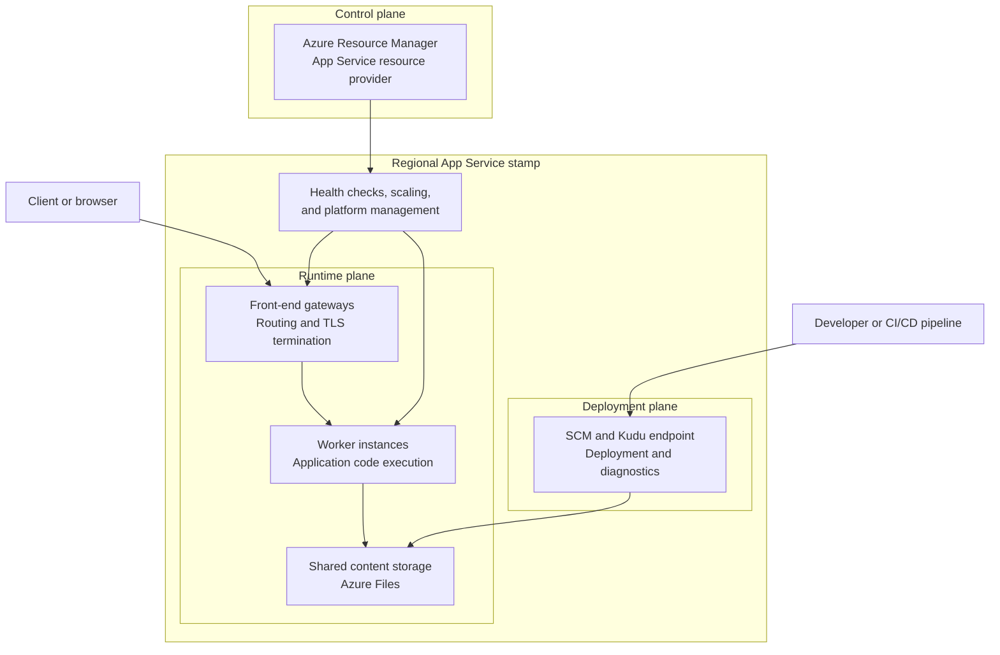
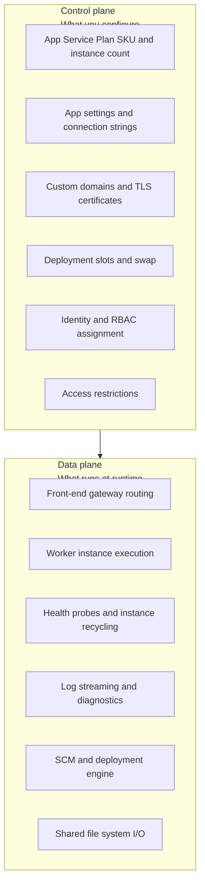
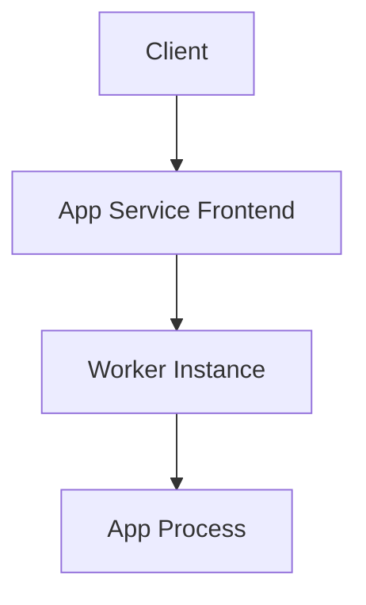
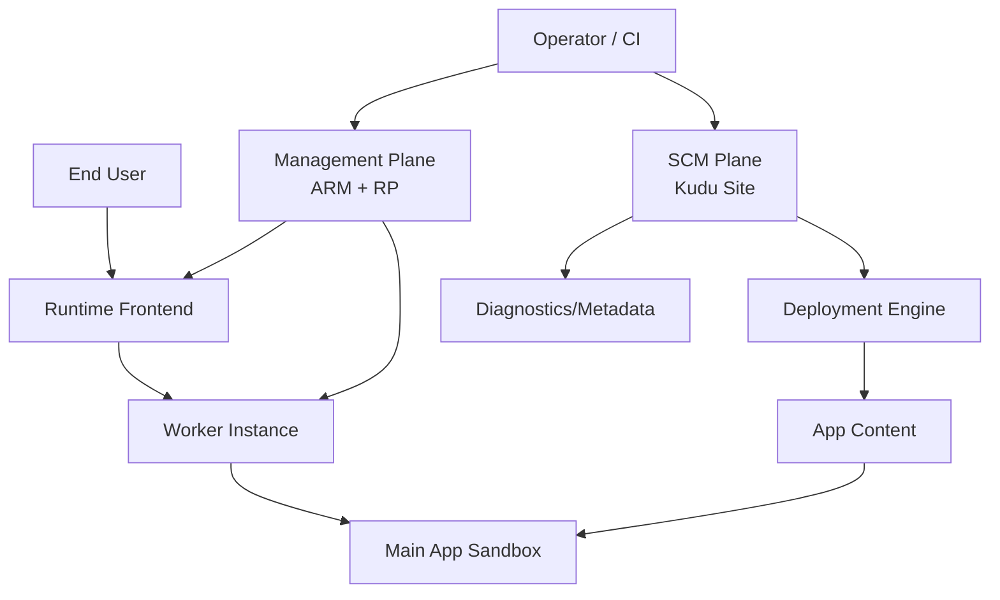
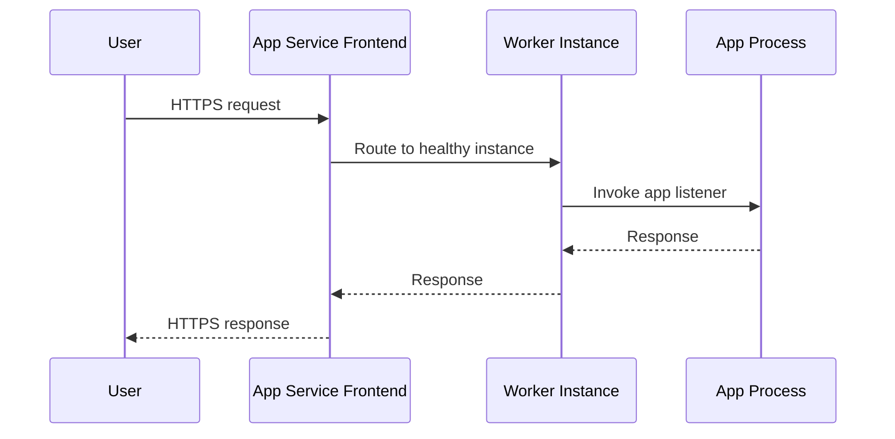
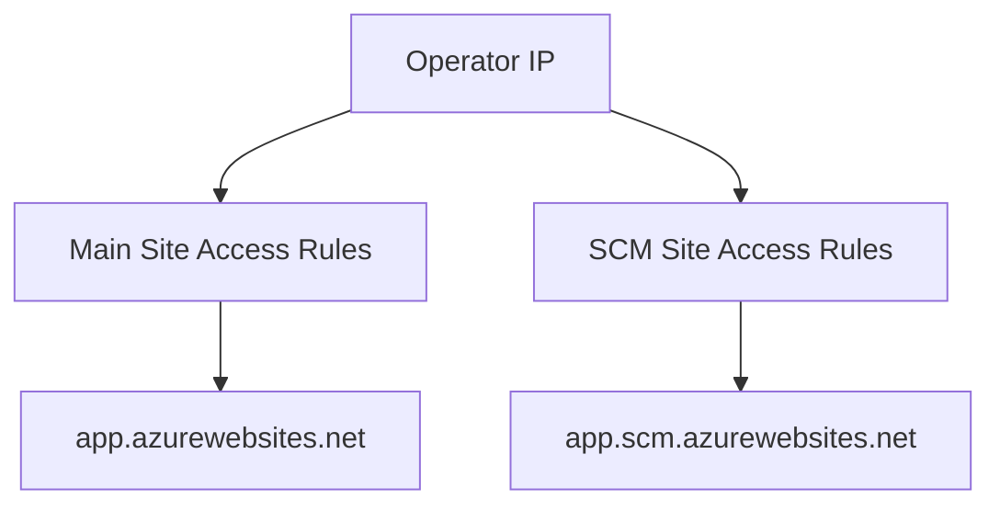
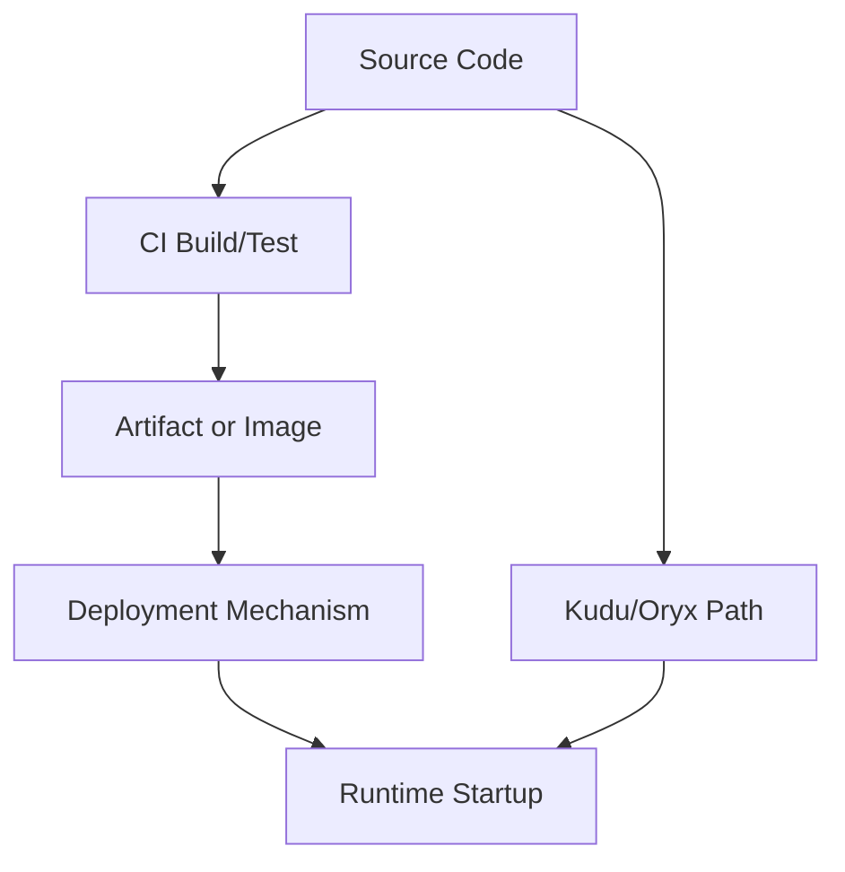
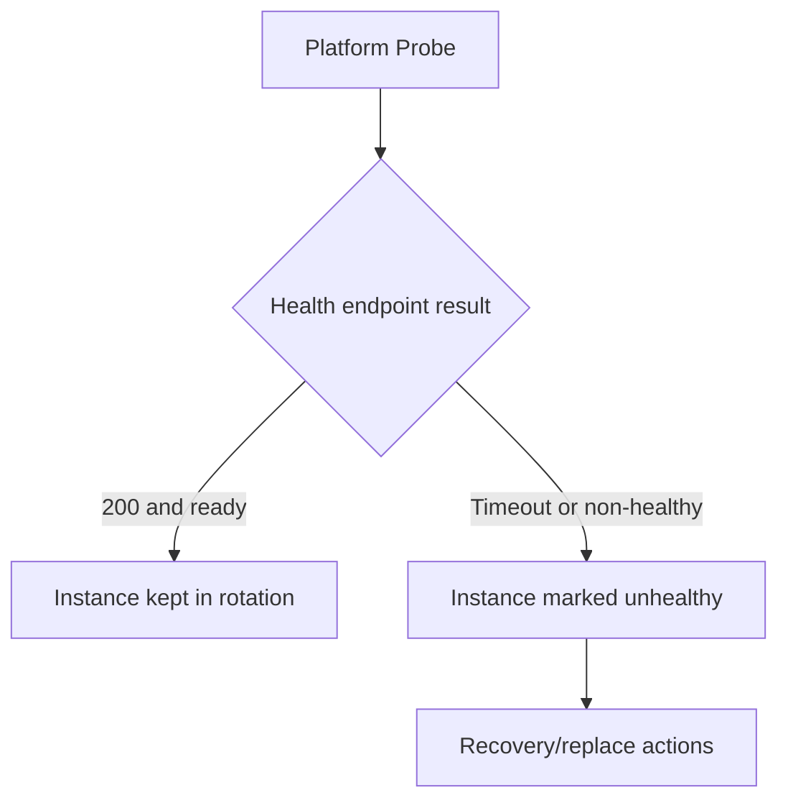
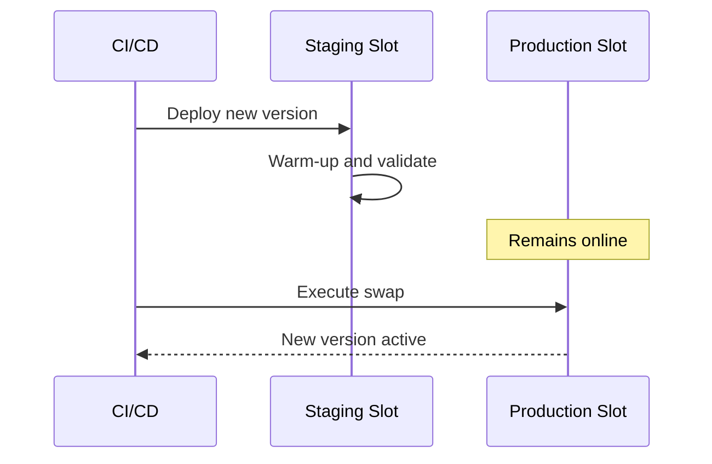
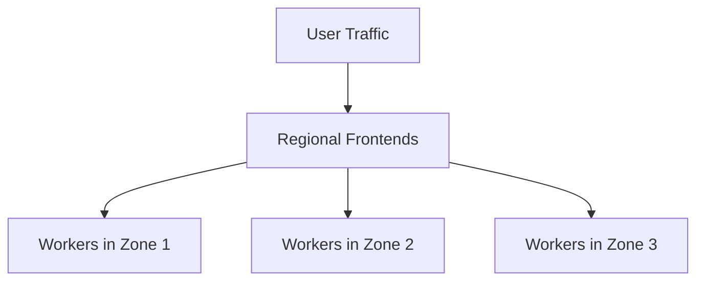

# How App Service Works

Azure App Service is a managed hosting platform for web apps and APIs. You focus on application behavior, while Microsoft operates fleet management, patching, frontend routing, and worker lifecycle. This page builds the mental model you need for design reviews, deployment decisions, and production troubleshooting.

!!! info "Scope of this page"
    This page explains the **common mental model** for Azure App Service — architecture, deployment, storage, startup, and diagnostics. Some operational details lean toward **Linux and container** hosting. Where behavior differs by hosting mode (Windows code, Linux built-in, Linux custom container), the text calls it out explicitly. For isolated environments (ASE), see [Microsoft Learn: App Service Environment overview](https://learn.microsoft.com/azure/app-service/environment/overview).

!!! note "Community guide disclaimer"
    This field guide is a community-maintained learning resource. For authoritative platform behavior, always confirm with Microsoft Learn and Azure product documentation before production changes.

## Prerequisites

### Reading prerequisites

- Basic Azure concepts: subscription, resource group, region, identity
- Basic understanding of HTTP request/response lifecycle
- Familiarity with the difference between control configuration and runtime execution

### Hands-on prerequisites

- Azure CLI installed and authenticated (`az --version`, `az login`)
- Permission to read and update App Service resources in your subscription
- One test app and one test plan for experiments (non-production)

---

## Main Content

### [Beginner] Architecture at a glance

Before diving into each subsystem, anchor on the full regional picture: **configuration enters through the control plane, user traffic enters through the runtime plane, and deployment traffic typically enters through the SCM plane**.

<!-- diagram-id: app-service-architecture-overview -->


Key takeaways:

- User requests hit **front-end gateways first**, then flow to healthy worker instances that run your application code.
- Configuration changes go through **Azure Resource Manager and the App Service resource provider**, not directly to the request path.
- **SCM/Kudu is a companion deployment and diagnostics surface**, which is why deployment behavior and runtime behavior can differ.
- Shared content and logs typically rely on **network-backed storage**, while platform services coordinate health, placement, and scale inside the regional stamp.

### [Beginner] Control plane vs data plane

For change management and incident response, it helps to collapse the platform into **what you configure** versus **what executes at runtime**.

<!-- diagram-id: control-data-plane -->


| Operation | Plane | Example |
|---|---|---|
| Create App Service Plan | Control | `az appservice plan create` |
| Change app setting | Control (triggers runtime restart) | `az webapp config appsettings set` |
| Handle HTTP request | Data | Client → Frontend → Worker → App |
| Scale out instances | Control (new workers join data plane) | `az appservice plan update --number-of-workers` |
| ZIP deploy | Data (SCM plane) | `az webapp deploy --src-path` |
| Assign managed identity | Control | `az webapp identity assign` |

Learn references:

- [App Service overview](https://learn.microsoft.com/azure/app-service/overview)
- [App Service plan overview](https://learn.microsoft.com/azure/app-service/overview-hosting-plans)
- [Reliability in App Service](https://learn.microsoft.com/azure/reliability/reliability-app-service)

### [Beginner] Platform architecture at a glance

The most useful mental model for App Service is **three planes**, not two:

1. **Management plane**
2. **Runtime plane**
3. **SCM plane**

Each plane has different APIs, responsibilities, and failure modes.

#### Three-plane model

| Plane | What it is | Typical operations | Typical tools |
|---|---|---|---|
| Management plane | Azure Resource Manager + App Service resource provider | App settings, scaling, certificates, networking config, slot config, identity | Azure Portal, ARM/Bicep, Azure CLI, REST |
| Runtime plane | Frontend gateways + worker instances that run your app | Request routing, app startup, health checks, process execution, log streaming path | Browser/API clients, platform probes, runtime logs |
| SCM plane | Companion management surface (Kudu + deployment engine) | ZIP deploy API, deployment logs, selected diagnostics, environment metadata | `https://<app-name>.scm.azurewebsites.net`, Kudu APIs |

!!! note
    A single management-plane change (for example, changing an app setting) can trigger runtime recycle. Treat any config mutation as potentially restart-impacting.

#### Core request path (single-region, single-app)

For a normal single-app flow, keep the model simple:

`Client → App Service Frontend → Worker Instance`

Do not assume a global load balancer in this baseline diagram. Multi-region routing with Front Door or Traffic Manager is a separate architecture topic.

<!-- diagram-id: core-request-path -->


#### Management, runtime, and SCM interactions

<!-- diagram-id: plane-interactions -->


!!! important "Main app vs SCM app are separate contexts"
    The main app and the SCM/Kudu site run in different sandbox contexts. They are related operationally, but not identical runtime contexts. Diagnostic visibility differs by hosting mode.

Microsoft Learn references:

- [App Service overview](https://learn.microsoft.com/azure/app-service/overview)
- [Kudu service overview](https://learn.microsoft.com/azure/app-service/resources-kudu)
- [App Service Environment overview](https://learn.microsoft.com/azure/app-service/environment/overview)

---

### [Beginner] Hosting modes and what changes

App Service behavior is not identical across hosting modes. Most confusion comes from applying Linux custom container assumptions to built-in stacks, or vice versa.

#### Hosting mode comparison

| Aspect | Windows Code | Linux Built-in | Linux Custom Container |
|---|---|---|---|
| Startup model | Platform launches stack runtime on worker | Platform launches built-in language image and startup command | Platform pulls your image and starts container |
| Port contract | Platform-managed internal port/named pipe behavior | App typically reads `PORT` (or `WEBSITES_PORT` when applicable) | App Service must know listening port via `WEBSITES_PORT` |
| Persistent storage path | Durable app content/log paths (Windows filesystem model) | `/home` persistent shared storage by default | `/home` persistence depends on `WEBSITES_ENABLE_APP_SERVICE_STORAGE` setting |
| Diagnostic entry point | Kudu/SCM provides rich diagnostics | Kudu/SCM provides rich diagnostics | SSH into app container is primary; Kudu diagnostics are limited |
| Common pitfall | Assuming local temp files are durable | Binding wrong port or slow startup | Expecting SCM container to see app container filesystem/processes |

!!! warning "Port and storage are mode-specific"
    Do not apply one universal rule for every mode. Your app must satisfy the correct contract for **its** hosting mode.

#### Port contract by hosting mode

- **Windows code**
    - App Service integrates with IIS/httpPlatform/ASP.NET hosting model.
    - Binding is platform-managed (named pipe or platform-assigned port behavior depending on stack).
- **Linux built-in image**
    - App typically binds to `PORT` (and in some cases `WEBSITES_PORT`).
    - Validate startup command and framework binding behavior.
- **Linux custom container**
    - App Service needs container port metadata, typically via `WEBSITES_PORT`.
    - Ensure your container listens on the configured port.

#### Storage behavior by hosting mode

- **Built-in images**: `/home` is typically persistent and shared.
- **Custom containers**: persistence behavior depends on `WEBSITES_ENABLE_APP_SERVICE_STORAGE`.

!!! note
    Microsoft documentation and historical behavior around custom-container storage defaults can vary by scenario. Verify your actual settings and observed behavior rather than assuming `/home` persistence.

Learn references:

- [Configure a custom container for App Service](https://learn.microsoft.com/azure/app-service/configure-custom-container)
- [App Service operating system functionality](https://learn.microsoft.com/azure/app-service/operating-system-functionality)

---

### [Beginner] Management plane: what you configure

The management plane is where desired state is declared.

Typical objects and settings:

- App Service Plan SKU and instance count
- App settings and connection strings
- Deployment slots and slot settings
- Custom domains and TLS certificates
- Access restrictions
- Identity settings (system/user-assigned managed identity)
- Backup and restore configuration

#### Why management-plane changes can restart runtime

Many settings are consumed at process/container start. When changed, App Service recycles processes to enforce consistency.

Common recycle triggers:

- App settings change
- Startup command change
- Stack/runtime configuration change
- Slot swap
- Scale up/down or scale in/out

#### Example: inspect current app state with CLI

```bash
az webapp show \
    --resource-group "$RG" \
    --name "$APP_NAME" \
    --query "{state:state, hostNames:hostNames, httpsOnly:httpsOnly, serverFarmId:serverFarmId}" \
    --output json
```

Example output (PII masked):

```json
{
  "hostNames": [
    "app-<masked>.azurewebsites.net",
    "www.example.com"
  ],
  "httpsOnly": true,
  "serverFarmId": "/subscriptions/<subscription-id>/resourceGroups/<rg>/providers/Microsoft.Web/serverfarms/<plan>",
  "state": "Running"
}
```

#### Example: inspect key app settings safely

```bash
az webapp config appsettings list \
    --resource-group "$RG" \
    --name "$APP_NAME" \
    --query "[?name=='WEBSITES_PORT' || name=='PORT' || name=='WEBSITES_ENABLE_APP_SERVICE_STORAGE' || name=='SCM_DO_BUILD_DURING_DEPLOYMENT']"
```

Learn references:

- [Manage an App Service app in Azure CLI](https://learn.microsoft.com/azure/app-service/scripts/cli-web-app)
- [Configure app settings](https://learn.microsoft.com/azure/app-service/configure-common)

---

### [Beginner] Runtime plane: how requests are served

At runtime, App Service frontends terminate inbound connections and route traffic to healthy worker instances.

#### Runtime path and warm instance selection

<!-- diagram-id: runtime-request-sequence -->


#### Instance lifecycle realities

- Instances can recycle during platform maintenance.
- Scale-out adds new instances that must warm up.
- Scale-in removes instances and in-flight behavior must tolerate it.

Design implications:

- Prefer stateless app nodes.
- Keep startup idempotent.
- Externalize durable state.
- Ensure graceful shutdown behavior.

#### Runtime observability basics

- Request failures (HTTP 5xx, latency spikes) are runtime symptoms.
- Management-plane metrics alone are insufficient.
- Log correlation should include timestamp, instance, and request identifiers.

Learn references:

- [Monitor App Service](https://learn.microsoft.com/azure/app-service/troubleshoot-diagnostic-logs)
- [Reliability in App Service](https://learn.microsoft.com/azure/reliability/reliability-app-service)

---

### [Operator] SCM plane (Kudu): deployment and diagnostics companion

The SCM site (`<app-name>.scm.azurewebsites.net`) is a companion management surface.

Reframe it correctly:

- Kudu is **not** always equivalent to your runtime environment.
- Diagnostic depth varies by hosting model.
- Deployment APIs are still valuable even when UI features differ.

#### What Kudu typically provides

| Capability | Endpoint or surface |
|---|---|
| ZIP deployment API | `/api/zipdeploy` |
| Deployment history | `/api/deployments` |
| Environment metadata | `/api/environment` |
| Log stream | `/api/logstream` |
| File APIs | `/api/vfs/` |

#### Critical caveats by hosting model

1. **Linux custom container**
    - SCM site runs in a **separate container** from your app container.
    - SCM cannot directly inspect app container filesystem/processes.
    - Use app-container SSH/logs as primary diagnostic path.

2. **SCM access restrictions can differ from main app**
    - Main site may be reachable while SCM is blocked.
    - Troubleshoot SCM access rules separately.

3. **Linux Kudu ZIP deploy UI limitations**
    - UI behavior is not universal across Linux scenarios.
    - Prefer API/CLI deployment commands for reliability.

!!! warning "Common confusion"
    "My app works, but Kudu will not open" is often an SCM access-restriction configuration issue, not an app runtime issue.

#### Access restrictions for main site vs SCM site

<!-- diagram-id: scm-access-rules -->


#### CLI check: SCM and app access restrictions

```bash
az webapp config access-restriction show \
    --resource-group "$RG" \
    --name "$APP_NAME" \
    --output json
```

Learn references:

- [Kudu service overview](https://learn.microsoft.com/azure/app-service/resources-kudu)
- [Set up Azure App Service access restrictions](https://learn.microsoft.com/azure/app-service/app-service-ip-restrictions)
- [Configure a custom container](https://learn.microsoft.com/azure/app-service/configure-custom-container)

---

### [Operator] Build and deployment flow (accurate model)

App Service supports multiple deployment sources and mechanisms. **Oryx is one build automation path**, not a universal default for every deployment style.

#### Correct framing

- You can build in CI and deploy artifacts.
- You can trigger server-side build for selected flows.
- You can deploy prebuilt containers.
- ZIP deploy does **not** auto-build unless you explicitly enable it.

#### Deployment method vs build behavior

| Deployment method | Typical build location | Build behavior notes |
|---|---|---|
| GitHub Actions (recommended for compiled stacks) | CI pipeline | Build/test/package in CI, then deploy artifact or container |
| ZIP deploy | Usually prebuilt artifact | No server-side build unless `SCM_DO_BUILD_DURING_DEPLOYMENT=true` |
| Local Git / external Git integration | Can use server-side build path | May use build automation depending on stack and configuration |
| Container image deploy | Container build pipeline | App Service pulls image; no App Service source build step |

#### Deployment flow map

<!-- diagram-id: deployment-flow-map -->


#### ZIP deploy with explicit server-side build setting

```bash
az webapp config appsettings set \
    --resource-group "$RG" \
    --name "$APP_NAME" \
    --settings SCM_DO_BUILD_DURING_DEPLOYMENT=true

az webapp deploy \
    --resource-group "$RG" \
    --name "$APP_NAME" \
    --src-path "./build-output.zip" \
    --type zip
```

#### GitHub Actions pattern (high-level)

1. Build and test in CI.
2. Produce immutable artifact (or container image digest).
3. Deploy artifact/image to App Service.
4. Validate health endpoint before full traffic confidence.

!!! tip
    For Java, .NET, and Node builds with compile steps, CI-built artifacts improve reproducibility and rollback simplicity.

Learn references:

- [Deploy to App Service with GitHub Actions](https://learn.microsoft.com/azure/app-service/deploy-github-actions)
- [Deploy ZIP package](https://learn.microsoft.com/azure/app-service/deploy-zip)
- [Oryx build system](https://learn.microsoft.com/azure/app-service/configure-language-nodejs#build-automation)

---

### [Beginner] Filesystem model: ephemeral vs persistent

Storage behavior drives many production incidents. Separate storage into two classes:

1. Ephemeral instance-local storage
2. Persistent shared storage

#### Ephemeral storage

Characteristics:

- Fast local I/O
- Instance-scoped
- Lost on recycle/replacement
- Not shared across scaled-out instances

Good uses:

- Temporary upload staging
- Transient cache files
- Intermediate processing artifacts

Bad uses:

- User data requiring durability
- Cross-instance coordination files
- Any state you need after restart

#### Persistent storage (`/home` on Linux)

Characteristics:

- Network-backed
- Persists across restarts
- Shared between instances of same app
- Higher latency than local temporary storage

Key Linux paths:

| Path | Typical purpose |
|---|---|
| `/home/site/wwwroot` | Deployed app content |
| `/home/LogFiles` | Application/platform logs |
| `/home/data` | App-specific persistent files |

!!! warning "Verify hosting mode defaults"
    For built-in Linux images, `/home` is generally persistent and shared. For custom containers, persistence depends on `WEBSITES_ENABLE_APP_SERVICE_STORAGE`. Verify your actual app settings and runtime behavior.

#### Mistake example: file-based database on `/home`

Do **not** assume `/home` is suitable for SQLite or other file-based databases in production multi-instance scenarios.

Why this is risky:

- Shared network filesystem characteristics can introduce lock contention.
- Latency variance affects transaction behavior.
- Multi-instance concurrency increases corruption/timeout risk.

Preferred approach:

- Use managed database services (Azure SQL, Azure Database for PostgreSQL, Cosmos DB, etc.).

Learn references:

- [Operating system functionality in App Service](https://learn.microsoft.com/azure/app-service/operating-system-functionality)
- [Best practices for App Service](https://learn.microsoft.com/azure/app-service/app-service-best-practices)

---

### [Operator] Startup contracts and health

Startup success is a contract between your app and the platform:

- App listens on expected port model
- App initializes within limits
- Health endpoint reflects readiness truthfully
- App handles termination gracefully

#### Health Check behavior details

Health Check is more than a monitoring toggle; it is part of runtime traffic safety.

Important behaviors:

- Health endpoint should return **200 only when fully warmed**.
- If endpoint responds with **302 redirect**, Health Check does **not** follow redirect as success.
- A **1-minute timeout** generally counts as unhealthy.
- Most effective with **2+ instances** (single instance has limited failover value).
- Used as a readiness gate during scale-out and recovery flows.

<!-- diagram-id: health-check-decision -->


#### Example health endpoint design rules

- Avoid expensive deep checks on every probe call.
- Confirm critical dependencies needed for serving traffic.
- Return explicit non-200 when app is not ready.
- Keep response fast and deterministic.

Learn references:

- [Monitor App Service instances by using Health Check](https://learn.microsoft.com/azure/app-service/monitor-instances-health-check)
- [Reliability in App Service](https://learn.microsoft.com/azure/reliability/reliability-app-service)

---

### [Operator] Warm-up and deployment safety

Deployment safety is about controlling user impact while new code starts.

#### Slot swap mechanics

When using deployment slots:

1. Deploy to source slot.
2. Source slot warms up.
3. Target (production) stays online during warm-up.
4. Swap happens after readiness checks.

<!-- diagram-id: slot-swap-sequence -->


#### Custom swap warm-up settings

- `WEBSITE_SWAP_WARMUP_PING_PATH`
- `WEBSITE_SWAP_WARMUP_PING_STATUSES`

Use these to align swap readiness with your app’s real warm-up endpoint and expected status codes.

#### Important slot constraints

- Deployment slots require **Standard tier or higher**.
- Auto swap is **not supported** on Linux web apps / Web App for Containers.

#### If slots are not available

Use one or more alternatives:

- Artifact rollback (redeploy previous known-good package)
- Run-from-package with previous package version
- Blue-green traffic strategy in CI/CD workflow (external routing/control)

!!! tip "Baseline should be tier-aware"
    Do not assume slot-based rollback is universally available. Your operational baseline must include a rollback method that matches your SKU and hosting mode.

Learn references:

- [Set up staging environments in App Service](https://learn.microsoft.com/azure/app-service/deploy-staging-slots)
- [Run your app from a ZIP package](https://learn.microsoft.com/azure/app-service/deploy-run-package)

---

### [Operator] Shared plan contention and capacity behavior

An App Service Plan is the compute boundary. Apps in the same plan compete for shared CPU, memory, and I/O capacity.

#### What shares plan resources

Within one plan, shared compute can be consumed by:

- Multiple web apps
- Deployment slots
- Diagnostic workloads and log generation
- Backup operations
- WebJobs

This is why app-only metrics can hide root cause. Plan-level visibility is mandatory.

#### Monitoring strategy: app and plan together

Track at least:

- Plan CPU percentage
- Plan memory working set pressure
- HTTP queue/latency signals at app level
- Restart count and instance health

#### Example: inspect plan for an app

```bash
az webapp show \
    --resource-group "$RG" \
    --name "$APP_NAME" \
    --query "{planId:serverFarmId, state:state}" \
    --output json
```

Use the `planId` to correlate app incidents with plan-level metrics in Azure Monitor.

Learn references:

- [Scale an app in Azure App Service](https://learn.microsoft.com/azure/app-service/manage-scale-up)
- [Monitor App Service](https://learn.microsoft.com/azure/app-service/troubleshoot-diagnostic-logs)

---

### [Beginner] Operational baseline checklist

Use this as a minimum baseline before production go-live.

#### Reliability baseline

- Health endpoint implemented and tested
- Health check configured in App Service
- At least two instances for meaningful health-based routing (where workload requires availability)
- Startup path measured and within acceptable threshold

#### Deployment safety baseline

- CI build/test pipeline produces immutable artifacts
- Rollback method documented and tested
    - If Standard+ with slots: slot swap/rollback runbook
    - If no slots: previous artifact redeploy or run-from-package fallback
- Deployment identity/credentials minimized

#### Observability baseline

- Application logging enabled with structured format
- Log retention and export path documented
- Alerting defined for error rate, restart spikes, and latency regressions

#### Configuration baseline

- Port contract validated for hosting mode
- Storage behavior validated (`/home` persistence expectation verified)
- Secrets stored in secure settings/Key Vault references where applicable

#### Capacity baseline

- Plan-level metrics dashboard in place
- App-level and plan-level alerts linked in incident workflow
- Scale policy reviewed against real traffic profile

---

## Advanced Topics

### Zone redundancy and regional resiliency

Zone resilience in App Service depends on SKU, instance count, and regional capability.

#### Conditions and boundaries

- Zone redundancy is available on supported Premium tiers (for example Premium v2/v3/v4 where supported).
- You generally need **2+ instances** for meaningful zonal distribution.
- Region must support the relevant zonal capability.
- Fault domains are platform-managed; they are not directly user-controlled in App Service.

#### What this means operationally

- Validate zone support before committing architecture decisions.
- Pair zonal design with data-tier resiliency.
- Add regional failover strategy for true regional outage tolerance.

<!-- diagram-id: zone-redundancy-topology -->


Learn references:

- [Reliability in App Service](https://learn.microsoft.com/azure/reliability/reliability-app-service)
- [About availability zones](https://learn.microsoft.com/azure/reliability/availability-zones-overview)

---

## Language-Specific Details

For language-specific implementation details, see:

- [Python Guide](../../language-guides/python/index.md)
- [Node.js Guide](../../language-guides/nodejs/index.md)
- [Java Guide](../../language-guides/java/index.md)
- [.NET Guide](../../language-guides/dotnet/index.md)

---

## See Also

- [Hosting Models](../hosting-models.md)
- [Request Lifecycle](../request-lifecycle.md)
- [Scaling](../scaling.md)
- [Networking](../networking.md)
- [Resource Relationships](../resource-relationships.md)
- [Authentication Architecture](../authentication-architecture.md)
- [Security Architecture](../security-architecture.md)

## Sources

- [Azure App Service overview](https://learn.microsoft.com/azure/app-service/overview)
- [App Service plan overview](https://learn.microsoft.com/azure/app-service/overview-hosting-plans)
- [App Service Environment overview](https://learn.microsoft.com/azure/app-service/environment/overview)
- [Kudu service overview](https://learn.microsoft.com/azure/app-service/resources-kudu)
- [Configure a custom container for App Service](https://learn.microsoft.com/azure/app-service/configure-custom-container)
- [Operating system functionality in App Service](https://learn.microsoft.com/azure/app-service/operating-system-functionality)
- [Deploy ZIP package to App Service](https://learn.microsoft.com/azure/app-service/deploy-zip)
- [Deploy to App Service by using GitHub Actions](https://learn.microsoft.com/azure/app-service/deploy-github-actions)
- [Set up staging environments in App Service](https://learn.microsoft.com/azure/app-service/deploy-staging-slots)
- [Run your app from a ZIP package](https://learn.microsoft.com/azure/app-service/deploy-run-package)
- [Monitor App Service instances by using Health Check](https://learn.microsoft.com/azure/app-service/monitor-instances-health-check)
- [Set up App Service access restrictions](https://learn.microsoft.com/azure/app-service/app-service-ip-restrictions)
- [Reliability in App Service](https://learn.microsoft.com/azure/reliability/reliability-app-service)
- [About availability zones](https://learn.microsoft.com/azure/reliability/availability-zones-overview)
- [Troubleshoot diagnostic logs in App Service](https://learn.microsoft.com/azure/app-service/troubleshoot-diagnostic-logs)
- [Best practices for Azure App Service](https://learn.microsoft.com/azure/app-service/app-service-best-practices)
- [Configure app settings](https://learn.microsoft.com/azure/app-service/configure-common)
- [Scale an app in Azure App Service](https://learn.microsoft.com/azure/app-service/manage-scale-up)
