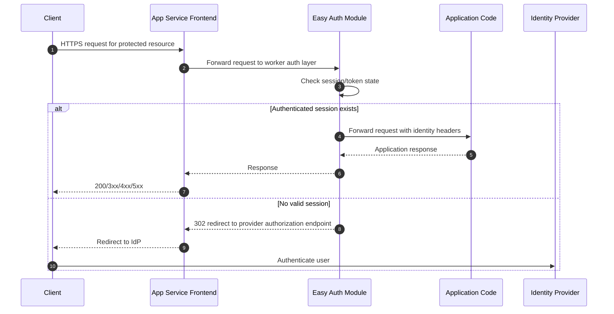
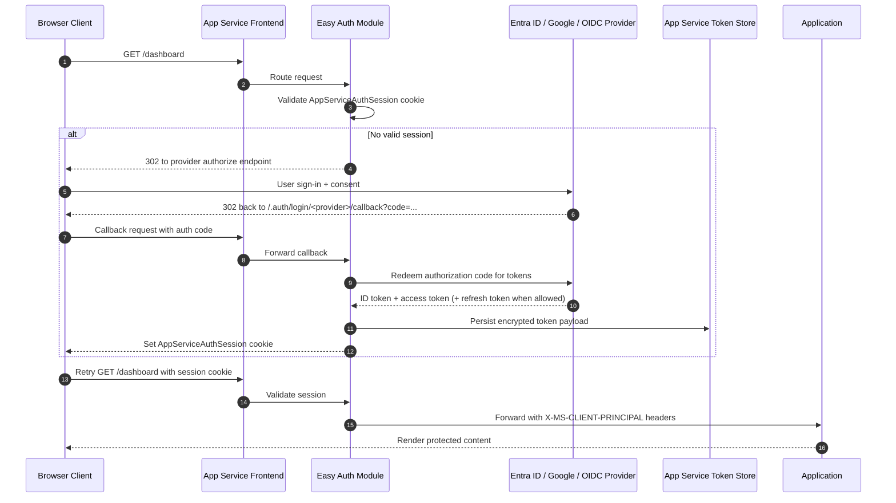
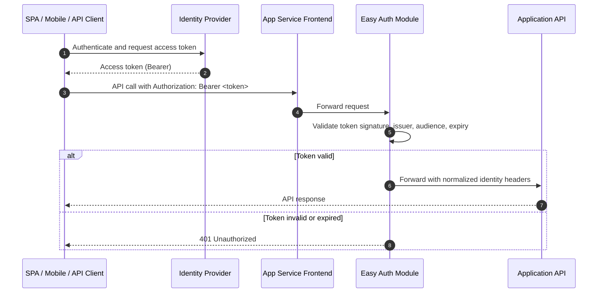
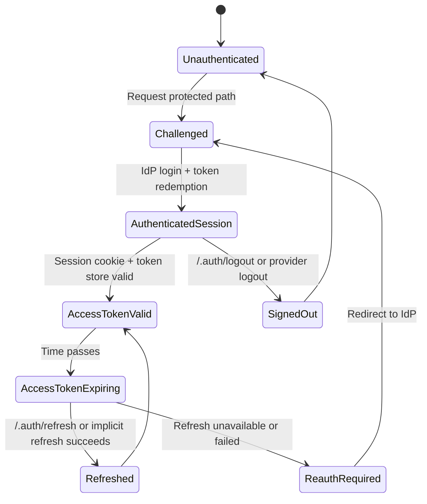
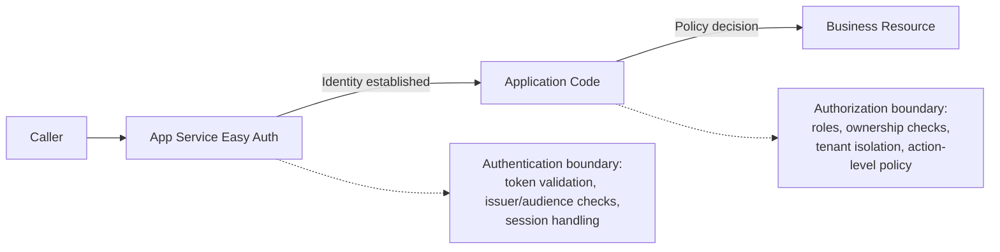
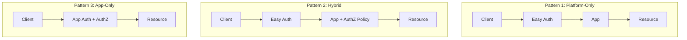

# Authentication Architecture

Azure App Service Authentication/Authorization (commonly called **Easy Auth**) implements a platform-level authentication layer that executes before your application code. This document explains the runtime architecture, request flows, token lifecycle, and design boundaries you must account for in production systems.

## How App Service Authentication Works

App Service inserts an authentication component into the inbound request path so identity is established before requests are handed to your app process.

Core platform behavior:

- The authentication module sits in front of your app in the same App Service worker sandbox.
- On **Windows**, the component is implemented as a native IIS module.
- On **Linux** and custom containers, authentication runs as a sidecar-style proxy process in front of your containerized app.
- Requests are intercepted before app routing logic executes.
- After successful authentication, identity information is projected to your app through request headers.

This architecture allows App Service to provide consistent provider integration (Microsoft Entra ID, Google, GitHub, and others) without requiring authentication middleware in each framework.

### Request interception boundary

The auth layer executes after global frontend admission (TLS termination, host mapping, access restrictions) and before your framework receives the request. This is why failed platform authentication can produce `401` or `302` responses with no corresponding app-level access log entry.

### Identity projection model

When authentication succeeds, App Service adds identity context headers such as:

- `X-MS-CLIENT-PRINCIPAL`
- `X-MS-CLIENT-PRINCIPAL-ID`
- `X-MS-CLIENT-PRINCIPAL-NAME`
- `X-MS-CLIENT-PRINCIPAL-IDP`
- `X-MS-TOKEN-AAD-ACCESS-TOKEN` (provider-specific token headers when enabled)

Your code consumes these headers as trusted platform inputs only when requests are guaranteed to come through App Service frontends and worker proxies.

## Authentication Flow

App Service supports two primary interaction models depending on client type and trust boundaries.

### Server-Directed Flow (Default)

Server-directed flow is the default mode for classic web applications where browser navigation and redirects are expected.

Characteristics:

- Best fit for MVC/server-rendered apps.
- Browser never handles provider protocol details directly.
- Session continuity is driven by App Service-managed session cookie and token store entries.
- Reduced framework-specific auth implementation complexity.

### Client-Directed Flow

Client-directed flow is common for SPAs, mobile clients, and API consumers that obtain tokens directly from an identity provider.

Characteristics:

- Better alignment with API-first patterns.
- Client controls token acquisition and refresh cadence.
- App Service still centralizes token validation and provider trust config.
- Useful when front-end and back-end are decoupled and use explicit bearer tokens.

## Token Lifecycle

App Service token management combines client session state and a server-side token store.

### Token store internals

- Token store is filesystem-backed and scoped per app instance context.
- Tokens are encrypted at rest by platform-managed mechanisms.
- Store entries map authenticated session context to provider token payloads.
- In scale-out scenarios, session affinity and platform synchronization behavior can affect read locality, especially during rapid instance churn.

### Session token behavior

- Browser-facing continuity is maintained with the `AppServiceAuthSession` cookie.
- Cookie presence is necessary but not sufficient; the server-side session record must also be valid.
- If a cookie exists but token backing data is expired or missing, Easy Auth re-challenges the client.

### Access token refresh behavior

- If a provider issued refresh tokens and the app configuration permits storage, Easy Auth can refresh access tokens without interactive sign-in.
- Refresh attempts are typically triggered when token validity is checked and nearing or past expiry.
- Refresh failure (revoked refresh token, changed consent, conditional access enforcement) causes re-authentication.

### Expiration and re-authentication triggers

Common triggers for authentication renewal:

- Access token expiration with no valid refresh token path.
- Session cookie timeout or invalidation.
- Provider-side revocation or risk policy enforcement.
- Auth configuration changes (client ID, issuer, allowed audiences, signing metadata).
- Deployment slot swaps where callback URI or auth config no longer matches active hostname.

### `/.auth/refresh` endpoint behavior

`/.auth/refresh` requests an on-demand token refresh for the current authenticated session.

- Returns success when session and refresh token state permit renewal.
- Returns `401` when session is absent, expired, or non-refreshable.
- Frequently used by SPAs to avoid full redirect loops when renewing tokens.

## Identity Providers

Provider support varies by protocol details and enterprise governance requirements.

| Provider | Protocol | Use Case | Configuration |
|---|---|---|---|
| Microsoft Entra ID | OpenID Connect | Enterprise apps, internal tools | App registration required |
| Google | OAuth 2.0 | Consumer-facing apps | Google Cloud Console |
| Facebook | OAuth 2.0 | Social login | Facebook Developer Portal |
| Twitter/X | OAuth 1.0a | Social login | Twitter Developer Portal |
| GitHub | OAuth 2.0 | Developer tools | GitHub OAuth App |
| Apple | OpenID Connect | iOS ecosystem apps | Apple Developer Account |
| Custom OpenID Connect | OIDC | Any OIDC-compliant IdP | Issuer URL + client config |

Provider selection considerations:

- Required claims shape (groups, roles, tenant, email, subject).
- Token lifetime and refresh support constraints.
- Multi-tenant vs single-tenant audience design.
- Conditional Access and MFA enforcement behavior.
- Operational ownership of secrets, certificates, and metadata rollover.

## Authentication vs Authorization

App Service auth settings establish **identity**, not full access policy.

- **Authentication** answers: *Who is calling this endpoint?*
- **Authorization** answers: *What is this caller allowed to do?*

Critical design boundary:

- Easy Auth validates identity and projects claims.
- Your application (or downstream API gateway/policy engine) must enforce resource-specific authorization.
- Enabling authentication alone does not implement role-based access rules for domain actions.

Common failure mode:

- Teams enable Easy Auth, observe successful sign-in, and assume endpoints are fully protected.
- Without app-level authorization checks, any authenticated principal can invoke privileged operations.

Common header surfaces available to app code include:

- `X-MS-CLIENT-PRINCIPAL`
- `X-MS-CLIENT-PRINCIPAL-ID`
- `X-MS-CLIENT-PRINCIPAL-NAME`
- `X-MS-CLIENT-PRINCIPAL-IDP`
- `X-MS-TOKEN-*` headers when token store and provider settings allow exposure

## Architecture Patterns

### Pattern 1: Platform-Only Authentication

Profile:

- Easy Auth handles all sign-in and session flow.
- App trusts `X-MS-CLIENT-PRINCIPAL` and related headers.
- Minimal authentication code in application runtime.

Strengths:

- Fastest implementation path.
- Lower protocol complexity in app code.
- Good fit for internal tools with coarse authorization requirements.

Trade-offs:

- Limited custom authorization expressiveness unless added in code.
- Tight coupling to platform header model.

### Pattern 2: Hybrid Authentication

Profile:

- Easy Auth performs identity establishment.
- Application enforces authorization policies (roles, claims, ownership, ABAC/RBAC rules).

Strengths:

- Balanced operational simplicity and policy control.
- Works well for enterprise line-of-business applications.

Trade-offs:

- Requires disciplined claims mapping and policy testing.
- Still dependent on platform configuration correctness.

### Pattern 3: Application-Only Authentication

Profile:

- Easy Auth disabled.
- Application implements protocol handlers, JWT validation, session management, and key rollover logic.

Strengths:

- Maximum flexibility and portability across hosting platforms.
- Full control over protocol and token processing behavior.

Trade-offs:

- Highest implementation and maintenance burden.
- Greater risk of security defects if controls are inconsistently implemented.

## Platform Behavior Details

### Linux vs Windows Differences

Implementation differences matter when debugging edge behavior.

Windows model:

- Native IIS authentication module in the worker process path.
- Deep integration with IIS request pipeline.
- Header injection occurs within IIS-managed request lifecycle.

Linux/custom container model:

- Sidecar/proxy-style auth component forwards traffic to your app container.
- Header forwarding and hop semantics depend on proxy boundary behavior.
- Startup sequencing includes auth sidecar and app container readiness interactions.

Operational implications:

- Header casing and proxy behavior can differ across stacks.
- Troubleshooting must include platform proxy logs and container logs.
- Explicit trust boundaries for forwarded headers are mandatory.

### Multi-Tenant vs Isolated

App Service plans are multi-tenant by default; App Service Environment (ASE) offers isolated deployment topology.

Multi-tenant considerations:

- Authentication feature behavior is standardized, but underlying infrastructure is shared.
- Network controls and private endpoints should be combined with auth for defense in depth.

Isolated (ASE) considerations:

- Dedicated network and compute boundary.
- Better fit for strict compliance, private ingress, and controlled egress architectures.
- Identity flow remains protocol-compatible, but operational ownership of network path increases.

### Deployment Slot Behavior

Authentication configuration is slot-specific unless explicitly managed as a shared setting.

Common swap risk:

- Production hostname changes to slot content where redirect URI configuration still points to prior slot host.
- Result: IdP callback mismatch, failed sign-in loop, or provider `redirect_uri` validation errors.

Mitigations:

- Pre-register redirect URIs for production and staging hostnames.
- Validate auth flows on slot URL before swap.
- Keep provider secrets and issuer settings aligned across slots.
- Use staged swap runbooks that include authentication smoke tests.

## See Also

- [Request Lifecycle](./request-lifecycle.md)
- [Security Architecture](./security-architecture.md)
- [How App Service Works](./how-app-service-works.md)
- [Security Operations](../operations/security.md)

## References

- [Authentication and authorization in Azure App Service](https://learn.microsoft.com/azure/app-service/overview-authentication-authorization)
- [Configure authentication providers](https://learn.microsoft.com/azure/app-service/configure-authentication-provider-aad)
- [Work with OAuth tokens in App Service](https://learn.microsoft.com/azure/app-service/configure-authentication-oauth-tokens)
- [App Service Auth architecture](https://learn.microsoft.com/azure/app-service/overview-authentication-authorization#architecture)
- [Authentication in deployment slots](https://learn.microsoft.com/azure/app-service/deploy-staging-slots)
