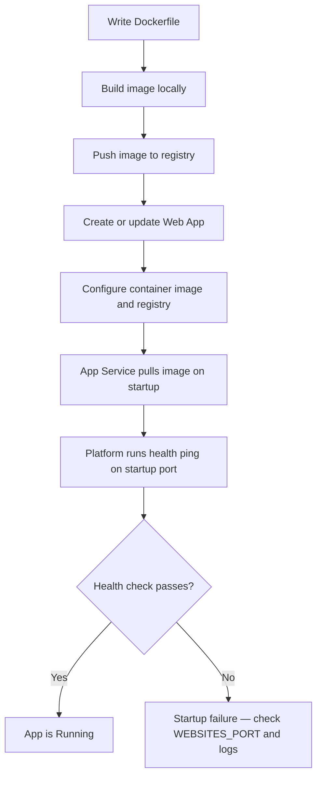
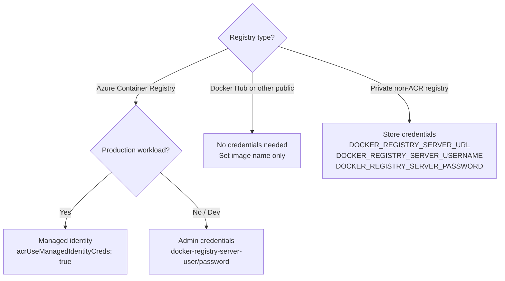
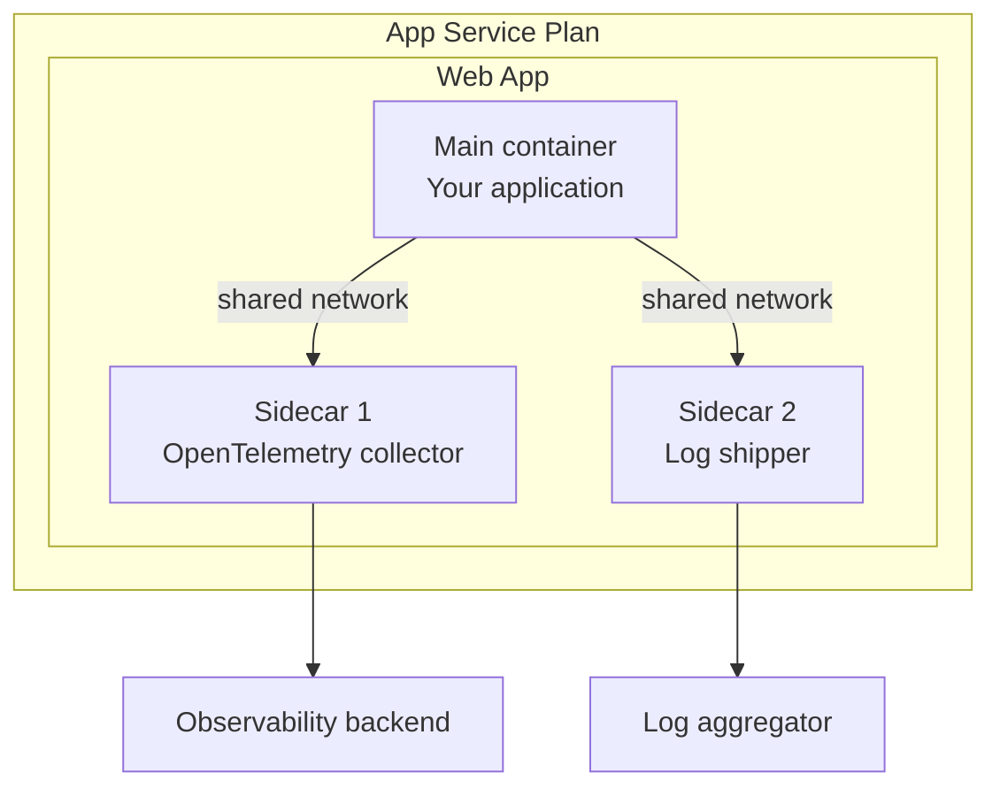

---
content_sources:
  text:
    - type: mslearn
      url: https://learn.microsoft.com/en-us/azure/app-service/tutorial-custom-container
    - type: mslearn
      url: https://learn.microsoft.com/en-us/azure/app-service/configure-custom-container
    - type: mslearn
      url: https://learn.microsoft.com/en-us/azure/app-service/tutorial-custom-container-sidecar
  diagrams:
    - id: container-lifecycle
      type: flowchart
      source: self-generated
      justification: "Synthesized from MSLearn custom container and configure-custom-container articles"
      based_on:
        - https://learn.microsoft.com/en-us/azure/app-service/tutorial-custom-container
        - https://learn.microsoft.com/en-us/azure/app-service/configure-custom-container
    - id: registry-auth-decision
      type: flowchart
      source: self-generated
      justification: "Synthesized from MSLearn configure-custom-container registry auth sections"
      based_on:
        - https://learn.microsoft.com/en-us/azure/app-service/configure-custom-container
    - id: sidecar-architecture
      type: flowchart
      source: mslearn-adapted
      based_on:
        - https://learn.microsoft.com/en-us/azure/app-service/tutorial-custom-container-sidecar
content_validation:
  status: verified
  last_reviewed: "2026-05-01"
  reviewer: agent
  core_claims:
    - claim: "Web App for Containers lets you run a custom Docker container on App Service instead of a built-in runtime stack."
      source: https://learn.microsoft.com/en-us/azure/app-service/tutorial-custom-container
      verified: true
    - claim: "Service principal authentication for Windows container image pull is no longer supported; managed identity is recommended for both Windows and Linux containers."
      source: https://learn.microsoft.com/en-us/azure/app-service/configure-custom-container
      verified: true
    - claim: "You can add up to nine sidecar containers per Linux app in App Service."
      source: https://learn.microsoft.com/en-us/azure/app-service/tutorial-custom-container-sidecar
      verified: true
    - claim: "To pull from a network-protected registry, the app must use VNet integration and the vnetImagePullEnabled site setting."
      source: https://learn.microsoft.com/en-us/azure/app-service/configure-custom-container
      verified: true
    - claim: "Docker Hub and private registry credentials are stored in environment variables DOCKER_REGISTRY_SERVER_URL, DOCKER_REGISTRY_SERVER_USERNAME, and DOCKER_REGISTRY_SERVER_PASSWORD, but are not exposed to the application."
      source: https://learn.microsoft.com/en-us/azure/app-service/configure-custom-container
      verified: true
---

# Web App for Containers

Web App for Containers is the App Service hosting model that runs a custom Docker container instead of a built-in runtime stack. It gives you full control over the OS, runtime, dependencies, and configuration while App Service manages the underlying infrastructure, scaling, and platform integration.

Use Web App for Containers when:

- Your app requires a specific runtime version, native library, or OS package not available in the built-in stacks.
- You want to standardize deployments around a container image across environments.
- You are migrating a containerized workload from another platform to App Service.

## Main Content

### Linux vs Windows Container Hosting

App Service supports custom containers on both Linux and Windows. The two hosting paths differ in capabilities and recommended patterns.

| Dimension | Linux containers | Windows containers |
|---|---|---|
| Image format | OCI / Docker Linux | Windows Server Core / Nano Server |
| Sidecar support | Up to 9 sidecar containers per app | Not supported |
| Registry auth | Managed identity (recommended), credentials | Managed identity (recommended); service principal no longer supported |
| Persistent storage | `/home` directory, Azure Files mount | `C:\home` directory |
| SSH access | Built-in SSH support available | Not available |

!!! warning "Service principal auth for Windows containers is retired"
    Using a service principal for Windows container image pull authentication is no longer supported. Use managed identity for both Windows and Linux containers.

### Container Lifecycle on App Service

Deploying a containerized app to App Service follows a consistent flow regardless of language or registry.

<!-- diagram-id: container-lifecycle -->


Each stage has a corresponding verification step:

| Stage | Verification command |
|---|---|
| Image built | `docker run --rm --publish 8080:8080 <IMAGE>` — confirm app responds locally |
| Image pushed | `az acr repository list --name $REGISTRY_NAME` |
| App configured | `az webapp config container show --name $APP_NAME --resource-group $RG` |
| App running | `az webapp show --name $APP_NAME --resource-group $RG --query "state"` |

Verify container configuration and running state:

```bash
az webapp config container show \
  --name $APP_NAME \
  --resource-group $RG \
  --output table
```

| Command/Code | Purpose |
|---|---|
| `az webapp config container show` | Shows the current container image and registry settings applied to the app |

<!-- Verified: real az CLI output from koreacentral, 2026-05-01 -->
```text
Name                                 SlotSetting    Value
-----------------------------------  -------------  ---------------------------------------------------
WEBSITES_ENABLE_APP_SERVICE_STORAGE  False          false
DOCKER_REGISTRY_SERVER_URL           False          https://<registry-name>.azurecr.io
DOCKER_CUSTOM_IMAGE_NAME                            DOCKER|<registry-name>.azurecr.io/flask-test:v1
```

```bash
az webapp show \
  --name $APP_NAME \
  --resource-group $RG \
  --query "{name:name, state:state, defaultHostName:defaultHostName, linuxFxVersion:siteConfig.linuxFxVersion}" \
  --output yaml
```

| Command/Code | Purpose |
|---|---|
| `--query "{...linuxFxVersion:siteConfig.linuxFxVersion}"` | Confirms the container image configured on the app |

<!-- Verified: real az CLI output from koreacentral, 2026-05-01 -->
```yaml
defaultHostName: <app-name>.azurewebsites.net
linuxFxVersion: DOCKER|<registry-name>.azurecr.io/flask-test:v1
name: <app-name>
state: Running
```

### Registry Authentication Patterns

App Service supports three registry authentication patterns. Choose based on your registry type and security requirements.

<!-- diagram-id: registry-auth-decision -->


#### ACR with Managed Identity (Recommended)

Managed identity eliminates stored credentials and is the recommended pattern for ACR.

```bash
az webapp identity assign \
  --name $APP_NAME \
  --resource-group $RG
```

| Command/Code | Purpose |
|---|---|
| `az webapp identity assign` | Enables system-assigned managed identity on the web app |

<!-- Verified: real az CLI output from koreacentral, 2026-05-01 -->
```yaml
principalId: <object-id>
tenantId: <tenant-id>
type: SystemAssigned
userAssignedIdentities: null
```

```bash
az role assignment create \
  --assignee $PRINCIPAL_ID \
  --scope $REGISTRY_RESOURCE_ID \
  --role "AcrPull"
```

| Command/Code | Purpose |
|---|---|
| `--role "AcrPull"` | Grants the minimum permission needed to pull images from ACR |
| `--scope $REGISTRY_RESOURCE_ID` | Limits the role to a specific registry |

<!-- Verified: real az CLI output from koreacentral, 2026-05-01 -->
```yaml
roleDefinitionName: AcrPull
principalType: ServicePrincipal
scope: /subscriptions/<subscription-id>/resourceGroups/<resource-group>/providers/Microsoft.ContainerRegistry/registries/<registry-name>
```

```bash
az webapp config set \
  --name $APP_NAME \
  --resource-group $RG \
  --generic-configurations '{"acrUseManagedIdentityCreds": true}'
```

| Command/Code | Purpose |
|---|---|
| `acrUseManagedIdentityCreds: true` | Instructs App Service to use the managed identity for ACR image pulls instead of stored credentials |

Verify managed identity is active:

```bash
az webapp config show \
  --name $APP_NAME \
  --resource-group $RG \
  --query "acrUseManagedIdentityCreds" \
  --output tsv
```

| Command/Code | Purpose |
|---|---|
| `--query "acrUseManagedIdentityCreds"` | Confirms managed identity image pull is enabled |

<!-- Verified: real az CLI output from koreacentral, 2026-05-01 -->
```text
true
```

#### Private Non-ACR Registry (Credentials)

For Docker Hub private repositories or any non-ACR private registry, supply credentials:

```bash
az webapp config container set \
  --name $APP_NAME \
  --resource-group $RG \
  --container-image-name $IMAGE_NAME \
  --docker-registry-server-url $REGISTRY_URL \
  --docker-registry-server-user $REGISTRY_USER \
  --docker-registry-server-password $REGISTRY_PASSWORD
```

| Command/Code | Purpose |
|---|---|
| `--docker-registry-server-url` | Full URL of the private registry (for example, `https://index.docker.io`) |
| `--docker-registry-server-user` | Registry username stored as an encrypted app setting |
| `--docker-registry-server-password` | Registry password stored as an encrypted app setting |

!!! note "Credentials are not exposed to application code"
    App Service stores registry credentials in the reserved environment variables `DOCKER_REGISTRY_SERVER_URL`, `DOCKER_REGISTRY_SERVER_USERNAME`, and `DOCKER_REGISTRY_SERVER_PASSWORD`. These variables are not forwarded to the application container for security reasons.

#### Network-Protected Registry

To pull from a registry inside a virtual network or behind a private endpoint, enable VNet image pull:

```bash
az webapp config set \
  --name $APP_NAME \
  --resource-group $RG \
  --generic-configurations '{"vnetImagePullEnabled": true}'
```

| Command/Code | Purpose |
|---|---|
| `vnetImagePullEnabled: true` | Routes image pull traffic through the app's VNet integration instead of the public internet |

!!! warning "VNet integration is a prerequisite"
    The app must have VNet integration configured and DNS resolution in place before enabling `vnetImagePullEnabled`. Without VNet integration, the setting has no effect.

### Multi-Container and Sidecar Pattern

App Service supports adding up to nine sidecar containers alongside the main Linux custom container. Sidecars run in the same App Service plan and share the network namespace with the main container.

<!-- diagram-id: sidecar-architecture -->


**Use sidecars for:**

- Observability agents (OpenTelemetry, Datadog, Dynatrace)
- Log shippers (Fluent Bit, Logstash)
- Configuration or secrets sync sidecars

!!! note "Sidecar support is Linux-only"
    Sidecar containers are only available for Linux custom container apps. Windows containers do not support sidecars.

#### Configure a Sidecar

```bash
az webapp sitecontainers create \
  --name $APP_NAME \
  --resource-group $RG \
  --container-name $SIDECAR_NAME \
  --image $SIDECAR_IMAGE \
  --is-main false \
  --target-port 4317
```

| Command/Code | Purpose |
|---|---|
| `az webapp sitecontainers create` | Attaches a sidecar container to the main Linux custom container app |
| `--is-main false` | Marks this as a sidecar — the main container must already exist |
| `--target-port` | Port the sidecar listens on inside the app (for example, 4317 for OpenTelemetry gRPC) |

<!-- Verified: real az CLI output from koreacentral, 2026-05-01 -->
```json
{
  "authType": "Anonymous",
  "image": "otel/opentelemetry-collector:latest",
  "isMain": false,
  "name": "otel-collector",
  "targetPort": "4317",
  "type": "Microsoft.Web/sites/sitecontainer"
}
```

!!! note "CLI command name"
    The Azure CLI command for managing sidecar containers is `az webapp sitecontainers`, not `az webapp sidecar`. The Microsoft Learn documentation refers to the feature as "sidecar containers."

### Port Configuration and Health Checks

App Service sends an HTTP GET to the startup port to verify the container started successfully. By default it expects port 80. If your container listens on a different port, set `WEBSITES_PORT`:

```bash
az webapp config appsettings set \
  --name $APP_NAME \
  --resource-group $RG \
  --settings WEBSITES_PORT=8080
```

| Command/Code | Purpose |
|---|---|
| `WEBSITES_PORT` | Tells App Service which port your container exposes so the platform health ping reaches it |

<!-- Verified: real az CLI output from koreacentral, 2026-05-01 -->
```yaml
- name: WEBSITES_PORT
  slotSetting: false
  value: '8080'
```

!!! warning "Missing WEBSITES_PORT is the most common container startup failure"
    If the platform cannot connect to the startup port within the startup window, it marks the container as failed and restarts it. Check `WEBSITES_PORT` first whenever a container fails to start.

### Security Considerations

| Topic | Recommendation |
|---|---|
| ACR image pulls | Use managed identity — eliminates stored credentials and supports rotation-free operation |
| Non-ACR registry credentials | Store as app settings; never hardcode in Dockerfile or application code |
| Network-protected registry | Use VNet integration + `vnetImagePullEnabled` instead of exposing registry to the public internet |
| Windows containers | Service principal auth is retired; migrate to managed identity |
| Persistent storage | Do not write persistent data to the container filesystem; use the `/home` directory or Azure Files |

## See Also

- [Container Deployment — Operations Guide](../../operations/deployment/container-deploy.md)
- [Node.js Custom Container Recipe](../../language-guides/nodejs/recipes/custom-container.md)
- [Python Custom Container Recipe](../../language-guides/python/recipes/custom-container.md)
- [Container Did Not Respond to HTTP Pings — Playbook](../../troubleshooting/playbooks/startup-availability/container-didnt-respond-to-http-pings.md)
- [Windows Container Health Probes — Playbook](../../troubleshooting/playbooks/startup-availability/windows-container-health-probes.md)
- [Container HTTP Pings — Lab Guide](../../troubleshooting/lab-guides/container-http-pings.md)

## Sources

- [Run a custom container in Azure App Service — Microsoft Learn](https://learn.microsoft.com/en-us/azure/app-service/tutorial-custom-container)
- [Configure a custom container for App Service — Microsoft Learn](https://learn.microsoft.com/en-us/azure/app-service/configure-custom-container)
- [Configure a sidecar container for a custom container app — Microsoft Learn](https://learn.microsoft.com/en-us/azure/app-service/tutorial-custom-container-sidecar)
