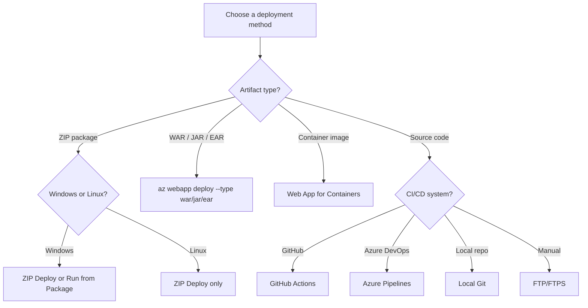

# Deployment Options Reference

<!-- Verified: real az CLI output from koreacentral, 2026-05-01 -->

Azure App Service supports multiple deployment methods that differ in OS support, artifact type, automation capability, and production suitability. This page provides a complete reference with Windows and Linux compatibility, real CLI examples, and test-verified behavior.

## Deployment Method Matrix

<!-- diagram-id: deployment-method-decision-flow -->


| Method | Windows | Linux | Production Ready | Artifact |
|---|:---:|:---:|:---:|---|
| [ZIP Deploy — new API](#zip-deploy-new-api-az-webapp-deploy) | ✅ | ✅ | ✅ | `.zip` |
| [ZIP Deploy — legacy API](#zip-deploy-legacy-api) | ✅ | ✅ | ✅ | `.zip` |
| [Run from Package](#run-from-package) | ✅ | ⚠️ | ✅ | `.zip` |
| [Local Git](#local-git) | ✅ | ✅ | ⚠️ | Source |
| [FTP / FTPS](#ftp-ftps) | ✅ | ✅ | ❌ | Files |
| [WAR / JAR / EAR](#war-jar-ear-java) | ✅ | ✅ | ✅ | `.war/.jar/.ear` |
| [GitHub Actions](#github-actions) | ✅ | ✅ | ✅ | Any |
| [Azure Pipelines](#azure-pipelines) | ✅ | ✅ | ✅ | Any |
| [Web Deploy (MSDeploy)](#web-deploy-msdeploy) | ✅ | ❌ | ⚠️ | `.zip` |
| [Container Deploy (ACR)](#container-deploy-acr) | ✅ | ✅ | ✅ | Image |

Legend: ✅ Supported · ⚠️ Limited or conditional · ❌ Not supported

---

## ZIP Deploy — New API (`az webapp deploy`)

**Recommended.** The unified OneDeploy API introduced to replace `az webapp deployment source config-zip`. Supports async polling, deployment status tracking, and all artifact types.

| Property | Value |
|---|---|
| Windows | ✅ |
| Linux | ✅ |
| Unpack path (Windows) | `D:\home\site\wwwroot` |
| Unpack path (Linux) | `/home/site/wwwroot` |
| Build during deploy | Set `SCM_DO_BUILD_DURING_DEPLOYMENT=true` |
| Max package size | 2 GB (Kudu limit) |

```bash
# Deploy a ZIP package (Linux or Windows)
az webapp deploy \
  --resource-group $RG \
  --name $APP_NAME \
  --src-path ./deploy.zip \
  --type zip
```

| Parameter | Purpose |
|---|---|
| `--resource-group` | Resource group containing the app |
| `--name` | App Service name |
| `--src-path` | Path to the local ZIP package |
| `--type zip` | Artifact type; also accepts `war`, `jar`, `ear`, `static` |

**Real test output (koreacentral, 2026-05-01):**

```text
WARNING: Initiating deployment
WARNING: Deploying from local path: ./deploy.zip
WARNING: Warmed up Kudu instance successfully.
WARNING: Deployment has completed successfully
WARNING: You can visit your app at: http://app-deploy-test-5b293a.azurewebsites.net
```

HTTP response after deploy: `HTTP 200 — Hello from deployment test! Method: zip-new-api`

!!! tip "Build during deployment"
    For Linux apps with `requirements.txt` or `package.json`, set `SCM_DO_BUILD_DURING_DEPLOYMENT=true` to trigger Oryx build automatically during ZIP deploy.

---

## ZIP Deploy — Legacy API

The older `az webapp deployment source config-zip` still works but is superseded by `az webapp deploy`. It does not support async status polling or artifact-type selection.

```bash
# Legacy ZIP deploy
az webapp deployment source config-zip \
  --resource-group $RG \
  --name $APP_NAME \
  --src ./deploy.zip
```

| Parameter | Purpose |
|---|---|
| `--resource-group` | Resource group containing the app |
| `--name` | App Service name |
| `--src` | Path to the local ZIP package |

!!! warning "Prefer the new API"
    Use `az webapp deploy` for all new workflows. The legacy `config-zip` command does not expose deployment status and has no `--type` support for WAR/JAR.

---

## Run from Package

Mounts a ZIP file directly as the read-only `wwwroot` instead of unpacking it. Enables atomic deploys and eliminates file extraction time.

| Property | Value |
|---|---|
| Windows | ✅ |
| Linux | ⚠️ Limited (MSLearn documents as Windows-primary) |
| `wwwroot` | Read-only at runtime |
| Blob URL support | `WEBSITE_RUN_FROM_PACKAGE=<SAS URL>` |
| Local ZIP | `WEBSITE_RUN_FROM_PACKAGE=1` |

```bash
# 1. Enable Run from Package
az webapp config appsettings set \
  --resource-group $RG \
  --name $APP_NAME \
  --settings WEBSITE_RUN_FROM_PACKAGE="1"

# 2. Deploy the ZIP (it will be mounted, not unpacked)
az webapp deploy \
  --resource-group $RG \
  --name $APP_NAME \
  --src-path ./deploy.zip \
  --type zip
```

| Parameter | Purpose |
|---|---|
| `--resource-group` | Resource group containing the app |
| `--name` | App Service name |
| `--settings` | App setting key-value pairs; `WEBSITE_RUN_FROM_PACKAGE=1` activates mount mode |
| `--src-path` | Path to the local ZIP package to mount |
| `--type zip` | Artifact type; required for ZIP-based deployments |

| Setting | Effect |
|---|---|
| `WEBSITE_RUN_FROM_PACKAGE=1` | Mount local ZIP as wwwroot |
| `WEBSITE_RUN_FROM_PACKAGE=<URL>` | Mount remote ZIP from Blob SAS URL |
| `WEBSITE_USE_ZIP` | **Deprecated** — use `WEBSITE_RUN_FROM_PACKAGE` instead |

!!! warning "Linux limitation"
    On Linux App Service, `WEBSITE_RUN_FROM_PACKAGE` may cause startup failures. Microsoft Learn documents this feature as Windows-primary. Use standard ZIP deploy on Linux.

!!! note "Read-only wwwroot"
    With Run from Package active, any attempt to write to `wwwroot` at runtime will fail. Store runtime state in Azure Storage or an external service.

---

## Local Git

Push source code directly to a Git remote hosted by Kudu. App Service runs Oryx build automatically if `SCM_DO_BUILD_DURING_DEPLOYMENT=true`.

| Property | Value |
|---|---|
| Windows | ✅ |
| Linux | ✅ |
| Auth required | SCM basic auth (must be explicitly enabled) |
| Build on push | Oryx (set `SCM_DO_BUILD_DURING_DEPLOYMENT=true`) |
| Production suitability | Development and small team workflows |

```bash
# 1. Enable Local Git and retrieve the Git URL
az webapp deployment source config-local-git \
  --resource-group $RG \
  --name $APP_NAME \
  --output json

# 2. Enable SCM basic authentication (disabled by default)
az resource update \
  --resource-group $RG \
  --name scm \
  --namespace Microsoft.Web \
  --resource-type sites/basicPublishingCredentialsPolicies \
  --parent "sites/$APP_NAME" \
  --set properties.allow=true

# 3. Get app-scope credentials
az webapp deployment list-publishing-credentials \
  --resource-group $RG \
  --name $APP_NAME \
  --query "{user:publishingUserName, pass:publishingPassword}" \
  --output json

# 4. Add remote and push
git remote add azure https://<user>:<password>@$APP_NAME.scm.azurewebsites.net/$APP_NAME.git
git push azure main
```

| Command | Purpose |
|---|---|
| `config-local-git` | Enables Local Git mode and returns the remote Git URL |
| `--resource-group` | Resource group containing the app |
| `--name` | App Service name |
| `basicPublishingCredentialsPolicies` | Controls whether SCM basic auth is allowed (`properties.allow=true`) |
| `list-publishing-credentials` | Returns app-scope username and password for the Git remote |
| `git remote add azure <url>` | Registers the Kudu Git endpoint as a remote named `azure` |
| `git push azure main` | Pushes the local branch to Kudu; triggers Oryx build if enabled |

**Real test output (koreacentral, 2026-05-01):**

```text
Kudu deployment status: { "id": "9e974c8a7517", "active": false, "status": 1, "message": "initial deploy" }
```

`status: 1` = deployment succeeded. Oryx build triggered for Python apps when `SCM_DO_BUILD_DURING_DEPLOYMENT=true`.

!!! warning "SCM basic auth is off by default"
    Since 2023, Azure App Service disables SCM basic authentication by default for new apps. You must explicitly enable it via the REST API or Portal before Local Git push will work.

---

## FTP / FTPS

Upload individual files directly to `wwwroot` over FTP or FTPS. Not suitable for production deployments due to non-atomic file transfer and no rollback capability.

| Property | Value |
|---|---|
| Windows | ✅ |
| Linux | ✅ |
| Protocol | FTPS preferred (TLS 1.2); plain FTP available |
| Auth required | FTP basic auth (must be explicitly enabled) |
| Port | 990 (FTPS implicit) |

```bash
# 1. Enable FTP basic authentication
az resource update \
  --resource-group $RG \
  --name ftp \
  --namespace Microsoft.Web \
  --resource-type sites/basicPublishingCredentialsPolicies \
  --parent "sites/$APP_NAME" \
  --set properties.allow=true

# 2. Get FTPS URL and credentials from publish profile
az webapp deployment list-publishing-profiles \
  --resource-group $RG \
  --name $APP_NAME \
  --output json

# 3. Upload a file via FTPS
curl --ftp-ssl \
  --user "$FTP_USER:$FTP_PASS" \
  --upload-file ./app.py \
  "ftps://waws-prod-<region>.ftp.azurewebsites.windows.net/site/wwwroot/app.py"
```

| Parameter | Purpose |
|---|---|
| `--name ftp` | Target the FTP policy resource (use `scm` for SCM basic auth) |
| `--resource-type sites/basicPublishingCredentialsPolicies` | Policy resource type for publishing credentials |
| `--set properties.allow=true` | Enables basic authentication for FTP |
| `list-publishing-profiles` | Returns FTP URL, username, and password for the app |
| `curl --ftp-ssl` | Initiates an FTPS (TLS) connection instead of plain FTP |
| `--upload-file` | Local file path to upload |

| Field | Example value |
|---|---|
| FTPS URL | `ftps://waws-prod-se1-003.ftp.azurewebsites.windows.net/site/wwwroot` |
| Username | `$APP_NAME\$$APP_NAME` (app-scope credentials) |
| TLS version | TLS 1.2 (verified: `ECDHE-RSA-AES256-SHA384`) |

**Real test output (koreacentral, 2026-05-01):**

```text
* Connected to waws-prod-se1-003.ftp.azurewebsites.windows.net port 990
* SSL connection using TLSv1.2 / ECDHE-RSA-AES256-SHA384
* Server certificate: CN=waws-prod-se1-003.publish.azurewebsites.windows.net
RESULT: 226 Transfer complete
```

!!! danger "Not for production"
    FTP transfers files one by one with no atomicity guarantee. A partial upload leaves the app in an inconsistent state. Use ZIP deploy or GitHub Actions for production.

!!! warning "FTP basic auth is off by default"
    Like SCM, FTP basic authentication is disabled by default. Enable it explicitly before attempting FTP connections.

---

## WAR / JAR / EAR (Java)

Deploy Java packages to Tomcat, JBoss, or Java SE runtimes using the unified `az webapp deploy` API with an explicit `--type` flag.

| Property | Value |
|---|---|
| Windows | ✅ |
| Linux | ✅ |
| Runtimes | Tomcat, JBoss EAP, Java SE |
| WAR target path | `/webapps/ROOT.war` (Tomcat root context) |
| JAR target path | `/home/site/wwwroot/app.jar` (Java SE) |

```bash
# Deploy a WAR to Tomcat (root context)
az webapp deploy \
  --resource-group $RG \
  --name $APP_NAME \
  --src-path ./target/app.war \
  --type war

# Deploy a JAR (Spring Boot / Java SE runtime)
az webapp deploy \
  --resource-group $RG \
  --name $APP_NAME \
  --src-path ./target/app.jar \
  --type jar

# Deploy an EAR to JBoss
az webapp deploy \
  --resource-group $RG \
  --name $APP_NAME \
  --src-path ./target/app.ear \
  --type ear
```

| Parameter | Purpose |
|---|---|
| `--resource-group` | Resource group containing the app |
| `--name` | App Service name |
| `--src-path` | Path to the WAR, JAR, or EAR package |
| `--type` | Artifact type: `war` (Tomcat), `jar` (Java SE), or `ear` (JBoss EAP) |

| `--type` | Runtime | Deploy target |
|---|---|---|
| `war` | Tomcat | `webapps/ROOT.war` |
| `jar` | Java SE | `wwwroot/app.jar` |
| `ear` | JBoss EAP | EAR context root |

**Real test output (koreacentral, 2026-05-01):**

```text
Runtime: TOMCAT:10.1-java21
az webapp deploy --type war → HTTP 200 from Tomcat root context
```

!!! tip "Tomcat root context"
    Deploying with `--type war` replaces the ROOT application. To deploy to a non-root context path, use `--target-path /webapps/myapp` with the `--type war` flag.

---

## GitHub Actions

Automate build, test, and deployment from a GitHub repository. Supports OIDC authentication (no stored secrets) and slot-based blue-green deployments.

| Property | Value |
|---|---|
| Windows | ✅ |
| Linux | ✅ |
| Auth | OIDC (recommended) or publish profile secret |
| Slot support | Yes (`slot` parameter in `azure/webapps-deploy`) |

```yaml
# .github/workflows/deploy.yml
name: Deploy to Azure App Service

on:
  push:
    branches: [main]

jobs:
  deploy:
    runs-on: ubuntu-latest
    permissions:
      id-token: write
      contents: read

    steps:
      - uses: actions/checkout@v4

      - name: Azure login
        uses: azure/login@v2
        with:
          client-id: ${{ secrets.AZURE_CLIENT_ID }}
          tenant-id: ${{ secrets.AZURE_TENANT_ID }}
          subscription-id: ${{ secrets.AZURE_SUBSCRIPTION_ID }}

      - name: Deploy to App Service
        uses: azure/webapps-deploy@v3
        with:
          app-name: ${{ env.APP_NAME }}
          package: ./deploy.zip
```

| Action input | Purpose |
|---|---|
| `app-name` | Target App Service name |
| `package` | Path to ZIP, WAR, JAR, or folder |
| `slot-name` | Deploy to a staging slot (default: `production`) |
| `publish-profile` | Alternative to OIDC — uses publish profile secret |

See [GitHub Actions deployment guide](../operations/deployment/github-actions.md) for a complete slot swap workflow.

---

## Azure Pipelines

Deploy from Azure DevOps using the `AzureWebApp@1` task. Supports Web Deploy, ZIP push, and container deployments.

| Property | Value |
|---|---|
| Windows | ✅ |
| Linux | ✅ |
| Task | `AzureWebApp@1` |
| Container deploy | `AzureWebAppContainer@1` |

```yaml
# azure-pipelines.yml
steps:
  - task: AzureWebApp@1
    inputs:
      azureSubscription: $(serviceConnection)
      appType: webAppLinux
      appName: $(appName)
      package: $(Pipeline.Workspace)/drop/*.zip
      deploymentMethod: zipDeploy
```

| Task input | Purpose |
|---|---|
| `azureSubscription` | Service connection name |
| `appType` | `webApp` (Windows) or `webAppLinux` (Linux) |
| `appName` | App Service name |
| `deploymentMethod` | `zipDeploy`, `runFromPackage`, or `webDeploy` (Windows only) |

---

## Web Deploy (MSDeploy)

Windows-only deployment mechanism using the MSDeploy protocol. Commonly used with Visual Studio Publish or Azure Pipelines on Windows build agents.

| Property | Value |
|---|---|
| Windows | ✅ |
| Linux | ❌ Not supported |
| Protocol | MSDeploy over HTTPS (port 443) |
| Typical use | Visual Studio Publish, legacy CI/CD pipelines |

```bash
# Via Azure Pipelines (Windows agent only)
# deploymentMethod: webDeploy in AzureWebApp@1 task
- task: AzureWebApp@1
  inputs:
    azureSubscription: $(serviceConnection)
    appType: webApp
    appName: $(appName)
    deploymentMethod: webDeploy
```

| Task input | Purpose |
|---|---|
| `azureSubscription` | Service connection to the Azure subscription |
| `appType` | Must be `webApp` (Windows); `webAppLinux` does not support Web Deploy |
| `appName` | App Service name |
| `deploymentMethod: webDeploy` | Selects MSDeploy protocol; requires Windows build agent |

!!! warning "Windows only"
    Web Deploy is not supported on Linux App Service. Use ZIP deploy or GitHub Actions for cross-platform pipelines.

---

## Container Deploy (ACR)

Pull a container image from Azure Container Registry and run it as the app. Supports both Linux containers (default) and Windows containers.

| Property | Value |
|---|---|
| Windows | ✅ (Windows containers) |
| Linux | ✅ (Linux containers — default) |
| Registry | ACR, Docker Hub, or private registry |
| Auth | Managed identity (recommended) or admin credentials |

```bash
# Create app with container image
az webapp create \
  --resource-group $RG \
  --plan $PLAN_NAME \
  --name $APP_NAME \
  --deployment-container-image-name "$ACR_NAME.azurecr.io/$IMAGE:$TAG"

# Enable managed identity pull from ACR
az webapp identity assign \
  --resource-group $RG \
  --name $APP_NAME

az role assignment create \
  --assignee $(az webapp identity show --resource-group $RG --name $APP_NAME --query principalId --output tsv) \
  --role AcrPull \
  --scope $(az acr show --name $ACR_NAME --query id --output tsv)

az webapp config set \
  --resource-group $RG \
  --name $APP_NAME \
  --generic-configurations '{"acrUseManagedIdentityCreds": true}'
```

| Command / Parameter | Purpose |
|---|---|
| `az webapp create --deployment-container-image-name` | Creates the app and sets the initial container image |
| `az webapp identity assign` | Enables system-assigned managed identity on the app |
| `az role assignment create --role AcrPull` | Grants the managed identity permission to pull images from ACR |
| `--assignee` | Principal ID of the managed identity |
| `--scope` | ACR resource ID to scope the role assignment |
| `az webapp config set --generic-configurations` | Sets custom configuration; `acrUseManagedIdentityCreds: true` activates managed identity pull |

See [Web App for Containers](./containers/index.md) for the complete guide including sidecar patterns and CI/CD via ACR webhooks.

---

## OS-Specific Differences

This table summarizes the key behavioral differences between Windows and Linux App Service that affect deployment.

| Behavior | Windows | Linux |
|---|---|---|
| Default app root | `D:\home\site\wwwroot` | `/home/site/wwwroot` |
| Build engine | Kudu (MSBuild / script) | Oryx (auto-detect language) |
| Run from Package | ✅ Fully supported | ⚠️ Limited |
| Web Deploy (MSDeploy) | ✅ | ❌ |
| Kudu SCM UI | Full UI | Basic UI |
| SCM basic auth default | Disabled (since 2023) | Disabled (since 2023) |
| FTP basic auth default | Disabled (since 2023) | Disabled (since 2023) |
| Container support | Windows containers | Linux containers |
| Java WAR deploy | ✅ Tomcat / JBoss | ✅ Tomcat / JBoss |

!!! note "SCM and FTP basic auth"
    Since mid-2023, both SCM and FTP basic authentication are disabled by default on new App Service apps. Enable them explicitly via the Portal (`Settings > Configuration > General settings`) or via REST API before using Local Git or FTP deployments.

---

## Choosing a Deployment Method

| Scenario | Recommended method |
|---|---|
| Artifact from CI pipeline | `az webapp deploy --type zip` |
| Zero-downtime release | GitHub Actions + deployment slot swap |
| Java app on Tomcat | `az webapp deploy --type war` |
| Container image | Web App for Containers + ACR managed identity |
| Quick file patch | FTP (development only) |
| Team source repository | GitHub Actions or Azure Pipelines |
| Local development | Local Git (with Oryx build) |

## See Also

- [Deployment Methods Operations Guide](../operations/deployment/index.md)
- [ZIP Deploy Guide](../operations/deployment/zip-deploy.md)
- [GitHub Actions Guide](../operations/deployment/github-actions.md)
- [Slots and Swap Guide](../operations/deployment/slots-and-swap.md)
- [Web App for Containers](./containers/index.md)
- [Deployment Scenarios by SKU](./deployment-scenarios.md)

## Sources

- [Deploy Files to Azure App Service (Microsoft Learn)](https://learn.microsoft.com/en-us/azure/app-service/deploy-zip)
- [Run Your App from a ZIP Package (Microsoft Learn)](https://learn.microsoft.com/en-us/azure/app-service/deploy-run-package)
- [Deploy from Local Git (Microsoft Learn)](https://learn.microsoft.com/en-us/azure/app-service/deploy-local-git)
- [Deploy Content Using FTP/S (Microsoft Learn)](https://learn.microsoft.com/en-us/azure/app-service/deploy-ftp)
- [Deploy by Using GitHub Actions (Microsoft Learn)](https://learn.microsoft.com/en-us/azure/app-service/deploy-github-actions)
- [Deploy by Using Azure Pipelines (Microsoft Learn)](https://learn.microsoft.com/en-us/azure/app-service/deploy-azure-pipelines)
- [App Service Windows to Linux Migration (Microsoft Learn)](https://learn.microsoft.com/en-us/azure/app-service/app-service-migration-windows-linux)
