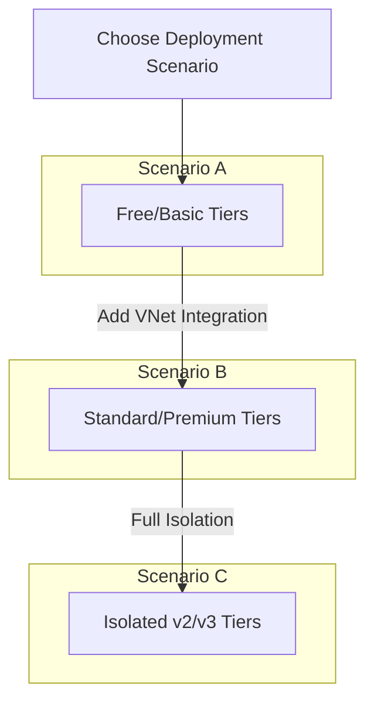
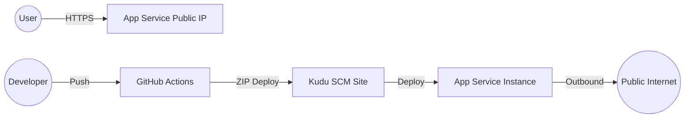
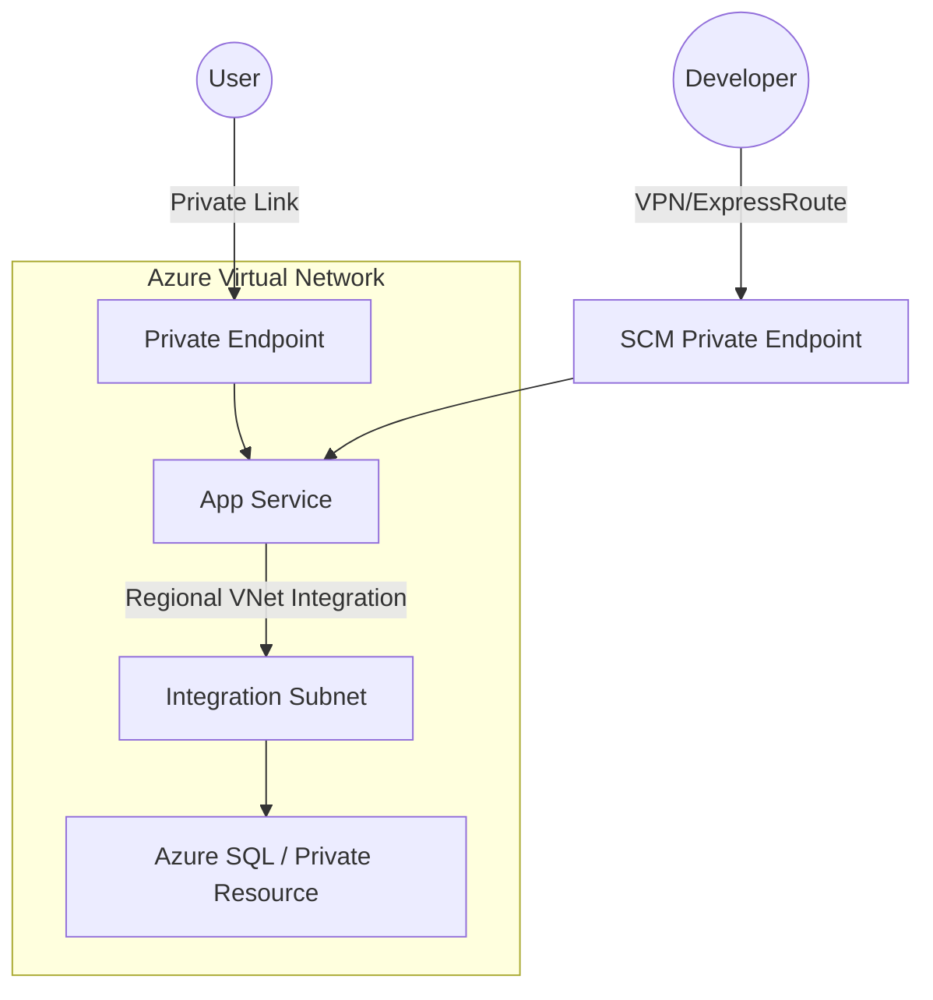
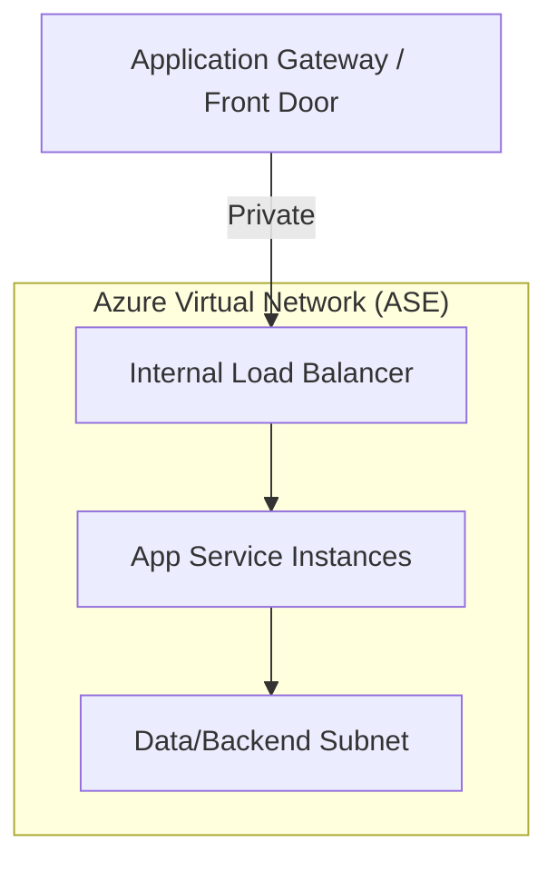

# Azure App Service Deployment Scenarios

Understanding the relationship between App Service SKUs and deployment architecture is essential for security, performance, and cost-effectiveness. This guide breaks down common scenarios based on networking requirements and tier capabilities.

## Scenario Overview

The choice of deployment scenario typically follows a progression of networking complexity and isolation requirements.

<!-- diagram-id: scenario-overview-flow -->


## Matrix A: Networking and Security by SKU

| Feature | Free/Shared | Basic | Standard | Premium (v2/v3/v4) | Isolated (ASE) |
| :--- | :---: | :---: | :---: | :---: | :---: |
| Public Inbound | Yes | Yes | Yes | Yes | Optional |
| Regional VNet Integration | No | Yes | Yes | Yes | Native |
| Private Endpoints | No | Yes | Yes | Yes | Native |
| IP Restrictions | Yes | Yes | Yes | Yes | Yes |
| Hybrid Connections | No | Yes | Yes | Yes | No (Direct VNet) |
| Outbound IP Control | Shared | Shared | Shared | Shared/NAT Gateway | Fully Controlled |

## Matrix B: Deployment Methods by SKU

| Method | Free/Shared | Basic | Standard | Premium | Isolated |
| :--- | :---: | :---: | :---: | :---: | :---: |
| ZIP Deploy | Yes | Yes | Yes | Yes | Yes |
| Run from Package | Yes | Yes | Yes | Yes | Yes |
| Container (Web App for Containers) | No | Yes | Yes | Yes | Yes |
| GitHub Actions / ADO | Yes | Yes | Yes | Yes | Yes (vNet required) |
| Kudu (SCM) Site | Public Only | Public Only | Public/Private | Public/Private | Private |
| Deployment Slots | No | No | 5 | 20 | 20 |

## Scenario A: Public-Only (Free/Shared tiers)

Best for early development, personal projects, or static-like sites where VNet integration and private ingress are not required.

<!-- diagram-id: scenario-a-public-basic -->


### Key Characteristics
- **Networking:** All traffic enters via a shared public IP address.
- **Security:** Access control is limited to IP restrictions (allow/deny lists).
- **SCM Access:** The Kudu management site is publicly accessible. **Warning:** This management interface is exposed to the internet and should be secured with strong credentials or disabled if not in use.

### Deployment Example (ZIP Deploy)
```bash
az webapp deployment source config-zip \
    --resource-group "myResourceGroup" \
    --name "myWebApp" \
    --src "project.zip"
```

| Command/Parameter | Purpose |
| :--- | :--- |
| --resource-group | Specifies the Azure resource group containing the app service. |
| --name | The name of the target App Service. |
| --src | Path to the ZIP file containing the application code. |

## Scenario B: VNet Integrated & Private Inbound (Basic/Standard/Premium)

The standard for production enterprise applications. This scenario allows the App Service to reach resources inside a Virtual Network and supports private ingress via Private Endpoints.

<!-- diagram-id: scenario-b-vnet-integrated -->


### Key Characteristics
- **Regional VNet Integration:** Allows the app to access resources in a VNet (like SQL databases or Key Vaults with private endpoints).
- **Private Endpoints:** Provides a private IP for ingress. **Note:** Adding a private endpoint does not automatically disable the public endpoint; you must explicitly disable public network access in the Networking settings to achieve full isolation.
- **Outbound Traffic:** Can be routed through a NAT Gateway or Firewall for fixed outbound IPs (requires NAT Gateway on the integration subnet).

### Enabling VNet Integration
```bash
az webapp vnet-integration add \
    --resource-group "myResourceGroup" \
    --name "myWebApp" \
    --vnet "myVNet" \
    --subnet "integrationSubnet"
```

| Command/Parameter | Purpose |
| :--- | :--- |
| --resource-group | Specifies the Azure resource group containing the app service. |
| --name | The name of the target App Service. |
| --vnet | The name of the Virtual Network to integrate with. |
| --subnet | The dedicated subnet for App Service outbound traffic. |

## Scenario C: Isolated (ASE)

The highest level of isolation. The entire App Service Environment (ASE) runs within your Virtual Network on dedicated hardware.

<!-- diagram-id: scenario-c-isolated-ase -->


### Key Characteristics
- **Single Tenant:** No shared infrastructure with other customers.
- **Internal Load Balancer (ILB):** Can be configured to have no public internet footprint at all.
- **Scalability:** Supports much larger scale-out compared to multi-tenant tiers.

## Pre-Deployment Checklist

1. **Verify SKU Compatibility:** Ensure the chosen tier supports VNet integration (Basic+) or Private Endpoints (Basic+).
2. **Subnet Delegation:** The integration subnet must be delegated to `Microsoft.Web/serverFarms` and must be empty before configuration.
3. **App Settings (Code Deploy):** For ZIP or package-based deployments, configure `WEBSITE_RUN_FROM_PACKAGE=1` for faster startup and atomic swaps. (Not applicable for custom containers).
4. **DNS Resolution:** Ensure private DNS zones (`privatelink.azurewebsites.net`) are linked to your VNet when using Private Endpoints.

## See Also
- [Networking features overview](https://learn.microsoft.com/azure/app-service/networking-features)
- [Zero-downtime deployments with slots](https://learn.microsoft.com/azure/app-service/deploy-staging-slots)
- [Security baseline for App Service](https://learn.microsoft.com/azure/app-service/security-baseline)

## Sources
- Microsoft Learn: [App Service Environment Overview](https://learn.microsoft.com/azure/app-service/environment/overview)
- Microsoft Learn: [VNet Integration](https://learn.microsoft.com/azure/app-service/overview-vnet-integration)
- Microsoft Learn: [Deploy from Package](https://learn.microsoft.com/azure/app-service/deploy-run-package)
- Microsoft Learn: [Continuous Deployment](https://learn.microsoft.com/azure/app-service/deploy-continuous-deployment)
