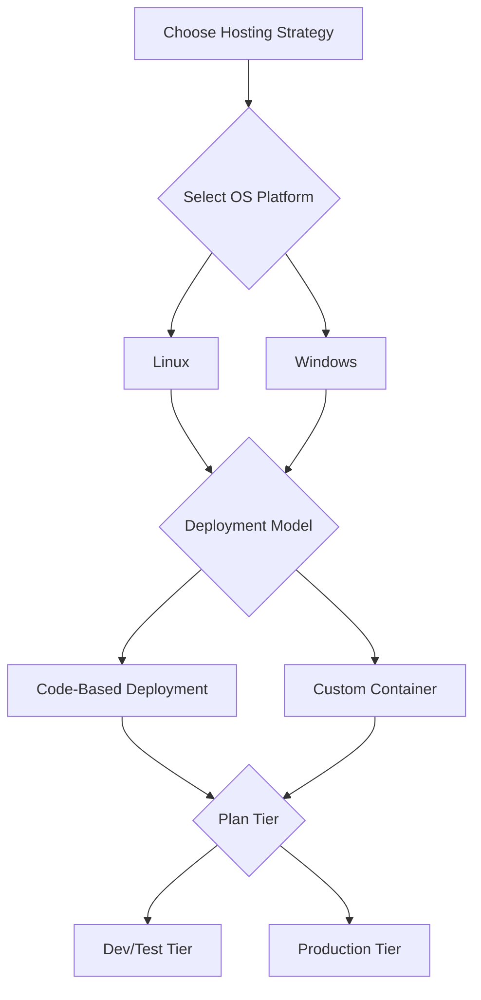

---
hide:
  - toc
---

# Hosting Models

Choosing the right hosting model in Azure App Service determines your operational control, scalability envelope, networking options, and total cost. This document explains how to choose plan tiers and deployment models without relying on language-specific assumptions.

## Prerequisites

- Understanding of App Service Plan, Web App, and deployment slots
- Familiarity with production SLAs and scaling requirements
- Azure CLI access for plan/app inspection

## Main Content

### Decision flow



### App Service Plan fundamentals

The App Service Plan defines:

- Available CPU and memory per instance
- Maximum instance count
- Feature set (autoscale, slots, networking capabilities)
- Price and SLA envelope

A single plan can host multiple apps, which share the same compute pool.

| Tier Family | Typical Use | Scale Features | Notable Limits |
|---|---|---|---|
| Free/Shared | Learning, experiments | Very limited | Shared resources, feature constraints |
| Basic | Low-traffic workloads | Manual scale | Fewer advanced platform features |
| Standard | Baseline production | Manual + autoscale | Moderate scale ceiling |
| Premium | Higher performance and networking needs | Larger autoscale ranges | Higher cost per instance |
| Isolated | Strict network/compliance boundaries | Dedicated environment options | Premium pricing and complexity |

!!! note
    For production workloads, start at a tier that supports autoscale, deployment slots, and required networking controls. Under-sizing often costs more through incidents than right-sizing upfront.

### OS choice considerations

Both Linux and Windows are supported. Decision factors are usually:

- Existing operational standards
- Dependency compatibility and startup behavior
- Corporate baseline images and compliance requirements
- Tooling and observability workflows

Keep the choice consistent across environments where possible to reduce drift.

### Deployment model: code vs container

#### Code-based deployment

In this model, App Service builds and runs your application package using platform runtime support.

Pros:

- Faster onboarding
- Lower container lifecycle burden
- Strong platform integration

Trade-offs:

- Less control over base image and system packages
- Runtime update cadence follows platform policy

#### Custom container deployment

You package your app into an OCI image and deploy from a registry.

Pros:

- Full control of runtime stack
- Repeatable environment across local and cloud stages
- Easier use of OS-level dependencies

Trade-offs:

- You own patch cadence and image hygiene
- Requires registry governance and scanning
- Startup behavior depends on image quality and entrypoint design

### Shared plan vs dedicated plan strategy

#### Shared plan strategy

- Cost-efficient when multiple apps have non-overlapping load patterns
- Increases risk of cross-app contention
- Requires strong capacity monitoring

#### Dedicated plan per critical app

- Better resource isolation
- Easier capacity forecasting
- Higher cost, simpler blast-radius management

### Feature mapping by hosting choice

| Capability | Plan Dependent | Deployment Model Dependent |
|---|---|---|
| Autoscale | Yes | No |
| Deployment slots | Yes | No |
| Private endpoint | Yes | No |
| VNet integration | Yes | No |
| Custom startup image | No | Yes (container model) |
| Platform build automation | No | Yes (code model) |

### Cost and capacity planning

Capacity planning should consider:

- Peak and average request rates
- CPU-heavy vs IO-heavy request profile
- Memory per request and background workers
- Startup time and recycle frequency

A practical pattern:

1. Start with a production-capable tier
2. Load test realistic traffic patterns
3. Add autoscale thresholds and cooldowns
4. Re-evaluate plan size monthly

### CLI examples for model selection and inspection

Create a Linux production plan:

```bash
az appservice plan create \
    --resource-group "$RG" \
    --name "$PLAN_NAME" \
    --location "$LOCATION" \
    --sku "S1" \
    --is-linux
```

Create an app attached to that plan:

```bash
az webapp create \
    --resource-group "$RG" \
    --plan "$PLAN_NAME" \
    --name "$APP_NAME" \
    --runtime "$RUNTIME_STACK"
```

> Set `$RUNTIME_STACK` to the stack that matches your application platform.

Inspect plan characteristics:

```bash
az appservice plan show \
    --resource-group "$RG" \
    --name "$PLAN_NAME" \
    --query "{sku:sku, numberOfWorkers:numberOfWorkers, reserved:reserved, status:status}" \
    --output json
```

Example output (PII masked):

```json
{
  "numberOfWorkers": 2,
  "reserved": true,
  "sku": {
    "capacity": 2,
    "name": "S1",
    "tier": "Standard"
  },
  "status": "Ready"
}
```

### Bicep pattern for repeatable hosting model

```bicep
param location string = resourceGroup().location
param planName string
param appName string

resource plan 'Microsoft.Web/serverfarms@2023-12-01' = {
  name: planName
  location: location
  sku: {
    name: 'S1'
    tier: 'Standard'
    size: 'S1'
    capacity: 1
  }
  properties: {
    reserved: true
  }
}

resource app 'Microsoft.Web/sites@2023-12-01' = {
  name: appName
  location: location
  properties: {
    serverFarmId: plan.id
    httpsOnly: true
  }
}
```

## Advanced Topics

### Multi-region hosting model

For high availability and low latency:

- Deploy active-active apps across regions
- Use traffic management and health-based routing
- Keep data tier replication design aligned with app topology

### Scale safety guardrails

- Minimum instance floor to avoid cold traffic shifts
- Maximum instance ceiling to control unexpected spend
- Alerts on rapid instance churn

### Container governance model

If using custom containers:

- Enforce image signing/scanning policies
- Track base image patch level
- Validate startup and probe behavior in pre-production slots

### Right-sizing checklist

- Does plan support required networking features?
- Does plan support required deployment patterns?
- Does autoscale react before saturation?
- Is per-instance memory headroom sufficient under peak?

## Language-Specific Details

For language-specific implementation details, see:
- [Node.js Guide](../language-guides/nodejs/index.md)
- [Python Guide](../language-guides/python/index.md)
- [Java Guide](../language-guides/java/index.md)
- [.NET Guide](../language-guides/dotnet/index.md)

## See Also

- [How App Service Works](./how-app-service-works.md)
- [Request Lifecycle](./request-lifecycle.md)
- [Scaling](./scaling.md)
- [Networking](./networking.md)
- [App Service plan overview (Microsoft Learn)](https://learn.microsoft.com/azure/app-service/overview-hosting-plans)
- [Custom container in App Service (Microsoft Learn)](https://learn.microsoft.com/azure/app-service/tutorial-custom-container)

## Sources

- [App Service plan overview (Microsoft Learn)](https://learn.microsoft.com/azure/app-service/overview-hosting-plans)
- [Custom container in App Service (Microsoft Learn)](https://learn.microsoft.com/azure/app-service/tutorial-custom-container)
