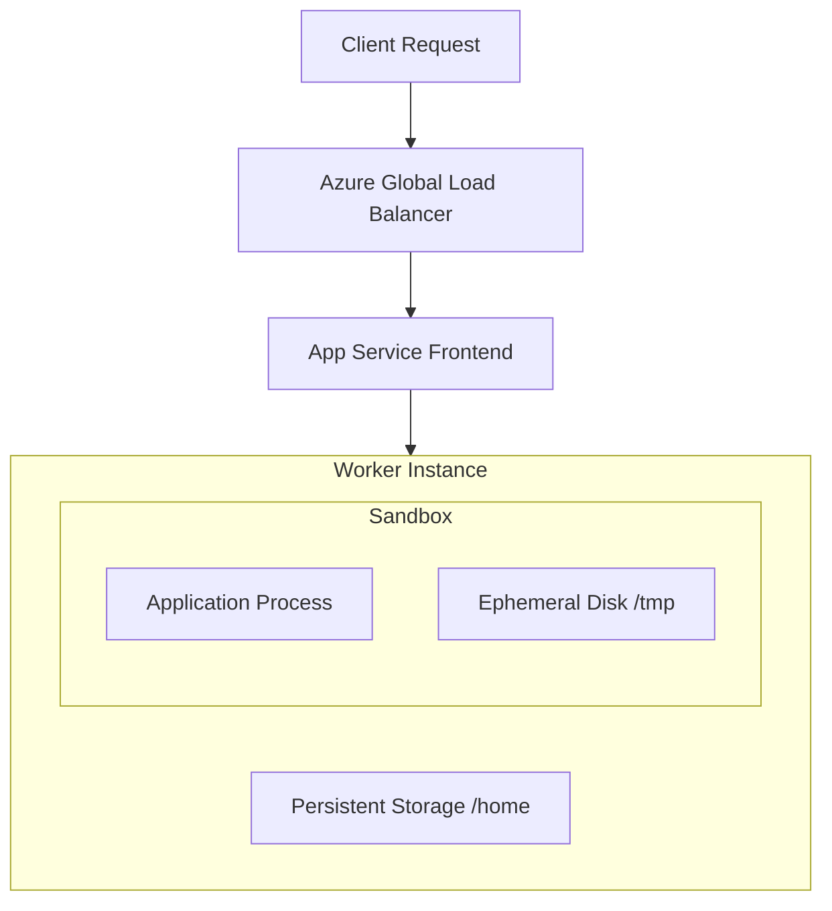
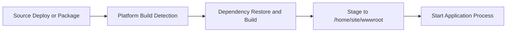
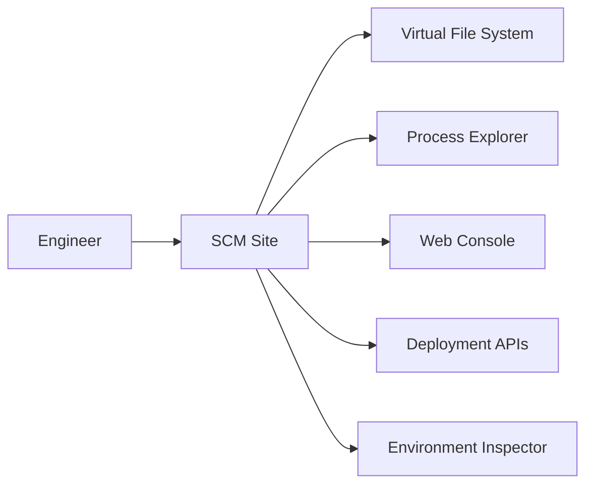

# How App Service Works

Azure App Service is a managed application hosting platform that runs your web application without requiring you to manage virtual machines, operating system patching, or load balancer infrastructure. This guide explains the platform internals that affect reliability, performance, and day-2 operations.

## Prerequisites

- Basic familiarity with Azure resources (resource groups, plans, apps)
- Azure CLI installed (`az --version`)
- Permissions to read App Service resources in your subscription

## Main Content

### Platform architecture at a glance

App Service separates **control plane** and **data plane** responsibilities:

- **Control plane**: configuration, deployments, scaling, certificates, access rules
- **Data plane**: request handling on frontend and worker infrastructure



### Control plane and data plane responsibilities

| Plane | Examples | Common Operations |
|---|---|---|
| Control plane | ARM, App Service resource provider | Deploy app, set app settings, change plan, scale rules |
| Data plane | Frontend gateways, workers | Serve requests, route traffic, stream logs |

!!! note
    A control plane operation (for example, changing app settings) can trigger a data plane recycle of your application process. Plan for restart-safe behavior.

### Sandbox and workload isolation

Your application runs in a hardened sandbox on shared infrastructure (except dedicated isolation offerings). Isolation boundaries include:

- Process isolation from other tenants
- Filesystem isolation at the app scope
- Network policy boundaries controlled by platform configuration
- Resource governance (CPU, memory, file handles, process limits)

The sandbox model means you should treat the environment as **replaceable compute**:

- Instances can restart
- Scale-out adds new instances dynamically
- Local ephemeral state can disappear at any restart

### Build and deployment flow

For code-based deployments, App Service uses a platform build pipeline (commonly Oryx) to:

1. Detect the application stack
2. Resolve and install dependencies
3. Prepare startup artifacts
4. Stage output into the app content directory

For container-based deployments, App Service pulls and starts your image, then applies platform startup contracts (ports, health probes, environment variables).



### Filesystem model: ephemeral vs persistent

Understanding storage semantics is mandatory for reliable behavior.

#### Ephemeral instance disk

- Fast local storage
- Wiped when instance is replaced or restarted
- Not shared across scaled-out instances
- Suitable for temp files, short-lived caches, and transient processing

#### Persistent shared storage (`/home`)

- Backed by network-attached storage
- Persists across restarts
- Shared among all instances of the same app
- Slower latency than local ephemeral disk

Key paths:

| Path | Purpose |
|---|---|
| `/home/site/wwwroot` | Deployed app content |
| `/home/LogFiles` | Platform/application logs |
| `/home/data` | General persistent area |

!!! warning "Storage design rule"
    Do not treat local ephemeral disk as durable storage. Put durable user data in managed data stores (database, object storage, queue, or file share service).

### Bring Your Own Storage (BYOS)

You can mount external storage at custom paths for large assets or shared content patterns.

Typical use cases:

- Shared read assets across instances
- Shared writable content with file-share-backed mounts
- Externalized artifacts that should not be bundled in deployment packages

Important constraints:

- Feature availability depends on plan tier and OS/runtime mode
- Mount count limits apply per app
- Throughput and latency depend on backing storage and networking path

### Runtime startup contract

At startup, the platform injects environment configuration and expects your app to:

- Bind to the platform-provided port
- Become healthy within startup limits
- Handle process termination signals gracefully

If startup fails repeatedly, App Service may cycle the process and surface startup errors in logs.

### Restart and recycle triggers

Common triggers include:

- Platform maintenance events
- Configuration changes (app settings, startup config)
- Scale actions
- Manual restart actions
- Process crashes or health-check failures

Design implications:

- Keep the app stateless where possible
- Use idempotent startup behavior
- Persist durable state externally

### Kudu (SCM site) for diagnostics

Every app includes a companion SCM site:

`https://<app-name>.scm.azurewebsites.net`

Kudu helps with runtime inspection and operational diagnostics.



Useful endpoints:

| Capability | Endpoint |
|---|---|
| File browsing | `/api/vfs/` |
| Process inventory | `/api/processes` |
| Environment dump | `/api/environment` |
| Zip deployment | `/api/zipdeploy` |
| Log stream | `/api/logstream` |

!!! note
    SCM diagnostics share the same plan resources as your app. Heavy diagnostics activity can impact performance on small SKUs.

### Inspecting platform state with Azure CLI

```bash
az webapp show \
    --resource-group "$RG" \
    --name "$APP_NAME" \
    --query "{state:state, defaultHostName:defaultHostName, enabledHostNames:enabledHostNames}" \
    --output json
```

Example output (PII masked):

```json
{
  "defaultHostName": "app-<masked>.azurewebsites.net",
  "enabledHostNames": [
    "app-<masked>.azurewebsites.net",
    "www.example.com"
  ],
  "state": "Running"
}
```

## Advanced Topics

### Availability zones and fault domains

Plan-level redundancy characteristics vary by SKU family and region capabilities. For mission-critical systems, evaluate zone redundancy, regional failover strategy, and data-tier resilience together.

### Warm-up and deployment safety

Use health checks and deployment slots to reduce failed rollouts:

- Deploy to slot
- Validate warm-up and probes
- Swap into production after readiness confirmation

### Shared plan contention

Multiple apps in the same App Service Plan share compute resources. Noisy-neighbor behavior can happen at the plan scope even when app-level isolation is strong.

### Operational baseline checklist

- Health endpoint configured
- Structured logs enabled
- Alert rules for restarts and HTTP failure rates
- Backup strategy for external data stores
- Rollback path using deployment slots

## Language-Specific Details

For language-specific implementation details, see:
- [Node.js Guide](https://yeongseon.github.io/azure-appservice-nodejs-guide/)
- [Python Guide](https://yeongseon.github.io/azure-appservice-python-guide/)
- [Java Guide](https://yeongseon.github.io/azure-appservice-java-guide/)
- [.NET Guide](https://yeongseon.github.io/azure-appservice-dotnet-guide/)

## See Also

- [Hosting Models](./hosting-models.md)
- [Request Lifecycle](./request-lifecycle.md)
- [Scaling](./scaling.md)
- [Networking](./networking.md)
- [Resource Relationships](./resource-relationships.md)
- [Azure App Service overview (Microsoft Learn)](https://learn.microsoft.com/azure/app-service/overview)
- [Kudu service overview (Microsoft Learn)](https://learn.microsoft.com/azure/app-service/resources-kudu)
