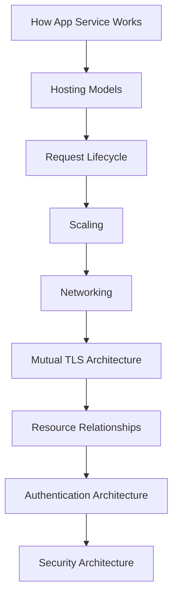

---
content_sources:
  diagrams:
    - id: platform-concepts-map
      type: flowchart
      source: mslearn-adapted
      mslearn_url: https://learn.microsoft.com/en-us/azure/app-service/overview
      description: "Maps the guide's platform concept pages to the main Azure App Service concept areas described in Microsoft Learn."
---

# Concepts

This section explains Azure App Service platform behavior in a language-agnostic way. Use these documents to understand architecture, scaling, networking, and dependency relationships before diving into language-specific implementation details.

## Main Content

### Documents

| Document | Description |
|---|---|
| [How App Service Works](./architecture/index.md) | Platform architecture, sandbox model, filesystem, runtime contracts |
| [Hosting Models](./hosting-models.md) | Plan tiers, OS choices, code vs container deployment models |
| [Request Lifecycle](./request-lifecycle.md) | End-to-end request path, routing, timeouts, health checks |
| [Scaling](./scaling.md) | Scale up/out strategies, autoscale rules, stateless design |
| [Networking](./networking.md) | Inbound and outbound controls, private networking, DNS patterns |
| [Mutual TLS Architecture](./mtls.md) | Inbound client certificates, outbound certificate loading, and ASE trust boundaries |
| [Resource Relationships](./resource-relationships.md) | Identity, data, storage, secrets, monitoring integration map |
| [Authentication Architecture](./authentication-architecture.md) | EasyAuth flow, token handling, identity provider integration |
| [Security Architecture](./security-architecture.md) | Network perimeter, TLS, managed identity, secret management |

<!-- diagram-id: platform-concepts-map -->

### Recommended reading order

1. Start with platform internals
2. Choose hosting and plan strategy
3. Learn request flow and timeouts
4. Design scaling envelope
5. Finalize networking controls
6. Validate resource relationships and permissions

## Advanced Topics

- Build architecture decision records (ADRs) per environment
- Standardize plan tier baselines by workload class
- Define SLO-driven scaling and networking review checkpoints

## Language-Specific Details

For language-specific implementation details, see:
- [Node.js Guide](../language-guides/nodejs/index.md)
- [Python Guide](../language-guides/python/index.md)
- [Java Guide](../language-guides/java/index.md)
- [.NET Guide](../language-guides/dotnet/index.md)

## See Also

- [Operations](../operations/index.md)
- [Best Practices](../best-practices/index.md)
- [Reference](../reference/index.md)

## Sources

- [Azure App Service documentation (Microsoft Learn)](https://learn.microsoft.com/azure/app-service/)
