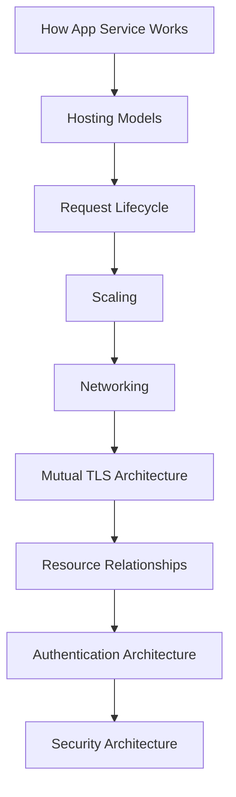

---
content_sources:
  diagrams:
    - id: platform-concepts-map
      type: flowchart
      source: mslearn-adapted
      mslearn_url: https://learn.microsoft.com/en-us/azure/app-service/overview
      description: "Maps the guide's platform concept pages to the main Azure App Service concept areas described in Microsoft Learn."
---
# Concepts

This section explains Azure App Service platform behavior in a language-agnostic way. Use these documents to understand architecture, scaling, networking, and dependency relationships before diving into language-specific implementation details.

## Main Content

### Documents

| Document | Description |
|---|---|
| [How App Service Works](./architecture/index.md) | Platform architecture, sandbox model, filesystem, runtime contracts |
| [Hosting Models](./hosting-models.md) | Plan tiers, OS choices, code vs container deployment models |
| [Request Lifecycle](./request-lifecycle.md) | End-to-end request path, routing, timeouts, health checks |
| [Scaling](./scaling.md) | Scale up/out strategies, autoscale rules, stateless design |
| [Networking](./networking.md) | Inbound and outbound controls, private networking, DNS patterns |
| [Mutual TLS Architecture](./mtls.md) | Inbound client certificates, outbound certificate loading, and ASE trust boundaries |
| [Resource Relationships](./resource-relationships.md) | Identity, data, storage, secrets, monitoring integration map |
| [Authentication Architecture](./authentication-architecture.md) | EasyAuth flow, token handling, identity provider integration |
| [Security Architecture](./security-architecture.md) | Network perimeter, TLS, managed identity, secret management |

<!-- diagram-id: platform-concepts-map -->

```mermaid
graph TD
    A[How App Service Works] --> B[Hosting Models]
    B --> C[Request Lifecycle]
    C --> D[Scaling]
    D --> E[Networking]
    E --> F[Mutual TLS Architecture]
    F --> G[Resource Relationships]
    G --> H[Authentication Architecture]
    H --> I[Security Architecture]
```

### Recommended reading order

1. Start with platform internals
2. Choose hosting and plan strategy
3. Learn request flow and timeouts
4. Design scaling envelope
5. Finalize networking controls
6. Validate resource relationships and permissions

### Verify platform surfaces in Azure Portal

![app-test-20251107 | Web App | Browse | Stop | Swap | Restart | Delete | Refresh | Essentials | Resource group | rg-test-20251107 | Status | Running | Location | Korea Central | Default domain | app-test-20251107.azurewebsites.net | App Service Plan | asp-test-20251107 (P0v3: 1) | Operating System | Linux | Health Check | Not Configured | Properties | Web app | Publishing model | Code | Runtime Stack | Python - 3.11 | Runtime status | Healthy | Hosting | Plan Type | App Service plan | Instance Count | 1 | SKU and size | Premium0V3 (P0v3) | Application Insights | ai-test-20251107 | Korea Central | Networking | Inbound IP addresses | <ip-redacted> | Private endpoint connections | 0 private endpoints | Virtual network integration | Not configured](../assets/platform/architecture/01-app-service-overview.png)

**[Observed]** `app-test-20251107` `Web App` `Browse` `Stop` `Swap` `Restart` `Delete` `Refresh` `Download publish profile` `Reset publish profile` `Share to mobile` `Send us your feedback` `Essentials` `View Cost` `JSON View` `Resource group (move)` `rg-test-20251107` `Status` `Running` `Location (move)` `Korea Central` `Subscription (move)` `Visual Studio Enterprise Subscription` `Subscription ID` `00000000-0000-0000-0000-000000000000` `Tags (edit)` `Add tags` `Default domain` `app-test-20251107.azurewebsites.net` `App Service Plan` `asp-test-20251107 (P0v3: 1)` `Operating System` `Linux` `Health Check` `Not Configured` `Properties` `Monitoring` `Logs` `Capabilities` `Notifications (1)` `Recommendations` `Web app` `Name` `Publishing model` `Code` `Runtime Stack` `Python - 3.11` `Runtime status` `Healthy` `Domains` `Custom domain` `2 Domains` `View all` `Hosting` `Plan Type` `App Service plan` `Instance Count` `1` `SKU and size` `Premium0V3 (P0v3)` `Scale up` `Deployment Center` `Deployment logs` `View logs` `Last deployment` `Deployment provider` `None` `Application Insights` `Name` `ai-test-20251107` `Region` `Korea Central` `Networking` `Inbound IP addresses` `<ip-redacted>, <ipv6-redacted>` `Private endpoint connections` `0 private endpoints` `Virtual network integration` `Not configured`.

**[Inferred]** The `Plan Type` value `App Service plan` and the `SKU and size` value `Premium0V3 (P0v3)` appearing in the `Hosting` section are consistent with the hosting-tier topics referenced in the [Hosting Models](#documents) row of the Documents table above. The `Inbound IP addresses`, `Private endpoint connections`, and `Virtual network integration` rows of the `Networking` section are consistent with the inbound and outbound topics referenced in the [Networking](#documents) row of the Documents table. The `Application Insights` section listing `ai-test-20251107` is consistent with the monitoring-integration topic referenced in the [Resource Relationships](#documents) row.

**[Not Proven]** Additional configuration detail, historical detail, and linked-resource detail are not visible on this view.

## Advanced Topics

- Build architecture decision records (ADRs) per environment
- Standardize plan tier baselines by workload class
- Define SLO-driven scaling and networking review checkpoints

## Language-Specific Details

For language-specific implementation details, see:
- [Node.js Guide](../language-guides/nodejs/index.md)
- [Python Guide](../language-guides/python/index.md)
- [Java Guide](../language-guides/java/index.md)
- [.NET Guide](../language-guides/dotnet/index.md)

## See Also

- [Operations](../operations/index.md)
- [Best Practices](../best-practices/index.md)
- [Reference](../reference/index.md)

## Sources

- [Azure App Service documentation (Microsoft Learn)](https://learn.microsoft.com/en-us/azure/app-service/)
