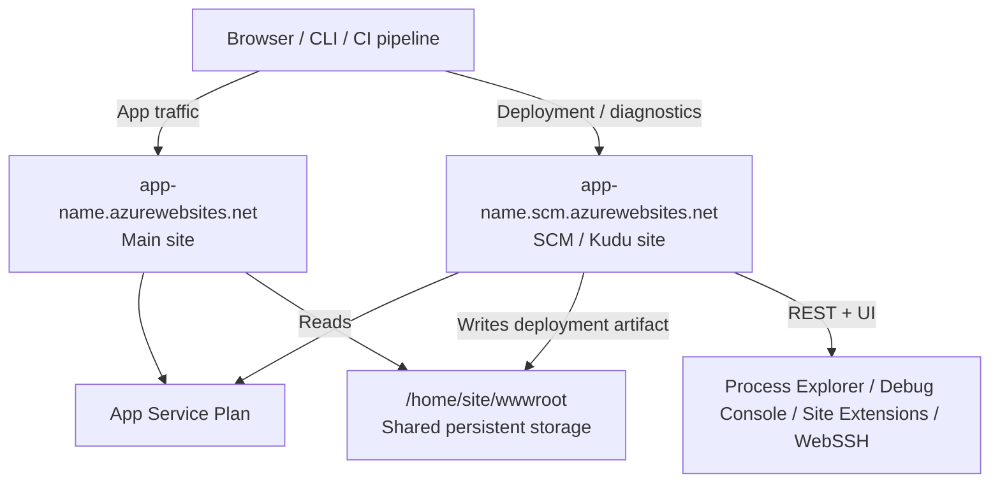
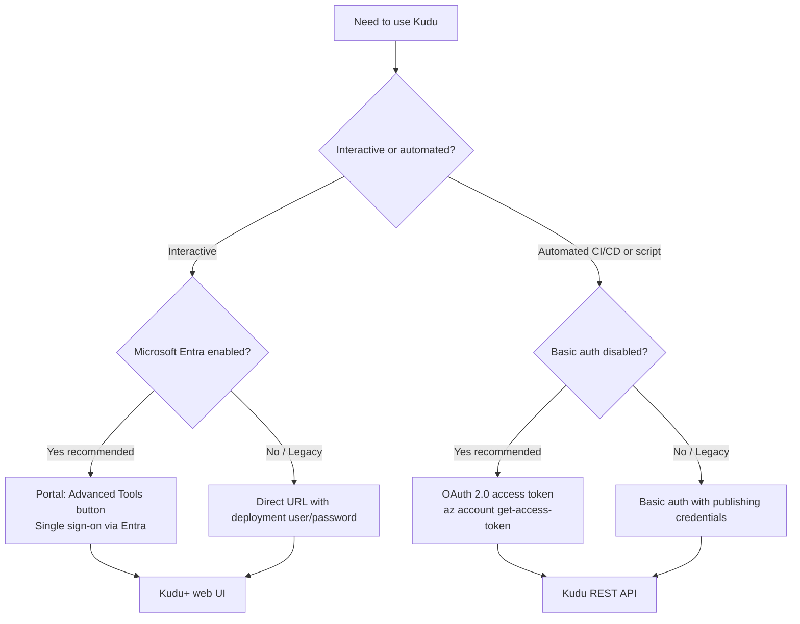

# Kudu Deep Dive

Kudu is the engine behind App Service deployment and the SCM (source control manager) companion site that ships with every Web App. It gives you a browser-based control surface, a REST API, and shell access for inspecting environment, processes, files, and deployment history. This page is the single conceptual entry point that ties together the Kudu URL formats, authentication model, web UI tour, file system layout, and security hardening guidance. Once you finish this page, jump to [Kudu API Reference](../reference/kudu-queries.md) for the per-endpoint cheatsheet.

## Why Kudu Matters

Most App Service deployment paths—ZIP deploy, Run from Package, Local Git, GitHub Actions, FTP, OneDeploy—either talk to Kudu directly or rely on it for the post-deploy step (unpacking the artifact, running Oryx, recycling the worker). When something goes wrong between "deployment succeeded" and "app responds 200 OK," Kudu is usually where the evidence lives.

Three concrete capabilities make Kudu non-replaceable:

1. **It runs in a separate sandbox.** SCM has its own filesystem snapshot, its own credentials surface, and its own restart lifecycle. That separation is why deployments survive worker recycles and why you can inspect a hung app from a healthy companion site.
2. **It exposes both UI and REST.** Operators get a clickable console for one-off investigation; CI pipelines and runbooks call the same endpoints non-interactively.
3. **It is the only deployment surface that disabling basic auth still leaves accessible**—via Microsoft Entra ID OAuth tokens. Modern Azure environments increasingly require this token-based path.

## Architecture: How Kudu Fits with Your App

Every App Service app is paired with a **companion Kudu site** at a related hostname. The two sites share the same App Service Plan compute, but they run in different sandbox contexts and serve different traffic.

<!-- diagram-id: kudu-architecture-relationship -->


| Aspect | Main site | SCM (Kudu) site |
|---|---|---|
| Hostname (non-Isolated) | `app-name.azurewebsites.net` | `app-name.scm.azurewebsites.net` |
| Hostname (ASE Internet) | `app-name.ase-name.p.azurewebsites.net` | `app-name.scm.ase-name.p.azurewebsites.net` |
| Hostname (ASE Internal) | `app-name.ase-name.appserviceenvironment.net` | `app-name.scm.ase-name.appserviceenvironment.net` |
| Purpose | Serves user requests | Deployment, diagnostics, file & process access |
| Restart | Recycles on app code change | Survives most app-level restarts |
| Access restrictions | "Main site" tab | "Advanced tool site" tab (separate ruleset) |

!!! warning "Linux custom container caveat"
    On Linux **custom container** apps, the SCM/Kudu site runs in a **separate container** from the main app container. Kudu still helps with deployment metadata, persistent storage, and shared logs, but `/api/processes` and Kudu's file browser do **not** reflect the running app container. Use [WebSSH](#linux-kudu-bash-console) into the app container or application/container logs for runtime investigation.

## Accessing the Kudu Site

There are three supported access paths, each appropriate for a different use case:

<!-- diagram-id: kudu-access-decision-flow -->


### Path 1: Portal `Advanced Tools` button (recommended for interactive use)

The Azure Portal exposes Kudu under `Development Tools > Advanced Tools` in every Web App blade.

#### Portal view: Advanced Tools entry point in the Web App blade

![Azure Portal Web App blade with Advanced Tools selected. Left navigation lists Overview, Activity log, Access control (IAM), Tags, ..., Settings, Deployment, Events, Monitoring, and Development Tools (group expanded). The Development Tools group shows SSH, Advanced Tools (highlighted as the current selection), and Recommended services. Right pane shows the Advanced Tools description: "Kudu is the engine behind a number of features in Azure App Service related to source control based deployment, and other deployment methods like Dropbox and OneDrive sync." Two buttons appear: "Open in a new tab" (link-styled) and "Go →" (blue, primary).](../assets/platform/kudu-deep-dive/01-advanced-tools-entry.png)

> [Observed] The Development Tools group is expanded in the left nav, and `Advanced Tools` is the highlighted entry. The right pane shows only a short Kudu description plus a primary `Go →` button — there is no inline Kudu UI on this blade.
>
> [Inferred] The same blade exists with the same layout for both Linux and Windows apps — Advanced Tools is platform-agnostic. Because the blade hosts only a launch button (no embedded console), Kudu+ is intentionally a separate companion site rather than an in-portal blade. Clicking `Go →` launches Kudu using your existing portal-authenticated browser session, so no extra credentials are prompted.

Use the Advanced Tools blade when you want a one-click path that piggybacks on your existing portal sign-in. For headless scripts and CI/CD callers, prefer the REST API path described in [Path 3](#path-3-rest-api-or-cli).

### Path 2: Direct URL

If you already know the app name, you can navigate straight to the SCM hostname:

```bash
# Replace with your app name
APP_NAME=app-test-20251107
echo "https://${APP_NAME}.scm.azurewebsites.net"
```

Browser-based access prompts for Microsoft Entra sign-in (if the user has the required RBAC role) or basic authentication (if SCM basic auth is enabled).

### Path 3: REST API or CLI

Both `az` CLI and `curl` can hit Kudu endpoints non-interactively. See [Authentication and RBAC](#authentication-and-rbac) for which auth method to choose.

```bash
# Microsoft Entra OAuth (recommended, works even when basic auth is disabled)
ACCESS_TOKEN=$(az account get-access-token --resource https://management.azure.com --query accessToken --output tsv)
curl --silent --header "Authorization: Bearer ${ACCESS_TOKEN}" \
  "https://${APP_NAME}.scm.azurewebsites.net/api/environment"
```

| Step | Purpose |
|---|---|
| `az account get-access-token --resource https://management.azure.com` | Acquires an OAuth 2.0 access token scoped to ARM, which Kudu accepts as proof of `Microsoft.Web/sites/publish/Action` permission. |
| `curl --header "Authorization: Bearer ..."` | Presents the token as a bearer credential; basic auth state on the app does not affect this path. |
| `/api/environment` | Example Kudu REST endpoint—returns environment variables and platform metadata. |

## Authentication and RBAC

Kudu supports two authentication models. **Microsoft Entra ID is the recommended path** for both interactive and automated access.

| Method | When to use | What you need |
|---|---|---|
| **Microsoft Entra ID (OAuth)** | All modern scenarios; required when basic auth is disabled | Azure RBAC role with `Microsoft.Web/sites/publish/Action` permission |
| **Basic authentication** | Legacy tools (older Visual Studio, older Git clients) | SCM basic auth enabled + publishing credentials |

### Required Azure RBAC role

To access Kudu in the browser using Microsoft Entra authentication, the role assigned to your user/principal must include the `Microsoft.Web/sites/publish/Action` operation. Built-in roles that satisfy this:

| Role type | Built-in roles |
|---|---|
| Job-function roles | `Website Contributor`, `Logic Apps Standard Developer (Preview)` |
| Privileged administrator roles | `Owner`, `Contributor` (over-privileged for routine Kudu use) |

!!! tip "Prefer job-function roles"
    `Website Contributor` is the smallest built-in role that grants Kudu access. Avoid blanket `Contributor` or `Owner` assignments for daily diagnostic work—use `Website Contributor` scoped to the specific Web App or resource group.

### Disabling basic authentication

Both `scm` (Kudu/Git/Web Deploy) and `ftp` (FTP/FTPS) basic auth flags are independently controlled. **SCM basic auth is required as a prerequisite for FTP basic auth.**

```bash
# Disable SCM basic auth
az resource update \
  --resource-group $RG \
  --name scm \
  --namespace Microsoft.Web \
  --resource-type basicPublishingCredentialsPolicies \
  --parent sites/$APP_NAME \
  --set properties.allow=false

# Disable FTP basic auth (independent flag, but disabling SCM forces FTP off too)
az resource update \
  --resource-group $RG \
  --name ftp \
  --namespace Microsoft.Web \
  --resource-type basicPublishingCredentialsPolicies \
  --parent sites/$APP_NAME \
  --set properties.allow=false
```

| Parameter | Purpose |
|---|---|
| `--name scm` / `--name ftp` | Selects which publishing-credentials policy to update; the two are separate resources. |
| `--resource-type basicPublishingCredentialsPolicies` | The Azure resource type that governs SCM/FTP basic auth. |
| `--parent sites/$APP_NAME` | Scopes the policy to the specific Web App. |
| `--set properties.allow=false` | Disables basic auth; set to `true` to re-enable. |

After disabling, basic-auth-only tools fail with `401 Unauthenticated`. Modern Azure CLI (>= 2.48.1) falls back to Entra authentication automatically for `az webapp deploy`, `az webapp log tail`, `az webapp ssh`, and related commands.

## Kudu+ Web UI Tour (Windows)

When you open the SCM URL on a **Windows** App Service, you land on Kudu+ Environment home with a top nav exposing the major diagnostic surfaces.

#### Portal view: Kudu+ Environment home with REST API inventory

![Kudu+ Environment home page. Top navigation lists Environment, Debug console (dropdown), Process explorer, Tools (dropdown), Site extensions, and a user@example.com (PII masked) account label. The Environment heading lists Build 2026.5.1.3 (Commit: f4ee002fc6), Azure App Service 108.0.7.45 (release_ANT108-f8334366)+f833436623d9273dc099f581aebca802e0a126fd, Site up time 00.00:06:39, Site folder C:\home, Temp folder C:\local\Temp\. The REST API heading with caption "(works best when using a JSON viewer extension)" is followed by a list of items: App Settings, Deployments, Source control info, Files, Log streaming (use curl, not browser!), Processes and mini-dumps, Runtime versions, Site Extensions (installed | feed), Web hooks, WebJobs (all | triggered | continuous), Functions (list | host config). The footer states "More information about Kudu can be found on the wiki."](../assets/troubleshooting/kudu/02-kudu-home.png)

> [Observed] The Environment landing page exposes build/version info (`Build 2026.5.1.3`, `Azure App Service 108.0.7.45`), site uptime, and filesystem roots (`Site folder C:\home`, `Temp folder C:\local\Temp\`). Below that, a REST API section lists eleven entries: App Settings, Deployments, Source control info, Files, Log streaming, Processes and mini-dumps, Runtime versions, Site Extensions, Web hooks, WebJobs, Functions. The top nav separately exposes five tabs: Environment, Debug console, Process explorer, Tools, Site extensions.
>
> [Inferred] The REST API list on this page is the discoverability entry for Kudu's JSON endpoints — the `(works best when using a JSON viewer extension)` caption confirms these endpoints return raw JSON rather than HTML. The REST list and the top nav are not a 1:1 mapping: some REST categories (Deployments, WebJobs, Functions) have no dedicated top-nav tab on this screen, so scripted callers typically hit the JSON endpoints directly rather than driving those categories through the UI.

The Kudu+ home doubles as your **REST API inventory**. The top nav (`Environment`, `Debug console`, `Process explorer`, `Tools`, `Site extensions`) provides interactive UIs for the categories with visual triage value, while the REST API list below it enumerates a broader set of JSON endpoints (including deployments, WebJobs, and Functions metadata) that do not have dedicated top-nav tabs. Use the UI for interactive triage; switch to the REST URLs (e.g. `/api/processes`, `/api/vfs`, `/api/deployments`) when you need to script the same checks for an incident runbook.

### App Settings and Environment

#### Portal view: Kudu Environment / App Settings page

![Kudu+ Environment (/Env) page on a Windows App Service. Top navigation shows Environment (current), Debug console (dropdown), Process explorer, Tools (dropdown), Site extensions, and a user@example.com account label. The page has an Index of anchor links: System Info, App Settings, Connection Strings, Environment variables, PATH, HTTP Headers, Server variables. The System info section lists OS version Microsoft Windows NT 10.0.20348.0, 64 bit system True, 64 bit process False, Processor count 8, Machine name WEBWK000002, Short instance id 92ca53, CLR version 4.0.30319.42000, IIS command line including `-ap "~1app-kudu-capture-msit-win"` and a `\\.\pipe\iisipm…` named pipe identifier, C:\home usage 1,024 MB total / 1,023 MB free (green), C:\local usage 500 MB total / 499 MB free (green). The AppSettings section lists key=value pairs including aspnet:PortableCompilationOutput=true, aspnet:DisableFcnDaclRead=true, SCM_GIT_USERNAME=windowsazure, SCM_GIT_EMAIL=windowsazure, ScmType=None, WEBSITE_AUTH_ENABLED=False, WEBSITE_DEFAULT_HOSTNAME=app-kudu-capture-msit-win.azurewebsites.net, WEBSITE_SITE_NAME=app-kudu-capture-msit-win.](../assets/platform/kudu-deep-dive/02-environment-appsettings.png)

> [Observed] The Index navigates to seven anchored sections on the same scrollable page (System Info, App Settings, Connection Strings, Environment variables, PATH, HTTP Headers, Server variables). System info reports a clean disk picture (`C:\home` 1,023 MB free of 1,024 MB; `C:\local` 499 MB free of 500 MB, both in green), and AppSettings shows platform-injected keys like `WEBSITE_DEFAULT_HOSTNAME` and `WEBSITE_SITE_NAME` alongside `ScmType=None`.
>
> [Inferred] The Index is purely a same-page jump table — there are no sub-pages. `ScmType=None` indicates no source-control-based deployment is configured (this is a freshly created app); a Git or GitHub Actions setup would change this value. The `WEBSITE_*` keys visible here are how every runtime sees its own identity, and `/api/environment` returns the same values as JSON for scripted callers.

The Environment page is one of the most commonly used Kudu tools. It lists `AppSettings` (what your code sees via `process.env` / `Environment.GetEnvironmentVariable`), `System Connection Strings`, `Environment Variables` (the full process environment including platform-injected values like `WEBSITE_INSTANCE_ID`), and `HTTP Headers` from the incoming request. When configuration-related bugs are suspected, this page reveals exactly what the runtime sees—no guessing about whether an app setting was applied.

### Debug Console (CMD / PowerShell)

Windows Kudu exposes both CMD and PowerShell as browser-based shells.

#### Portal view: Kudu Debug Console (CMD) with site/wwwroot listing


> [Observed] The Debug Console is a split-pane UI — a file tree rooted at `/home` on top, a CMD shell at `C:\home\site\wwwroot>` on the bottom. Running `dir` from the shell shows the contents of `C:\home\site\wwwroot\`.
>
> [Inferred] The file tree and the shell are wired to the same filesystem view — clicking a folder in the tree changes the shell's working directory and vice versa. That two-way binding is what makes Kudu Debug Console faster than separate browser-to-shell tools for one-off file checks.

The split-pane Debug Console is convenient for confirming deployment state without leaving the browser. The top file-tree pane lets you click into `site/wwwroot`, `LogFiles`, and `data`; the bottom shell pane accepts CMD commands that produce evidence (file listings, `web.config` contents, log tails). For configuration drift investigations, this view answers "is the file actually there?" in seconds.

#### Portal view: Kudu Debug Console (PowerShell) variant


> [Observed] The split-pane layout is identical to the CMD variant, but the bottom shell renders PowerShell's columnar object output (Mode / LastWriteTime / Length / Name) instead of CMD's flat text.
>
> [Inferred] The URL path differs from the CMD variant — it is `/DebugConsole/?shell=powershell` (NOT `/DebugConsole/PowerShell`, which returns 404). Switching shells is therefore a query-string flip, meaning the front-end is the same UI bound to a different backend shell process.

PowerShell mode is preferable when you need richer scripting—object pipelines, `Select-Object`, structured filtering—on Windows hosts. Common one-liners: `Get-Process` to enumerate workers, `Get-Content -Path C:\home\site\wwwroot\web.config` to dump configuration, and `Get-ChildItem -Path C:\home\LogFiles -Recurse | Sort-Object LastWriteTime -Descending` to find the freshest logs.

### Process Explorer

#### Portal view: Kudu Process Explorer with w3wp.exe rows

![Kudu+ Process Explorer page. Top navigation shows Environment, Debug console (dropdown), Process explorer (current), Tools (dropdown), Site extensions, user@example.com (PII masked) account label. The page heading reads Process Explorer. A Find Handle... button sits above a Refresh link. The table has columns name, pid, user_name, total_cpu_time, working_set, private_memory, thread_count, properties, profiling. Row 1: w3wp.exe, 1760, app-test-windows-20260608, 3 s, 6,044 KB, 52,008 KB, 31, Properties.. button, Collect IIS Events checkbox, Start Profiling button. Row 2: w3wp.exe with an scm badge, 6200, app-test-windows-20260608, 14 s, 44,096 KB, 76,112 KB, 32, Properties.. button, Collect IIS Events checkbox, Start Profiling button.](../assets/troubleshooting/kudu/03-process-explorer.png)

> [Observed] The table lists two `w3wp.exe` rows on this idle app — one unbadged (pid 1760, private memory 52,008 KB, 31 threads) and one carrying an `scm` badge (pid 6200, private memory 76,112 KB, 32 threads). Each row exposes `Properties..`, a `Collect IIS Events` checkbox, and a `Start Profiling` button.
>
> [Inferred] The `scm`-badged row is the Kudu worker itself (serving the page you are looking at); the unbadged row is the user-traffic worker. Kudu therefore runs in a separate IIS app pool from the user site, which is why disabling the user site does not disable Kudu, and why memory pressure on one worker does not necessarily affect the other. `Start Profiling` triggers CPU sampling on the selected process — pair it with `Collect IIS Events` when investigating request-scoped CPU spikes.

Process Explorer is the only Kudu surface that exposes **live per-process state**: CPU time, working set, private memory, thread count, and handle count. The two `w3wp.exe` rows—one for the main site, one with an `scm` badge for the Kudu site itself—illustrate the dual-process model: the SCM worker is what serves this very page, while the unbadged worker serves user traffic. For memory-leak and thread-exhaustion suspicions, sort by `private_memory` and refresh every 30-60 seconds to spot growth.

### Site Extensions

Site Extensions add gallery-installed agents (Application Insights Profiler, Crash Diagnoser, .NET Snapshot Debugger). They are Windows-only.

#### Portal view: Kudu Site Extensions gallery

![Kudu+ Site Extensions Gallery on Windows. Top nav shows Environment, Debug console, Process explorer, Tools, Site extensions (current), user@example.com. Two tabs: Installed and Gallery (current/active). The Gallery view displays a grid of extension cards including: ASP.NET Core Logging Integration v10.0.9, New Relic .NET Agent v1.6.0, .NET Datadog APM v3.48.0, AppDynamics 4.5 v26.5.0, OzCode Production Debugger, JENNIFER .NET Agent, File Counter, Azure Let's Encrypt, IIS.Compression. Each card shows the package version, a short description, and a + (Add) button.](../assets/platform/kudu-deep-dive/05-site-extensions.png)

> [Observed] The Gallery tab is active (vs the Installed tab). The visible cards span observability agents (New Relic, Datadog, AppDynamics, JENNIFER), debugging tools (OzCode), and platform utilities (Azure Let's Encrypt, IIS.Compression).
>
> [Inferred] The gallery is a curated NuGet feed surface; every card is one click away from installation into the same SCM sandbox the rest of Kudu runs in. Most production-grade extensions here are observability sidecars — choose them only after Application Insights is shown to be insufficient, because each adds startup cost and another moving part to the worker process.

The Site Extensions gallery is the entry point for installing diagnostic agents that are too heavy to ship by default. Most operators install `Application Insights Profiler` for code-level CPU profiling and `Crash Diagnoser` for automated dump capture on configurable triggers. After installation, the extension's UI appears under `Site Extensions > Installed`; some extensions also expose their own admin pages reachable from this list.

## Linux Kudu Bash Console

On **Linux** App Service, the Kudu UI is intentionally minimal—most diagnostics happen through the WebSSH terminal, which gives you a real Bash shell inside the app container (for code apps) or the SCM container (for custom containers).

#### Portal view: Linux Kudu Bash Console (WebSSH)

![Linux App Service WebSSH terminal in the browser. A large AZURE ASCII art banner reads 'APP SERVICE ON LINUX', followed by documentation link, runtime info (NodeJS v22.22.2), Instance Name 10-30-0-179, and Instance Id (truncated lowercase hex). A note explains that only changes under /home are persisted across container restarts. Shell prompt `root@f13e82c606b0:/home#` with executed commands: `pwd` returning `/home`, and `ls /home/site/wwwroot` returning `hostingstart.html  package.json  startup.js`. Bottom status bar reads 'SSH CONNECTION ESTABLISHED' with target `ssh://root@169.254.129.3:2222`.](../assets/platform/kudu-deep-dive/06-linux-bash-console.png)

> [Observed] The browser terminal lands in `/home` as `root` inside the container with hostname `f13e82c606b0`. The runtime is Node.js v22.22.2 (a built-in Linux runtime), and `/home/site/wwwroot` already contains the default `hostingstart.html`, `package.json`, and `startup.js`. The status bar confirms an SSH tunnel to `169.254.129.3:2222`.
>
> [Inferred] The address `169.254.129.3` is in the IPv4 link-local range — it is the sandbox-internal address App Service uses to proxy WebSSH into the container. For built-in runtimes you reach the app container directly; for custom containers, the proxy lands in a separate SCM container unless the image runs `sshd` on port 2222 (see the warning below).

The Linux Bash Console gives you a real interactive shell inside the app sandbox. The default working directory is `/home`, and the deployed code lives at `/home/site/wwwroot`. For built-in Linux runtimes (Python, Node, .NET, Java), this terminal IS the app container—you can inspect installed packages (`pip list`, `npm ls`), tail the gunicorn/node logs, and run the app's own commands to reproduce startup behavior. For Linux custom containers, see the warning below.

!!! warning "Custom container: WebSSH connects to a different process namespace"
    For Linux **custom containers**, this WebSSH session lands in the **SCM container**, not your app container. To SSH into the app container, you must (a) include `openssh-server` in your image, (b) start `sshd` on port `2222`, and (c) set the root password to `Docker!`. App Service then proxies a separate SSH session to port `2222`. See [Web App for Containers — Custom container recipes](../language-guides/nodejs/recipes/custom-container.md) for the Dockerfile pattern.

| Linux runtime | Kudu Bash console connects to | Common evidence to collect |
|---|---|---|
| Built-in Python / Node / .NET / Java | App container (same sandbox as the runtime) | Installed packages, process tree (`ps auxf`), runtime version, `/tmp` state |
| Custom container | SCM container (separate from app) | Use the `/webssh/host` endpoint after configuring `sshd` on port `2222` in the image |

## File System and Logs

Kudu exposes the App Service file system both interactively (file browser) and programmatically (`/api/vfs/{path}` endpoint).

| Path | Description | Persistent? |
|---|---|---|
| `/home/site/wwwroot` (Linux) / `C:\home\site\wwwroot` (Windows) | Current deployed application code | ✅ Yes |
| `/home/LogFiles` (Linux) / `C:\home\LogFiles` (Windows) | Application, platform, deployment, and HTTP logs | ✅ Yes |
| `/home/data` (Linux) / `C:\home\data` (Windows) | Application data directory | ✅ Yes |
| `/tmp` (Linux) / `C:\local\Temp` (Windows) | Per-instance temp storage | ❌ No (cleared on restart) |
| `/home/site/deployments` | Deployment history with per-deploy logs | ✅ Yes |

```bash
# Browse persistent storage via REST
curl --silent --header "Authorization: Bearer ${ACCESS_TOKEN}" \
  "https://${APP_NAME}.scm.azurewebsites.net/api/vfs/home/"

# Download a specific log file
curl --location --header "Authorization: Bearer ${ACCESS_TOKEN}" \
  "https://${APP_NAME}.scm.azurewebsites.net/api/vfs/LogFiles/application/app.log" \
  --output app.log
```

| Endpoint | Purpose |
|---|---|
| `GET /api/vfs/<path>/` (trailing slash) | Lists directory entries as JSON |
| `GET /api/vfs/<path>` (no trailing slash) | Downloads file contents |
| `PUT /api/vfs/<path>` with `If-Match` header | Uploads/replaces a file |
| `DELETE /api/vfs/<path>` | Removes a file |

For the complete endpoint reference, see [Kudu API Reference](../reference/kudu-queries.md).

## Diagnostic Dumps and Deployments

### Diagnostic dumps

Kudu can generate a full process dump for offline analysis (WinDbg, Visual Studio, dotnet-dump). Dumps are essential when a process hangs or deadlocks and live logs cannot explain the state.

#### Portal view: Kudu Process page with diagnostic dump capture

![Kudu+ Process Explorer 'w3wp.exe : 5384 Properties' dialog on Windows. Five tabs across the top: General (current), Modules, Handles, Threads, Environment Variables. The General tab shows fields: id 5384, name w3wp, file name `C:\Windows\SysWOW64\inetsrv\w3wp.exe`, command line including `-ap "~1app-kudu-capture-msit-win"` and the IIS pipe identifier `\\.\pipe\iisipm00000000-0000-0000-0000-000000000000`, user name `IIS APPPOOL\app-kudu-capture-msit-win`, is scm site true, is webjob true, handle count 1356, thread count 54, plus memory metrics. Two prominent action buttons at the bottom: `Kill` (red) and `Download memory dump` (blue). A Close button is in the dialog header.](../assets/platform/kudu-deep-dive/07-diagnostic-dump.png)

> [Observed] The General tab shows process metadata (id, working binary, command line, identity, handle/thread counts) and exposes two action buttons: `Kill` (red) and `Download memory dump` (blue). The `is scm site : true` field is set on this process row.
>
> [Inferred] `Kill` (immediate process termination) and `Download memory dump` (expensive full-process capture that briefly pauses the worker) are both consequential — `Download memory dump` is the UI surface for `POST /api/processes/{pid}/dump`, which is what incident runbooks should call to avoid the wrong PID being clicked under pressure. The `is scm site : true` field marks this row as the SCM worker (the worker serving Kudu itself), not the user-traffic worker. The IIS pipe GUID is masked (all-zero) in this capture but is real on a live system — it is a per-worker named pipe identifier, not a security secret.

The `Download memory dump` button captures a full process image (including the heap) for offline analysis in WinDbg, Visual Studio, or `dotnet-dump analyze` — appropriate for memory-leak and hang investigations where live logs cannot explain the state.

```bash
# Trigger a dump for PID 1234
curl --silent --request POST --header "Authorization: Bearer ${ACCESS_TOKEN}" \
  --output "dump-${APP_NAME}-$(date +%Y%m%dT%H%M%S).dmp" \
  "https://${APP_NAME}.scm.azurewebsites.net/api/processes/1234/dump"
```

!!! warning "Dump capture is expensive"
    Capturing a full memory dump on a high-memory worker can pause the process for several seconds and consume significant disk I/O. Capture only at confirmed peak-symptom moments and only one dump per incident if possible.

### Deployment history and source control

Kudu owns the deployment ledger. Every push, ZIP deploy, or container pull writes an entry under `/home/site/deployments/` and is exposed via the `Deployments` page and the `/api/deployments` endpoint.

#### Portal view: Deployment Center Logs tab (the portal-side view of Kudu deployment history)

![Azure Portal Deployment Center blade with Logs tab active. Page title 'Deployment Center'. Four tabs across the top: Settings, Containers (new), Logs (current/highlighted), FTPS Credentials. Command bar shows Refresh and Delete actions. A banner alert reads 'CI/CD is not configured. To start, go to Settings tab and set up CI/CD.' The Logs table has columns Time, Deployment ID, Author, Status, Message. One group header 'Thursday, June 25, 2026 (1)' with a single row: Time `6/25/2026, 04:10:21 PM`, Deployment ID `0f7d078`, Author `N/A`, Status `Succeeded (Active)`, Message `OneDeploy`. Left navigation shows the Deployment Center entry highlighted. Top-right account avatar is masked with solid Portal-blue.](../assets/platform/kudu-deep-dive/08-deployments-history.png)

> [Observed] The Logs tab lists one deployment from 2026-06-25 16:10:21, deployment ID `0f7d078`, status `Succeeded (Active)`, message `OneDeploy`. The CI/CD banner indicates no automated pipeline is currently wired to this app.
>
> [Inferred] The portal Logs tab is rendering the same data that `GET /api/deployments` returns as JSON — verified against the live API, the same row surfaces with id `0f7d0782-774d-4379-8b15-1200563e0b61`, deployer `OneDeploy`, `complete:true`, `active:true`. `Active` flags the row whose artifact is currently live at `/home/site/wwwroot`; that flag is exactly what slot swap and rollback ultimately flip.

The Deployments view records every deployment with its commit ID, author, timestamp, status, and detailed per-step log. When a deploy "succeeded" but the app fails to start, this is where you confirm the deployment ID, then follow the log link to see Oryx build output, dependency installation, and startup command resolution. Failed deployments stay in the history—use `id`, `status`, and `message` fields to filter.

## REST API Quick Reference

| Endpoint | Method | Purpose |
|---|---|---|
| `/api/environment` | GET | Environment variables and platform metadata |
| `/api/processes` | GET | List running processes |
| `/api/processes/{id}` | GET / DELETE | Inspect or kill a process |
| `/api/processes/{id}/dump` | POST | Generate a process dump |
| `/api/vfs/{path}` | GET / PUT / DELETE | File operations |
| `/api/zip/{path}` | GET / PUT | Download / upload folder as ZIP |
| `/api/deployments` | GET | Deployment history |
| `/api/deployments/{id}/log` | GET | Detailed deployment log |
| `/api/command` | POST | Execute shell command in app root |
| `/api/settings` | GET | Kudu settings (including `scmType`) |
| `/api/zipdeploy` | POST | ZIP deploy entry point (used by `az webapp deploy`) |

For full request/response examples, see [Kudu API Reference](../reference/kudu-queries.md).

## Windows vs Linux Capability Matrix

| Capability | Windows | Linux (built-in runtimes) | Linux (custom container) |
|---|:---:|:---:|:---:|
| Kudu+ Environment page | ✅ Full | ✅ Basic | ✅ Basic (SCM container view) |
| Debug Console (CMD / PowerShell) | ✅ | ❌ | ❌ |
| Bash Console (WebSSH) | ❌ | ✅ App container | ⚠️ SCM container only (configure `sshd` on port 2222 for app container) |
| Process Explorer UI | ✅ | ❌ (use `/api/processes`) | ❌ |
| Site Extensions | ✅ | ❌ | ❌ |
| `/api/processes` endpoint | ✅ Returns IIS workers | ✅ Returns app processes | ⚠️ Returns SCM container processes only |
| `/api/processes/{id}/dump` endpoint | ✅ | ⚠️ Limited (runtime-dependent) | ❌ |
| `/api/vfs` endpoint | ✅ | ✅ | ⚠️ Sees shared `/home` only, not app container fs |
| `/api/deployments` endpoint | ✅ | ✅ | ✅ |
| Auto-Heal via `web.config` | ✅ | ❌ (different mechanism) | ❌ |

## Security Hardening

Kudu is a powerful management surface—exposed to the public internet by default. Lock it down systematically:

1. **Disable basic authentication.** Use the CLI commands in [Authentication and RBAC](#authentication-and-rbac). After this change, only Microsoft Entra-authenticated callers can use Kudu.
2. **Apply IP access restrictions on the SCM site separately from the main site.** The `Access Restrictions` blade has two tabs—`Main site` and `Advanced tool site`. Hardening the main site without also hardening the SCM site leaves Kudu publicly reachable.
3. **Audit Kudu access.** Enable `AppServiceAuditLogs` shipping to Log Analytics or storage; every successful and failed Kudu/FTP login is recorded with timestamp, user, source IP, and protocol.
4. **Use Azure Policy to enforce.** The built-in audit policies for FTP and SCM basic auth flag any app where basic auth is still enabled; pair them with remediation policies to auto-disable.
5. **Scope RBAC narrowly.** Use `Website Contributor` (not `Contributor`/`Owner`) and assign at the Web App level, not the resource group or subscription level, for routine operator access.
6. **Rotate publishing credentials after exposure.** If a deployment user/password leaks, use `Reset publish profile` in the Portal Overview blade to invalidate the leaked credentials.

```bash
# Restrict SCM site to corporate CIDR (example)
az webapp config access-restriction add \
  --resource-group $RG \
  --name $APP_NAME \
  --scm-site true \
  --rule-name AllowCorp \
  --action Allow \
  --ip-address 203.0.113.0/24 \
  --priority 100
```

| Parameter | Purpose |
|---|---|
| `--scm-site true` | Targets the Advanced tool site ruleset, not the main site (critical distinction). |
| `--rule-name AllowCorp` | Identifier shown in the Portal Access Restrictions blade. |
| `--action Allow` / `--ip-address` | Defines an explicit allow rule for a CIDR range. |
| `--priority 100` | Evaluated before the default `Allow all` rule (priority 2147483647). After adding allow rules, flip the unmatched-rule action to `Deny`. |

## Common Operational Tasks

| Task | Fastest Kudu path |
|---|---|
| Confirm an app setting actually reached the runtime | Open Kudu+ Environment page → check `AppSettings` section |
| Verify a file was deployed | Debug Console (Win) or WebSSH (Linux) → `ls /home/site/wwwroot` |
| Read a startup error | WebSSH → `cat /home/LogFiles/application/<latest>.log` OR `/api/vfs/LogFiles/...` |
| Identify the worker PID | Process Explorer (Win) OR `curl .../api/processes` (Linux) |
| Capture a hang dump | Process Explorer → Properties → Download Memory Dump (Win), or `POST /api/processes/{id}/dump` |
| Find why a deploy "succeeded but broke" | `GET /api/deployments/{id}/log` → search for Oryx build steps |
| Run a one-off shell command from CI | `POST /api/command` with JSON `{"command":"...","dir":"/home/site/wwwroot"}` |
| Validate DNS to a private endpoint | WebSSH → `nslookup mybackend.privatelink.database.windows.net` |

## Language-Specific Details

Kudu is platform-level and shared across stacks. For runtime-specific access patterns (custom container SSH setup, package inspection, build log location), see:

- [Node.js Custom Container Recipe](../language-guides/nodejs/recipes/custom-container.md) — SSH on port 2222 setup
- [Python Runtime Guide](../language-guides/python/python-runtime.md) — Oryx build logs in Kudu/Deployment Center
- [.NET CI/CD Tutorial](../language-guides/dotnet/tutorial/06-ci-cd.md) — Kudu diagnostics for failed deploys

## See Also

- [Kudu API Reference](../reference/kudu-queries.md) — per-endpoint cheatsheet with curl examples
- [Windows Kudu and Diagnostic Tools](../troubleshooting/playbooks/startup-availability/windows-kudu-diagnostics.md) — Windows-specific tool selection playbook
- [How App Service Works](./architecture/index.md) — main site vs SCM plane in the broader architecture
- [Deployment Options Reference](./deployment-options.md) — how each deployment method uses Kudu
- [Networking Best Practices](../best-practices/networking.md) — SCM access restrictions in context
- [Troubleshooting Reference](../reference/troubleshooting.md) — broader diagnostic surface map

## Sources

- [Kudu service overview (Microsoft Learn)](https://learn.microsoft.com/en-us/azure/app-service/resources-kudu)
- [Disable Basic Authentication for Deployment (Microsoft Learn)](https://learn.microsoft.com/en-us/azure/app-service/configure-basic-auth-disable)
- [Authentication Types by Deployment Method (Microsoft Learn)](https://learn.microsoft.com/en-us/azure/app-service/deploy-authentication-types)
- [App Service Diagnostics Overview (Microsoft Learn)](https://learn.microsoft.com/en-us/azure/app-service/overview-diagnostics)
- [Deploy Files to Azure App Service (Microsoft Learn)](https://learn.microsoft.com/en-us/azure/app-service/deploy-zip)
- [Configure Deployment Credentials for Azure App Service (Microsoft Learn)](https://learn.microsoft.com/en-us/azure/app-service/deploy-configure-credentials)
