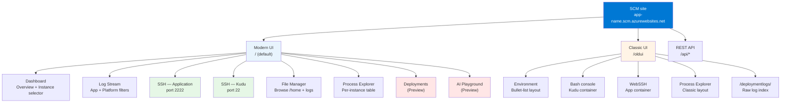

# Kudu on Linux

This page covers the Kudu surfaces that only exist on Linux App Service — the KuduLite modern UI shipped as the default landing at `/`, the classic UI still reachable at `/oldui`, the two-container WebSSH model (app container on port 2222, Kudu container on port 22), per-instance Log Stream and File Manager, and six diagnostic scenarios that use these surfaces end-to-end.

For the parts of Kudu that behave the same on both platforms (SCM URL, authentication, REST API, file system layout, security hardening), see [Kudu Overview](./kudu-overview.md). For the Windows counterparts (Debug Console CMD/PowerShell, Process Explorer with IIS w3wp semantics, Site Extensions gallery), see [Kudu on Windows](./kudu-windows.md).

## Linux-Specific Kudu Surfaces

The Kudu UI shipped with Linux App Service is [`Azure-App-Service/KuduLite`](https://github.com/Azure-App-Service/KuduLite), a Linux/Docker-native fork of the Windows Kudu codebase. It exposes several surfaces that do not exist on Windows App Service:

<!-- diagram-id: linux-kudu-surface-map -->


| Surface | URL path | What it does | Linux-only reason |
|---|---|---|---|
| Modern UI dashboard | `/` | Dark sidebar layout with instance selector, cards for Logs & Diagnostics / Tools / Environment | KuduLite ships with a rewritten UI; Windows Kudu shipped the classic HTML UI at `/` |
| Modern UI Log Stream | Sidebar → Log Stream (from `/`) | Live tail with filter chips for TIMEFRAME / INSTANCE / CONTAINER / LOG TYPE / LEVEL | Linux App Service surfaces separate Application vs Platform log streams; Windows Kudu does not have this split |
| WebSSH — Application | Sidebar → SSH → APPLICATION | Browser terminal into the **app container** as `root`, over `ssh://root@169.254.129.2:2222` | Linux App Service runs the app in a Docker container with SSH on port 2222; Windows uses IIS with no SSH surface |
| WebSSH — Kudu | Sidebar → SSH → KUDU | Browser terminal into the **Kudu (SCM) container** as `kudu_ssh_user`, over `ssh://kudu_ssh_user@127.0.0.6:22` | Kudu itself runs in a separate Linux container from the app; this shell is what runs Kudu's own `.NET` process |
| File Manager | Sidebar → File Manager | Browse `/home` on the Kudu container — includes `LogFiles/`, `site/`, and deployment scratch directories | Linux `/home` is the mounted shared storage that both containers see; UI surfaces it directly |
| Classic UI | `/oldui` | Legacy KuduLite HTML layout with Environment / SSH / Bash / Log stream / Process explorer top nav | Legacy path retained for scripts and users familiar with the pre-2022 UI |
| Deployments (Preview) | Sidebar → Deployments | Upload artifact + Deploy wizard scoped to the detected runtime (e.g. Node.js 22-lts) | Kudu's classic UI has no equivalent upload wizard — this is a modern-UI addition |
| AI Playground (Preview) | Sidebar → AI Playground | Sidecar Small Language Model (SLM) playground that expects an OpenAI-compatible endpoint at `localhost:11434/v1/chat/completions` | Sidecar model is a Linux App Service feature (Docker network + sidecar container) |

The rest of this page walks through each surface — modern and classic side by side where both exist — then applies them to six diagnostic scenarios.

## UI Route Map

The modern UI and classic UI cover overlapping but not identical feature sets. Use this map to pick the right entry point.

| Feature | Modern UI (`/`) | Classic UI (`/oldui`) | Notes |
|---|---|---|---|
| Dashboard / landing page | Sidebar layout with Overview cards | Flat HTML with build/version info + REST API index | Modern UI has an instance selector; classic UI does not |
| Environment / App Settings | Sidebar → Environment (table layout) | Top nav → Environment (bullet list) | Both surface the same underlying `/api/environment` data |
| SSH into app container | Sidebar → SSH → APPLICATION | Top nav → SSH | Same underlying `ssh://root@169.254.129.2:2222` endpoint |
| Shell into Kudu container | Sidebar → SSH → KUDU | Top nav → Bash | Modern UI labels this "SSH — Kudu"; classic UI calls it "Bash" |
| Log Stream (live tail) | Sidebar → Log Stream (filter chips) | Top nav → Log stream (raw stream) | **Only modern UI has the Application vs Platform log split** |
| File Manager | Sidebar → File Manager | Not exposed as a top-nav item | Classic UI expects you to `cd` in the shell instead |
| Process Explorer | Sidebar → Process Explorer (per-instance table) | Top nav → Process explorer | Both expose Collect Dump and Start Profiling actions |
| Deployments | Sidebar → Deployments (upload wizard, PREVIEW) | Direct browse of `/deploymentlogs/` HTTP index | Classic UI has no wizard — only the raw log listing |
| AI Playground | Sidebar → AI Playground (PREVIEW) | Top nav → AI Playground PREVIEW | Same sidecar-SLM feature, different chrome |
| REST API discoverability | Not surfaced in sidebar | Landing page lists `/api/environment`, `/api/logs/docker`, etc. | Classic UI is the fastest way to see the REST inventory |

For UI-independent access, hit the REST endpoints directly — see [Kudu Overview — REST API Quick Reference](./kudu-overview.md#rest-api-quick-reference).

## Dashboard (Modern UI Landing)

Opening the SCM URL on a Linux App Service today lands you on the modern KuduLite dashboard — a dark sidebar layout with an instance selector in the header and category cards in the main pane.

### Portal view: KuduLite modern UI landing page

[[[ shot("platform--kudu--10-linux-modern-dashboard") ]]]

> [Observed] The sidebar exposes 8 tools grouped into 4 categories (OVERVIEW / MONITORING / TOOLS / CONFIGURATION). The header shows the KuduLite build (`20260513.7`), the current instance ID (`1270773dcc5849`), and a `Switch` link that opens the instance selector. The SKU Information block reports `LinuxFree` (the Free tier used for this capture) and the app type (`Node.js 22-lts`) that Oryx detected.
>
> [Inferred] The `Switch` link in the header is the modern UI's per-instance targeting mechanism — every tool below (SSH, Log Stream, Process Explorer) is scoped to whichever instance is currently selected in the header. This is why the modern UI, unlike the classic one, can produce coherent per-instance evidence without requiring `Arr-Affinity` cookie manipulation.

The category cards are just shortcuts — clicking `Logs` in the "Logs & Diagnostics" card takes you to the same page as `MONITORING → Logs` in the sidebar. Use whichever entry point is faster.

## App Settings and Environment (Modern vs Classic)

Both UIs expose the same underlying `/api/environment` data, but present it very differently. Use the modern UI for scrollable inspection; use the classic UI when you need a bullet list to paste into an incident report.

### Portal view: KuduLite modern UI Environment page

[[[ shot("platform--kudu--19-linux-modern-environment") ]]]

> [Observed] The Machine Name is `8448e0b625b7` — a 12-char Docker container short hostname. The CLR version is `8.0.27` (Kudu itself is a .NET app), and the Current Working Directory is `/opt/Kudu` — the container path where the Kudu binaries live. The 64-char Instance ID field is fully masked to `aaaa…a` in the capture, confirming the PII regex correctly caught this lowercase-hex-64 token before rendering.
>
> [Inferred] The `Machine Name = 8448e0b625b7` and `Current Working Directory = /opt/Kudu` values together prove this page is running inside the **Kudu container**, not the app container. If you SSH into the app container next (via the Sidebar → SSH → APPLICATION path), you will see a different `hostname` (`7f19815b2b2b` on this app at the time of capture) — that difference is a fast integrity check that you are looking at the right container's environment.

### Portal view: KuduLite classic UI Environment page

[[[ shot("platform--kudu--23-linux-classic-environment") ]]]

> [Observed] Same data as the modern UI — Machine Name `8448e0b625b7`, CLR `8.0.27`, Kudu `1.0.0.0` — but rendered as flat bullet lists on a single scrollable page. The classic UI uses only 5 top-nav tabs (Environment / SSH / Bash / Log stream / Process explorer) plus the AI Playground preview link.
>
> [Inferred] The bullet-list layout is easier to copy-paste into a ticket (no table cell boundaries to strip) but harder to read at a glance than the modern UI's table layout. Both pages call `/api/environment` under the hood, so any discrepancy between them would indicate stale caching in one UI — this is a useful cross-check when a value on one page seems wrong.

Both pages surface the same seven sections (System Info, AppSettings, Connection Strings, Environment Variables, PATH, HTTP Headers, Server Variables). For scripted callers, hit `/api/environment` directly — it returns the same data as JSON.

## WebSSH — Two Containers, Two Shells

Linux App Service runs your app in one container and Kudu itself in a **separate** container. The modern UI exposes both under `Sidebar → SSH`; the classic UI splits them across `SSH` (app container) and `Bash` (Kudu container). Understanding which container you are in determines whether a diagnostic command is meaningful or misleading.

### Portal view: Modern UI — SSH into the application container

[[[ shot("platform--kudu--14-linux-modern-ssh-app") ]]]

> [Observed] The APPLICATION tab connects to `ssh://root@169.254.129.2:2222` and lands as `root` in the app container with hostname `7f19815b2b2b`. Node.js is available inside this container (`node --version` returned `v22.22.2` — matching the `Node.js 22-lts` runtime reported on the dashboard).
>
> [Inferred] `root@7f19815b2b2b` is the **app container**, not Kudu — this is the container that serves user traffic. Any process listing (`ps aux`), file inspection (`ls /home/site/wwwroot`), or runtime diagnostic (`node --inspect`) done from this shell reflects the state your users are actually experiencing. The private-network address `169.254.129.2:2222` is the SCM-tunnel endpoint the browser terminal proxies through.

### Portal view: Modern UI — SSH into the Kudu container

[[[ shot("platform--kudu--15-linux-modern-ssh-kudu") ]]]

> [Observed] The KUDU tab connects to `ssh://kudu_ssh_user@127.0.0.6:22` and lands as `kudu_ssh_user` in the Kudu container with hostname `8448e0b625b7` (Debian 12 bookworm). Listing `/home` shows the shared-storage mount with 6 entries: `ASP.NET`, `DeploymentLogStream`, `LogFiles`, `services`, `site`, and a per-app scratch directory `u087d495a1c1802fef35731`.
>
> [Inferred] Both containers see the SAME `/home` directory — it is a shared Azure Files mount, which is why deployments made through the Kudu container appear immediately in the app container's file system. However, listing `ps aux` in this Kudu shell will show Kudu's own `.NET` processes, NOT the app's `node` process. Running `node --version` here fails — Node.js is only installed in the app container image.

### Portal view: Classic UI — WebSSH (equivalent to modern APPLICATION tab)

[[[ shot("platform--kudu--25-linux-classic-webssh") ]]]

> [Observed] Classic UI WebSSH connects to exactly the same `ssh://root@169.254.129.2:2222` endpoint as the modern UI APPLICATION tab and lands at the same `root@7f19815b2b2b:/home` prompt. The chrome is different (single fullscreen terminal, no tab bar) but the underlying shell is identical.
>
> [Inferred] Any workflow that relied on the classic UI WebSSH continues to work on the modern UI's APPLICATION tab — this is why the classic UI can be retired without breaking existing runbooks that document these paths.

### Portal view: Classic UI — Bash console (equivalent to modern KUDU tab)

[[[ shot("platform--kudu--24-linux-classic-bash") ]]]

> [Observed] The classic UI's "Bash" tab connects to `ssh://kudu_ssh_user@127.0.0.6:22` — the same endpoint the modern UI labels "SSH → KUDU". Prompt (`kudu_ssh_user@8448e0b625b7`) and hostname (`8448e0b625b7`) match the modern UI KUDU tab exactly.
>
> [Inferred] The naming inconsistency (classic UI: "SSH" for app + "Bash" for Kudu; modern UI: "SSH — APPLICATION" + "SSH — KUDU") is one reason to prefer the modern UI — its terminology makes it obvious that both terminals are SSH, just to different containers.

| Terminal | Endpoint | User | Hostname on this app | Available commands |
|---|---|---|---|---|
| Modern UI → SSH → APPLICATION | `ssh://root@169.254.129.2:2222` | `root` | `7f19815b2b2b` (app container) | Runtime tools (`node`, `python`, `dotnet`), app filesystem, user traffic diagnostics |
| Modern UI → SSH → KUDU | `ssh://kudu_ssh_user@127.0.0.6:22` | `kudu_ssh_user` | `8448e0b625b7` (Kudu container) | Kudu binaries, `.NET`, deployment scratch, shared `/home` mount |
| Classic UI → SSH | Same as modern UI APPLICATION | `root` | Same | Same |
| Classic UI → Bash | Same as modern UI KUDU | `kudu_ssh_user` | Same | Same |

!!! warning "Custom containers require SSH-in-image"
    The `ssh://root@169.254.129.2:2222` endpoint above works only because App Service built-in Linux runtimes preinstall an SSH server on port 2222 inside the app container image. If you deploy a **custom container** and do not include and start an `sshd` on port 2222 inside your image, the APPLICATION tab (and the classic UI SSH) will fail to connect — only the KUDU tab remains reachable. See [Configure SSH for a custom container (Microsoft Learn)](https://learn.microsoft.com/en-us/azure/app-service/configure-custom-container?tabs=debian&pivots=container-linux#enable-ssh) for the exact `Dockerfile` recipe.

## Log Stream (Modern UI Only)

The modern UI Log Stream is the fastest way to isolate whether a symptom is coming from your application code or from the platform (container startup, Oryx build, health probe failures). The classic UI has a Log stream tab, but it is a raw combined stream without the Application vs Platform split.

### Portal view: Modern UI Log Stream — Application logs

[[[ shot("platform--kudu--11-linux-modern-logs-app") ]]]

> [Observed] The filter row exposes five chips: TIMEFRAME, INSTANCE, CONTAINER, LOG TYPE, LEVEL. LOG TYPE is set to `Application` — the terminal shows time-stamped INFO lines matching typical Express request/response logging. The lines start with the ISO 8601 timestamp (`2026-07-01T10:30:00.182Z`) and end with a status code and duration.
>
> [Inferred] Application logs are what your code writes to stdout/stderr inside the app container — they appear here because App Service on Linux forwards container stdout to `/home/LogFiles/*_default_docker.log` and the modern UI Log Stream tails that file. If you do not see application logs but the app is clearly running, either (a) your code is writing to a log file instead of stdout, or (b) application logging is disabled on the Diagnostic Settings blade.

### Portal view: Modern UI Log Stream — Platform logs

[[[ shot("platform--kudu--12-linux-modern-logs-platform") ]]]

> [Observed] Switching LOG TYPE to `Platform` replaces the stream contents with lines prefixed `PLAT` — image-pull events (`appsvc/kudulite:bookworm_20260513.7.tuxprod pulled from 10.0.0.0:13209`), container start events (`container 025febf58056_app-stacktrace-repro-demouser-20260625_kudu started`), and warm-up probe events (`probe /robots933456.txt returned 404`).
>
> [Inferred] Platform logs are what the App Service Linux host writes about container lifecycle — image pulls, container starts, health probes, container restarts. These logs are visible only through the Log Stream (or the underlying `/home/LogFiles/*_docker.log` file); they are NOT emitted by your application code, so the split between "Application" and "Platform" is the fastest way to answer "is this my bug or a platform issue?"

| Log type filter | What it streams | Underlying file pattern in `/home/LogFiles/` |
|---|---|---|
| Application | Your app's stdout/stderr inside the app container | `*_default_docker.log` |
| Platform | Host-level events: image pull, container start, probes | `*_docker.log` (without the `default_` infix) |
| Kudu (rare) | Kudu container's own operational logs | `*_default_scm_docker.log` |

For non-interactive tailing (incident automation, log aggregation), use the REST endpoint:

```bash
ACCESS_TOKEN=$(az account get-access-token --resource https://management.azure.com/ --query accessToken --output tsv)

# Stream all Docker logs
curl --silent --header "Authorization: Bearer ${ACCESS_TOKEN}" \
  "https://${APP_NAME}.scm.azurewebsites.net/api/logs/docker"
```

| Parameter | Purpose |
|---|---|
| `az account get-access-token --resource https://management.azure.com/` | Obtains a Microsoft Entra bearer token for the ARM audience, which Kudu accepts after basic auth is disabled. |
| `--header "Authorization: Bearer ${ACCESS_TOKEN}"` | Presents the token on the request. |
| `/api/logs/docker` | Returns the combined Docker log index across all instances. Follow individual log URLs to stream a specific file. |

## File Manager (Modern UI Only)

The modern UI File Manager exposes the shared `/home` mount that both containers see. This is where you find deployment scratch space, per-instance log files, and the app's `wwwroot`. The classic UI has no equivalent — the classic UI expects you to `cd` in the shell instead.

### Portal view: Modern UI File Manager at `/home`

[[[ shot("platform--kudu--16-linux-modern-filemanager") ]]]

> [Observed] The root of `/home` contains 6 folders and 2 dotfiles. The folders are: `LogFiles/` (per-instance log storage), `site/` (contains `wwwroot`), `u087d495a1c1802fef35731/` (deployment scratch — the same per-app directory visible in the Kudu SSH `ls /home` output), `DeploymentLogStream/`, `services/`, `ASP.NET/`.
>
> [Inferred] `/home` is the shared Azure Files mount — files written here from the Kudu container appear immediately in the app container and vice versa. The `.bash_history` and `.gitconfig` are personal-shell artifacts left by SSH sessions; their presence is a good hint that a recent operator debugged this app. The `u087d495a1c1802fef35731` directory is per-app scratch space used by Oryx during builds; it can accumulate stale artifacts and is safe to clean up if `/home` disk usage climbs.

### Portal view: Modern UI File Manager at `/home/LogFiles`

[[[ shot("platform--kudu--17-linux-modern-filemanager-logs") ]]]

> [Observed] `/home/LogFiles/` uses a three-way naming convention that maps directly to the Log Stream filters: `*_default_docker.log` = CONTAINER STDOUT/STDERR (application), `*_docker.log` = PLATFORM LOGS, `*_default_scm_docker.log` = KUDU LOGS. The header badges (CURRENT INSTANCE + the three log-type tags) confirm this mapping in the UI. Filenames embed the ISO-8601 date, hour, and short instance ID (`2026_07_01_10-30-0-182`).
>
> [Inferred] The date-and-instance-ID naming means each instance in a multi-instance app writes its own set of log files under the same `/home/LogFiles/` directory (all instances share the storage mount). Filtering to a specific instance in the Log Stream chip is the interactive way to isolate one instance's stream; downloading only the files whose short-instance-ID prefix matches is the scripted equivalent for offline analysis.

The File Manager also supports upload — dropping a file here writes it to the Kudu container's `/home`, which the app container then sees. This is useful for injecting a debug script or replacing a config file without a full deployment.

## Process Explorer (Modern vs Classic)

The Process Explorer surfaces the live process table inside the current container. On Linux App Service, the two most useful actions per row are Collect Dump (writes a language-specific dump to `/home/LogFiles/`) and Start Profiling (runs a time-boxed CPU trace).

### Portal view: Modern UI Process Explorer

[[[ shot("platform--kudu--18-linux-modern-process-explorer") ]]]

> [Observed] Modern UI Process Explorer shows the process table scoped to the current instance (selected in the header). This app has a single visible row: PID 1860, running `node /home/site/wwwroot/server.js` as `root`. Two action buttons per row: `withHeap` + `Collect Dump` captures a language-specific dump (Node.js writes a `.heapsnapshot`), and `60s` + `Start Profiling` runs a 60-second CPU sampling profile.
>
> [Inferred] The single-row process table is a strong signal that this is the app container (not Kudu — Kudu itself would show a `dotnet` process). Confirm by matching the PID with the output of `ps aux` in the APPLICATION SSH tab. If you see `node` here but not in the SSH shell, you are looking at Process Explorer on the wrong instance — use the header instance selector to switch.

### Portal view: Classic UI Process Explorer

[[[ shot("platform--kudu--26-linux-classic-process-explorer") ]]]

> [Observed] Classic UI Process Explorer shows the same PID 1860 `node` row as the modern UI but exposes more columns per row (cpu time, working set, private memory, threads, handles) and uses a wider action button set (`Properties`, `Kill`, `Dump`, `Profile`). The `is scm site: False` field confirms this is the app container, not Kudu.
>
> [Inferred] The extra columns make the classic UI slightly better for at-a-glance triage (you see thread count and handle count without opening a Properties dialog), but the modern UI's per-row action buttons are less error-prone under pressure (no accidental `Kill` clicks — the button is a two-step confirm).

For non-interactive process listings, the REST endpoint returns the same table as JSON:

```bash
curl --silent --header "Authorization: Bearer ${ACCESS_TOKEN}" \
  "https://${APP_NAME}.scm.azurewebsites.net/api/processes" |
  jq '.[] | {id, name, file_name, working_set, thread_count, is_scm_site}'
```

## Deployments (Modern UI — Preview)

The modern UI's Deployments page is a runtime-aware upload wizard scoped to the detected app type. The classic UI has no equivalent — it exposes `/deploymentlogs/` as an HTTP index instead.

### Portal view: Modern UI Deployments (Preview) upload wizard

[[[ shot("platform--kudu--20-linux-modern-deployments") ]]]

> [Observed] The wizard is scoped to the detected runtime (`Node.js 22-lts`) — the title reads "Deploy your Node.js 22-lts app" rather than a generic "Upload". Two steps: Upload (drag-drop, 1 GB max, `.zip` or `.tar.gz`) then Deploy. An informational card below reminds operators that this replaces the running artifact and points at the REST rollback path.
>
> [Inferred] The PREVIEW badge indicates the wizard is still evolving — it currently wraps the ZIP deploy REST endpoint but does not yet expose the async flow (`isAsync=true`) or the deployment log tail. For programmatic deploys, hit `/api/zipdeploy` directly — see [Kudu on Windows — Scenario 6](./kudu-windows.md#scenario-6-track-zipdeploy-async-status) for the async pattern (same endpoint on both platforms).

### Portal view: Classic UI — direct browse of `/deploymentlogs/`

[[[ shot("platform--kudu--27-linux-classic-deployment-logs") ]]]

> [Observed] The classic UI's deployment-log surface is a bare HTTP index at `/deploymentlogs/`, showing raw `.txt` log files (a single 4155-byte log in this capture). No upload wizard, no rollback UI.
>
> [Inferred] The classic UI's zero-chrome deployment log listing is actually useful for scripted collection — a single `curl --silent` returns the raw log for parsing. But for interactive deploy-and-verify flows, the modern UI wizard is faster because you do not need to switch to a separate ZIP-deploy CLI.

Both UIs write deployment artifacts to `/home/site/deployments/{id}/` and both use the same `/api/deployments` REST endpoint for listing and rollback — see [Kudu on Windows — Scenario 4: Roll Back to a Previous Deployment](./kudu-windows.md#scenario-4-roll-back-to-a-previous-deployment-via-apideployments) for the platform-independent rollback pattern.

## AI Playground (Modern UI — Preview)

The AI Playground is a sidecar Small Language Model (SLM) surface — it expects an OpenAI-compatible endpoint running as a sidecar container on the Docker network.

### Portal view: Modern UI AI Playground

[[[ shot("platform--kudu--21-linux-modern-ai-playground") ]]]

> [Observed] The page is titled "SIDECAR PLAYGROUND" with a PREVIEW badge. An orange callout confirms no SLM is configured on this app and specifies the expected endpoint (`localhost:11434/v1/chat/completions` — an OpenAI-compatible chat completions API). Code samples are provided in C#, Python, and Node.js — the Node.js sample uses `fetch()` with a JSON body containing `model` and `messages` fields.
>
> [Inferred] This feature is designed for apps that ship a sidecar SLM container (typically Ollama or Text Generation Inference) exposing an OpenAI-compatible API on port 11434 inside the app's Docker network. The playground itself does not host a model — it is a client UI that calls the sidecar. For apps that do not use sidecar SLMs, this page is inert and can be ignored.

Because the AI Playground has no Microsoft Learn documentation page today, it is not listed as a `core_claim` in this document's frontmatter. Treat this section as an [Observed] tour of the current UI surface only.

## Diagnostic Scenarios

The remaining sections apply the Linux KuduLite surfaces to six recurring incident patterns. Each scenario names the symptom, the Kudu surface to use, the concrete steps, and what the resulting evidence looks like.

### Scenario 1: Pin Investigation to a Single Instance via the Instance Selector

**Symptom.** A multi-instance Linux app is showing intermittent 502s. Metrics show the errors are concentrated on one instance, but Log Stream is showing traffic from all instances mixed together and you cannot tell which log line came from which instance.

**Diagnostic path.** Modern UI header `Switch` → pick the misbehaving instance → every subsequent tool (Log Stream, SSH, Process Explorer, File Manager) is now scoped to that instance.

**Steps.**

1. **Identify the misbehaving instance from Application Insights or Log Analytics.** Query the instance IDs producing 502s:

    ```kusto
    AppServiceHTTPLogs
    | where TimeGenerated > ago(15m)
    | where ScStatus == 502
    | summarize count() by tostring(_ResourceId), Instance = tostring(customDimensions.HttpXAzureRef)
    | order by count_ desc
    ```

    | Field | Purpose |
    |---|---|
    | `ScStatus == 502` | Filters to gateway errors (usually origin failed to respond within timeout) |
    | `customDimensions.HttpXAzureRef` | Short instance ID emitted in `X-Azure-Ref` response header |
    | `order by count_ desc` | Concentrates on the noisiest instance |

    Note the top instance's short ID (e.g., `127077`).

2. **Open the modern KuduLite UI and pin to that instance.** Click `Switch` in the header, then pick the row matching the short ID from step 1. The header now shows `Instance: <full-id>` in the header banner.

3. **Verify the pin took effect with Log Stream.**

    Navigate to `MONITORING → Log Stream`, expand the INSTANCE filter chip, and confirm only the pinned instance's ID appears — LOG TYPE `Application` should now show ONLY that instance's stdout/stderr.

4. **SSH into the pinned instance's app container.**

    `TOOLS → SSH → APPLICATION` now connects to that specific instance. Verify with `hostname` — it should match the short-instance-ID prefix from step 1.

5. **Reproduce or observe the failure while pinned.** With Log Stream open in one browser tab and SSH open in another, trigger the request that causes the 502 (or wait for the next natural occurrence). You will now see the application log line, the platform log line, AND the process state all from the same instance.

**What the evidence proves.** Without the instance selector, a multi-instance app's log stream is a lossy interleaving of every instance — you cannot tell whether a stack trace and a subsequent recovery message came from the same worker. Pinning removes the interleaving and produces a coherent per-instance timeline that is safe to attach to an incident ticket.

### Scenario 2: Compare Processes Across Instances to Find a Runaway Worker

**Symptom.** Portal metrics show CPU on the App Service Plan at 60-80% overall, but the app has 3 instances and you suspect only one is pegged. Log Stream is noisy across all three.

**Diagnostic path.** For each instance, pin the modern UI to it, open Process Explorer, and snapshot the process table. Compare snapshots to identify the outlier.

**Steps.**

1. **List the instances.** From your laptop:

    ```bash
    az webapp list-instances \
      --resource-group "${RG}" \
      --name "${APP_NAME}" \
      --query '[].{Name:name}' \
      --output table
    ```

    | Parameter | Purpose |
    |---|---|
    | `az webapp list-instances` | Returns all currently running instances of the Web App — one row per instance the App Service Plan has scaled to. |
    | `--query '[].{Name:name}'` | JMESPath projection that keeps only the `name` field (which is the full instance ID like `d3a...127077`). |
    | `--output table` | Renders as a Markdown-style table for easy visual scanning. |

    Note each instance's short ID.

2. **For each instance, pin and snapshot.** In the modern UI:
   - Header `Switch` → pick instance A → `TOOLS → Process Explorer` → screenshot the table
   - Header `Switch` → pick instance B → `TOOLS → Process Explorer` → screenshot
   - Repeat for instance C

    Label each screenshot with the short instance ID.

3. **Diff the CPU% column across snapshots.**

    | Instance | node PID | CPU % | RSS | Verdict |
    |---|---|---|---|---|
    | A (`127077`) | 1860 | 8% | 87 MB | Normal |
    | B (`3fac21`) | 1873 | 95% | 412 MB | **Outlier — pegged** |
    | C (`8b2419`) | 1854 | 6% | 91 MB | Normal |

    Instance B is the culprit.

4. **Capture a profile from the outlier instance ONLY.** With the modern UI still pinned to instance B, click `60s` + `Start Profiling` on the runaway `node` row. Wait for the 60-second window, then download the profile. This isolates the CPU trace to the instance that is actually burning cycles — running the profile on a healthy instance would waste the capture budget.

5. **For Node.js, analyze the profile with `clinic flame` or Chrome DevTools.**

    ```bash
    npm install --global clinic
    clinic flame --visualize-only ./profile-instance-b-20260701T143000.cpuprofile
    ```

    The flame graph will show which JavaScript function is holding the CPU on the outlier instance.

6. **Optionally restart JUST the outlier instance via the SCM REST API.**

    ```bash
    ACCESS_TOKEN=$(az account get-access-token --resource https://management.azure.com/ --query accessToken --output tsv)

    # This restarts ALL instances — for single-instance restart, scale down + scale up.
    # For Linux App Service, single-instance restart requires soft-restart via SSH:
    # ssh into instance B, then `pkill -HUP node` or equivalent app-specific reload signal.
    ```

    | Parameter | Purpose |
    |---|---|
    | `az account get-access-token --resource https://management.azure.com/` | Obtains a Microsoft Entra bearer token for the ARM audience, which Kudu accepts after basic auth is disabled. |
    | `--query accessToken --output tsv` | Extracts only the token string from the JSON response, suitable for use in an `Authorization: Bearer` header. |

**What the evidence proves.** The per-instance process snapshots turn "CPU is high" into "instance B's node PID 1873 is burning 95% while A and C are normal". That level of specificity lets you target the profile (60s trace of the actual busy worker) instead of averaging noise across all three instances.

### Scenario 3: Diagnose a Custom Container That Fails to Start

**Symptom.** You deployed a custom Docker container to Linux App Service. Portal Overview shows the app as `Running` for a moment, then flips to `Waiting for response`. The main site returns 503. The app container never becomes reachable.

**Diagnostic path.** Modern UI SSH → KUDU tab (custom container SSH is unavailable if the image lacks `sshd`) → tail platform logs and container stdout from `/home/LogFiles/` to identify why the container failed to start.

**Steps.**

1. **Confirm the app container is unreachable but Kudu is up.** Try each terminal in the modern UI:
   - `TOOLS → SSH → APPLICATION` — expect "SSH connection refused" or "container not ready"
   - `TOOLS → SSH → KUDU` — expect a normal `kudu_ssh_user@...` prompt

    If APPLICATION fails but KUDU succeeds, the app container is down while Kudu (which runs in its own container) is fine.

2. **From the KUDU shell, tail the platform log for image-pull and startup events.**

    ```bash
    # Inside the Kudu container terminal:
    tail --follow --lines=200 /home/LogFiles/*_docker.log
    ```

    Look for:
    - `Pulling image` → `pulled` (or `pull failed`) — proves whether ACR/DockerHub credentials work
    - `Starting container` → look for the next `container exited` or `container is running` event
    - `Container didn't respond to HTTP pings on port XXXX` → your app either did not listen, listened on the wrong port, or crashed before binding

3. **Tail the container's own stdout to see the crash reason.**

    ```bash
    tail --follow --lines=500 /home/LogFiles/*_default_docker.log
    ```

    Common crash signatures:

    | Log signature | Root cause | Fix |
    |---|---|---|
    | `exec: "npm": executable file not found in $PATH` | Node.js not installed in the base image | Use a Node.js base image or `apt-get install nodejs` in the Dockerfile |
    | `Error: listen EACCES: permission denied 0.0.0.0:80` | Container tried to bind port 80 as non-root | Bind to port 8080 (App Service auto-remaps) or run as root |
    | `Segmentation fault (core dumped)` | Native library mismatch (glibc vs musl, missing `.so` file) | Match base-image libc to the one the binary was built against |
    | `WEBSITES_PORT` warnings in platform log | Container listens on a port App Service is not probing | Set `WEBSITES_PORT` App Setting to match the container's exposed port |

4. **Verify the container's health check target is correct.**

    ```bash
    # Get the port App Service is probing:
    az webapp config appsettings list \
      --resource-group "${RG}" \
      --name "${APP_NAME}" \
      --query "[?name=='WEBSITES_PORT'].value" \
      --output tsv

    # Compare against the port the container binds (from its stdout log in step 3).
    ```

    | Parameter | Purpose |
    |---|---|
    | `az webapp config appsettings list` | Lists every App Setting the Web App has configured — this is the same list the Portal shows under Configuration → Application Settings. |
    | `--query "[?name=='WEBSITES_PORT'].value"` | JMESPath filter that returns only the value of the `WEBSITES_PORT` setting; empty output means the setting is unset (default = port 80). |
    | `--output tsv` | Emits the value without JSON quotes so it can be interpolated into shell scripts. |

    If `WEBSITES_PORT` is unset, App Service probes port 80 by default. If your container binds 8080, set:

    ```bash
    az webapp config appsettings set \
      --resource-group "${RG}" \
      --name "${APP_NAME}" \
      --settings WEBSITES_PORT=8080
    ```

    | Parameter | Purpose |
    |---|---|
    | `az webapp config appsettings set` | Adds or updates App Settings — this triggers an immediate app restart, which re-runs the health probe against the new port. |
    | `--settings WEBSITES_PORT=8080` | Sets the port App Service uses for both the health probe and inbound HTTP traffic routing. |

5. **If you need SSH into the failing custom container, rebuild the image with `sshd`.**

    Follow the [Configure SSH for a custom container recipe (Microsoft Learn)](https://learn.microsoft.com/en-us/azure/app-service/configure-custom-container?tabs=debian&pivots=container-linux#enable-ssh). The recipe installs `openssh-server`, configures it to listen on port 2222 with the App Service-required root password, and starts `sshd` alongside the app entry point. After redeploying, the modern UI APPLICATION SSH tab will connect.

**What the evidence proves.** The KUDU container SSH gives you a live shell even when the app container is completely broken, and the two log-file patterns (`*_docker.log` for platform events, `*_default_docker.log` for container stdout) together identify whether the failure is an image pull, a startup crash, a port-binding mismatch, or a health-probe misconfiguration.

### Scenario 4: Isolate App Container vs Kudu Container Boundary Issues

**Symptom.** A file exists in one container but not the other. Or an environment variable is set in the Portal but the app does not see it. You need to prove which container has the correct state.

**Diagnostic path.** Open BOTH `SSH → APPLICATION` and `SSH → KUDU` in the modern UI, run the same command in both, compare the output.

**Steps.**

1. **Confirm you are in the correct container in each tab.**

    In the APPLICATION tab:

    ```bash
    hostname                 # Expected: <12-char-hex> — app container
    ls /                     # Expected: standard Linux root — /home is the shared mount
    which node               # Expected: /usr/local/bin/node (or similar) if this is a Node.js app
    ```

    In the KUDU tab:

    ```bash
    hostname                 # Expected: <different 12-char-hex> — Kudu container
    ls /opt/Kudu             # Expected: Kudu binaries
    which node               # Expected: no output — Node.js is NOT installed in Kudu
    ```

2. **Verify a file's existence in both containers.**

    ```bash
    # In BOTH tabs:
    ls -la /home/site/wwwroot/appsettings.json
    md5sum /home/site/wwwroot/appsettings.json
    ```

    Since `/home` is the shared Azure Files mount, the file MUST be identical in both containers — different md5sums indicate a caching bug or that you are actually on different apps (check `hostname` matches your expected app).

3. **Verify an App Setting is visible in the app container.**

    In the Portal, add `TEST_SETTING=hello-world` under Configuration → Application Settings → Save. The app container will restart. After it restarts:

    In the APPLICATION tab:

    ```bash
    env | grep TEST_SETTING           # Expected: TEST_SETTING=hello-world
    ```

    In the KUDU tab:

    ```bash
    env | grep TEST_SETTING           # Expected: NO output — Kudu is not restarted by app settings changes
    ```

    This asymmetry is important: **the Kudu container does NOT see app settings changes**, so any diagnostic script running from a Kudu SSH will see stale environment values relative to the app.

4. **If a file is missing in one container, check the shared mount.**

    ```bash
    # In both tabs:
    df /home                          # Expected: same filesystem (usually //volume.file.core.windows.net/...)
    ```

    Different mount sources indicate that one container is using local storage (typically because `WEBSITES_ENABLE_APP_SERVICE_STORAGE=false` is set for a custom container) — the fix is to enable that setting or copy the missing file into the correct location.

**What the evidence proves.** The two-container SSH model, combined with the shared `/home` mount, makes it trivial to prove where state actually lives. This is critical for debugging "the Portal says my setting is X but the app is behaving as if it were Y" — you can now show conclusively whether the app container sees the new value.

### Scenario 5: Triage a Crash-Loop Container

**Symptom.** Portal Overview keeps flipping between `Running` and `Starting`. The app is up for 30-90 seconds, then restarts. HTTP requests intermittently fail with 502. No obvious pattern in application logs.

**Diagnostic path.** Modern UI Log Stream (Platform filter) → identify the restart events → for each restart, capture the container's final stdout lines from `/home/LogFiles/*_default_docker.log` before the restart.

**Steps.**

1. **Confirm the restart pattern in the Log Stream Platform view.**

    `MONITORING → Log Stream`, set LOG TYPE = `Platform`. Look for repeating pairs of lines:

    ```
    PLAT 2026-07-01T10:30:00Z container_name started
    PLAT 2026-07-01T10:31:15Z container_name exited with code 137
    PLAT 2026-07-01T10:31:16Z container_name started
    PLAT 2026-07-01T10:32:34Z container_name exited with code 137
    ```

    Exit code `137` means the container was killed by SIGKILL — typically OOM (out-of-memory) killed by the App Service host when the container exceeds its memory limit.

2. **Correlate each restart with the container's final application log lines.**

    In the KUDU SSH tab, list log files sorted by time:

    ```bash
    ls -lt /home/LogFiles/*_default_docker.log | head -5
    ```

    The most recent file is the current running container. The file before it is the one that just died.

3. **Extract the last 20 lines of the previous container's log.**

    ```bash
    PREV_LOG=$(ls -t /home/LogFiles/*_default_docker.log | sed -n '2p')
    tail --lines=20 "${PREV_LOG}"
    ```

    Look for:

    | Signature | Root cause | Fix |
    |---|---|---|
    | `<--- Last few GCs --->` followed by heap allocation trace | Node.js V8 heap OOM | Increase `NODE_OPTIONS=--max-old-space-size=4096` or profile for leaks |
    | `Killed` on the last line, no crash trace | External SIGKILL (App Service OOM) | Scale up SKU (more container memory) or fix a native memory leak |
    | `UnhandledPromiseRejectionWarning: <error>` | Unhandled promise rejection escalated to process exit | Add `process.on('unhandledRejection', ...)` handler + fix the async chain |
    | `Error: connect ECONNREFUSED <db-host>` on startup | App tries to connect to DB before it is reachable | Add exponential backoff on the DB connection init |

4. **Correlate against the memory recycle threshold.**

    ```bash
    # From KUDU SSH:
    cat /proc/meminfo | head -3
    ```

    Compare `MemTotal` against your app's peak memory just before the restart (from the Log Stream Application view — Node.js typically prints heap stats before OOM crashes).

5. **Confirm the fix by removing the restart from the Platform log.**

    After deploying the fix, watch the Platform log stream for 15-30 minutes. Absence of `container exited` lines confirms the crash loop is gone.

**What the evidence proves.** The `PLAT ... exited with code N` line names the exact exit code the platform observed, and the `.../*_default_docker.log` files preserve the container's last stdout even after restart. Together, these turn "the app keeps crashing" into "container exited with 137 (OOM) after logging 'JavaScript heap out of memory' — need to increase --max-old-space-size or fix leak."

### Scenario 6: Investigate a Deployment Regression / Oryx Build Failure

**Symptom.** A recent deployment succeeded (green in Deployment Center) but the app now returns 500 errors on paths that worked yesterday. You suspect the Oryx build step subtly changed the artifact.

**Diagnostic path.** Classic UI `/deploymentlogs/` → grab the raw build log for the current and previous deployment → diff the Oryx build steps → identify what changed (Node.js version, npm packages, build script output).

**Steps.**

1. **List recent deployments and identify the current + previous IDs.**

    ```bash
    ACCESS_TOKEN=$(az account get-access-token --resource https://management.azure.com/ --query accessToken --output tsv)

    curl --silent --header "Authorization: Bearer ${ACCESS_TOKEN}" \
      "https://${APP_NAME}.scm.azurewebsites.net/api/deployments" |
      jq '.[] | {id, message, status, active, received_time}' |
      head -30
    ```

    | Parameter | Purpose |
    |---|---|
    | `az account get-access-token --resource https://management.azure.com/` | Obtains a Microsoft Entra bearer token for the ARM audience, which Kudu accepts after basic auth is disabled. |
    | `--header "Authorization: Bearer ${ACCESS_TOKEN}"` | Presents the token on the request — the same authentication path both Windows and Linux Kudu accept. |
    | `jq '.[] | {id, message, status, active, received_time}'` | Reduces each deployment object to the fields that matter for regression triage. |
    | `head -30` | Caps the listing at the ~10 most recent deployments (each is ~3 lines of JSON output). |

    Note the current active deployment ID (`active: true`) and the previous one.

2. **Fetch the Oryx build log for each deployment.**

    ```bash
    CURR_ID=<current-id>
    PREV_ID=<previous-id>

    curl --silent --header "Authorization: Bearer ${ACCESS_TOKEN}" \
      "https://${APP_NAME}.scm.azurewebsites.net/api/deployments/${CURR_ID}/log" |
      jq --raw-output '.[] | .message' > build-curr.txt

    curl --silent --header "Authorization: Bearer ${ACCESS_TOKEN}" \
      "https://${APP_NAME}.scm.azurewebsites.net/api/deployments/${PREV_ID}/log" |
      jq --raw-output '.[] | .message' > build-prev.txt
    ```

3. **Diff the two builds.**

    ```bash
    diff build-prev.txt build-curr.txt | head -60
    ```

    Common regression signatures:

    | Diff line | Root cause | Fix |
    |---|---|---|
    | `Node.js version: 20.11.0` → `Node.js version: 22.5.0` | Runtime version drifted (usually because App Setting `WEBSITE_NODE_DEFAULT_VERSION` uses `~22` or `LTS`) | Pin to explicit version: `WEBSITE_NODE_DEFAULT_VERSION=22.5.0` |
    | `npm ci` succeeds in prev, fails in curr with peer-dep warning | A transitive dependency published a breaking version | Add the pinned version to `package.json`'s `resolutions` or `overrides` field |
    | `Running 'npm run build' ... failed with exit 1` | Build script broke — usually a missing devDependency | Ensure `devDependencies` are installed (Oryx skips them by default on `NODE_ENV=production`) |
    | Absent `Detecting platform` line in curr build | Oryx build was disabled | Confirm `SCM_DO_BUILD_DURING_DEPLOYMENT=true` — see step 4 |

4. **Verify Oryx build is enabled.**

    ```bash
    az webapp config appsettings list \
      --resource-group "${RG}" \
      --name "${APP_NAME}" \
      --query "[?name=='SCM_DO_BUILD_DURING_DEPLOYMENT'].value" \
      --output tsv
    ```

    | Parameter | Purpose |
    |---|---|
    | `az webapp config appsettings list` | Lists every App Setting the Web App has configured — this is the same list the Portal shows under Configuration → Application Settings. |
    | `--query "[?name=='SCM_DO_BUILD_DURING_DEPLOYMENT'].value"` | JMESPath filter that returns only the value of the `SCM_DO_BUILD_DURING_DEPLOYMENT` setting; empty output means it is unset (defaults to `false` for ZIP deploy). |
    | `--output tsv` | Emits the value without JSON quotes so it can be compared with `true` / `false` in a shell script. |

    If this returns `false` or is empty, Oryx will NOT build — the deployment just copies the ZIP contents as-is. To enable Oryx build:

    ```bash
    az webapp config appsettings set \
      --resource-group "${RG}" \
      --name "${APP_NAME}" \
      --settings SCM_DO_BUILD_DURING_DEPLOYMENT=true
    ```

    | Parameter | Purpose |
    |---|---|
    | `az webapp config appsettings set` | Adds or updates App Settings — this triggers an immediate app restart. The next deployment will run Oryx build. |
    | `--settings SCM_DO_BUILD_DURING_DEPLOYMENT=true` | Enables Oryx runtime detection + package install + build script execution during ZIP or push deploy. |

5. **Rollback while you fix the build.**

    Use the platform-independent rollback pattern from [Kudu on Windows — Scenario 4](./kudu-windows.md#scenario-4-roll-back-to-a-previous-deployment-via-apideployments):

    ```bash
    curl --silent --request PUT \
      --header "Authorization: Bearer ${ACCESS_TOKEN}" \
      --header "Content-Type: application/json" \
      --data '{}' \
      "https://${APP_NAME}.scm.azurewebsites.net/api/deployments/${PREV_ID}"
    ```

    This flips the `active` flag to the previous deployment in <2 seconds.

6. **Verify the rollback took effect.**

    ```bash
    curl --silent --header "Authorization: Bearer ${ACCESS_TOKEN}" \
      "https://${APP_NAME}.scm.azurewebsites.net/api/deployments" |
      jq '.[] | select(.active == true) | {id, message}'
    ```

    Then hit the previously failing endpoint from your laptop and confirm the 500 is gone.

**What the evidence proves.** The Oryx build log preserves every step of the build — runtime detection, package install, custom build script output. Diffing the previous and current build logs isolates the exact step where the regression was introduced, which is far more actionable than the deployment-succeeded/failed status alone. Combined with the `active` flag rollback, you can un-break production in under a minute while the fix is developed.

## See Also

- [Kudu Overview](./kudu-overview.md) — cross-platform architecture, authentication, REST API, security hardening
- [Kudu on Windows](./kudu-windows.md) — Debug Console (CMD/PowerShell), Process Explorer with IIS w3wp semantics, Site Extensions gallery, and Windows-specific diagnostic scenarios
- [Kudu API Reference](../reference/kudu-queries.md) — per-endpoint cheatsheet with curl examples

## Sources

- [Kudu service overview (Microsoft Learn)](https://learn.microsoft.com/en-us/azure/app-service/resources-kudu)
- [Open an SSH session to Linux containers (Microsoft Learn)](https://learn.microsoft.com/en-us/azure/app-service/configure-linux-open-ssh-session) — port 2222, WebSSH endpoint semantics for built-in Linux runtimes
- [Configure a custom container for Azure App Service (Microsoft Learn)](https://learn.microsoft.com/en-us/azure/app-service/configure-custom-container) — custom container SSH requirements, `WEBSITES_PORT`, health-probe target
- [Enable diagnostic logging (Microsoft Learn)](https://learn.microsoft.com/en-us/azure/app-service/troubleshoot-diagnostic-logs) — `/home/LogFiles/` structure, Docker log types, streaming vs file-based access
- [Configure a Node.js app for Azure App Service on Linux (Microsoft Learn)](https://learn.microsoft.com/en-us/azure/app-service/configure-language-nodejs) — Oryx runtime detection, `SCM_DO_BUILD_DURING_DEPLOYMENT`, Node.js version pinning
- [Azure-App-Service/KuduLite (GitHub)](https://github.com/Azure-App-Service/KuduLite) — Linux SCM implementation source and wiki documenting the modern UI (`/`) and classic UI (`/oldui`) surfaces
- [New Kudu UI for App Service on Linux (Preview) — Microsoft Tech Community (2022-02-24)](https://techcommunity.microsoft.com/blog/appsonazureblog/new-kudu-ui-for-app-service-on-linuxpreview/3212270) — original announcement of the modern KuduLite UI as an opt-in `/newui` preview (later promoted to the default `/` landing per [Observed] on 2026-07-01 in the Kudu Overview)
