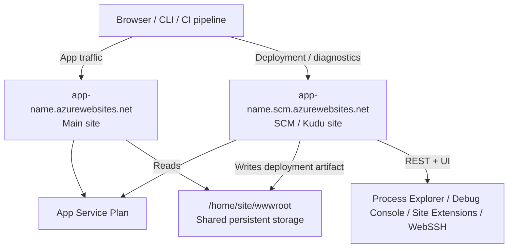
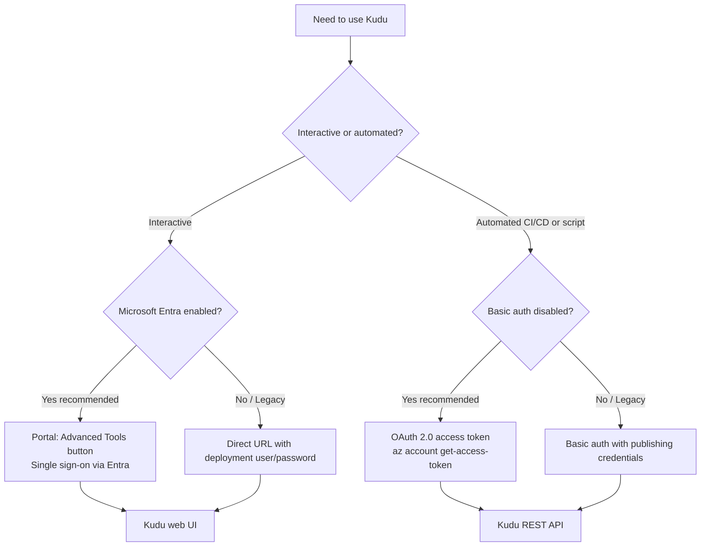

# Kudu Overview

Kudu is the engine behind App Service deployment and the SCM (source control manager) companion site that ships with every Web App. It gives you a browser-based control surface, a REST API, and shell access for inspecting environment, processes, files, and deployment history.

This overview covers the parts of Kudu that behave the same on both platforms — architecture, authentication, REST API, file system layout, and security hardening. For platform-specific web UIs and diagnostic workflows, jump to the companion pages:

- [Kudu on Windows](./kudu-windows.md) — Debug Console (CMD/PowerShell), Process Explorer, Site Extensions, and Windows-specific diagnostic scenarios.
- [Kudu on Linux](./kudu-linux.md) — KuduLite modern UI (default at `/`) and classic UI (at `/oldui`), WebSSH into the app container, and Linux-specific diagnostic scenarios.

Once you finish this page, jump to [Kudu API Reference](../reference/kudu-queries.md) for the per-endpoint cheatsheet.

## Why Kudu Matters

Most App Service deployment paths—ZIP deploy, Run from Package, Local Git, GitHub Actions, FTP, OneDeploy—either talk to Kudu directly or rely on it for the post-deploy step (unpacking the artifact, running Oryx, recycling the worker). When something goes wrong between "deployment succeeded" and "app responds 200 OK," Kudu is usually where the evidence lives.

Three concrete capabilities make Kudu non-replaceable:

1. **It runs in a separate sandbox.** SCM has its own filesystem snapshot, its own credentials surface, and its own restart lifecycle. That separation is why deployments survive worker recycles and why you can inspect a hung app from a healthy companion site.
2. **It exposes both UI and REST.** Operators get a clickable console for one-off investigation; CI pipelines and runbooks call the same endpoints non-interactively.
3. **It is the only deployment surface that disabling basic auth still leaves accessible**—via Microsoft Entra ID OAuth tokens. Modern Azure environments increasingly require this token-based path.

## Architecture: How Kudu Fits with Your App

Every App Service app is paired with a **companion Kudu site** at a related hostname. The two sites share the same App Service Plan compute, but they run in different sandbox contexts and serve different traffic.

<!-- diagram-id: kudu-architecture-relationship -->


| Aspect | Main site | SCM (Kudu) site |
|---|---|---|
| Hostname (non-Isolated) | `app-name.azurewebsites.net` | `app-name.scm.azurewebsites.net` |
| Hostname (ASE Internet) | `app-name.ase-name.p.azurewebsites.net` | `app-name.scm.ase-name.p.azurewebsites.net` |
| Hostname (ASE Internal) | `app-name.ase-name.appserviceenvironment.net` | `app-name.scm.ase-name.appserviceenvironment.net` |
| Purpose | Serves user requests | Deployment, diagnostics, file & process access |
| Restart | Recycles on app code change | Survives most app-level restarts |
| Access restrictions | "Main site" tab | "Advanced tool site" tab (separate ruleset) |

!!! warning "Linux custom container caveat"
    On Linux **custom container** apps, the SCM/Kudu site runs in a **separate container** from the main app container. Kudu still helps with deployment metadata, persistent storage, and shared logs, but `/api/processes` and Kudu's file browser do **not** reflect the running app container. Use [WebSSH](./kudu-linux.md#webssh-two-containers-two-shells) into the app container or application/container logs for runtime investigation.

## Kudu, KuduLite, and the Modern Linux UI

Kudu ships in two implementations. On Linux, KuduLite additionally exposes two UI variants (modern and classic) at different routes. Which one you land on determines what tools are available and where to click.

| Implementation | Platform | Repository | Status | Key surfaces |
|---|---|---|---|---|
| **Kudu** | Windows | [`projectkudu/kudu`](https://github.com/projectkudu/kudu) | Repo archived 2024-09-04 (still runs on Windows App Service) | Debug Console (CMD & PowerShell), Process Explorer, Site Extensions, Environment page |
| **KuduLite — modern UI (default at `/`)** | Linux | [`Azure-App-Service/KuduLite`](https://github.com/Azure-App-Service/KuduLite) | Actively maintained; modern UI is the default landing page | Dashboard, Logs, Log Stream, WebSSH terminals (app + Kudu), File Manager, Process Explorer, Environment, Deployments |
| **KuduLite — classic UI (at `/oldui`)** | Linux | Same repo | Legacy path — reachable at `/oldui` on any Linux App Service | Classic HTML UI, Bash DebugConsole, Environment page, per-instance Process Explorer |

!!! note "Why two implementations?"
    The original Kudu was written for Windows/IIS. When Linux App Service launched, Microsoft forked it to `KuduLite` and rewrote parts for Linux/Docker. The **archived** `projectkudu/kudu` repo is still the code that runs on Windows App Service today — archival means the public repo is frozen, not that the deployed product is unmaintained.

!!! info "Modern UI vs classic UI on Linux"
    [Observed] on 2026-07-01: opening `https://<linux-app>.scm.azurewebsites.net/` on a Linux Web App today renders the **modern KuduLite UI** — a dark sidebar layout with a per-instance selector, dedicated WebSSH tabs for the app container and the Kudu container, and a Deployments Preview page. The **classic KuduLite UI** — the flat HTML layout historically shown at `/` — has been demoted to `/oldui`.

    The modern UI was originally introduced as an opt-in preview at `/newui` per the [App Service on Linux team's announcement (Feb 2022)](https://techcommunity.microsoft.com/blog/appsonazureblog/new-kudu-ui-for-app-service-on-linuxpreview/3212270). Microsoft has not published a Learn page documenting the subsequent promotion from `/newui` to the default root path; the current default landing is verified only by direct observation on the SCM site. Windows App Service still ships the original Kudu UI at `/` and does not expose either KuduLite variant — requesting `https://<windows-app>.scm.azurewebsites.net/oldui` on a Windows app returns 404.

**Where to go next:**

- Windows apps → [Kudu on Windows](./kudu-windows.md) covers the full classic UI (Debug Console, Process Explorer, Site Extensions) plus Windows-specific diagnostic scenarios.
- Linux apps → [Kudu on Linux](./kudu-linux.md) covers the KuduLite modern UI (`/`) and classic UI (`/oldui`) feature-by-feature, WebSSH, and Linux-specific diagnostic scenarios (including custom containers).

## Accessing the Kudu Site

There are three supported access paths, each appropriate for a different use case:

<!-- diagram-id: kudu-access-decision-flow -->


### Path 1: Portal `Advanced Tools` button (recommended for interactive use)

The Azure Portal exposes Kudu under `Development Tools > Advanced Tools` in every Web App blade.

#### Portal view: Advanced Tools entry point in the Web App blade

![Azure Portal Web App blade with Advanced Tools selected. Left navigation lists Overview, Activity log, Access control (IAM), Tags, ..., Settings, Deployment, Events, Monitoring, and Development Tools (group expanded). The Development Tools group shows SSH, Advanced Tools (highlighted as the current selection), and Recommended services. Right pane shows the Advanced Tools description: "Kudu is the engine behind a number of features in Azure App Service related to source control based deployment, and other deployment methods like Dropbox and OneDrive sync." Two buttons appear: "Open in a new tab" (link-styled) and "Go →" (blue, primary).](../assets/platform/kudu/01-advanced-tools-entry.png)

> [Observed] The Development Tools group is expanded in the left nav, and `Advanced Tools` is the highlighted entry. The right pane shows only a short Kudu description plus a primary `Go →` button — there is no inline Kudu UI on this blade.
>
> [Inferred] The same blade exists with the same layout for both Linux and Windows apps — Advanced Tools is platform-agnostic. Because the blade hosts only a launch button (no embedded console), Kudu is intentionally a separate companion site rather than an in-portal blade. Clicking `Go →` launches Kudu using your existing portal-authenticated browser session, so no extra credentials are prompted.

Use the Advanced Tools blade when you want a one-click path that piggybacks on your existing portal sign-in. For headless scripts and CI/CD callers, prefer the REST API path described in [Path 3](#path-3-rest-api-or-cli).

### Path 2: Direct URL

If you already know the app name, you can navigate straight to the SCM hostname:

```bash
# Replace with your app name
APP_NAME=app-test-20251107
echo "https://${APP_NAME}.scm.azurewebsites.net"
```

Browser-based access prompts for Microsoft Entra sign-in (if the user has the required RBAC role) or basic authentication (if SCM basic auth is enabled).

### Path 3: REST API or CLI

Both `az` CLI and `curl` can hit Kudu endpoints non-interactively. See [Authentication and RBAC](#authentication-and-rbac) for which auth method to choose.

```bash
# Microsoft Entra OAuth (recommended, works even when basic auth is disabled)
ACCESS_TOKEN=$(az account get-access-token --resource https://management.azure.com --query accessToken --output tsv)
curl --silent --header "Authorization: Bearer ${ACCESS_TOKEN}" \
  "https://${APP_NAME}.scm.azurewebsites.net/api/environment"
```

| Step | Purpose |
|---|---|
| `az account get-access-token --resource https://management.azure.com` | Acquires an OAuth 2.0 access token scoped to ARM, which Kudu accepts as proof of `Microsoft.Web/sites/publish/Action` permission. |
| `curl --header "Authorization: Bearer ..."` | Presents the token as a bearer credential; basic auth state on the app does not affect this path. |
| `/api/environment` | Example Kudu REST endpoint—returns environment variables and platform metadata. |

## Authentication and RBAC

Kudu supports two authentication models. **Microsoft Entra ID is the recommended path** for both interactive and automated access.

| Method | When to use | What you need |
|---|---|---|
| **Microsoft Entra ID (OAuth)** | All modern scenarios; required when basic auth is disabled | Azure RBAC role with `Microsoft.Web/sites/publish/Action` permission |
| **Basic authentication** | Legacy tools (older Visual Studio, older Git clients) | SCM basic auth enabled + publishing credentials |

### Required Azure RBAC role

To access Kudu in the browser using Microsoft Entra authentication, the role assigned to your user/principal must include the `Microsoft.Web/sites/publish/Action` operation. Built-in roles that satisfy this:

| Role type | Built-in roles |
|---|---|
| Job-function roles | `Website Contributor`, `Logic Apps Standard Developer (Preview)` |
| Privileged administrator roles | `Owner`, `Contributor` (over-privileged for routine Kudu use) |

!!! tip "Prefer job-function roles"
    `Website Contributor` is the smallest built-in role that grants Kudu access. Avoid blanket `Contributor` or `Owner` assignments for daily diagnostic work—use `Website Contributor` scoped to the specific Web App or resource group.

### Disabling basic authentication

Both `scm` (Kudu/Git/Web Deploy) and `ftp` (FTP/FTPS) basic auth flags are independently controlled. **SCM basic auth is required as a prerequisite for FTP basic auth.**

```bash
# Disable SCM basic auth
az resource update \
  --resource-group $RG \
  --name scm \
  --namespace Microsoft.Web \
  --resource-type basicPublishingCredentialsPolicies \
  --parent sites/$APP_NAME \
  --set properties.allow=false

# Disable FTP basic auth (independent flag, but disabling SCM forces FTP off too)
az resource update \
  --resource-group $RG \
  --name ftp \
  --namespace Microsoft.Web \
  --resource-type basicPublishingCredentialsPolicies \
  --parent sites/$APP_NAME \
  --set properties.allow=false
```

| Parameter | Purpose |
|---|---|
| `--name scm` / `--name ftp` | Selects which publishing-credentials policy to update; the two are separate resources. |
| `--resource-type basicPublishingCredentialsPolicies` | The Azure resource type that governs SCM/FTP basic auth. |
| `--parent sites/$APP_NAME` | Scopes the policy to the specific Web App. |
| `--set properties.allow=false` | Disables basic auth; set to `true` to re-enable. |

After disabling, basic-auth-only tools fail with `401 Unauthenticated`. Modern Azure CLI (>= 2.48.1) falls back to Entra authentication automatically for `az webapp deploy`, `az webapp log tail`, `az webapp ssh`, and related commands.

## File System and Logs

Kudu exposes the App Service file system both interactively (file browser) and programmatically (`/api/vfs/{path}` endpoint).

| Path | Description | Persistent? |
|---|---|---|
| `/home/site/wwwroot` (Linux) / `C:\home\site\wwwroot` (Windows) | Current deployed application code | ✅ Yes |
| `/home/LogFiles` (Linux) / `C:\home\LogFiles` (Windows) | Application, platform, deployment, and HTTP logs | ✅ Yes |
| `/home/data` (Linux) / `C:\home\data` (Windows) | Application data directory | ✅ Yes |
| `/tmp` (Linux) / `C:\local\Temp` (Windows) | Per-instance temp storage | ❌ No (cleared on restart) |
| `/home/site/deployments` | Deployment history with per-deploy logs | ✅ Yes |

```bash
# Browse persistent storage via REST
curl --silent --header "Authorization: Bearer ${ACCESS_TOKEN}" \
  "https://${APP_NAME}.scm.azurewebsites.net/api/vfs/home/"

# Download a specific log file
curl --location --header "Authorization: Bearer ${ACCESS_TOKEN}" \
  "https://${APP_NAME}.scm.azurewebsites.net/api/vfs/LogFiles/application/app.log" \
  --output app.log
```

| Endpoint | Purpose |
|---|---|
| `GET /api/vfs/<path>/` (trailing slash) | Lists directory entries as JSON |
| `GET /api/vfs/<path>` (no trailing slash) | Downloads file contents |
| `PUT /api/vfs/<path>` with `If-Match` header | Uploads/replaces a file |
| `DELETE /api/vfs/<path>` | Removes a file |

For the complete endpoint reference, see [Kudu API Reference](../reference/kudu-queries.md).

## Diagnostic Dumps and Deployments

### Diagnostic dumps

Kudu can generate a full process dump for offline analysis (WinDbg, Visual Studio, `dotnet-dump analyze`). Dumps are essential when a process hangs or deadlocks and live logs cannot explain the state. The cross-platform entry point is `POST /api/processes/{pid}/dump`.

```bash
# Trigger a dump for PID 1234 (works on both Windows and Linux where dump capture is supported)
curl --silent --request POST --header "Authorization: Bearer ${ACCESS_TOKEN}" \
  --output "dump-${APP_NAME}-$(date +%Y%m%dT%H%M%S).dmp" \
  "https://${APP_NAME}.scm.azurewebsites.net/api/processes/1234/dump"
```

| Parameter / flag | Purpose |
|---|---|
| `--request POST` | The `/api/processes/{pid}/dump` endpoint requires POST (mutating action — it briefly pauses the target process). |
| `--header "Authorization: Bearer ${ACCESS_TOKEN}"` | Microsoft Entra bearer token obtained from `az account get-access-token --resource https://management.azure.com/`. Kudu accepts the ARM audience for authenticated calls after basic auth is disabled. |
| `--output "dump-*.dmp"` | Streams the binary dump to disk. Without `--output`, curl would print binary bytes to the terminal and corrupt the shell. |
| `/api/processes/1234/dump` | Path parameter `1234` is the PID from `GET /api/processes`. See platform-specific guides for how to identify the correct worker PID. |

!!! warning "Dump capture is expensive"
    Capturing a full memory dump on a high-memory worker can pause the process for several seconds and consume significant disk I/O. Capture only at confirmed peak-symptom moments and only one dump per incident if possible.

!!! info "Platform-specific dump workflows"
    The **UI** for dump capture differs by platform:

    - **Windows**: Process Explorer → Properties dialog → `Download memory dump` button (see [Kudu on Windows](./kudu-windows.md#capture-a-memory-dump-from-process-explorer)).
    - **Linux built-in runtimes**: Runtime-dependent — .NET Core supports `dotnet-dump collect`, Java supports `jmap`, Node.js supports `--inspect` + Chrome DevTools heap snapshots (see [Kudu on Linux — WebSSH](./kudu-linux.md#webssh-two-containers-two-shells) for the shell you would use to run these tools inside the app container).
    - **Linux custom containers**: Not supported by Kudu — install profiling tools inside your container image and expose them via a debug endpoint or `sshd` on port 2222.

### Deployment history and source control

Kudu owns the deployment ledger. Every push, ZIP deploy, or container pull writes an entry under `/home/site/deployments/` and is exposed via the `Deployments` page and the `/api/deployments` endpoint.

#### Portal view: Deployment Center Logs tab (the portal-side view of Kudu deployment history)

![Azure Portal Deployment Center blade with Logs tab active. Page title 'Deployment Center'. Four tabs across the top: Settings, Containers (new), Logs (current/highlighted), FTPS Credentials. Command bar shows Refresh and Delete actions. A banner alert reads 'CI/CD is not configured. To start, go to Settings tab and set up CI/CD.' The Logs table has columns Time, Deployment ID, Author, Status, Message. One group header 'Thursday, June 25, 2026 (1)' with a single row: Time `6/25/2026, 04:10:21 PM`, Deployment ID `0f7d078`, Author `N/A`, Status `Succeeded (Active)`, Message `OneDeploy`. Left navigation shows the Deployment Center entry highlighted. Top-right account avatar is masked with solid Portal-blue.](../assets/platform/kudu/08-deployments-history.png)

> [Observed] The Logs tab lists one deployment from 2026-06-25 16:10:21, deployment ID `0f7d078`, status `Succeeded (Active)`, message `OneDeploy`. The CI/CD banner indicates no automated pipeline is currently wired to this app.
>
> [Inferred] The portal Logs tab is rendering the same data that `GET /api/deployments` returns as JSON — verified against the live API, the same row surfaces with id `0f7d0782-774d-4379-8b15-1200563e0b61`, deployer `OneDeploy`, `complete:true`, `active:true`. `Active` flags the row whose artifact is currently live at `/home/site/wwwroot`; that flag is exactly what slot swap and rollback ultimately flip.

The Deployments view records every deployment with its commit ID, author, timestamp, status, and detailed per-step log. When a deploy "succeeded" but the app fails to start, this is where you confirm the deployment ID, then follow the log link to see Oryx build output, dependency installation, and startup command resolution. Failed deployments stay in the history—use `id`, `status`, and `message` fields to filter.

## REST API Quick Reference

| Endpoint | Method | Purpose |
|---|---|---|
| `/api/environment` | GET | Environment variables and platform metadata |
| `/api/processes` | GET | List running processes |
| `/api/processes/{id}` | GET / DELETE | Inspect or kill a process |
| `/api/processes/{id}/dump` | POST | Generate a process dump |
| `/api/vfs/{path}` | GET / PUT / DELETE | File operations |
| `/api/zip/{path}` | GET / PUT | Download / upload folder as ZIP |
| `/api/deployments` | GET | Deployment history |
| `/api/deployments/{id}/log` | GET | Detailed deployment log |
| `/api/command` | POST | Execute shell command in app root |
| `/api/settings` | GET | Kudu settings (including `scmType`) |
| `/api/zipdeploy` | POST | ZIP deploy entry point (used by `az webapp deploy`) |

For full request/response examples, see [Kudu API Reference](../reference/kudu-queries.md).

## Windows vs Linux Capability Matrix

| Capability | Windows | Linux (built-in runtimes) | Linux (custom container) |
|---|:---:|:---:|:---:|
| Kudu Environment page | ✅ Full | ✅ Basic | ✅ Basic (SCM container view) |
| Debug Console (CMD / PowerShell) | ✅ | ❌ | ❌ |
| Bash Console (WebSSH) | ❌ | ✅ App container | ⚠️ SCM container only (configure `sshd` on port 2222 for app container) |
| Process Explorer UI | ✅ | ❌ (use `/api/processes`) | ❌ |
| Site Extensions | ✅ | ❌ | ❌ |
| `/api/processes` endpoint | ✅ Returns IIS workers | ✅ Returns app processes | ⚠️ Returns SCM container processes only |
| `/api/processes/{id}/dump` endpoint | ✅ | ⚠️ Limited (runtime-dependent) | ❌ |
| `/api/vfs` endpoint | ✅ | ✅ | ⚠️ Sees shared `/home` only, not app container fs |
| `/api/deployments` endpoint | ✅ | ✅ | ✅ |
| Auto-Heal via `web.config` | ✅ | ❌ (different mechanism) | ❌ |

## Security Hardening

Kudu is a powerful management surface—exposed to the public internet by default. Lock it down systematically:

1. **Disable basic authentication.** Use the CLI commands in [Authentication and RBAC](#authentication-and-rbac). After this change, only Microsoft Entra-authenticated callers can use Kudu.
2. **Apply IP access restrictions on the SCM site separately from the main site.** The `Access Restrictions` blade has two tabs—`Main site` and `Advanced tool site`. Hardening the main site without also hardening the SCM site leaves Kudu publicly reachable.
3. **Audit Kudu access.** Enable `AppServiceAuditLogs` shipping to Log Analytics or storage; every successful and failed Kudu/FTP login is recorded with timestamp, user, source IP, and protocol.
4. **Use Azure Policy to enforce.** The built-in audit policies for FTP and SCM basic auth flag any app where basic auth is still enabled; pair them with remediation policies to auto-disable.
5. **Scope RBAC narrowly.** Use `Website Contributor` (not `Contributor`/`Owner`) and assign at the Web App level, not the resource group or subscription level, for routine operator access.
6. **Rotate publishing credentials after exposure.** If a deployment user/password leaks, use `Reset publish profile` in the Portal Overview blade to invalidate the leaked credentials.

```bash
# Restrict SCM site to corporate CIDR (example)
az webapp config access-restriction add \
  --resource-group $RG \
  --name $APP_NAME \
  --scm-site true \
  --rule-name AllowCorp \
  --action Allow \
  --ip-address 203.0.113.0/24 \
  --priority 100
```

| Parameter | Purpose |
|---|---|
| `--scm-site true` | Targets the Advanced tool site ruleset, not the main site (critical distinction). |
| `--rule-name AllowCorp` | Identifier shown in the Portal Access Restrictions blade. |
| `--action Allow` / `--ip-address` | Defines an explicit allow rule for a CIDR range. |
| `--priority 100` | Evaluated before the default `Allow all` rule (priority 2147483647). After adding allow rules, flip the unmatched-rule action to `Deny`. |

## Common Operational Tasks

| Task | Fastest Kudu path |
|---|---|
| Confirm an app setting actually reached the runtime | Open Kudu Environment page → check `AppSettings` section |
| Verify a file was deployed | Debug Console (Win) or WebSSH (Linux) → `ls /home/site/wwwroot` |
| Read a startup error | WebSSH → `cat /home/LogFiles/application/<latest>.log` OR `/api/vfs/LogFiles/...` |
| Identify the worker PID | Process Explorer (Win) OR `curl .../api/processes` (Linux) |
| Capture a hang dump | Process Explorer → Properties → Download Memory Dump (Win), or `POST /api/processes/{id}/dump` |
| Find why a deploy "succeeded but broke" | `GET /api/deployments/{id}/log` → search for Oryx build steps |
| Run a one-off shell command from CI | `POST /api/command` with JSON `{"command":"...","dir":"/home/site/wwwroot"}` |
| Validate DNS to a private endpoint | WebSSH → `nslookup mybackend.privatelink.database.windows.net` |

## Language-Specific Details

Kudu is platform-level and shared across stacks, but the diagnostic surface differs by OS. For platform-specific playbooks, see the companion docs:

- [Kudu on Windows](./kudu-windows.md) — Kudu Web UI tour, Debug Console (CMD/PS), Process Explorer, Site Extensions, and 6 Windows scenarios (w3wp hang, memory dump analysis, CPU spike, `/api/deployments` rollback, WebJob failure, ZipDeploy status tracking).
- [Kudu on Linux](./kudu-linux.md) — KuduLite modern UI (default at `/`) and classic UI (at `/oldui`), WebSSH tour, and 6 Linux scenarios (instance selector + per-instance SSH, per-instance process comparison, custom container startup logs, app-vs-Kudu container boundary debugging, crash-loop triage, deployment regression / Oryx investigation).

For runtime-specific patterns (custom container SSH setup, package inspection, build log location):

- [Node.js Custom Container Recipe](../language-guides/nodejs/recipes/custom-container.md) — SSH on port 2222 setup
- [Python Runtime Guide](../language-guides/python/python-runtime.md) — Oryx build logs in Kudu/Deployment Center
- [.NET CI/CD Tutorial](../language-guides/dotnet/tutorial/06-ci-cd.md) — Kudu diagnostics for failed deploys

## See Also

- [Kudu on Windows](./kudu-windows.md) — Windows-specific Kudu tour and 6 diagnostic scenarios
- [Kudu on Linux](./kudu-linux.md) — KuduLite modern UI (`/`) and classic UI (`/oldui`), plus 6 Linux-specific scenarios
- [Kudu API Reference](../reference/kudu-queries.md) — per-endpoint cheatsheet with curl examples
- [Windows Kudu and Diagnostic Tools](../troubleshooting/playbooks/startup-availability/windows-kudu-diagnostics.md) — Windows-specific tool selection playbook
- [How App Service Works](./architecture/index.md) — main site vs SCM plane in the broader architecture
- [Deployment Options Reference](./deployment-options.md) — how each deployment method uses Kudu
- [Networking Best Practices](../best-practices/networking.md) — SCM access restrictions in context
- [Troubleshooting Reference](../reference/troubleshooting.md) — broader diagnostic surface map

## Sources

- [Kudu service overview (Microsoft Learn)](https://learn.microsoft.com/en-us/azure/app-service/resources-kudu)
- [Disable Basic Authentication for Deployment (Microsoft Learn)](https://learn.microsoft.com/en-us/azure/app-service/configure-basic-auth-disable)
- [Authentication Types by Deployment Method (Microsoft Learn)](https://learn.microsoft.com/en-us/azure/app-service/deploy-authentication-types)
- [App Service Diagnostics Overview (Microsoft Learn)](https://learn.microsoft.com/en-us/azure/app-service/overview-diagnostics)
- [Deploy Files to Azure App Service (Microsoft Learn)](https://learn.microsoft.com/en-us/azure/app-service/deploy-zip)
- [Configure Deployment Credentials for Azure App Service (Microsoft Learn)](https://learn.microsoft.com/en-us/azure/app-service/deploy-configure-credentials)
- [projectkudu/kudu Wiki (GitHub, archived 2024-09-04)](https://github.com/projectkudu/kudu/wiki) — Windows Kudu documentation, REST API reference
- [Azure-App-Service/KuduLite (GitHub)](https://github.com/Azure-App-Service/KuduLite) — Linux Kudu implementation (active repository)
- [New Kudu UI for App Service on Linux (Preview) — Microsoft Tech Community (2022-02-24)](https://techcommunity.microsoft.com/blog/appsonazureblog/new-kudu-ui-for-app-service-on-linuxpreview/3212270) — announcement and feature tour of `/newui`
- [KuduLite Wiki: Using NEWUI (GitHub)](https://github.com/Azure-App-Service/KuduLite/wiki/Using-NEWUI) — `/newui` feature reference and instance selector documentation
