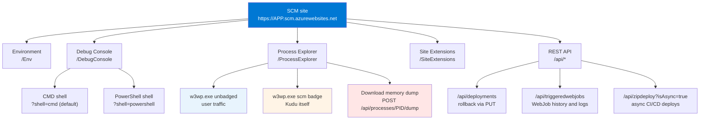

# Kudu on Windows

This page covers the Kudu surfaces that only exist on Windows App Service — Debug Console (CMD and PowerShell), Process Explorer with live IIS worker metrics, Site Extensions, and memory dump capture from the Process Explorer UI — followed by six diagnostic scenarios that use these surfaces end-to-end.

For the parts of Kudu that behave the same on both platforms (SCM URL, authentication, REST API, file system layout, security hardening), see [Kudu Overview](./kudu-overview.md). For the Linux counterparts (WebSSH, KuduLite modern UI at `/`, and classic UI at `/oldui`), see [Kudu on Linux](./kudu-linux.md).

## Windows-Specific Kudu Surfaces

The Kudu UI shipped with Windows App Service is the full [`projectkudu/kudu`](https://github.com/projectkudu/kudu) implementation. It exposes several surfaces that do not exist on Linux App Service:

<!-- diagram-id: windows-kudu-surface-map -->


| Surface | URL path | What it does | Windows-only reason |
|---|---|---|---|
| Debug Console (CMD) | `/DebugConsole/` | Split-pane file tree + interactive CMD shell inside the SCM worker | Requires `cmd.exe` — a Windows-only binary |
| Debug Console (PowerShell) | `/DebugConsole/?shell=powershell` | Same split-pane UI, PowerShell shell instead of CMD | Requires PowerShell — PowerShell Core exists on Linux, but Kudu does not surface it there |
| Process Explorer | `/ProcessExplorer/` | Live table of `w3wp.exe` workers with CPU / memory / handle / thread counters, plus per-process Properties, Dump, and Kill actions | Depends on the IIS worker process model — Linux App Service uses containers, not IIS |
| Site Extensions gallery | `/SiteExtensions/` | Install additional diagnostic agents (Application Insights Profiler, Crash Diagnoser, third-party APMs) into the SCM sandbox | Extension packaging format targets `%HOME%\SiteExtensions\` on Windows only |
| Diagnostic Dump button | Process Explorer → Properties → `Download memory dump` | UI wrapper for `POST /api/processes/{pid}/dump` — captures a full-process minidump | Windows produces a native minidump (`.dmp`) via the DebugDiag/Win32 API; Linux runtimes require language-specific dump tools |

The rest of this page walks through each surface, then applies them to six diagnostic scenarios.

## Kudu Web UI Tour (Environment Home)

When you open the SCM URL on a **Windows** App Service, you land on the Kudu Environment home page. The top navigation exposes the major diagnostic surfaces; the page body itself is a REST API inventory.

### Portal view: Kudu Environment home with REST API inventory

![Kudu Environment home page. Top navigation lists Environment, Debug console (dropdown), Process explorer, Tools (dropdown), Site extensions, and a user@example.com (PII masked) account label. The Environment heading lists Build 2026.5.1.3 (Commit: f4ee002fc6), Azure App Service 108.0.7.45 (release_ANT108-f8334366)+f833436623d9273dc099f581aebca802e0a126fd, Site up time 00.00:06:39, Site folder C:\home, Temp folder C:\local\Temp\. The REST API heading with caption "(works best when using a JSON viewer extension)" is followed by a list of items: App Settings, Deployments, Source control info, Files, Log streaming (use curl, not browser!), Processes and mini-dumps, Runtime versions, Site Extensions (installed | feed), Web hooks, WebJobs (all | triggered | continuous), Functions (list | host config). The footer states "More information about Kudu can be found on the wiki."](../assets/troubleshooting/kudu/02-kudu-home.png)

> [Observed] The Environment landing page exposes build/version info (`Build 2026.5.1.3`, `Azure App Service 108.0.7.45`), site uptime, and filesystem roots (`Site folder C:\home`, `Temp folder C:\local\Temp\`). Below that, a REST API section lists eleven entries: App Settings, Deployments, Source control info, Files, Log streaming, Processes and mini-dumps, Runtime versions, Site Extensions, Web hooks, WebJobs, Functions. The top nav separately exposes five tabs: Environment, Debug console, Process explorer, Tools, Site extensions.
>
> [Inferred] The REST API list on this page is the discoverability entry for Kudu's JSON endpoints — the `(works best when using a JSON viewer extension)` caption confirms these endpoints return raw JSON rather than HTML. The REST list and the top nav are not a 1:1 mapping: some REST categories (Deployments, WebJobs, Functions) have no dedicated top-nav tab on this screen, so scripted callers typically hit the JSON endpoints directly rather than driving those categories through the UI.

Use the top-nav tabs (`Environment`, `Debug console`, `Process explorer`, `Tools`, `Site extensions`) for interactive triage. Switch to the REST URLs listed in the page body (`/api/processes`, `/api/vfs`, `/api/deployments`, `/api/triggeredwebjobs`) when you need to script the same checks for an incident runbook.

## App Settings and Environment

The Environment page is one of the most commonly used Kudu tools. It reveals exactly what values your runtime sees — no guessing about whether an App Setting was applied.

### Portal view: Kudu Environment / App Settings page

![Kudu Environment (/Env) page on a Windows App Service. Top navigation shows Environment (current), Debug console (dropdown), Process explorer, Tools (dropdown), Site extensions, and a user@example.com account label. The page has an Index of anchor links: System Info, App Settings, Connection Strings, Environment variables, PATH, HTTP Headers, Server variables. The System info section lists OS version Microsoft Windows NT 10.0.20348.0, 64 bit system True, 64 bit process False, Processor count 8, Machine name WEBWK000002, Short instance id 92ca53, CLR version 4.0.30319.42000, IIS command line including `-ap "~1app-kudu-capture-msit-win"` and a `\\.\pipe\iisipm…` named pipe identifier, C:\home usage 1,024 MB total / 1,023 MB free (green), C:\local usage 500 MB total / 499 MB free (green). The AppSettings section lists key=value pairs including aspnet:PortableCompilationOutput=true, aspnet:DisableFcnDaclRead=true, SCM_GIT_USERNAME=windowsazure, SCM_GIT_EMAIL=windowsazure, ScmType=None, WEBSITE_AUTH_ENABLED=False, WEBSITE_DEFAULT_HOSTNAME=app-kudu-capture-msit-win.azurewebsites.net, WEBSITE_SITE_NAME=app-kudu-capture-msit-win.](../assets/platform/kudu/02-environment-appsettings.png)

> [Observed] The Index navigates to seven anchored sections on the same scrollable page (System Info, App Settings, Connection Strings, Environment variables, PATH, HTTP Headers, Server variables). System info reports a clean disk picture (`C:\home` 1,023 MB free of 1,024 MB; `C:\local` 499 MB free of 500 MB, both in green), and AppSettings shows platform-injected keys like `WEBSITE_DEFAULT_HOSTNAME` and `WEBSITE_SITE_NAME` alongside `ScmType=None`.
>
> [Inferred] The Index is purely a same-page jump table — there are no sub-pages. `ScmType=None` indicates no source-control-based deployment is configured (this is a freshly created app); a Git or GitHub Actions setup would change this value. The `WEBSITE_*` keys visible here are how every runtime sees its own identity, and `/api/environment` returns the same values as JSON for scripted callers.

The page groups the information into seven index-linked sections:

| Section | What it shows | Typical use |
|---|---|---|
| System Info | OS version, CPU count, instance ID, disk usage of `C:\home` and `C:\local` | Confirm you are on the expected SKU / instance; watch disk thresholds |
| App Settings | Every key from Configuration → Application settings, PLUS platform-injected `WEBSITE_*` keys | Verify a Portal setting change actually reached the runtime |
| Connection Strings | Every entry from Configuration → Connection strings, with type tag (SQLAzure, Custom, MySQL, etc.) | Confirm string is present without leaking the value in Portal UI |
| Environment variables | The full process environment (`AppSettings` + `WEBSITE_*` + inherited variables) | Debug library behavior that reads `process.env` / `Environment.GetEnvironmentVariable` |
| PATH | The resolved `PATH` for the worker process | Diagnose "command not found" during startup scripts |
| HTTP Headers | Headers of the request that loaded this Kudu page | Verify Front Door / App Gateway header injection |
| Server variables | IIS server variables for the current Kudu request | Diagnose IIS-level rewrite / auth issues |

For scripted access, `GET /api/environment` returns the same data as JSON. That is the endpoint runbooks should call rather than screen-scraping the HTML page.

## Debug Console

Windows Kudu exposes both CMD and PowerShell as browser-based shells. Both share the same split-pane UI — a file tree rooted at `/home` on top, a shell at the bottom.

### CMD Console

#### Portal view: Kudu Debug Console (CMD) with site/wwwroot listing


> [Observed] The Debug Console is a split-pane UI — a file tree rooted at `/home` on top, a CMD shell at `C:\home\site\wwwroot>` on the bottom. Running `dir` from the shell shows the contents of `C:\home\site\wwwroot\`.
>
> [Inferred] The file tree and the shell are wired to the same filesystem view — clicking a folder in the tree changes the shell's working directory and vice versa. That two-way binding is what makes Kudu Debug Console faster than separate browser-to-shell tools for one-off file checks.

Use the CMD console for quick file operations and legacy tools that expect `cmd.exe` syntax:

```cmd
:: List deployed files
dir C:\home\site\wwwroot

:: Dump web.config (verify the deployed one, not the local repo copy)
type C:\home\site\wwwroot\web.config

:: Show tail of the newest log
for /f "delims=" %f in ('dir /b /a-d /o-d C:\home\LogFiles\*.log') do type "C:\home\LogFiles\%f" & goto :done
:done
```

### PowerShell Console

#### Portal view: Kudu Debug Console (PowerShell) variant


> [Observed] The split-pane layout is identical to the CMD variant, but the bottom shell renders PowerShell's columnar object output (Mode / LastWriteTime / Length / Name) instead of CMD's flat text.
>
> [Inferred] The URL path differs from the CMD variant — it is `/DebugConsole/?shell=powershell` (NOT `/DebugConsole/PowerShell`, which returns 404). Switching shells is therefore a query-string flip, meaning the front-end is the same UI bound to a different backend shell process.

PowerShell mode is preferable when you need richer scripting — object pipelines, `Select-Object`, structured filtering:

```powershell
# Enumerate workers with resource usage
Get-Process | Where-Object { $_.ProcessName -eq 'w3wp' } |
  Select-Object Id, WorkingSet64, PrivateMemorySize64, Handles, Threads

# Find the freshest log file
Get-ChildItem -Path C:\home\LogFiles -Recurse -File |
  Sort-Object LastWriteTime -Descending |
  Select-Object -First 5 FullName, LastWriteTime, Length

# Dump the resolved web.config
Get-Content -Path C:\home\site\wwwroot\web.config
```

!!! info "Shell selection is a query string"
    Both consoles share the URL `https://<app>.scm.azurewebsites.net/DebugConsole/`. Append `?shell=powershell` for PowerShell. The path `/DebugConsole/PowerShell` (no query string) returns 404 — a common trap when following older internal wikis.

## Process Explorer

Process Explorer is the only Kudu surface that exposes **live per-process state**: CPU time, working set, private memory, thread count, and handle count.

### Portal view: Kudu Process Explorer with w3wp.exe rows

![Kudu Process Explorer page. Top navigation shows Environment, Debug console (dropdown), Process explorer (current), Tools (dropdown), Site extensions, user@example.com (PII masked) account label. The page heading reads Process Explorer. A Find Handle... button sits above a Refresh link. The table has columns name, pid, user_name, total_cpu_time, working_set, private_memory, thread_count, properties, profiling. Row 1: w3wp.exe, 1760, app-test-windows-20260608, 3 s, 6,044 KB, 52,008 KB, 31, Properties.. button, Collect IIS Events checkbox, Start Profiling button. Row 2: w3wp.exe with an scm badge, 6200, app-test-windows-20260608, 14 s, 44,096 KB, 76,112 KB, 32, Properties.. button, Collect IIS Events checkbox, Start Profiling button.](../assets/troubleshooting/kudu/03-process-explorer.png)

> [Observed] The table lists two `w3wp.exe` rows on this idle app — one unbadged (pid 1760, private memory 52,008 KB, 31 threads) and one carrying an `scm` badge (pid 6200, private memory 76,112 KB, 32 threads). Each row exposes `Properties..`, a `Collect IIS Events` checkbox, and a `Start Profiling` button.
>
> [Inferred] The `scm`-badged row is the Kudu worker itself (serving the page you are looking at); the unbadged row is the user-traffic worker. Kudu therefore runs in a separate IIS app pool from the user site, which is why disabling the user site does not disable Kudu, and why memory pressure on one worker does not necessarily affect the other. `Start Profiling` triggers CPU sampling on the selected process — pair it with `Collect IIS Events` when investigating request-scoped CPU spikes.

The two `w3wp.exe` rows illustrate the dual-process model on every Windows App Service:

| Row | What it serves | When you care |
|---|---|---|
| Unbadged `w3wp.exe` | User traffic (`https://<app>.azurewebsites.net`) | Memory / CPU spikes, thread exhaustion, hang investigations |
| `w3wp.exe` with `scm` badge | Kudu itself (`https://<app>.scm.azurewebsites.net`) | Kudu UI becomes slow or times out — check this row |

For memory-leak and thread-exhaustion suspicions, sort by `private_memory` and refresh every 30-60 seconds to spot growth. The per-row action buttons (`Properties..`, `Collect IIS Events`, `Start Profiling`) drive the diagnostic scenarios later on this page.

## Site Extensions

Site Extensions add gallery-installed agents (Application Insights Profiler, Crash Diagnoser, .NET Snapshot Debugger, third-party APMs). They are **Windows-only**.

### Portal view: Kudu Site Extensions gallery

![Kudu Site Extensions Gallery on Windows. Top nav shows Environment, Debug console, Process explorer, Tools, Site extensions (current), user@example.com. Two tabs: Installed and Gallery (current/active). The Gallery view displays a grid of extension cards including: ASP.NET Core Logging Integration v10.0.9, New Relic .NET Agent v1.6.0, .NET Datadog APM v3.48.0, AppDynamics 4.5 v26.5.0, OzCode Production Debugger, JENNIFER .NET Agent, File Counter, Azure Let's Encrypt, IIS.Compression. Each card shows the package version, a short description, and a + (Add) button.](../assets/platform/kudu/05-site-extensions.png)

> [Observed] The Gallery tab is active (vs the Installed tab). The visible cards span observability agents (New Relic, Datadog, AppDynamics, JENNIFER), debugging tools (OzCode), and platform utilities (Azure Let's Encrypt, IIS.Compression).
>
> [Inferred] The gallery is a curated NuGet feed surface; every card is one click away from installation into the same SCM sandbox the rest of Kudu runs in. Most production-grade extensions here are observability sidecars — choose them only after Application Insights is shown to be insufficient, because each adds startup cost and another moving part to the worker process.

Extensions are installed into `%HOME%\SiteExtensions\<extension-id>\` and persist across worker recycles (they live under `/home`, which is the shared mounted storage). To install non-interactively, use the REST API:

```bash
# Install Application Insights Profiler site extension
curl --silent --request PUT \
  --header "Authorization: Bearer ${ACCESS_TOKEN}" \
  --header "Content-Type: application/json" \
  --data '{"id": "Microsoft.ApplicationInsights.Profiler.AspNetCore"}' \
  "https://${APP_NAME}.scm.azurewebsites.net/api/siteextensions/Microsoft.ApplicationInsights.Profiler.AspNetCore"
```

| Parameter | Purpose |
|---|---|
| `--request PUT` | Site extension installation is idempotent — PUT installs if missing, upgrades if version differs. |
| `--header "Content-Type: application/json"` | Kudu expects a JSON body describing the extension package. |
| Body `{"id": "..."}` | The extension package ID as it appears in the gallery URL. |
| Path `/api/siteextensions/{id}` | The same `{id}` appears in both the URL path and body — Kudu validates they match. |

Common production extensions:

| Extension | Purpose | Runtime overhead |
|---|---|---|
| `Microsoft.ApplicationInsights.AzureWebSites` | Codeless Application Insights for .NET Framework apps | Minimal — data plane only |
| `Microsoft.ApplicationInsights.Profiler.AspNetCore` | Code-level CPU profiling triggered on demand | Moderate — samples CPU when triggered |
| `Microsoft.AspNetCore.AzureAppServices.SiteExtension` | ASP.NET Core Hosting Bundle when the platform default lags a needed version | Startup-time only |
| `DaaS` (Diagnostics as a Service) | Automated dump / trace / profile capture on triggers | High during capture windows |

Reach for a Site Extension only after Application Insights is shown to be insufficient — each extension adds startup cost and another moving part to the worker process.

## Capture a Memory Dump from Process Explorer

A memory dump captures a full process image (heap, stacks, loaded modules, thread state) for offline analysis in WinDbg, Visual Studio, or `dotnet-dump analyze`. This is the primary evidence for hang and memory-leak investigations where live logs cannot explain the state.

### Portal view: Kudu Process page with diagnostic dump capture

![Kudu Process Explorer 'w3wp.exe : 5384 Properties' dialog on Windows. Five tabs across the top: General (current), Modules, Handles, Threads, Environment Variables. The General tab shows fields: id 5384, name w3wp, file name `C:\Windows\SysWOW64\inetsrv\w3wp.exe`, command line including `-ap "~1app-kudu-capture-msit-win"` and the IIS pipe identifier `\\.\pipe\iisipm00000000-0000-0000-0000-000000000000`, user name `IIS APPPOOL\app-kudu-capture-msit-win`, is scm site true, is webjob true, handle count 1356, thread count 54, plus memory metrics. Two prominent action buttons at the bottom: `Kill` (red) and `Download memory dump` (blue). A Close button is in the dialog header.](../assets/platform/kudu/07-diagnostic-dump.png)

> [Observed] The General tab shows process metadata (id, working binary, command line, identity, handle/thread counts) and exposes two action buttons: `Kill` (red) and `Download memory dump` (blue). The `is scm site : true` field is set on this process row.
>
> [Inferred] `Kill` (immediate process termination) and `Download memory dump` (expensive full-process capture that briefly pauses the worker) are both consequential — `Download memory dump` is the UI surface for `POST /api/processes/{pid}/dump`, which is what incident runbooks should call to avoid the wrong PID being clicked under pressure. The `is scm site : true` field marks this row as the SCM worker (the worker serving Kudu itself), not the user-traffic worker. The IIS pipe GUID is masked (all-zero) in this capture but is real on a live system — it is a per-worker named pipe identifier, not a security secret.

The four remaining tabs of the Properties dialog expose additional detail without requiring a full dump:

| Tab | Contents | When to use instead of a dump |
|---|---|---|
| Modules | Loaded DLLs with path and version | Confirm the right version of a shared assembly is loaded |
| Handles | Open file / registry / mutex handles | Diagnose file-lock issues without capturing a dump |
| Threads | Thread IDs, CPU time, start address | Spot a runaway thread before dumping |
| Environment Variables | The full environment of THIS specific process | Confirm the worker sees an App Setting change (compare against `/Env`) |

For non-interactive capture (incident automation, scheduled diagnostics), use the REST endpoint documented in [Kudu Overview — Diagnostic Dumps](./kudu-overview.md#diagnostic-dumps).

## Diagnostic Scenarios

The remaining sections apply the Windows Kudu surfaces to six recurring incident patterns. Each scenario names the symptom, the Kudu surface to use, the concrete steps, and what the resulting evidence looks like.

### Scenario 1: w3wp Production Hang — Capture and Preserve Evidence

**Symptom.** The main site is returning 502.5 or timing out on `/healthz`, but the worker process is still running (Portal Overview shows the app as `Running`, not `Stopped`). Restart-and-hope loses the evidence needed to prevent recurrence.

**Diagnostic path.** Process Explorer → identify the hung user-traffic worker → capture a dump → collect a matching `w3wp` counter snapshot → THEN restart.

**Steps.**

1. **Confirm the site is hung, not just slow.** From your laptop:

    ```bash
    curl --max-time 30 --write-out "\nHTTP %{http_code} in %{time_total}s\n" \
      "https://${APP_NAME}.azurewebsites.net/healthz"
    ```

    | Parameter | Purpose |
    |---|---|
    | `--max-time 30` | Fail fast — a healthy `/healthz` responds in <500 ms. If curl times out at 30 s, the worker is not just slow, it is hung. |
    | `--write-out "\nHTTP %{http_code} in %{time_total}s\n"` | Prints the HTTP status and wall-clock latency in a machine-parseable line — useful for pasting into incident tickets. |

2. **Open Process Explorer.** Navigate to `https://${APP_NAME}.scm.azurewebsites.net/ProcessExplorer/`. Identify the **unbadged** `w3wp.exe` row (the user-traffic worker — not the `scm`-badged row). Note its PID.

3. **Snapshot the counters BEFORE dumping.** Click `Properties..` on the unbadged row and screenshot the General tab. This preserves `handle count`, `thread count`, `private_memory`, and `total_cpu_time` at the moment of hang — values that will be lost after restart.

4. **Capture a memory dump.** Click `Download memory dump` (the blue button on the General tab). The button is a UI wrapper for `POST /api/processes/{pid}/dump`; the browser streams the `.dmp` file (typically 200 MB - 2 GB depending on `WorkingSet`).

    !!! warning "Dump capture pauses the worker"
        The `Download memory dump` action briefly freezes the target process (typically 2-30 seconds depending on memory size) while the runtime writes the dump. Do not click this button on a healthy production worker. If you must capture from a healthy instance, scale out first so at least one other worker keeps serving traffic.

5. **Restart the app.** Portal Overview → `Restart`. This kills all workers and recycles them; the dump you just captured is the only evidence left of the hang state.

6. **Analyze offline with `dotnet-dump analyze` or WinDbg.**

    ```bash
    # Install dotnet-dump globally (one-time)
    dotnet tool install --global dotnet-dump

    # Load the dump
    dotnet-dump analyze "dump-${APP_NAME}-20260701T143000.dmp"

    # Inside the SOS prompt
    > clrstack --all       # Every managed thread's call stack
    > sync                 # Managed locks and monitors — shows deadlocks
    > dumpheap --stat      # Object counts by type — spot leaks
    ```

**What the evidence proves.** A dump captured at the hang moment lets you distinguish deadlock (all threads blocked in `Monitor.Wait`), thread pool starvation (all worker threads busy in the same downstream call), and native-code deadlock (managed threads blocked in `WaitForSingleObject`). Restart-without-dump leaves you unable to distinguish these.

### Scenario 2: Memory Dump Analysis — Track Down a Growing Working Set

**Symptom.** Application Insights shows a slow upward drift in `private_memory` on one instance over several hours, eventually triggering the `WEBSITE_MEMORY_LIMIT_MB` recycle. Restart resets the counter but the drift resumes.

**Diagnostic path.** Take TWO dumps at different times, compare heap statistics to identify the growing object type.

**Steps.**

1. **First dump — captured when memory is still moderate.** Wait until `Process Explorer → w3wp.exe (unbadged) → private_memory` shows ~50% of the recycle threshold. Capture and label the dump `dump-t1-${TIMESTAMP}.dmp`.

2. **Second dump — captured when memory is high but before recycle.** Wait until private_memory reaches ~80% of the threshold. Capture and label `dump-t2-${TIMESTAMP}.dmp`.

3. **Compare heap stats between the two dumps.**

    ```bash
    # Dump t1 heap summary
    dotnet-dump analyze "dump-t1-20260701T100000.dmp" --command "dumpheap --stat" > heap-t1.txt

    # Dump t2 heap summary
    dotnet-dump analyze "dump-t2-20260701T140000.dmp" --command "dumpheap --stat" > heap-t2.txt

    # Compare
    diff heap-t1.txt heap-t2.txt | head -30
    ```

    The `dumpheap --stat` output has three columns: `MT` (method table), `Count`, `TotalSize`. Types whose `Count` and `TotalSize` grew significantly between t1 and t2 are your leak suspects.

4. **Drill into the suspect type.**

    ```bash
    dotnet-dump analyze "dump-t2-20260701T140000.dmp"
    > dumpheap --type Contoso.OrderCache+CacheEntry
    # Prints every instance address
    > gcroot <address-from-previous-line>
    # Prints the reference chain keeping this instance alive
    ```

5. **Common Windows-specific leak patterns.**

    | Pattern | `dumpheap --stat` signature | Root cause |
    |---|---|---|
    | Unbounded in-memory cache | Growing `Dictionary<TKey, TValue>` entries | Missing eviction / TTL |
    | HttpClient socket exhaustion | Growing `SocketAsyncEventArgs` | `new HttpClient()` per request instead of `IHttpClientFactory` |
    | Event handler leak | Growing `EventHandler`-derived types with roots via `+=` | Missing `-=` on dispose |
    | Static list accumulation | Growing `List<T>` rooted by a static field | Log buffer never flushed / drained |

**What the evidence proves.** Two dumps taken at different memory levels, with a diffed `dumpheap --stat`, isolate exactly which type is growing. This is far more actionable than a single high-memory dump (which shows what is in memory, but not what is growing).

### Scenario 3: CPU Spike — Collect IIS Events and Profile the Worker

**Symptom.** Portal metrics show CPU on the App Service Plan pegged at 90-100% for a 5-15 minute window, then subsides. It repeats intermittently. You need to catch it in the act.

**Diagnostic path.** Process Explorer → `Collect IIS Events` + `Start Profiling` on the unbadged `w3wp.exe` → wait for the spike → download the trace → analyze in PerfView.

**Steps.**

1. **Enable IIS Events collection.** In Process Explorer, tick the `Collect IIS Events` checkbox on the unbadged `w3wp.exe` row. This starts an ETW session that captures every `IIS_RequestNotification` event, including request URL, response code, and duration.

2. **Start CPU profiling.** Click `Start Profiling` on the same row. This begins CPU sampling (1000 Hz by default) — the trace grows at ~50 MB per minute of active profiling, so do not leave it running longer than needed.

3. **Wait for the spike or reproduce the load.** If the spike is triggered by a known cron / user action, trigger it now. Otherwise, wait for the next observed spike (check the Metrics blade in a second Portal tab).

4. **Stop profiling immediately after the spike.** Click `Stop Profiling` — the button becomes an `Download profile` link. Download the `.diagsession` file.

5. **Analyze in PerfView (Windows-only tool).**

    ```powershell
    # Open the trace
    & 'C:\tools\PerfView.exe' 'w3wp-profile-20260701T143000.diagsession'

    # Inside PerfView:
    # - "CPU Stacks" view → sort by "Inc %" (inclusive CPU percentage)
    # - Right-click hottest frame → "Include Item" to filter down
    # - Look at "By Name" tab to identify the top managed methods burning CPU
    ```

6. **Correlate profile stacks to IIS request events.** In the same trace, open the `IIS_Trace/IIS_Request Handlers` view. Filter by the time range of the spike. This gives you the URL → method-hot-path pairing that identifies which endpoint drove the CPU burn.

**What the evidence proves.** A CPU trace shows *what code* burned CPU; IIS events show *which requests* were in flight at the same time. Together they answer: "at 14:32:15 the app was pegged because 300 concurrent requests to `/api/reports/generate` were spending 78% of their CPU time in `System.Text.RegularExpressions.Match`." That level of specificity is not derivable from metrics alone.

### Scenario 4: Roll Back to a Previous Deployment via `/api/deployments`

**Symptom.** A deployment succeeded (green in Deployment Center), but the app now returns 500 errors on paths that worked yesterday. You need to roll back **now** while investigating.

**Diagnostic path.** `GET /api/deployments` → identify the last-known-good deployment ID → `PUT /api/deployments/{id}` to reactivate it. On Windows, this leverages Kudu's built-in ability to swap the active deployment atomically at the filesystem level.

**Steps.**

1. **List recent deployments and pick the previous active one.**

    ```bash
    ACCESS_TOKEN=$(az account get-access-token --resource https://management.azure.com/ --query accessToken --output tsv)

    curl --silent --header "Authorization: Bearer ${ACCESS_TOKEN}" \
      "https://${APP_NAME}.scm.azurewebsites.net/api/deployments" |
      jq '.[] | {id, message, author, status, active, received_time, end_time}'
    ```

    | Parameter | Purpose |
    |---|---|
    | `az account get-access-token --resource https://management.azure.com/` | Obtains a Microsoft Entra bearer token for the ARM audience, which Kudu accepts after basic auth is disabled. |
    | `--header "Authorization: Bearer ${ACCESS_TOKEN}"` | Presents the token on the request. |
    | `jq '.[] | {...}'` | Reduces each deployment object to the fields that matter for rollback decisions. |

    Look for the deployment where `active: true` (the current broken one) and the one immediately before it (the last-known-good).

2. **Read the deployment log for the current active deployment to confirm the failure signature.**

    ```bash
    BAD_ID=<current-active-id-from-step-1>
    curl --silent --header "Authorization: Bearer ${ACCESS_TOKEN}" \
      "https://${APP_NAME}.scm.azurewebsites.net/api/deployments/${BAD_ID}/log" |
      jq '.[] | select(.type != "0") | {message, log_time}'
    ```

    Filtering `select(.type != "0")` shows only warning/error entries (`type: "1"` warning, `type: "2"` error), suppressing routine info entries.

3. **Reactivate the last-known-good deployment.**

    ```bash
    GOOD_ID=<last-known-good-id-from-step-1>
    curl --silent --request PUT \
      --header "Authorization: Bearer ${ACCESS_TOKEN}" \
      --header "Content-Type: application/json" \
      --data '{}' \
      "https://${APP_NAME}.scm.azurewebsites.net/api/deployments/${GOOD_ID}"
    ```

    | Parameter | Purpose |
    |---|---|
    | `--request PUT` | Kudu treats PUT on `/api/deployments/{id}` as "make this deployment active" — the artifact is already stored under `/home/site/deployments/${GOOD_ID}/`, so this is a filesystem symlink flip, not a re-deploy. |
    | `--data '{}'` | Kudu requires a JSON body even though the operation is idempotent. Empty object is accepted. |

4. **Verify the rollback took effect.**

    ```bash
    # The 'active' field should now be true on GOOD_ID
    curl --silent --header "Authorization: Bearer ${ACCESS_TOKEN}" \
      "https://${APP_NAME}.scm.azurewebsites.net/api/deployments" |
      jq '.[] | select(.active == true) | {id, message}'
    ```

    Then hit the previously failing endpoint from your laptop and confirm the 500 is gone.

**What the evidence proves.** The `active: true` flag in the deployments API is exactly what the platform uses to route requests at `/home/site/wwwroot`. Flipping this flag is functionally equivalent to a slot swap in the deployment plane but happens in <2 seconds without requiring a Standard tier or higher.

### Scenario 5: Debug a WebJob Failure

**Symptom.** A triggered WebJob shows `Failed` status in the WebJobs blade, but the failure reason is not obvious from the Portal UI.

**Diagnostic path.** `/api/triggeredwebjobs/{jobName}/history` to list runs → `/api/triggeredwebjobs/{jobName}/history/{runId}/log` for the specific run's stdout/stderr.

**Steps.**

1. **List the recent runs of the failing WebJob.**

    ```bash
    JOB_NAME=nightly-report
    curl --silent --header "Authorization: Bearer ${ACCESS_TOKEN}" \
      "https://${APP_NAME}.scm.azurewebsites.net/api/triggeredwebjobs/${JOB_NAME}/history" |
      jq '.runs[] | {id, status, start_time, end_time, duration, trigger}'
    ```

    | Parameter | Purpose |
    |---|---|
    | `/api/triggeredwebjobs/{name}/history` | Returns the last N runs (default 50) with status, timing, and per-run log URL. |
    | `.runs[]` | Kudu returns `{ runs: [...] }` — dereference to iterate. |

    Identify the failing run's `id` (typically a timestamp like `202607010200000`).

2. **Pull the full log for that specific run.**

    ```bash
    RUN_ID=202607010200000
    curl --silent --header "Authorization: Bearer ${ACCESS_TOKEN}" \
      "https://${APP_NAME}.scm.azurewebsites.net/api/triggeredwebjobs/${JOB_NAME}/history/${RUN_ID}/log"
    ```

    This returns the raw stdout + stderr the WebJob wrote during that run. Unlike Application Insights, this captures unhandled exceptions that crashed the process before they could be logged programmatically.

3. **For continuous WebJobs, use the `/api/continuouswebjobs/{name}` endpoint.**

    ```bash
    curl --silent --header "Authorization: Bearer ${ACCESS_TOKEN}" \
      "https://${APP_NAME}.scm.azurewebsites.net/api/continuouswebjobs/${JOB_NAME}"

    # Continuous jobs also expose their most recent log
    curl --silent --header "Authorization: Bearer ${ACCESS_TOKEN}" \
      "https://${APP_NAME}.scm.azurewebsites.net/api/continuouswebjobs/${JOB_NAME}/log"
    ```

4. **Common WebJob failure signatures.**

    | Log signature | Root cause | Fix |
    |---|---|---|
    | `System.IO.FileNotFoundException: Could not load file or assembly ...` | Missing runtime dependency | Ensure the WebJob's `bin/` folder was included in the deploy artifact |
    | `Exit code -1073741819` (0xC0000005 access violation) | Native crash | Check `LogFiles/eventlog.xml` for the CLR crash record |
    | `WebJob timed out. Cancelling.` | Job exceeded WebJob timeout | Split into smaller jobs or migrate to Functions with a durable orchestration |
    | `Access denied to path 'D:\home\site\wwwroot\...'` | Writing to `wwwroot` from a Run-From-Package deployment | Write to `D:\home\data\` (writable) instead |

**What the evidence proves.** The Kudu WebJobs API returns the raw process output that ran, unfiltered by the runtime's exception handler. That is often the ONLY way to see a startup failure that occurred before your application logging was initialized.

### Scenario 6: Track ZipDeploy Async Status

**Symptom.** A large ZipDeploy artifact (>200 MB) exceeds the synchronous deploy timeout. `az webapp deploy` returns a 202 with a status URL, and you need to programmatically watch it to completion for a CI pipeline gate.

**Diagnostic path.** Use `POST /api/zipdeploy?isAsync=true` explicitly, then poll `GET /api/deployments/{id}` until `status` transitions from `3` (pending) to `4` (succeeded) or `5` (failed).

**Steps.**

1. **Trigger the async deploy.**

    ```bash
    ARTIFACT=./release.zip
    ACCESS_TOKEN=$(az account get-access-token --resource https://management.azure.com/ --query accessToken --output tsv)

    RESPONSE=$(curl --silent --show-error --write-out "\n%{http_code}\n" \
      --request POST \
      --header "Authorization: Bearer ${ACCESS_TOKEN}" \
      --header "Content-Type: application/zip" \
      --data-binary "@${ARTIFACT}" \
      "https://${APP_NAME}.scm.azurewebsites.net/api/zipdeploy?isAsync=true")

    HTTP_CODE=$(echo "$RESPONSE" | tail -n1)
    LOCATION_HEADER=$(curl --silent --head --header "Authorization: Bearer ${ACCESS_TOKEN}" \
      --request POST --header "Content-Type: application/zip" --data-binary "@${ARTIFACT}" \
      "https://${APP_NAME}.scm.azurewebsites.net/api/zipdeploy?isAsync=true" | grep -i '^location:')
    echo "$LOCATION_HEADER"
    ```

    | Parameter | Purpose |
    |---|---|
    | `--request POST` | ZipDeploy is a POST that streams the archive body to Kudu. |
    | `--header "Content-Type: application/zip"` | Kudu uses this to decide the deploy handler (zip vs. gzipped tar vs. war). |
    | `--data-binary "@${ARTIFACT}"` | `@` prefix instructs curl to read from a file; `--data-binary` preserves binary content without newline translation. |
    | `?isAsync=true` | Kudu returns 202 Accepted immediately instead of blocking until the deploy finishes. |
    | `Location` response header | Contains the `/api/deployments/{id}` URL to poll for status. |

2. **Extract the deployment ID from the Location header.**

    ```bash
    # Location header looks like: https://<app>.scm.azurewebsites.net/api/deployments/latest
    # Follow it once to get the concrete deployment ID
    DEPLOY_ID=$(curl --silent --header "Authorization: Bearer ${ACCESS_TOKEN}" \
      "https://${APP_NAME}.scm.azurewebsites.net/api/deployments/latest" | jq --raw-output '.id')
    echo "Tracking deployment ${DEPLOY_ID}"
    ```

3. **Poll until terminal status.**

    ```bash
    while true; do
      STATUS=$(curl --silent --header "Authorization: Bearer ${ACCESS_TOKEN}" \
        "https://${APP_NAME}.scm.azurewebsites.net/api/deployments/${DEPLOY_ID}" | jq --raw-output '.status')

      echo "$(date -u +%FT%TZ) status=${STATUS}"

      case "$STATUS" in
        4) echo "Deployment succeeded"; break ;;
        5) echo "Deployment failed"; exit 1 ;;
        3) sleep 10 ;;
        *) echo "Unexpected status: $STATUS"; exit 1 ;;
      esac
    done
    ```

    | Status code | Meaning | Terminal? |
    |---|---|---|
    | `3` | Pending / in progress | No — keep polling |
    | `4` | Succeeded | Yes — mark CI job green |
    | `5` | Failed | Yes — fetch log, mark CI job red |
    | `6` | Cancelled (rare) | Yes — treat as failure for CI |

4. **On failure, fetch the deployment log to fail the CI with a useful error.**

    ```bash
    curl --silent --header "Authorization: Bearer ${ACCESS_TOKEN}" \
      "https://${APP_NAME}.scm.azurewebsites.net/api/deployments/${DEPLOY_ID}/log" |
      jq '.[] | select(.type == "2") | {message, log_time}'
    ```

    `type: "2"` filters to error entries only — the concrete reason the deploy failed (Oryx build error, startup command mismatch, missing dependency).

**What the evidence proves.** The async polling loop with concrete status-code handling is what turns "ZipDeploy sometimes times out on the sync path" from a flaky CI failure into a deterministic gate. Combined with the log-on-failure step, it produces a CI failure message that names the exact deploy step that failed, not "curl exited 22 with HTTP 500".

## See Also

- [Kudu Overview](./kudu-overview.md) — cross-platform architecture, authentication, REST API, security hardening
- [Kudu on Linux](./kudu-linux.md) — KuduLite modern UI at `/`, classic UI at `/oldui`, WebSSH, and Linux-specific diagnostic scenarios
- [Kudu API Reference](../reference/kudu-queries.md) — per-endpoint cheatsheet with curl examples
- [Windows Kudu and Diagnostic Tools Playbook](../troubleshooting/playbooks/startup-availability/windows-kudu-diagnostics.md) — hypothesis-driven tool selection for Windows-specific incidents

## Sources

- [Kudu service overview (Microsoft Learn)](https://learn.microsoft.com/en-us/azure/app-service/resources-kudu)
- [Deploy Files to Azure App Service (Microsoft Learn)](https://learn.microsoft.com/en-us/azure/app-service/deploy-zip) — ZipDeploy synchronous and async modes, `isAsync=true` semantics
- [Run background tasks with WebJobs (Microsoft Learn)](https://learn.microsoft.com/en-us/azure/app-service/webjobs-create)
- [Site Extensions for Azure App Service (Microsoft Learn)](https://learn.microsoft.com/en-us/azure/app-service/web-sites-purchase-extensions)
- [Enable diagnostic logging (Microsoft Learn)](https://learn.microsoft.com/en-us/azure/app-service/troubleshoot-diagnostic-logs)
- [Application Insights Profiler for App Service (Microsoft Learn)](https://learn.microsoft.com/en-us/azure/azure-monitor/profiler/profiler) — the recommended alternative to Kudu's built-in profiler for continuous production profiling
- [projectkudu/kudu Wiki (GitHub, archived 2024-09-04)](https://github.com/projectkudu/kudu/wiki) — Windows Kudu REST API reference, Debug Console (`?shell=powershell`), Process Explorer semantics
- [projectkudu/kudu Wiki — REST API](https://github.com/projectkudu/kudu/wiki/REST-API) — `/api/triggeredwebjobs`, `/api/continuouswebjobs`, `/api/deployments`, `/api/zipdeploy` endpoint documentation
- [Debug a .NET Core app on Azure App Service with dotnet-dump (Microsoft Learn)](https://learn.microsoft.com/en-us/dotnet/core/diagnostics/dotnet-dump) — offline analysis workflow for Kudu-captured dumps
