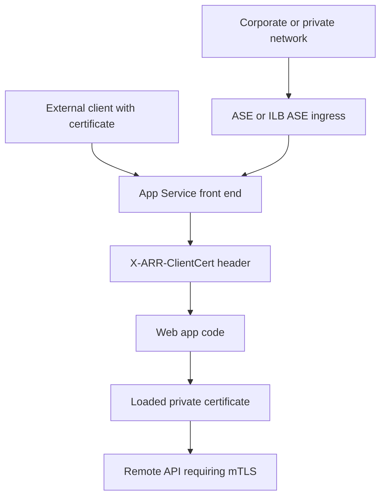

---
content_sources:
  diagrams:
    - id: app-service-mtls-planes
      type: flowchart
      source: mslearn-adapted
      mslearn_url: https://learn.microsoft.com/en-us/azure/app-service/app-service-web-configure-tls-mutual-auth
      based_on:
        - https://learn.microsoft.com/en-us/azure/app-service/configure-ssl-certificate-in-code
        - https://learn.microsoft.com/en-us/azure/app-service/environment/overview
content_validation:
  status: pending_review
  last_reviewed: "2026-04-25"
  reviewer: ai-agent
  core_claims:
    - claim: "App Service forwards inbound client certificates to app code in the X-ARR-ClientCert request header when mutual TLS is enabled."
      source: "https://learn.microsoft.com/en-us/azure/app-service/app-service-web-configure-tls-mutual-auth"
      verified: true
    - claim: "App Service does not validate the forwarded inbound client certificate; app code must validate it."
      source: "https://learn.microsoft.com/en-us/azure/app-service/app-service-web-configure-tls-mutual-auth"
      verified: true
    - claim: "Private certificates can be made available to app code with WEBSITE_LOAD_CERTIFICATES."
      source: "https://learn.microsoft.com/en-us/azure/app-service/configure-ssl-certificate-in-code"
      verified: true
    - claim: "App Service Environment changes network placement and ingress topology for App Service workloads."
      source: "https://learn.microsoft.com/en-us/azure/app-service/environment/overview"
      verified: true
---

# Mutual TLS Architecture

Azure App Service supports mutual TLS in multiple places, but the trust boundary is different in each one. For production design, separate inbound client certificate authentication, outbound client certificate presentation, and App Service Environment (ASE) ingress topology instead of treating all three as the same feature.

## Main Content

### The three mTLS planes in App Service

<!-- diagram-id: app-service-mtls-planes -->

App Service mTLS has three distinct planes:

| Plane | Direction | Where TLS terminates | What your code sees | Primary platform controls |
|---|---|---|---|---|
| Incoming client certificate authentication | Inbound | App Service front end | `X-ARR-ClientCert` header | `clientCertEnabled`, `clientCertMode`, `clientCertExclusionPaths` |
| Outbound client certificate authentication | Outbound | Remote service | Certificate loaded by the app process | uploaded private certificate, `WEBSITE_LOAD_CERTIFICATES` |
| End-to-end private ingress with ASE | Inbound topology | App Service front end inside ASE path | Depends on the exact ingress chain and proxy design | ASE / ILB ASE network design, ingress and certificate policy |

The important architecture rule is that **inbound mTLS and outbound mTLS are independent**. Enabling client certificates for inbound requests does not automatically give your app a client certificate for outbound calls, and uploading a private certificate for outbound calls does not authenticate inbound callers.

### Incoming client certificate authentication

For inbound mutual TLS, App Service terminates TLS at the front end and forwards the presented client certificate to your application in the `X-ARR-ClientCert` request header.

Key platform behavior:

- `clientCertEnabled` turns the feature on.
- `clientCertMode` controls whether certificates are required or optional.
- `clientCertExclusionPaths` bypasses certificate enforcement for selected paths.
- The forwarded header value is base64-encoded certificate content without PEM markers.
- Your application must validate issuer, subject, thumbprint, validity window, and chain policy as needed.

!!! warning "App Service forwards, but does not validate"
    Microsoft Learn explicitly states that App Service does not validate the inbound client certificate. Treat `clientCertMode=Required` as "certificate must be presented at the edge," not "certificate chain is trusted for authorization."

#### Site properties for inbound mTLS

| Property | Type | Example | Purpose |
|---|---|---|---|
| `clientCertEnabled` | Boolean | `true` | Enables client certificate forwarding and enforcement behavior |
| `clientCertMode` | String | `Required` | Controls whether certificates are required, optional, or renegotiated for interactive browsers |
| `clientCertExclusionPaths` | String | `/health;/webhooks/partner-a` | Skips client certificate enforcement for matching request paths |

Supported `clientCertMode` values documented by Microsoft Learn:

- `Required`
- `Optional`
- `OptionalInteractiveUser`

Design guidance:

1. Use `Required` for API endpoints where every caller must present a client certificate.
2. Use `Optional` only when the application enforces certificate presence for selected routes or callers.
3. Use `clientCertExclusionPaths` sparingly for liveness probes, platform callbacks, or third-party webhook endpoints that cannot present a certificate.

!!! warning "Exclusion paths rely on TLS renegotiation"
    Microsoft Learn documents that `clientCertExclusionPaths` and `OptionalInteractiveUser` rely on TLS renegotiation. TLS 1.3 and HTTP/2 do not support renegotiation, and large request bodies can fail when renegotiation is required. Validate these constraints before standardizing on exclusions.

### Outbound mTLS from the app to remote services

Outbound mTLS means your App Service app acts as the TLS client and presents its own certificate to a downstream dependency such as a partner API, API gateway, or internal service.

The platform pattern is different from inbound mTLS:

1. Upload a private certificate to the App Service app.
2. Make it available to application code with `WEBSITE_LOAD_CERTIFICATES`.
3. Load the certificate from the platform-exposed store or filesystem location.
4. Attach it to your HTTP client or TLS context.

!!! note
    App Service documents outbound certificate loading separately from inbound client certificate authentication. Keep the configuration, rotation, and operational runbooks separate.

### ASE and end-to-end private ingress considerations

App Service Environment changes where the App Service front ends and workers live on your network, but your application should still treat inbound client certificates as platform-forwarded artifacts unless your ingress chain adds another gateway or proxy behavior.

Conservative ASE design assumptions:

- Use ASE to control where ingress is exposed and how private routing works.
- Assume the standard `X-ARR-ClientCert` application contract only when no upstream gateway or proxy changes that behavior.
- Document ILB ASE as an ingress-topology choice, not as proof of a different in-app certificate format.

!!! warning "ASE details need topology-specific validation"
    ASE changes network boundaries, load-balancer placement, and private ingress patterns. Validate your exact ASE v3 ingress chain, especially for ILB deployments and upstream proxies such as Application Gateway or Front Door, before assuming standard App Service certificate-forwarding behavior.

### Comparison summary

| Question | Incoming client certificates | Outbound client certificates | ASE private ingress |
|---|---|---|---|
| Who presents the certificate? | External caller | Your app | External caller through ASE path |
| Where is TLS terminated? | App Service front end | Remote service | App Service front end in ASE topology |
| What does app code receive? | `X-ARR-ClientCert` header | Certificate from local store/path | Depends on whether the ingress chain preserves the standard App Service contract |
| What validates trust? | Your app code | Remote service and your outbound TLS configuration | Your app code plus ASE network design |
| Common mistake | Assuming `Required` validates the chain | Forgetting `WEBSITE_LOAD_CERTIFICATES` | Assuming ASE changes the app-level certificate contract |

## See Also

- [Security Architecture](./security-architecture.md)
- [Networking](./networking.md)
- [Incoming Client Certificates](../operations/incoming-client-certificates.md)
- [Outbound Client Certificates](../operations/outbound-client-certificates.md)
- [mTLS Best Practices](../best-practices/mtls.md)

## Sources

- [Set up TLS mutual authentication for Azure App Service (Microsoft Learn)](https://learn.microsoft.com/en-us/azure/app-service/app-service-web-configure-tls-mutual-auth)
- [Use TLS/SSL certificates in your application code in Azure App Service (Microsoft Learn)](https://learn.microsoft.com/en-us/azure/app-service/configure-ssl-certificate-in-code)
- [App Service Environment overview (Microsoft Learn)](https://learn.microsoft.com/en-us/azure/app-service/environment/overview)
