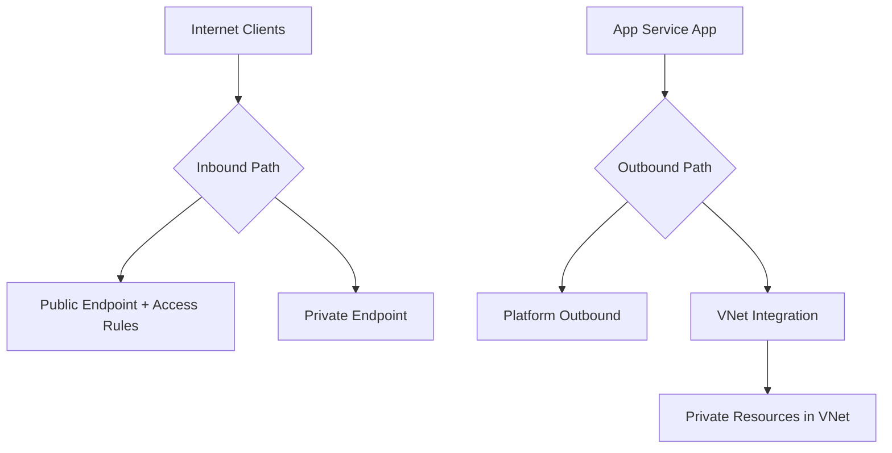
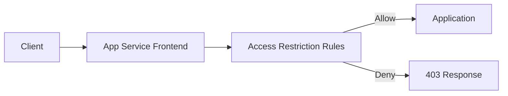
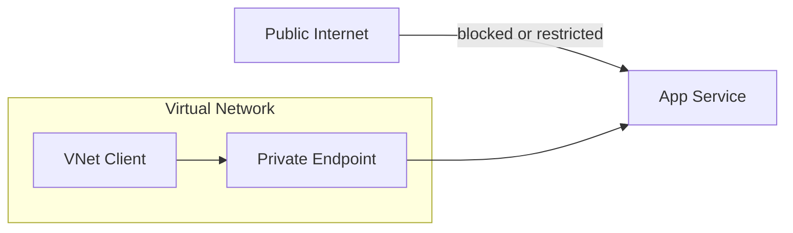
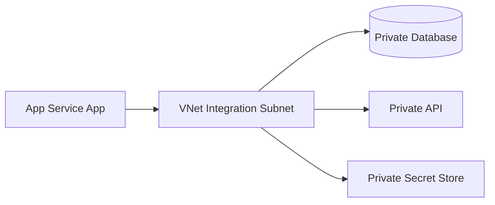
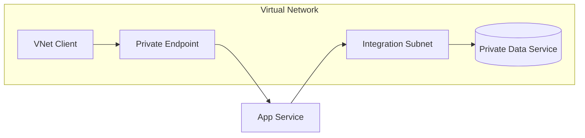
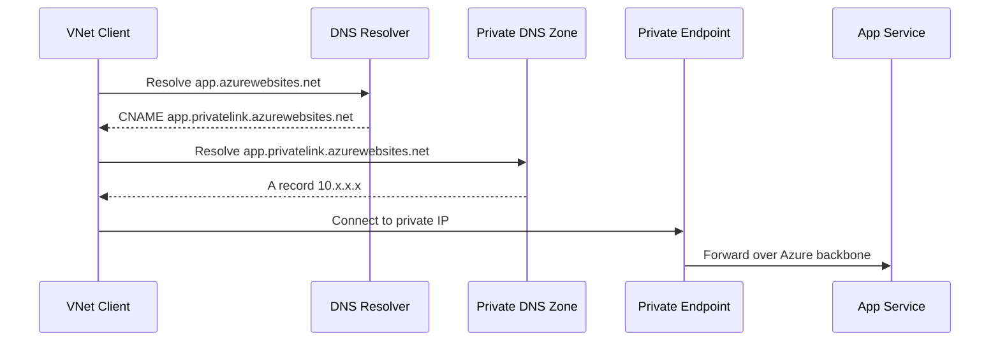

# Networking

Azure App Service networking controls define who can reach your application and how your application reaches downstream services. Correct networking design is fundamental for security, compliance, and predictable performance.

## Prerequisites

- Familiarity with virtual networks, subnets, DNS, and private IP ranges
- Understanding of ingress vs egress traffic
- Access to configure App Service networking features

## Main Content

### Networking model overview



### Inbound traffic controls

By default, an app has a public endpoint. You can tighten inbound access using:

- Access restrictions (IP, service tags, priority rules)
- Private endpoint (private ingress over Private Link)
- Authentication/authorization policy at the edge

#### Access restrictions

Access restrictions provide allow/deny controls evaluated before traffic reaches your app process.



Best practices:

- Use explicit allowlist rules
- Keep rule priorities documented
- Apply equivalent restrictions to SCM site where needed

!!! note
    Misconfigured access rules are a common cause of "app is up but unreachable" incidents.

#### Private endpoint for inbound isolation

A private endpoint assigns a private IP for app access within your network boundary.



Benefits:

- Reduces internet exposure
- Enables private-only ingress architectures
- Supports strict network segmentation requirements

### Outbound traffic controls

Outbound traffic covers calls from your app to databases, APIs, and service dependencies.

#### VNet integration for outbound connectivity

VNet integration lets app outbound traffic reach private resources.



Key requirements:

- Dedicated integration subnet
- Proper subnet delegation (`Microsoft.Web/serverFarms`)
- Sufficient subnet address space (minimum sizing guidance applies)

!!! warning "Ingress vs egress"
    VNet integration controls outbound connectivity. It does not make your app privately reachable from clients. Use private endpoint for private inbound access.

### Combining inbound and outbound private patterns

High-security architecture commonly combines:

- Private endpoint for inbound
- VNet integration for outbound
- Private DNS zones for name resolution
- Strict NSG and route governance



### DNS behavior with private endpoint

Private endpoint access typically relies on a CNAME chain and private DNS zone mapping.



### Outbound SNAT and connection planning

Outbound connections consume SNAT ports. High churn or poor connection reuse can cause intermittent failures.

Common symptoms:

- Sporadic outbound timeout spikes
- Dependency connection resets under burst load
- Recovery after traffic drop

Mitigations:

- Reuse outbound connections
- Use connection pooling in dependency clients
- Consider NAT Gateway with VNet integration for larger outbound capacity

### Hybrid connectivity

To reach on-premises or cross-network systems:

- VNet integration + VPN/ExpressRoute for full network extension
- Hybrid connections for simpler TCP scenarios

Choose based on latency, throughput, protocol support, and operational ownership.

### CLI examples for networking configuration

Show current network-related app configuration:

```bash
az webapp show \
    --resource-group "$RG" \
    --name "$APP_NAME" \
    --query "{defaultHostName:defaultHostName, httpsOnly:httpsOnly, hostNames:hostNames}" \
    --output json
```

Add access restriction rule:

```bash
az webapp config access-restriction add \
    --resource-group "$RG" \
    --name "$APP_NAME" \
    --rule-name "allow-corp" \
    --action Allow \
    --ip-address "203.0.113.0/24" \
    --priority 100
```

List access restriction rules:

```bash
az webapp config access-restriction show \
    --resource-group "$RG" \
    --name "$APP_NAME" \
    --output table
```

Create private endpoint (conceptual example):

```bash
az network private-endpoint create \
    --resource-group "$RG" \
    --name "$PE_NAME" \
    --vnet-name "$VNET_NAME" \
    --subnet "$SUBNET_NAME" \
    --private-connection-resource-id "$APP_RESOURCE_ID" \
    --group-id "sites" \
    --connection-name "$PE_CONNECTION_NAME"
```

Example output snippet (PII masked):

```json
{
  "customDnsConfigs": [
    {
      "fqdn": "app-<masked>.privatelink.azurewebsites.net",
      "ipAddresses": [
        "10.0.2.4"
      ]
    }
  ],
  "id": "/subscriptions/<subscription-id>/resourceGroups/rg-<masked>/providers/Microsoft.Network/privateEndpoints/pe-<masked>"
}
```

### Troubleshooting matrix

| Symptom | Likely Cause | Validation Path |
|---|---|---|
| Public clients blocked unexpectedly | Restriction rule precedence | Review priorities/actions |
| Private endpoint unreachable | DNS zone/link issue | Verify CNAME/A resolution in VNet |
| App cannot reach private DB | Missing VNet integration route | Validate subnet/delegation/NSG |
| Intermittent outbound timeouts | SNAT exhaustion | Inspect connection reuse + outbound metrics |

## Advanced Topics

### Zero-trust ingress pattern

Use private endpoint + strict access restrictions + identity-aware upstream gateway for layered controls.

### Route-all outbound strategy

In some designs, all outbound flows through controlled network paths for inspection and policy enforcement. Validate latency impact before broad rollout.

### Multi-environment DNS governance

Separate private DNS zones by environment when strict isolation is required, and document naming conventions to prevent resolution drift.

### Networking readiness checklist

- Inbound path explicitly documented (public/private)
- Access restrictions tested from allowed/denied sources
- Private DNS resolution validated in each subnet
- Outbound dependency inventory mapped to route path
- Alerting enabled for connectivity failures

## Language-Specific Details

For language-specific implementation details, see:
- [Node.js Guide](https://yeongseon.github.io/azure-appservice-nodejs-guide/)
- [Python Guide](https://yeongseon.github.io/azure-appservice-python-guide/)
- [Java Guide](https://yeongseon.github.io/azure-appservice-java-guide/)
- [.NET Guide](https://yeongseon.github.io/azure-appservice-dotnet-guide/)

## See Also

- [How App Service Works](./how-app-service-works.md)
- [Request Lifecycle](./request-lifecycle.md)
- [Scaling](./scaling.md)
- [Resource Relationships](./resource-relationships.md)
- [App Service networking features (Microsoft Learn)](https://learn.microsoft.com/azure/app-service/networking-features)
- [VNet integration overview (Microsoft Learn)](https://learn.microsoft.com/azure/app-service/overview-vnet-integration)
