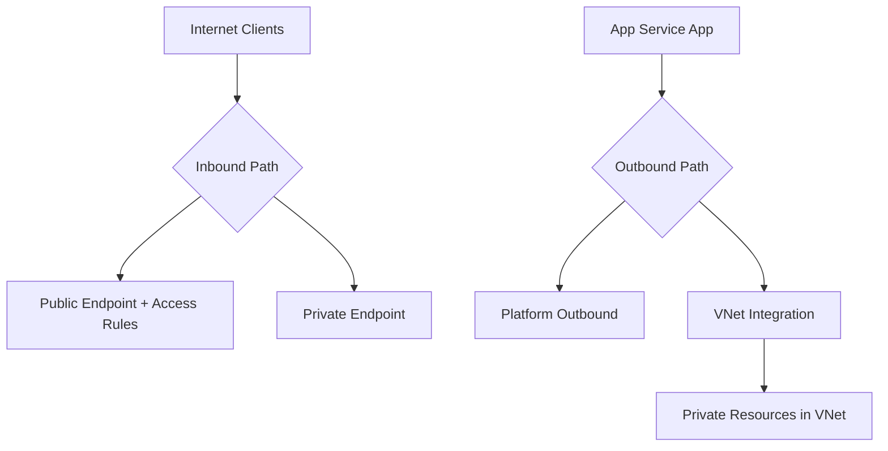
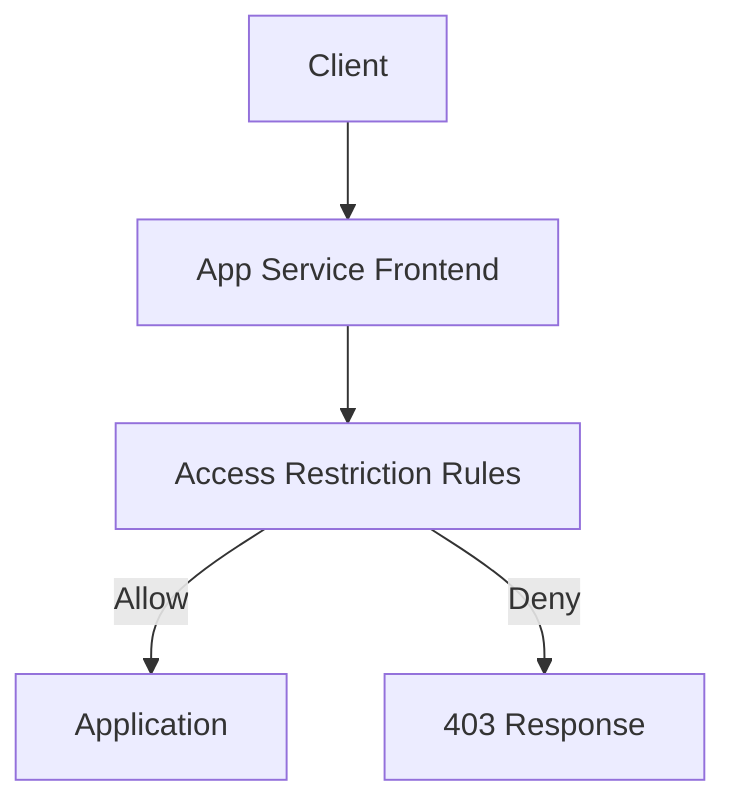
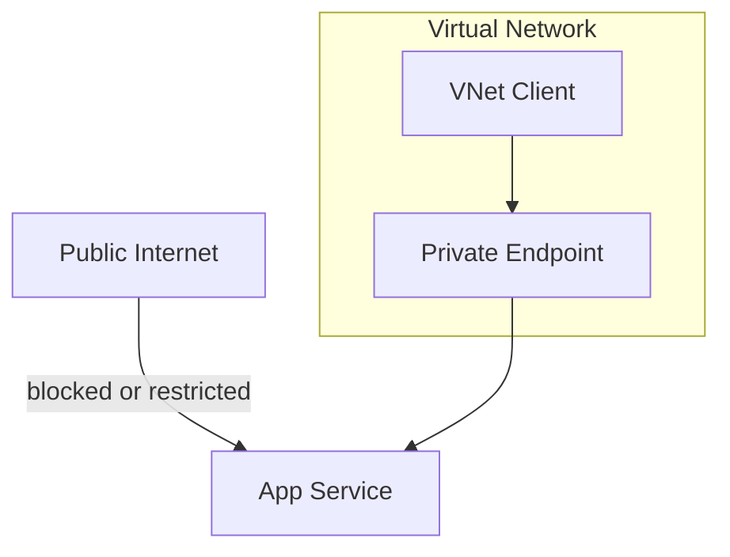
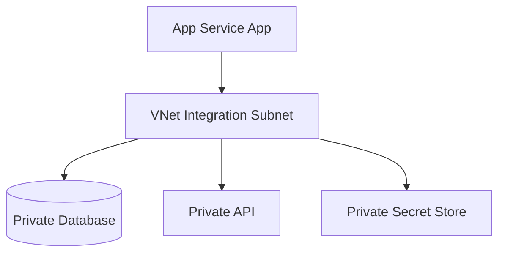
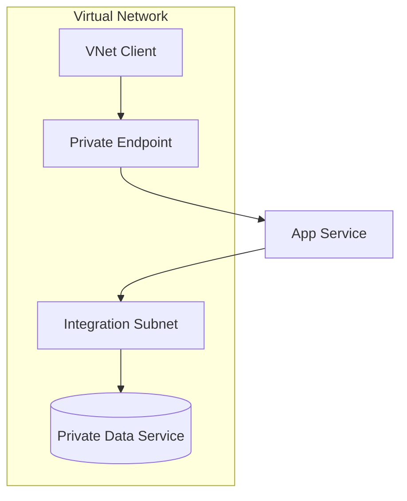
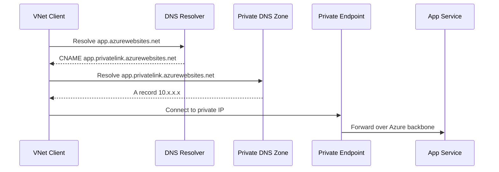

# Networking

Azure App Service networking controls define who can reach your application and how your application reaches downstream services. Correct networking design is fundamental for security, compliance, and predictable performance.

## Prerequisites

- Familiarity with virtual networks, subnets, DNS, and private IP ranges
- Understanding of ingress vs egress traffic
- Access to configure App Service networking features

## Main Content

### Networking model overview

<!-- diagram-id: networking-model-overview -->

```mermaid
graph TD
    Internet[Internet Clients] --> Ingress{Inbound Path}
    Ingress --> Public[Public Endpoint + Access Rules]
    Ingress --> Private[Private Endpoint]

    App[App Service App] --> Egress{Outbound Path}
    Egress --> Default[Platform Outbound]
    Egress --> VNet[VNet Integration]
    VNet --> PrivateResources[Private Resources in VNet]
```

#### Portal view: Networking blade

![App Service Networking blade for a Web App split into Inbound traffic configuration and Outbound traffic configuration cards. The Inbound card shows Public network access "Enabled (unrestricted)", Access restriction status "Not configured", Private endpoints "0", and FTP basic auth status. The Outbound card shows Virtual network integration "Not configured", Outbound addresses (a comma-separated list of platform-assigned IPs), and links to configure VNet integration and hybrid connections. A central panel labels the rows as inbound and outbound configuration columns.](../assets/platform/networking/01-networking-blade.png)

The Networking blade separates App Service networking into the two planes operators actually manage: ingress and egress. On the inbound side, `Public network access`, `Access restriction status`, and `Private endpoints` tell you whether requests arrive over an open public edge, rule-filtered access path, or Private Link. On the outbound side, `Virtual network integration` and the listed `Outbound addresses` show how the app reaches downstream resources, which is the core distinction behind VNet integration versus private inbound publishing.

### Inbound traffic controls

By default, an app has a public endpoint. You can tighten inbound access using:

- Access restrictions (IP, service tags, priority rules)
- Private endpoint (private ingress over Private Link)
- Authentication/authorization policy at the edge

#### Access restrictions

Access restrictions provide allow/deny controls evaluated before traffic reaches your app process.

<!-- diagram-id: access-restrictions-flow -->

```mermaid
graph TD
    Client[Client] --> FE[App Service Frontend]
    FE --> Rules[Access Restriction Rules]
    Rules -->|Allow| App[Application]
    Rules -->|Deny| Reject[403 Response]
```

Best practices:

- Use explicit allowlist rules
- Keep rule priorities documented
- Apply equivalent restrictions to SCM site where needed

!!! note
    Misconfigured access rules are a common cause of "app is up but unreachable" incidents.

#### Private endpoint for inbound isolation

A private endpoint assigns a private IP for app access within your network boundary.

<!-- diagram-id: private-endpoint-inbound -->

```mermaid
graph TD
    Internet[Public Internet] -- blocked or restricted --> App[App Service]
    subgraph VNet[Virtual Network]
        Client[VNet Client] --> PE[Private Endpoint]
    end
    PE --> App
```

Benefits:

- Reduces internet exposure
- Enables private-only ingress architectures
- Supports strict network segmentation requirements

### Outbound traffic controls

Outbound traffic covers calls from your app to databases, APIs, and service dependencies.

#### VNet integration for outbound connectivity

VNet integration lets app outbound traffic reach private resources.

<!-- diagram-id: vnet-integration-outbound -->

```mermaid
graph TD
    App[App Service App] --> Integration[VNet Integration Subnet]
    Integration --> Database[(Private Database)]
    Integration --> Api[Private API]
    Integration --> Vault[Private Secret Store]
```

Key requirements:

- Dedicated integration subnet
- Proper subnet delegation (`Microsoft.Web/serverFarms`)
- Sufficient subnet address space (minimum sizing guidance applies)

!!! warning "Ingress vs egress"
    VNet integration controls outbound connectivity. It does not make your app privately reachable from clients. Use private endpoint for private inbound access.

### Combining inbound and outbound private patterns

High-security architecture commonly combines:

- Private endpoint for inbound
- VNet integration for outbound
- Private DNS zones for name resolution
- Strict NSG and route governance

<!-- diagram-id: private-inbound-outbound-pattern -->

```mermaid
graph TD
    subgraph VNet[Virtual Network]
        Client[VNet Client] --> PE[Private Endpoint]
        Subnet[Integration Subnet] --> DB[(Private Data Service)]
    end
    PE --> App[App Service]
    App --> Subnet
```

### DNS behavior with private endpoint

Private endpoint access typically relies on a CNAME chain and private DNS zone mapping.

<!-- diagram-id: private-endpoint-dns-resolution -->

```mermaid
sequenceDiagram
    participant Client as VNet Client
    participant DNS as DNS Resolver
    participant Zone as Private DNS Zone
    participant PE as Private Endpoint
    participant App as App Service

    Client->>DNS: Resolve app.azurewebsites.net
    DNS-->>Client: CNAME app.privatelink.azurewebsites.net
    Client->>Zone: Resolve app.privatelink.azurewebsites.net
    Zone-->>Client: A record 10.x.x.x
    Client->>PE: Connect to private IP
    PE->>App: Forward over Azure backbone
```

### Outbound SNAT and connection planning

Outbound connections consume SNAT ports. High churn or poor connection reuse can cause intermittent failures.

Common symptoms:

- Sporadic outbound timeout spikes
- Dependency connection resets under burst load
- Recovery after traffic drop

Mitigations:

- Reuse outbound connections
- Use connection pooling in dependency clients
- Consider NAT Gateway with VNet integration for larger outbound capacity

### Hybrid connectivity

To reach on-premises or cross-network systems:

- VNet integration + VPN/ExpressRoute for full network extension
- Hybrid connections for simpler TCP scenarios

Choose based on latency, throughput, protocol support, and operational ownership.

### CLI examples for networking configuration

Show current network-related app configuration:

```bash
az webapp show \
    --resource-group "$RG" \
    --name "$APP_NAME" \
    --query "{defaultHostName:defaultHostName, httpsOnly:httpsOnly, hostNames:hostNames}" \
    --output json
```

Add access restriction rule:

```bash
az webapp config access-restriction add \
    --resource-group "$RG" \
    --name "$APP_NAME" \
    --rule-name "allow-corp" \
    --action Allow \
    --ip-address "203.0.113.0/24" \
    --priority 100
```

List access restriction rules:

```bash
az webapp config access-restriction show \
    --resource-group "$RG" \
    --name "$APP_NAME" \
    --output table
```

Create private endpoint (conceptual example):

```bash
az network private-endpoint create \
    --resource-group "$RG" \
    --name "$PE_NAME" \
    --vnet-name "$VNET_NAME" \
    --subnet "$SUBNET_NAME" \
    --private-connection-resource-id "$APP_RESOURCE_ID" \
    --group-id "sites" \
    --connection-name "$PE_CONNECTION_NAME"
```

Example output snippet (PII masked):

<!-- Verified: real az CLI output from koreacentral, 2026-05-01 -->
```json
{
  "customDnsConfigs": [
    {
      "fqdn": "app-<masked>.azurewebsites.net",
      "ipAddresses": [
        "192.0.2.4"
      ]
    },
    {
      "fqdn": "app-<masked>.scm.azurewebsites.net",
      "ipAddresses": [
        "192.0.2.4"
      ]
    }
  ],
  "id": "/subscriptions/<subscription-id>/resourceGroups/rg-<masked>/providers/Microsoft.Network/privateEndpoints/pe-<masked>",
  "name": "pe-<masked>",
  "provisioningState": "Succeeded"
}
```

### IP address behavior and lifecycle

Understanding when and why IP addresses change is critical for firewall allowlists, DNS records, and downstream dependency configurations.

#### Outbound IP addresses

App Service assigns a set of outbound IPs shared within the scale unit. Two fields are relevant:

| Field | Description | When to use |
|---|---|---|
| `outboundIpAddresses` | Currently active outbound IPs | Current state only — not safe for allowlists |
| `possibleOutboundIpAddresses` | All IPs the app could ever use on this plan | **Always use this for firewall allowlists** |

Query both fields:

```bash
az webapp show \
    --resource-group "$RG" \
    --name "$APP_NAME" \
    --query "{active:outboundIpAddresses, possible:possibleOutboundIpAddresses}" \
    --output json
```

Example output (PII masked):

| Output field | Meaning | Operational use |
|---|---|---|
| `active` | Currently in-use outbound IPs on this plan | Diagnostic snapshot only — do **not** allowlist |
| `possible` | Full candidate set the plan could rotate through | Union of active+possible is the correct allowlist |

<!-- Verified: real az CLI output from koreacentral, 2026-05-01; IP values redacted 2026-07-04 -->
```json
{
  "active": "<13 outbound IPv4 addresses; run the command above to retrieve current values>",
  "possible": "<31 additional outbound IPv4 addresses; the union of active + possible is the full allowlist candidate set>"
}
```

!!! warning "Outbound IPs change under these conditions"
    - Scale up or scale down (App Service Plan SKU change)
    - App Service Plan migration to a different scale unit or region
    - Enabling or disabling VNet Integration
    - Platform-side infrastructure updates

    Always allowlist all addresses from `possibleOutboundIpAddresses`, not just the currently active set.

#### Outbound IP behavior with VNet Integration

When VNet Integration is enabled with `WEBSITE_VNET_ROUTE_ALL=1` (Route All), outbound traffic is **routed** into the delegated integration subnet, where it becomes subject to the subnet's NSGs and route tables. Routing alone does **not** change your app's source IP. Per Microsoft Learn, when outbound internet traffic routing is enabled, the source address of outbound traffic is still one of the IPs listed in the app's properties (`possibleOutboundIpAddresses`) — unless a service that performs SNAT sits in the path:

| Egress configuration | Effective source IP seen by the destination |
|---|---|
| VNet Integration + Route All, no NAT Gateway or firewall | Still one of the app's platform outbound IPs (`possibleOutboundIpAddresses`) |
| VNet Integration + NAT Gateway on the integration subnet | The NAT Gateway's public IP |
| VNet Integration + route table (UDR) forcing traffic through a firewall/NVA | The firewall/NVA outbound IP |

!!! warning "Route All does not, by itself, give you a dedicated egress IP"
    A common misconception is that enabling Route All makes traffic exit from a single "subnet NAT IP". It does not. The subnet has no NAT IP unless you explicitly attach a [NAT Gateway](https://learn.microsoft.com/en-us/azure/app-service/networking/nat-gateway-integration). Without a NAT Gateway or firewall, the destination still sees one of the app's `possibleOutboundIpAddresses`.

##### Portal view: NAT Gateway configuration

![Azure portal Overview blade for a NAT gateway named natgw-appservice-demo. The Essentials panel shows Resource group rg-natgw-capture, Location Korea Central, Subscription Visual Studio Enterprise Subscription, Subscription ID 00000000-0000-0000-0000-000000000000, Virtual network vnet-natgw-demo, Subnets 1, SKU Standard, Public IP addresses 1, and Public IP prefixes 0. Two configuration cards read "Configure outbound IP addresses" and "Configure networking", the latter describing which subnets of a virtual network should use this NAT gateway.](../assets/platform/networking/02-nat-gateway-config.png)

A NAT Gateway is the managed Azure egress option for giving a VNet-integrated app a deterministic outbound IP (a firewall/NVA reached via a UDR — the third row of the table above — is another). The **Public IP addresses** count in the Essentials panel is the pool that outbound traffic is SNATed through — those addresses (not `possibleOutboundIpAddresses`) are what a downstream firewall sees once the integration **Subnets** are associated to the gateway via **Configure networking**. Confirm both the associated subnet and the attached public IP address (or addresses) here before allowlisting the NAT Gateway's IP downstream.

```bash
# Check current VNet integration state
az webapp vnet-integration list \
    --resource-group "$RG" \
    --name "$APP_NAME" \
    --output json
```

Example output:

<!-- Verified: real az CLI output from koreacentral, 2026-05-01 -->
```json
[
  {
    "name": "snet-integration",
    "vnetResourceId": "/subscriptions/<subscription-id>/resourceGroups/rg-<masked>/providers/Microsoft.Network/virtualNetworks/vnet-net-test/subnets/snet-integration",
    "isSwift": null
  }
]
```

Because Route All by itself does not change the source IP, downstream firewalls that already allowlist the app's `possibleOutboundIpAddresses` keep working after you enable integration. You only need to change an allowlist when you add a **NAT Gateway** or route through a **firewall** — in that case, allowlist that service's outbound IP instead.

!!! tip "Reaching a firewalled Azure Storage account"
    Route All plus a Storage firewall is a frequent failure mode: per Microsoft Learn, connectivity to global Azure Storage can fail for VNet-integrated apps when Route All is enabled and the app does **not** use service endpoints, private endpoints, or UDRs — traffic falls back to the default internet route, which the Storage firewall then blocks. Prefer a **private endpoint** (or a service endpoint on the integration subnet) over IP allowlisting. See [App Service to Azure Storage connectivity](storage-connectivity.md) for the full decision model.

#### Inbound IP addresses and Private Endpoint

By default, the app's inbound IP is shared and public. When a Private Endpoint is created, the app is assigned a **private IP from the endpoint subnet**. The public endpoint continues to exist but can be blocked via access restrictions.

Query the inbound IP:

```bash
az webapp show \
    --resource-group "$RG" \
    --name "$APP_NAME" \
    --query "inboundIpAddress" \
    --output tsv
```

Query Private Endpoint assigned IP:

```bash
az network private-endpoint show \
    --resource-group "$RG" \
    --name "pe-$APP_NAME" \
    --query "customDnsConfigs[0].ipAddresses" \
    --output json
```

Example output:

<!-- Verified: real az CLI output from koreacentral, 2026-05-01 -->
```json
[
  "192.0.2.4"
]
```

!!! warning "Private Endpoint does not remove the public IP"
    Creating a Private Endpoint assigns a private IP but does **not** automatically disable the public endpoint. To fully restrict inbound access to private clients only:

    1. Create the Private Endpoint.
    2. Add an access restriction to deny all public traffic (set a `Deny All` rule with lowest priority).
    3. Validate resolution from inside the VNet returns the private IP.

    Skipping step 2 leaves the app reachable from the public internet even with a Private Endpoint active.

### Troubleshooting matrix

| Symptom | Likely Cause | Validation Path |
|---|---|---|
| Public clients blocked unexpectedly | Restriction rule precedence | Review priorities/actions |
| Private endpoint unreachable | DNS zone/link issue | Verify CNAME/A resolution in VNet |
| App cannot reach private DB | Missing VNet integration route | Validate subnet/delegation/NSG |
| Intermittent outbound timeouts | SNAT exhaustion | Inspect connection reuse + outbound metrics |

## Advanced Topics

### Zero-trust ingress pattern

Use private endpoint + strict access restrictions + identity-aware upstream gateway for layered controls.

### Route-all outbound strategy

In some designs, all outbound flows through controlled network paths for inspection and policy enforcement. Validate latency impact before broad rollout.

### Multi-environment DNS governance

Separate private DNS zones by environment when strict isolation is required, and document naming conventions to prevent resolution drift.

### Networking readiness checklist

- Inbound path explicitly documented (public/private)
- Access restrictions tested from allowed/denied sources
- Private DNS resolution validated in each subnet
- Outbound dependency inventory mapped to route path
- Alerting enabled for connectivity failures

## Language-Specific Details

For language-specific implementation details, see:
- [Node.js Guide](../language-guides/nodejs/index.md)
- [Python Guide](../language-guides/python/index.md)
- [Java Guide](../language-guides/java/index.md)
- [.NET Guide](../language-guides/dotnet/index.md)

## See Also

- [How App Service Works](./architecture/index.md)
- [Request Lifecycle](./request-lifecycle.md)
- [Scaling](./scaling.md)
- [Resource Relationships](./resource-relationships.md)
- [App Service to Azure Storage connectivity](./storage-connectivity.md)

## Sources

- [App Service networking features (Microsoft Learn)](https://learn.microsoft.com/en-us/azure/app-service/networking-features)
- [VNet integration overview (Microsoft Learn)](https://learn.microsoft.com/en-us/azure/app-service/overview-vnet-integration)
- [NAT gateway integration (Microsoft Learn)](https://learn.microsoft.com/en-us/azure/app-service/networking/nat-gateway-integration)
