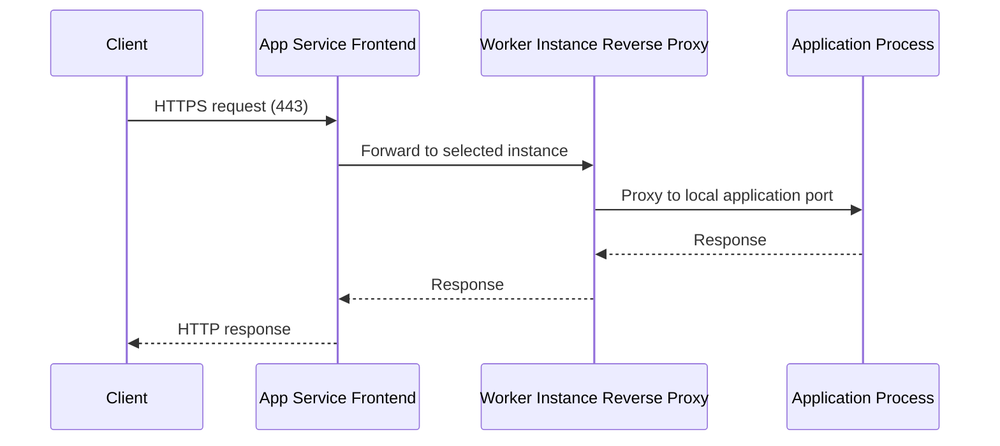
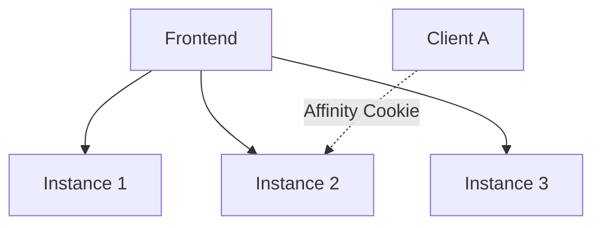

# Request Lifecycle

Every request to Azure App Service travels through multiple platform layers before reaching your application process. Understanding this lifecycle is essential for troubleshooting latency, timeout behavior, routing issues, and scale-related anomalies.

## Prerequisites

- Familiarity with HTTP(S), DNS, and reverse proxies
- Basic understanding of load balancing and health probes
- Access to App Service logs and metrics

## Main Content

### End-to-end request path

<!-- diagram-id: request-path-sequence -->


### Stage 1: DNS and global entry

Requests begin with DNS resolution of the app hostname. App Service supports platform hostnames and custom domains. After DNS resolution:

- TLS handshake occurs
- SNI and host header route to the correct app
- Global edge and frontend infrastructure direct traffic to the right stamp/region

### Stage 2: Frontend routing

Frontend components perform:

- TLS termination
- Hostname validation
- Access restriction evaluation
- Route selection to a healthy worker instance

If no healthy backend is available, requests can fail at the frontend before your app code executes.

### Stage 3: Worker reverse proxy handoff

On the worker, a local reverse proxy passes traffic to your application process listening on the platform-assigned port.

!!! note "Port contract"
    Your application must bind to the port provided by the platform environment. Binding to a fixed local port can cause startup success but request failures.

### Stage 4: Application execution

Your app handles routing, business logic, and dependency calls, then returns response status/body/headers.

Performance at this stage depends on:

- Application CPU and memory consumption
- Dependency latency (database, API, cache)
- Thread/process/event-loop saturation characteristics
- Connection pooling and outbound networking configuration

### Response return path

Responses travel back through worker and frontend layers to the client. Response headers may be modified by platform policies such as compression, security headers, and reverse-proxy metadata injection.

### Timeout and connection behaviors

Platform-level timeout behavior is critical for request design.

| Behavior | Typical Impact |
|---|---|
| Frontend request timeout | Long-running requests may return gateway timeout |
| Idle connection timeout | Idle sockets can be closed by infrastructure |
| Slow dependency path | Queue buildup and elevated tail latency |

Design guidance:

- Keep interactive requests short
- Offload long work to background pipelines
- Return `202 Accepted` for asynchronous workflows

!!! warning
    Holding HTTP requests open for background processing increases timeout risk and reduces available concurrency.

### Instance selection and session affinity

By default, frontend routing distributes traffic across healthy instances. Optional session affinity can pin a client to a specific instance using cookies.

<!-- diagram-id: instance-selection-affinity -->


Affinity trade-offs:

- Can simplify legacy in-memory session use
- Can produce uneven load distribution
- Reduces resilience if an instance fails

Preferred pattern: externalize session/state to a shared store.

### Health checks and request eligibility

Health checks influence whether an instance receives traffic.

- Healthy instance: included in routing pool
- Unhealthy instance: removed from routing pool
- Recovering instance: reintroduced after passing probes

Probe design should be lightweight and representative of app readiness.

### Deployment slots and lifecycle impact

With deployment slots:

1. New version warms in non-production slot
2. Health checks validate startup
3. Slot swap redirects production hostname

This reduces user-facing cold starts and failed startup exposure.

### Observability along the lifecycle

Correlate these signals for end-to-end insight:

- Request logs and status code distributions
- Frontend-generated diagnostics
- Instance restart events
- Dependency timing and failure rates
- Application-level correlation IDs

### CLI examples for lifecycle inspection

Enable and inspect HTTP logs:

```bash
az webapp log config \
    --resource-group "$RG" \
    --name "$APP_NAME" \
    --application-logging filesystem \
    --detailed-error-messages true \
    --failed-request-tracing true \
    --web-server-logging filesystem
```

Stream logs in real time:

```bash
az webapp log tail \
    --resource-group "$RG" \
    --name "$APP_NAME"
```

Inspect access restriction settings that affect frontend admission:

```bash
az webapp config access-restriction show \
    --resource-group "$RG" \
    --name "$APP_NAME" \
    --output json
```

Example output snippet (PII masked):

```json
{
  "ipSecurityRestrictions": [
    {
      "action": "Allow",
      "ipAddress": "203.0.113.0/24",
      "name": "corp-office",
      "priority": 100
    }
  ],
  "scmIpSecurityRestrictionsUseMain": true
}
```

### Common lifecycle failure patterns

| Symptom | Likely Layer | First Checks |
|---|---|---|
| 403 before app logs | Frontend restrictions | Access restrictions, auth settings |
| 502/503 bursts | Worker/app startup | Restarts, health probe failures |
| 504 responses | Long request path | Dependency latency, request design |
| Intermittent timeout | Outbound saturation | SNAT, connection pool settings |

## Advanced Topics

### Request queueing and tail latency

Median latency can look healthy while p95/p99 degrades under load. Track queue indicators and tail percentiles, not only averages.

### WebSockets and long-lived connections

If your app uses long-lived connections, validate platform support configuration, idle timeout behavior, and scale-out connection distribution.

### Graceful shutdown during recycles

When instances recycle, in-flight requests should complete quickly, and background workers should checkpoint progress externally.

### Incident triage workflow

1. Confirm frontend admission (DNS/TLS/restrictions)
2. Confirm worker health and restart events
3. Confirm app process readiness
4. Confirm dependency latency and outbound connectivity

## Language-Specific Details

For language-specific implementation details, see:
- [Node.js Guide](../language-guides/nodejs/index.md)
- [Python Guide](../language-guides/python/index.md)
- [Java Guide](../language-guides/java/index.md)
- [.NET Guide](../language-guides/dotnet/index.md)

## See Also

- [How App Service Works](./architecture/index.md)
- [Scaling](./scaling.md)
- [Networking](./networking.md)
- [Deployment Slots in App Service (Microsoft Learn)](https://learn.microsoft.com/azure/app-service/deploy-staging-slots)
- [Inbound and outbound IPs (Microsoft Learn)](https://learn.microsoft.com/azure/app-service/overview-inbound-outbound-ips)

## Sources

- [Deployment Slots in App Service (Microsoft Learn)](https://learn.microsoft.com/azure/app-service/deploy-staging-slots)
- [Inbound and outbound IPs (Microsoft Learn)](https://learn.microsoft.com/azure/app-service/overview-inbound-outbound-ips)
