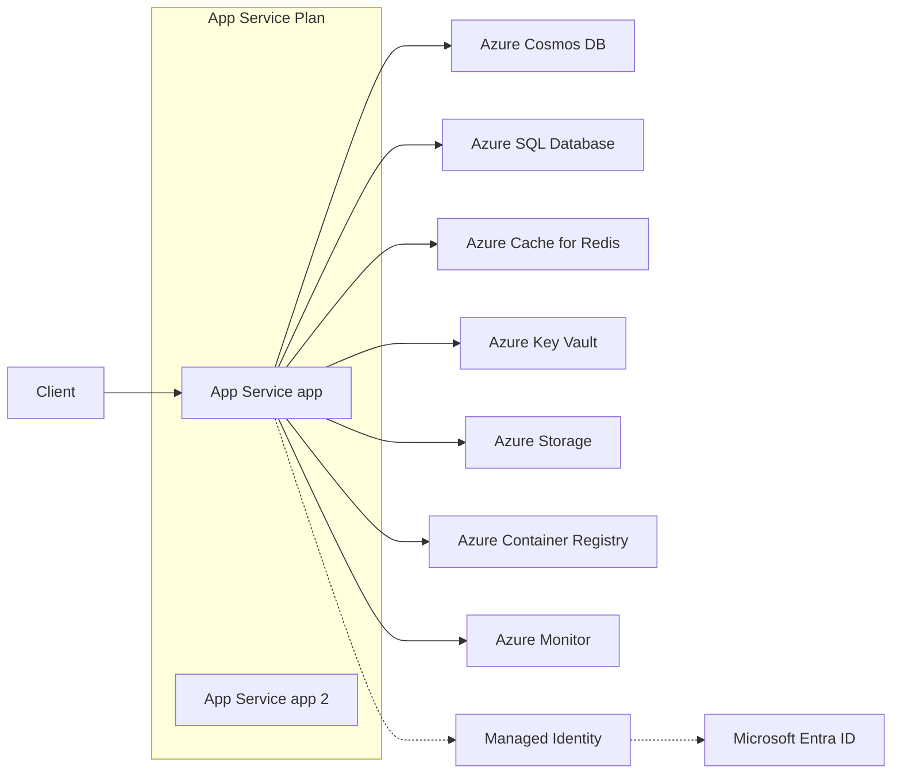
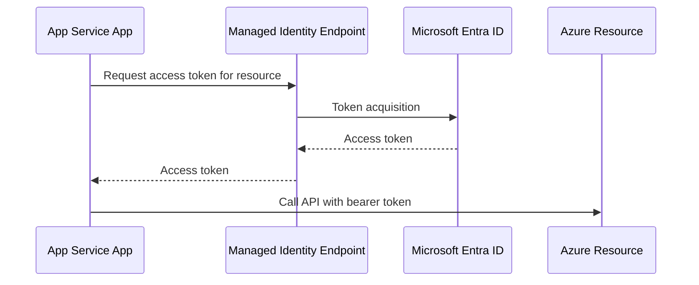
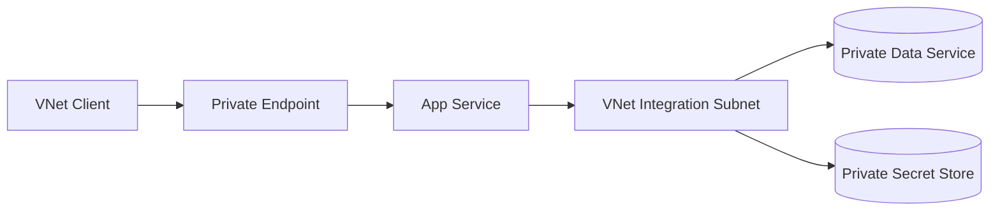

# Resource Relationships

Azure App Service is usually one component in a broader Azure architecture that includes identity, networking, secrets, data, storage, and monitoring resources. This document maps the most common platform relationships and explains why each relationship exists.

## Prerequisites

- Familiarity with Azure resource hierarchy (subscription, resource group, resource)
- Basic understanding of Microsoft Entra ID and managed identities
- Working knowledge of RBAC scopes and least-privilege design

## Main Content

### Core relationship map



Solid arrows represent runtime traffic or data flow. Dashed arrows represent identity and token relationships.

### Plan-to-app relationship

An App Service Plan is the compute boundary that hosts one or more apps.

Implications:

- Co-hosted apps share compute resources
- Scaling at plan scope affects all apps in that plan
- Cost is primarily tied to plan SKU and instance count

### App-to-identity relationship

Managed identity allows the app to request tokens without storing credentials in code or config files.

Flow summary:

1. App requests token from managed identity endpoint
2. Platform obtains token from Microsoft Entra ID
3. App presents token to downstream Azure service

Benefits:

- Eliminates secret distribution for many service-to-service calls
- Simplifies credential rotation risk
- Supports least-privilege authorization through RBAC



### App-to-data relationships

Common data patterns:

- Relational data service for transactional workloads
- NoSQL data service for flexible schema and globally distributed needs
- Cache service for low-latency reads and session acceleration

Design considerations:

- Connection pooling and retry policy
- Regional placement for latency minimization
- Throughput tier alignment with app scale profile

### App-to-secrets relationship

Secret retrieval typically uses one of these paths:

- Application code requests secrets at runtime using identity
- Platform-level secret references resolve into app settings

Security guidance:

- Store no production secrets in source control
- Apply least-privilege secret access policies
- Audit and alert on secret access anomalies

### App-to-storage relationship

Storage relationships include:

- Blob/object access for unstructured assets
- File-share integration for shared file semantics
- Queue/table patterns for asynchronous and metadata workloads

Persistence rule:

- Treat app local disk as ephemeral
- Use external storage services for durable business data

### App-to-container-registry relationship

For container-hosted apps:

- App Service pulls container images from registry
- Registry authentication can use managed identity
- Deployment reliability depends on image availability and pull performance

### App-to-monitoring relationship

Monitoring resources capture:

- Request telemetry
- Dependency traces
- Platform and app logs
- Alert signals for SLO/SLA operations

Observability should be treated as a first-class dependency, not an afterthought.

### Network-scoped relationships

Resource relationships are often constrained by network boundaries:

- Private endpoint for inbound private app access
- VNet integration for outbound private dependency access
- Private DNS to ensure correct private name resolution



### RBAC and scope relationships

Authorization is evaluated at scope levels:

- Management group
- Subscription
- Resource group
- Resource

Recommended pattern:

- Assign app identity only the minimum roles needed
- Prefer resource-scope role assignments over broad scopes
- Review assignments regularly

### Lifecycle and dependency ordering

Infrastructure lifecycle should respect dependency order:

1. Network and identity foundations
2. Plan and app resources
3. Data/secrets dependencies and permissions
4. Deployment and post-deploy validation

The same ordering helps in teardown and incident recovery planning.

### CLI examples for relationship validation

Show managed identity state:

```bash
az webapp identity show \
    --resource-group "$RG" \
    --name "$APP_NAME" \
    --output json
```

Example output (PII masked):

```json
{
  "principalId": "xxxxxxxx-xxxx-xxxx-xxxx-xxxxxxxxxxxx",
  "tenantId": "<tenant-id>",
  "type": "SystemAssigned",
  "userAssignedIdentities": null
}
```

List role assignments for app principal:

```bash
az role assignment list \
    --assignee-object-id "$APP_PRINCIPAL_ID" \
    --all \
    --output table
```

Inspect app-to-plan linkage:

```bash
az webapp show \
    --resource-group "$RG" \
    --name "$APP_NAME" \
    --query "{serverFarmId:serverFarmId, id:id, state:state}" \
    --output json
```

### Bicep snippet for identity + app relationship

```bicep
param location string = resourceGroup().location
param planName string
param appName string

resource plan 'Microsoft.Web/serverfarms@2023-12-01' = {
  name: planName
  location: location
  sku: {
    name: 'S1'
    tier: 'Standard'
    capacity: 1
  }
  properties: {
    reserved: true
  }
}

resource app 'Microsoft.Web/sites@2023-12-01' = {
  name: appName
  location: location
  identity: {
    type: 'SystemAssigned'
  }
  properties: {
    serverFarmId: plan.id
    httpsOnly: true
  }
}
```

## Advanced Topics

### Dependency blast-radius mapping

Map each app dependency to failure impact classes:

- Tier 0: request-path critical
- Tier 1: degraded-mode possible
- Tier 2: non-critical operational

This helps prioritize resilience investment and incident response.

### Multi-app plan governance

When several apps share one plan:

- Define ownership boundaries
- Set shared SLO expectations
- Enforce release windows for high-risk changes

### Secret and identity rotation strategy

Even with managed identities, supporting services and admin credentials require rotation governance. Include periodic validation in runbooks.

### Compliance evidence collection

Collect evidence from:

- RBAC assignment exports
- Diagnostic settings
- Network topology and private endpoint records
- Policy compliance reports

## Language-Specific Details

For language-specific implementation details, see:
- [Node.js Guide](../language-guides/nodejs/index.md)
- [Python Guide](../language-guides/python/index.md)
- [Java Guide](../language-guides/java/index.md)
- [.NET Guide](../language-guides/dotnet/index.md)

## See Also

- [How App Service Works](./how-app-service-works.md)
- [Hosting Models](./hosting-models.md)
- [Networking](./networking.md)
- [Managed identity for App Service (Microsoft Learn)](https://learn.microsoft.com/azure/app-service/overview-managed-identity)
- [Azure RBAC overview (Microsoft Learn)](https://learn.microsoft.com/azure/role-based-access-control/overview)

## Sources

- [Managed identity for App Service (Microsoft Learn)](https://learn.microsoft.com/azure/app-service/overview-managed-identity)
- [Azure RBAC overview (Microsoft Learn)](https://learn.microsoft.com/azure/role-based-access-control/overview)
