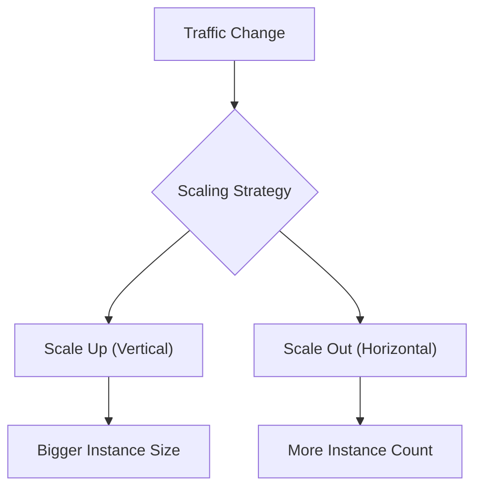
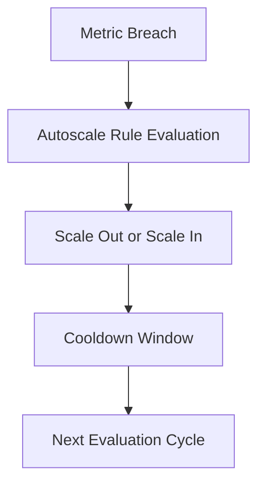
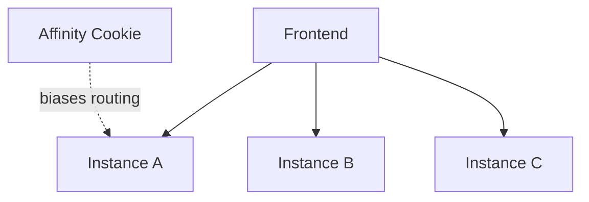

# Scaling

Scaling in Azure App Service is the process of adjusting compute capacity to meet traffic demand while balancing reliability and cost. Effective scaling combines platform features (scale up/out, autoscale) with application architecture (statelessness, externalized state, dependency resilience).

## Prerequisites

- App Service Plan with production-capable tier
- Azure Monitor access for metrics and autoscale rules
- Basic load profile data (expected baseline and peak)

## Main Content

### Core scaling dimensions

<!-- diagram-id: scaling-dimensions -->


### Scale up (vertical)

Scale up changes the size/SKU of compute instances in your plan.

Use when:

- Workload needs more memory per instance
- CPU saturation happens before scale-out helps
- Required features exist only in higher tiers

Trade-offs:

- Usually triggers recycle/restart
- Has finite ceiling per instance size
- Can increase cost rapidly if used alone for growth

### Scale out (horizontal)

Scale out adds more instances to distribute load.

Use when:

- Traffic volume is growing
- You need higher availability and fault tolerance
- Application is stateless and can run on multiple instances

Trade-offs:

- Requires shared external state (sessions/cache/locks)
- Dependency services must handle increased parallelism
- Operational complexity increases with instance count

### Stateless design requirement

Horizontal scale works best when instances are interchangeable.

Stateless patterns:

- Session data in distributed cache
- Durable workflows in queues/storage/database
- Shared file/content access via managed storage services

Anti-patterns:

- In-memory session-only state
- Local file writes used as source-of-truth
- Single-instance background jobs without leader control

### Autoscale fundamentals

Autoscale adjusts instance count based on metric rules and schedules.

Common rule signals:

- CPU percentage
- Memory percentage
- HTTP queue depth/request count
- Custom Azure Monitor metrics

<!-- diagram-id: autoscale-evaluation-loop -->


### Designing good autoscale rules

Rule quality matters more than rule quantity.

Best practices:

- Use separate thresholds for scale-out and scale-in
- Add cooldown periods to avoid oscillation
- Set a non-zero minimum instance floor for production
- Set a maximum instance cap for cost control
- Monitor if rules trigger before user-visible saturation

!!! note "Minimum/maximum envelope"
    Define minimum and maximum instance bounds first, then tune trigger thresholds. Bounds protect both uptime and budget.

### Session affinity considerations

Session affinity can keep users on the same instance, but this can undermine even load distribution.

<!-- diagram-id: session-affinity-scaling-impact -->


Prefer distributed state patterns over sticky routing when designing for scale and resilience.

### Plan-level scaling behavior

Because apps in the same plan share compute:

- One noisy app can impact others
- Autoscale affects plan capacity used by all co-hosted apps
- Capacity planning should consider aggregate workload patterns

For critical workloads, dedicate plans to reduce blast radius.

### Dependency-aware scaling

Scaling app instances increases outbound concurrency to dependencies.

Potential downstream bottlenecks:

- Database connection limits
- API rate limits
- Cache throughput caps
- Outbound port/SNAT constraints

Scale strategy should include dependency capacity tests, not only app-layer tests.

### CLI examples for scaling operations

Manual scale out to 3 instances:

```bash
az appservice plan update \
    --resource-group "$RG" \
    --name "$PLAN_NAME" \
    --number-of-workers 3
```

Scale up SKU to Premium:

```bash
az appservice plan update \
    --resource-group "$RG" \
    --name "$PLAN_NAME" \
    --sku "P1v3"
```

Create autoscale profile:

```bash
az monitor autoscale create \
    --resource-group "$RG" \
    --resource "$PLAN_NAME" \
    --resource-type "Microsoft.Web/serverfarms" \
    --name "$AUTOSCALE_NAME" \
    --min-count 2 \
    --max-count 10 \
    --count 2
```

Add CPU-based scale-out rule:

```bash
az monitor autoscale rule create \
    --resource-group "$RG" \
    --autoscale-name "$AUTOSCALE_NAME" \
    --condition "Percentage CPU > 70 avg 10m" \
    --scale out 1
```

Add CPU-based scale-in rule:

```bash
az monitor autoscale rule create \
    --resource-group "$RG" \
    --autoscale-name "$AUTOSCALE_NAME" \
    --condition "Percentage CPU < 35 avg 20m" \
    --scale in 1
```

Example autoscale output snippet (PII masked):

```json
{
  "enabled": true,
  "profiles": [
    {
      "capacity": {
        "default": "2",
        "maximum": "10",
        "minimum": "2"
      },
      "name": "default"
    }
  ],
  "targetResourceUri": "/subscriptions/<subscription-id>/resourceGroups/rg-<masked>/providers/Microsoft.Web/serverfarms/plan-<masked>"
}
```

### Scaling playbooks

#### Traffic spike playbook

1. Verify autoscale trigger latency
2. Increase minimum instance floor temporarily
3. Confirm dependency saturation is not primary bottleneck
4. Roll back temporary floor after event

#### Memory pressure playbook

1. Identify memory growth pattern (steady vs burst)
2. Scale up if per-instance memory headroom is insufficient
3. Scale out if concurrency pressure dominates
4. Investigate leaks and object retention behavior

#### Cost optimization playbook

1. Use schedule-based profiles for predictable low-traffic windows
2. Tune scale-in aggressively but safely
3. Review maximum instance cap monthly

## Advanced Topics

### Warm instance strategy

Keep at least one extra warmed instance during critical periods to absorb sudden bursts while autoscale catches up.

### Multi-region scaling patterns

Distribute traffic across regions for resiliency and lower client latency. Coordinate scale profiles with global routing health checks.

### Autoscale oscillation avoidance

Use wider hysteresis between scale-out and scale-in thresholds. Oscillation increases recycle frequency and can worsen tail latency.

### KPI baseline for scaling governance

- p95/p99 latency
- Error rate by status family
- CPU and memory utilization
- Queue depth
- Restart count per hour

## Language-Specific Details

For language-specific implementation details, see:
- [Node.js Guide](../language-guides/nodejs/index.md)
- [Python Guide](../language-guides/python/index.md)
- [Java Guide](../language-guides/java/index.md)
- [.NET Guide](../language-guides/dotnet/index.md)

## See Also

- [How App Service Works](./architecture/index.md)
- [Request Lifecycle](./request-lifecycle.md)
- [Networking](./networking.md)
- [Scale up App Service (Microsoft Learn)](https://learn.microsoft.com/azure/app-service/manage-scale-up)
- [Azure Monitor autoscale (Microsoft Learn)](https://learn.microsoft.com/azure/azure-monitor/autoscale/autoscale-get-started)

## Sources

- [Scale up App Service (Microsoft Learn)](https://learn.microsoft.com/azure/app-service/manage-scale-up)
- [Azure Monitor autoscale (Microsoft Learn)](https://learn.microsoft.com/azure/azure-monitor/autoscale/autoscale-get-started)
