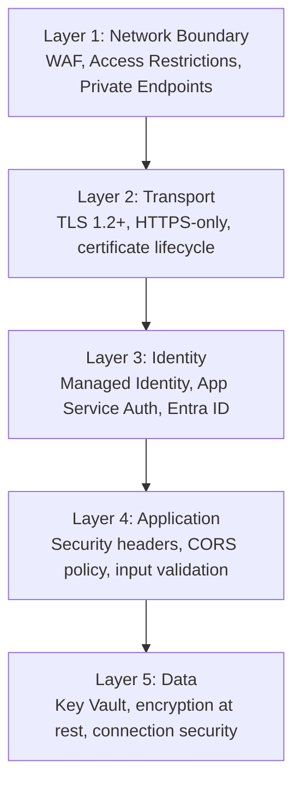
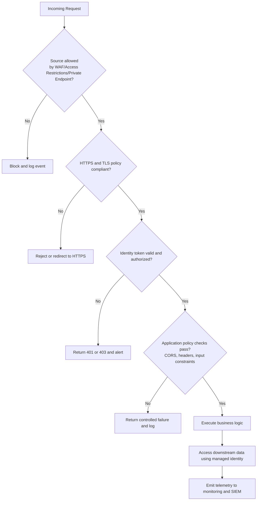
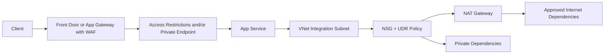
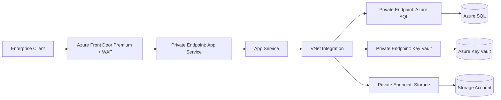
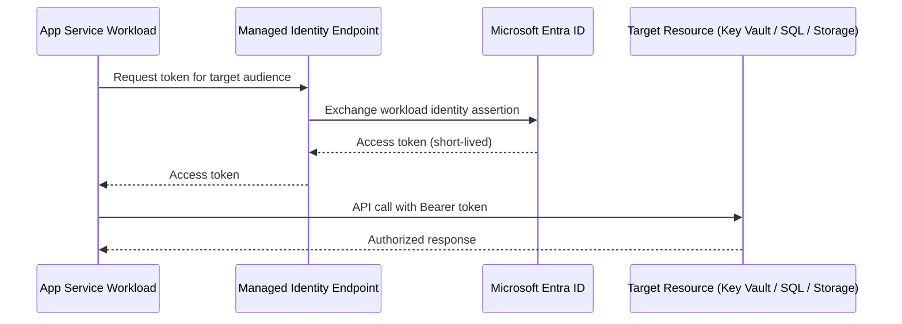
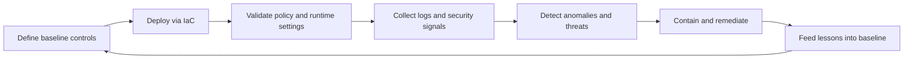

---
content_sources:
  diagrams:
    - id: security-layer-model
      type: flowchart
      source: mslearn-adapted
      mslearn_url: https://learn.microsoft.com/en-us/azure/app-service/overview-security
      description: "Shows the layered security controls that App Service guidance combines for defense in depth."
    - id: zero-trust-inbound-decision
      type: flowchart
      source: mslearn-adapted
      mslearn_url: https://learn.microsoft.com/en-us/azure/app-service/overview-security
      description: "Shows a zero-trust style decision sequence from network admission through identity, app policy, and telemetry."
    - id: inbound-outbound-security-controls
      type: flowchart
      source: mslearn-adapted
      mslearn_url: https://learn.microsoft.com/en-us/azure/app-service/networking-features
      description: "Shows inbound protection and outbound private routing controls around an App Service app."
    - id: private-app-service-topology
      type: flowchart
      source: mslearn-adapted
      mslearn_url: https://learn.microsoft.com/en-us/azure/app-service/networking-features
      description: "Shows a private App Service topology using private endpoint ingress plus private dependency access."
    - id: managed-identity-token-flow
      type: sequenceDiagram
      source: mslearn-adapted
      mslearn_url: https://learn.microsoft.com/en-us/azure/app-service/overview-managed-identity
      description: "Illustrates short-lived token acquisition through the managed identity endpoint and Microsoft Entra ID."
    - id: security-baseline-workflow
      type: flowchart
      source: mslearn-adapted
      mslearn_url: https://learn.microsoft.com/en-us/azure/app-service/overview-security
      description: "Shows the continuous security baseline cycle of planning, deployment, validation, monitoring, response, and improvement."
content_validation:
  status: verified
  last_reviewed: "2026-04-12"
  reviewer: ai-agent
  core_claims:
    - claim: "Access Restrictions evaluate allow/deny rules by IP, CIDR, service tag, or virtual network source."
      source: "https://learn.microsoft.com/azure/app-service/overview-security"
      verified: true
    - claim: "Private Endpoints expose app ingress via private IP in your virtual network."
      source: "https://learn.microsoft.com/azure/app-service/overview-security"
      verified: true
    - claim: "Regional VNet Integration routes application egress into selected virtual network paths."
      source: "https://learn.microsoft.com/azure/app-service/overview-vnet-integration"
      verified: true
    - claim: "App Service supports configuring a minimum TLS version of 1.2 or higher for the web app and SCM site."
      source: "https://learn.microsoft.com/azure/app-service/overview-security"
      verified: true
    - claim: "Managed identity replaces embedded credentials with workload-bound tokens issued by Microsoft Entra ID."
      source: "https://learn.microsoft.com/azure/app-service/overview-security"
      verified: true
---

# Security Architecture

Azure App Service security is built as a layered control system rather than a single perimeter. Production-grade deployments combine identity-bound access, network segmentation, encryption, policy enforcement, and continuous monitoring to implement defense-in-depth and Zero Trust principles across the entire request and data path.

## Prerequisites

- Familiarity with Azure App Service components (app, plan, deployment slots)
- Working knowledge of Microsoft Entra ID, RBAC, and managed identities
- Understanding of virtual networks, private endpoints, and TLS certificates
- Access to review App Service configuration and governance policies

## Main Content

### Security model overview

App Service security can be modeled as five concentric layers. Each layer reduces blast radius if an outer control is bypassed.

<!-- diagram-id: security-layer-model -->


Layer intent:

1. **Network boundary (outermost)** limits who can initiate connections.
2. **Transport** protects confidentiality and integrity in transit.
3. **Identity** ensures callers and workloads are strongly authenticated.
4. **Application** applies protocol- and payload-level protections.
5. **Data (innermost)** protects secrets and persisted business data.

!!! note
    A secure App Service deployment is not “public endpoint plus HTTPS.” It is a composition of independent controls that fail safely and are continuously validated.

### Zero Trust on App Service

App Service aligns well with Zero Trust when controls are intentionally combined:

- **Verify explicitly**: Authenticate and authorize every request and every service-to-service call.
- **Use least privilege**: Prefer managed identity over static credentials and grant minimum RBAC scope.
- **Assume breach**: Segment network paths, encrypt all channels, and instrument for rapid detection.

Zero Trust decision flow for an inbound request:

<!-- diagram-id: zero-trust-inbound-decision -->


### Network Security

#### Inbound controls

Inbound security determines who can reach your app process.

1. **Access Restrictions**
    - Evaluate allow/deny rules by IP, CIDR, service tag, or virtual network source.
    - Enforced before request execution in app code.

2. **Private Endpoints**
    - Expose app ingress via private IP in your virtual network.
    - Eliminate direct public network path for private-only architectures.
    - Depend on correct private DNS resolution for reliable connectivity.

3. **Azure Front Door or Application Gateway with WAF**
    - Centralize TLS policy, bot filtering, and Layer 7 protections.
    - Add edge inspection before traffic reaches App Service.

4. **Service Endpoints (legacy pattern)**
    - Historically used for service-level trust to subnet identity.

#### Outbound controls

Outbound security determines how your app reaches dependencies.

1. **Regional VNet Integration**
    - Routes application egress into selected virtual network paths.
    - Required for private dependency access patterns.

2. **NAT Gateway**
    - Provides deterministic, scalable outbound IP addresses.
    - Improves control for partner allowlists and SNAT management.

3. **User-Defined Routes (UDR)**
    - Force traffic through firewall or inspection appliances.

4. **Network Security Groups (NSG) on integration subnet**
    - Restrict reachable destinations and protocols.

Inbound and outbound flow with security controls:

<!-- diagram-id: inbound-outbound-security-controls -->


#### Private App Service architecture

High-security production design often uses private ingress and private dependency access end to end.

<!-- diagram-id: private-app-service-topology -->


Design notes: treat DNS as part of the security boundary, restrict SCM/Kudu separately, and validate failover behavior for private endpoints and upstream gateways.

### Identity and Access

#### Managed identity

Managed identity replaces embedded credentials with workload-bound tokens issued by Microsoft Entra ID.

**System-assigned managed identity**
- Lifecycle tied to one App Service app.
- Best for simple one-app-to-resource trust.
- Deleted automatically when the app is deleted.

**User-assigned managed identity**
- Independent lifecycle and reusable across multiple apps.
- Best for shared trust domains, slot swap continuity, or centralized identity governance.
- Requires explicit assignment to each app.

Token acquisition model:

- App requests token from local managed identity endpoint.
- Platform brokers identity assertion to Entra ID.
- Entra ID issues scoped token for target audience/resource.
- App presents token to target service.

Anti-pattern to avoid:

- Storing long-lived connection strings or keys in app settings when target service supports Entra ID and managed identity.

#### Service-to-service authentication

<!-- diagram-id: managed-identity-token-flow -->


#### RBAC best practices

| Scenario | Target Resource | Recommended Role |
|---|---|---|
| Read secrets | Key Vault | Key Vault Secrets User |
| Read/write blobs | Storage Account | Storage Blob Data Contributor |
| Query database | Azure SQL | db_datareader (SQL-level) |
| Send messages | Service Bus | Azure Service Bus Data Sender |

### Transport Security

#### TLS configuration

Transport protection should be explicit and enforced by policy:

- Set minimum TLS version to **1.2** at a minimum.
- Prefer **TLS 1.3** where supported by your fronting architecture.
- Define clear TLS termination points.
- Use strong certificate lifecycle practices (issuance, rotation, revocation).

TLS termination patterns:

1. **Terminate at Front Door/Application Gateway**
    - Edge handles client TLS and WAF policy.
    - Backend to App Service should still use HTTPS.

2. **Terminate at App Service**
    - Simpler topology, fewer components.
    - Reduced edge-layer inspection capability compared with dedicated WAF gateway.

3. **End-to-end TLS**
    - TLS from client to edge and edge to origin.

Certificate sources:

- App Service Managed Certificate (simple custom-domain HTTPS)
- Certificates from Azure Key Vault
- Uploaded PFX certificates (operationally heavier)

#### HTTPS enforcement

Use the `httpsOnly` setting to force encrypted transport.

- HTTP requests are redirected to HTTPS endpoint.
- Non-TLS traffic is never processed as business traffic.
- Combine with strict headers to prevent downgrade behavior.

### Application Security

#### Security headers

Baseline response headers reduce common browser-side attack classes.

| Header | Value | Purpose |
|---|---|---|
| Strict-Transport-Security | max-age=31536000; includeSubDomains | HSTS |
| X-Content-Type-Options | nosniff | MIME sniffing prevention |
| X-Frame-Options | DENY or SAMEORIGIN | Clickjacking prevention |
| Content-Security-Policy | default-src 'self' | XSS/injection prevention |
| X-XSS-Protection | 0 | Disable legacy XSS filter (CSP preferred) |
| Referrer-Policy | strict-origin-when-cross-origin | Referrer leakage prevention |

#### CORS configuration

App Service supports CORS at platform layer, while frameworks can enforce CORS in code.

**Platform-level CORS (`az webapp cors`)**
- Fast to configure and centralize for simple API patterns.
- Useful when teams need non-code operational controls.

**Application-level CORS (middleware)**
- Supports granular logic per route, method, environment, and tenant.
- Preferred for complex APIs and fine-grained authorization models.

Common CORS mistakes:

- `*` allow-all with credentialed requests.
- Broad origin wildcards in production without business need.
- Missing preflight handling for non-simple methods/headers.

#### FTPS and SCM security

Operational endpoints can become hidden attack surfaces.

- Disable FTP/FTPS when not required.
- Apply dedicated access restrictions for SCM site.
- Disable basic authentication for SCM/FTP where supported by process and tooling.
- Use CI/CD with modern auth flows instead of shared deployment credentials.

### Data Protection

#### Secrets management

Use Key Vault references in app settings to externalize secret storage.

Pattern: assign managed identity, grant `get` secret access, reference secrets from Key Vault, and rotate secrets in vault without redeploying app code.

Secret rotation guidance: prefer versionless references for mature pipelines, pin versions when strict change control is required, and alert on secret retrieval failures and near-expiry certificates.

Anti-pattern:

- Persisting secrets directly in environment variables not backed by Key Vault governance.

#### Encryption

Data protection spans multiple states:

- **Encryption at rest**: Platform-managed encryption for App Service data stores and dependent managed services.
- **Encryption in transit**: TLS for client-to-app and app-to-dependency paths.
- **Customer-managed keys (CMK)**: Available in specific App Service Environment scenarios requiring tenant-controlled key material.

#### Filesystem security

Storage behavior has direct security implications:

- Temporary storage (such as `/tmp`) is ephemeral and should not hold sensitive durable state.
- Persistent app content paths require strict deployment and access controls.
- Multi-instance apps may share persistent paths, so writes must be concurrency-safe and integrity-checked.

### Compliance and Governance

#### Azure Policy

Use policy to enforce non-negotiable baseline controls:

- HTTPS-only required
- Minimum TLS 1.2 enforced
- Managed identity required
- Diagnostic settings required
- Remote debugging disabled
- FTPS only or disabled

Example policy-oriented audit command:

```bash
az policy assignment list \
    --scope "/subscriptions/<subscription-id>/resourceGroups/$RG" \
    --output table
```

#### Microsoft Defender for App Service

Defender for App Service extends detection and posture capabilities:

- Identifies vulnerable framework and package patterns
- Detects suspicious access behavior and known malicious sources
- Surfaces recommendations and alerts in Defender for Cloud
- Supports integration into SOC workflows and ticketing pipelines

#### Audit and monitoring

Security operations require combined control-plane and data-plane visibility.

- **Activity Log**: Control-plane operations (configuration changes, role assignments, restarts)
- **Diagnostic Logs**: HTTP logs, application logs, platform logs
- **Log Analytics**: Central query and retention for investigation
- **Microsoft Sentinel**: Correlation, analytics rules, incident response workflows

Recommended alert domains include auth failures, access restriction deny spikes, TLS/HTTPS posture drift, and SCM endpoint exposure.

### Security Anti-Patterns

| Anti-Pattern | Risk | Correct Approach |
|---|---|---|
| Connection strings in App Settings | Credential exposure | Key Vault references + managed identity |
| Public SCM site with basic auth | Unauthorized deployment | Disable basic auth, restrict SCM access |
| No access restrictions | Open to internet | IP restrictions or Private Endpoints |
| TLS 1.0/1.1 enabled | Weak encryption | Enforce TLS 1.2 minimum |
| CORS allow-all (*) | Cross-origin attacks | Explicit allowed origins |
| FTP enabled | Unencrypted credential transfer | Disable FTP, use FTPS or deploy via CI/CD |

## Advanced Topics

### End-to-end security baseline workflow

<!-- diagram-id: security-baseline-workflow -->


A durable security program treats configuration as code and operations as continuous verification.

## See Also

- [Authentication Architecture](./authentication-architecture.md)
- [Networking](./networking.md)
- [Security Operations](../operations/security.md)
- [How App Service Works](./how-app-service-works.md)

## Sources

- [App Service security overview](https://learn.microsoft.com/azure/app-service/overview-security)
- [Security baseline for App Service](https://learn.microsoft.com/security/benchmark/azure/baselines/app-service-security-baseline)
- [Networking features overview](https://learn.microsoft.com/azure/app-service/networking-features)
- [Zero Trust for App Service](https://learn.microsoft.com/security/zero-trust/deploy/app-service)
- [Managed identities for App Service](https://learn.microsoft.com/azure/app-service/overview-managed-identity)
- [Key Vault references](https://learn.microsoft.com/azure/app-service/app-service-key-vault-references)
- [Microsoft Defender for App Service](https://learn.microsoft.com/azure/defender-for-cloud/defender-for-app-service-introduction)
