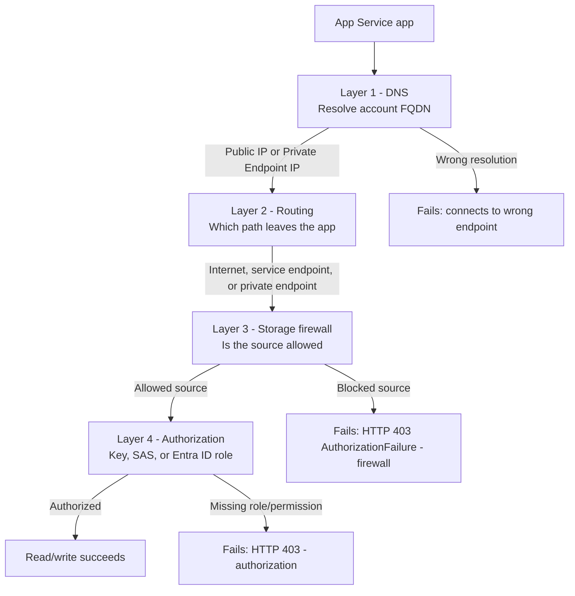
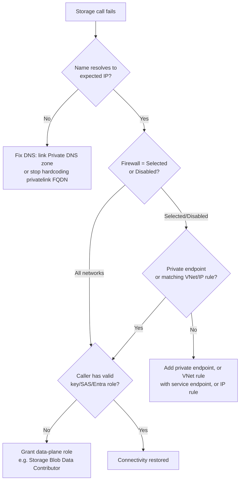

# App Service to Azure Storage connectivity

When an App Service app cannot reach an Azure Storage account, the cause is almost always in one of four independent layers: **DNS resolution**, **network routing**, the **Storage firewall**, or **data authorization**. Each layer can pass while another fails, so a single "connection refused" or `403` can have very different root causes. This page gives you a mental model to localize the failure and pick the right fix.

## Main Content

### The four-layer mental model

A request from your app to `https://<account>.blob.core.windows.net` passes through four checks, in order. All four must succeed.

<!-- diagram-id: storage-connectivity-four-layers -->

| Layer | Question it answers | Typical failure signal |
|---|---|---|
| **1. DNS** | Does the account FQDN resolve to a public IP or a private endpoint IP? | Connects to the public endpoint when you expected private (or vice versa) |
| **2. Routing** | Which path does traffic take out of the app — internet, service endpoint, or private endpoint? | Traffic falls back to the internet route and is blocked by the firewall |
| **3. Storage firewall** | Is the request's source (public IP, subnet, or private endpoint) on the allow list? | `403` with an `AuthorizationFailure` network reason |
| **4. Authorization** | Does the caller present a valid key, SAS, or Microsoft Entra role? | `403` even though the network path is correct |

!!! important "Network access and data authorization are independent"
    Per Microsoft Learn, clients that make requests from allowed network sources must **also** meet the storage account's authorization requirements. Opening the firewall does not grant data access, and granting a role does not bypass the firewall. Treat Layer 3 and Layer 4 as separate problems.

### Layer 1 — DNS

The account FQDN (`<account>.blob.core.windows.net`) resolves differently depending on whether a **private endpoint** exists:

- **No private endpoint**: the FQDN resolves to the Storage service's public IP. This is expected and normal — even when you use a service endpoint (a service endpoint changes routing, not DNS).
- **Private endpoint present**: the public FQDN is a CNAME to `privatelink.blob.core.windows.net`, which a linked **Private DNS zone** resolves to the private endpoint's private IP.

!!! warning "Do not hardcode the privatelink FQDN"
    Your application code and app settings should always use the **standard** FQDN (`<account>.blob.core.windows.net`). Let the Private DNS zone resolve it to the private IP. Hardcoding `<account>.privatelink.blob.core.windows.net` bypasses the intended resolution flow and breaks portability.

### Layer 2 — Routing

Routing decides which path a request takes out of the app:

- **No VNet Integration**: traffic leaves over the internet from the app's platform outbound IPs.
- **VNet Integration, private traffic only** (Route All disabled): only RFC1918 traffic and service-endpoint traffic enter the VNet; internet-destined traffic (including public Storage endpoints) still exits directly.
- **VNet Integration + Route All** (`WEBSITE_VNET_ROUTE_ALL=1`): traffic is routed into the integration subnet and subject to its NSGs and route tables.

!!! danger "Route All + firewalled global Storage is a common outage"
    Per Microsoft Learn, connectivity to global Azure Storage can fail for VNet-integrated apps when Route All is enabled and the app does **not** use service endpoints, private endpoints, or UDRs — the traffic is expected to route via the default internet route, which a Storage firewall then blocks. This is especially common when the storage account is in a **different region** than the virtual network. Fix it by adding a service endpoint (`Microsoft.Storage.Global` for cross-region), a private endpoint, or a UDR — not by widening the firewall.

[[[ shot("04-appservice-overview-vnet-integration") ]]]

Purpose: Confirm the app has VNet Integration in place, which is the prerequisite for the private routing paths in this layer.

Look for: The **Networking** section's **Virtual network integration** value (`vnet-storageconn-demo/snet-integration`) and **Private endpoint connections** count.

Expected result: A named `vnet/subnet` next to **Virtual network integration** means the app can route outbound traffic through that integration subnet; an empty value means the app has no VNet path and only the internet route is available.

### Layer 3 — Storage firewall

The Storage account's **Networking** blade has three public-network-access modes and four rule types.

Public network access modes:

| Mode | Behavior |
|---|---|
| **Enabled from all networks** | Any source may reach the public endpoint (subject to Layer 4). |
| **Enabled from selected virtual networks and IP addresses** | Only the configured VNet rules, IP rules, resource-instance rules, and trusted-service exceptions are allowed; everything else gets `403`. |
| **Disabled** | The public endpoint is off entirely; only **private endpoints** can reach the account. |

The three modes appear on the Storage account's **Networking → Public access** tab:

[[[ shot("01-storage-networking-all-networks") ]]]

Purpose: Show the least-restrictive mode, where any source may reach the public endpoint.

Look for: **Public network access** set to **Enabled from all networks**. No virtual network or IP allow list is required in this mode.

Expected result: Any client can open a TCP connection to the public endpoint; access is then gated solely by Layer 4 authorization.

[[[ shot("02-storage-networking-selected-networks") ]]]

Purpose: Show the mode that enforces an explicit allow list of virtual networks and IP ranges.

Look for: **Public network access** set to **Enabled from selected virtual networks and IP addresses**, and the **Virtual networks**, **Firewall**, and **Exceptions** sections that define the allowed sources.

Expected result: Only sources matching a configured VNet rule, IP rule, resource-instance rule, or trusted-service exception are allowed; every other source receives `403`.

[[[ shot("03-storage-networking-disabled") ]]]

Purpose: Show the most-restrictive mode, where the public endpoint is turned off.

Look for: **Public network access** set to **Disabled** and the note that **virtual networks and IP address settings are not in effect**.

Expected result: The public endpoint rejects all traffic; only a **private endpoint** can reach the account. Any VNet or IP rules are inert until public access is re-enabled.

Rule types (used by "Selected networks"):

| Rule type | Use when | Requires |
|---|---|---|
| **Virtual network rule** | The app reaches Storage from a subnet | A **service endpoint** on the subnet (`Microsoft.Storage` same-region, `Microsoft.Storage.Global` cross-region) |
| **IP network rule** | A fixed public IP (e.g., on-premises, NAT Gateway) **in a different region** from the Storage account | The public IP range on the allow list (not honored for same-region Azure service traffic) |
| **Resource instance rule** | An Azure resource that cannot be isolated by VNet/IP | The resource instance identity |
| **Trusted service exception** | An Azure service (logging, metrics) outside your network boundary | The trusted-services toggle |

!!! note "Service endpoint changes the source IP"
    When a subnet has a Storage service endpoint enabled, its traffic uses a **private** IP as the source. As a result, **IP network rules** that permitted that subnet's former public IP no longer apply — you must use a **virtual network rule** instead.

!!! warning "IP network rules are ignored for same-region Azure traffic"
    Storage IP network rules match only **public internet** source addresses. When App Service and the Storage account are in the **same region**, requests travel over the Azure backbone with an internal source address, so an IP rule listing the app's public outbound IP is silently ignored. For same-region access, use a **service endpoint + virtual network rule** or a **private endpoint**.

### Layer 4 — Authorization

Even with a correct network path, the caller must be authorized to the data:

- **Account key** — full access; avoid in application code.
- **SAS token** — scoped, time-limited. A SAS that binds to an IP does not grant access beyond the configured network rules.
- **Microsoft Entra ID (recommended)** — the app's managed identity holds a data-plane RBAC role such as **Storage Blob Data Contributor**. This is a `403` source that has nothing to do with the firewall.

### Setting-combination reference

The reachability of a firewalled account depends on the **routing** you configure and the **firewall mode**. Assumes correct Layer 4 authorization.

| Routing from app | Storage firewall = All networks | Storage firewall = Selected networks | Storage firewall = Disabled |
|---|---|---|---|
| No VNet Integration | Reachable (public IP) | **Blocked** — an IP network rule for the app's public outbound IP only helps when the app and Storage are in **different** regions; **same-region** IP rules are not honored (see caveat below) | **Blocked** (no private path) |
| VNet Integration, service endpoint on subnet | Reachable | Reachable **if** a matching VNet rule + `Microsoft.Storage[.Global]` endpoint exists | **Blocked** (service endpoint still uses the public endpoint) |
| VNet Integration + Private Endpoint + Private DNS | Reachable (private IP) | Reachable (private endpoints bypass firewall rules) | **Reachable** (private endpoint is the only allowed path) |
| VNet Integration + Route All, no endpoints | Reachable (internet fallback) | **Blocked** (internet source not allowed) | **Blocked** |

!!! warning "Same-region IP network rules are not honored"
    Azure Storage IP network rules apply only to requests that arrive from **public internet** source addresses. Traffic from an Azure service (including App Service) to a Storage account in the **same region** is routed over the Azure backbone with an internal source address, so an IP network rule listing the app's public outbound IP is **silently ignored** for same-region traffic. Use a **service endpoint with a virtual network rule** or a **private endpoint** instead. Public IP rules are only useful for cross-region or on-premises callers.

### Failure decision model

<!-- diagram-id: storage-connectivity-decision -->

## See Also

- [Networking](./networking.md)
- [Networking best practices](../best-practices/networking.md)
- [Resource Relationships](./resource-relationships.md)
- [Private network deploy recipe (Python)](../language-guides/python/recipes/private-network-deploy.md)

## Sources

- [Azure Storage firewall rules and network access (Microsoft Learn)](https://learn.microsoft.com/en-us/azure/storage/common/storage-network-security)
- [Restrictions for IP network rules (Microsoft Learn)](https://learn.microsoft.com/en-us/azure/storage/common/storage-network-security-limitations#restrictions-for-ip-network-rules)
- [Integrate your app with an Azure virtual network (Microsoft Learn)](https://learn.microsoft.com/en-us/azure/app-service/overview-vnet-integration)
- [Use private endpoints for App Service (Microsoft Learn)](https://learn.microsoft.com/en-us/azure/app-service/networking/private-endpoint)
- [Authorize access to data in Azure Storage (Microsoft Learn)](https://learn.microsoft.com/en-us/azure/storage/common/authorize-data-access)
