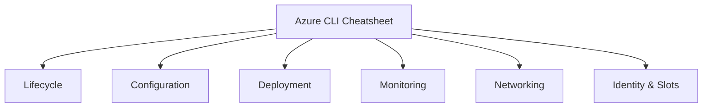

---
content_sources:
  diagrams:
    - id: reference-cli-cheatsheet-diagram-1
      type: flowchart
      source: self-generated
      justification: "Self-generated reference diagram synthesized from official Azure App Service documentation for this guide."
      based_on:
        - https://learn.microsoft.com/en-us/azure/app-service/overview
        - https://learn.microsoft.com/en-us/azure/app-service/troubleshoot-diagnostic-logs
---
# Azure CLI App Service Cheatsheet

Language-agnostic quick reference for Azure App Service operations with long flags only.

## Overview

<!-- diagram-id: reference-cli-cheatsheet-diagram-1 -->


## Prerequisites

```bash
az login
az account set --subscription <subscription-id>

RG="rg-myapp"
APP_NAME="app-myapp-prod"
PLAN_NAME="plan-myapp"
LOCATION="koreacentral"
```

## App Service Lifecycle

```bash
az group create --name $RG --location $LOCATION --output json
az appservice plan create --resource-group $RG --name $PLAN_NAME --location $LOCATION --sku P1V3 --is-linux --output json
az webapp create --resource-group $RG --plan $PLAN_NAME --name $APP_NAME --output json
az webapp show --resource-group $RG --name $APP_NAME --output json
az webapp stop --resource-group $RG --name $APP_NAME --output json
az webapp start --resource-group $RG --name $APP_NAME --output json
az webapp restart --resource-group $RG --name $APP_NAME --output json
az webapp delete --resource-group $RG --name $APP_NAME --output json
```

Masked output example:

```json
{
  "id": "/subscriptions/<subscription-id>/resourceGroups/rg-myapp/providers/Microsoft.Web/sites/app-myapp-prod",
  "name": "app-myapp-prod",
  "defaultHostName": "app-myapp-prod.azurewebsites.net",
  "identity": {
    "tenantId": "<tenant-id>",
    "principalId": "xxxxxxxx-xxxx-xxxx-xxxx-xxxxxxxxxxxx"
  }
}
```

## Configuration

```bash
az webapp config appsettings list --resource-group $RG --name $APP_NAME --output table
az webapp config appsettings set --resource-group $RG --name $APP_NAME --settings KEY1=VALUE1 KEY2=VALUE2 --output json
az webapp config appsettings delete --resource-group $RG --name $APP_NAME --setting-names KEY1 KEY2 --output json

az webapp config connection-string list --resource-group $RG --name $APP_NAME --output table
az webapp config connection-string set --resource-group $RG --name $APP_NAME --settings MainDb="Server=tcp:<server>.database.windows.net;Database=<db>;" --connection-string-type SQLAzure --output json
az webapp config connection-string delete --resource-group $RG --name $APP_NAME --setting-names MainDb --output json

az webapp config set --resource-group $RG --name $APP_NAME --always-on true --http20-enabled true --output json
```

## Deployment

```bash
az webapp deploy --resource-group $RG --name $APP_NAME --src-path ./deploy.zip --type zip --output json
az webapp deployment source config-local-git --resource-group $RG --name $APP_NAME --output json
az webapp deployment source show --resource-group $RG --name $APP_NAME --output json
az webapp log deployment list --resource-group $RG --name $APP_NAME --output table
az webapp deployment list-publishing-profiles --resource-group $RG --name $APP_NAME --xml --output json
```

## Monitoring

```bash
az webapp log config --resource-group $RG --name $APP_NAME --application-logging filesystem --detailed-error-messages true --failed-request-tracing true --web-server-logging filesystem --output json
az webapp log tail --resource-group $RG --name $APP_NAME
az webapp log download --resource-group $RG --name $APP_NAME --output json

WEBAPP_RESOURCE_ID=$(az webapp show --resource-group $RG --name $APP_NAME --query id --output tsv)
az monitor metrics list --resource $WEBAPP_RESOURCE_ID --metric "Requests" "Http5xx" "AverageResponseTime" --interval PT5M --aggregation Total Average --output table
```

## Networking

```bash
az webapp vnet-integration add --resource-group $RG --name $APP_NAME --vnet <vnet-name> --subnet <subnet-name> --output json
az webapp vnet-integration list --resource-group $RG --name $APP_NAME --output table
az webapp vnet-integration remove --resource-group $RG --name $APP_NAME --vnet <vnet-name> --subnet <subnet-name> --output json

az webapp config access-restriction add --resource-group $RG --name $APP_NAME --rule-name AllowCorp --action Allow --ip-address <corp-cidr> --priority 100 --output json
az webapp config access-restriction show --resource-group $RG --name $APP_NAME --output json
az webapp config access-restriction remove --resource-group $RG --name $APP_NAME --rule-name AllowCorp --output json
```

## Managed Identity

```bash
az webapp identity assign --resource-group $RG --name $APP_NAME --output json
az webapp identity show --resource-group $RG --name $APP_NAME --output json
```

Masked output example:

```json
{
  "type": "SystemAssigned",
  "principalId": "xxxxxxxx-xxxx-xxxx-xxxx-xxxxxxxxxxxx",
  "tenantId": "<tenant-id>",
  "userAssignedIdentities": null
}
```

## Deployment Slots

```bash
az webapp deployment slot create --resource-group $RG --name $APP_NAME --slot staging --configuration-source $APP_NAME --output json
az webapp deployment slot list --resource-group $RG --name $APP_NAME --output table
az webapp deployment slot swap --resource-group $RG --name $APP_NAME --slot staging --target-slot production --action swap --output json
az webapp traffic-routing set --resource-group $RG --name $APP_NAME --distribution staging=20 production=80 --output json
az webapp traffic-routing clear --resource-group $RG --name $APP_NAME --output json
az webapp deployment slot delete --resource-group $RG --name $APP_NAME --slot staging --output json
```

## Cleanup

```bash
az group delete --name $RG --yes --no-wait
```

## See Also

- [KQL Queries](kql-queries.md)
- [Platform Limits](platform-limits.md)

## Sources

- [Azure CLI Web App Commands (Microsoft Learn)](https://learn.microsoft.com/cli/azure/webapp)
- [Azure CLI App Service Plan Commands (Microsoft Learn)](https://learn.microsoft.com/cli/azure/appservice/plan)
- [Azure Monitor Metrics CLI (Microsoft Learn)](https://learn.microsoft.com/cli/azure/monitor/metrics)
