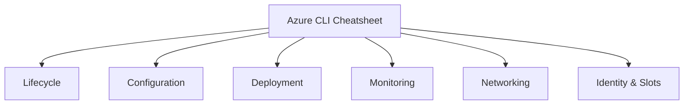

---
content_sources:
  diagrams:
    - id: reference-cli-cheatsheet-diagram-1
      type: flowchart
      source: self-generated
      justification: Self-generated reference diagram synthesized from official Azure App Service documentation for this guide.
      based_on:
        - https://learn.microsoft.com/en-us/azure/app-service/overview
        - https://learn.microsoft.com/en-us/azure/app-service/troubleshoot-diagnostic-logs
---
# Azure CLI App Service Cheatsheet

Language-agnostic quick reference for Azure App Service operations with long flags only.

## Overview

<!-- diagram-id: reference-cli-cheatsheet-diagram-1 -->

```mermaid
flowchart TD
    A[Azure CLI Cheatsheet] --> B[Lifecycle]
    A --> C[Configuration]
    A --> D[Deployment]
    A --> E[Monitoring]
    A --> F[Networking]
    A --> G[Identity & Slots]
```

## Prerequisites

```bash
az login
az account set --subscription <subscription-id>

RG="rg-myapp"
APP_NAME="app-myapp-prod"
PLAN_NAME="plan-myapp"
LOCATION="koreacentral"
```

| Command | Description |
|---|---|
| `az login` | Authenticates the local Azure CLI session against your Azure account. |
| `az account set --subscription <subscription-id>` | Switches subsequent CLI operations to the target subscription. |
| `RG="rg-myapp"` | Defines the resource group shell variable reused by later commands. |
| `APP_NAME="app-myapp-prod"` | Defines the web app name shell variable. |
| `PLAN_NAME="plan-myapp"` | Defines the App Service plan name shell variable. |
| `LOCATION="koreacentral"` | Defines the Azure region shell variable for resource creation commands. |

## App Service Lifecycle

```bash
az group create --name $RG --location $LOCATION --output json
az appservice plan create --resource-group $RG --name $PLAN_NAME --location $LOCATION --sku P1V3 --is-linux --output json
az webapp create --resource-group $RG --plan $PLAN_NAME --name $APP_NAME --output json
az webapp show --resource-group $RG --name $APP_NAME --output json
az webapp stop --resource-group $RG --name $APP_NAME --output json
az webapp start --resource-group $RG --name $APP_NAME --output json
az webapp restart --resource-group $RG --name $APP_NAME --output json
az webapp delete --resource-group $RG --name $APP_NAME --output json
```

| Command | Description |
|---|---|
| `az group create --name $RG --location $LOCATION --output json` | Creates the resource group that will hold the App Service resources. |
| `az appservice plan create --resource-group $RG --name $PLAN_NAME --location $LOCATION --sku P1V3 --is-linux --output json` | Creates a Linux App Service plan in the chosen region and SKU. |
| `az webapp create --resource-group $RG --plan $PLAN_NAME --name $APP_NAME --output json` | Creates the web app in that App Service plan. |
| `az webapp show --resource-group $RG --name $APP_NAME --output json` | Returns the current web app resource details. |
| `az webapp stop --resource-group $RG --name $APP_NAME --output json` | Stops the running app so it no longer serves traffic. |
| `az webapp start --resource-group $RG --name $APP_NAME --output json` | Starts a stopped web app. |
| `az webapp restart --resource-group $RG --name $APP_NAME --output json` | Restarts the app process on the existing site. |
| `az webapp delete --resource-group $RG --name $APP_NAME --output json` | Deletes the web app resource from the resource group. |

Masked output example:

```json
{
  "id": "/subscriptions/<subscription-id>/resourceGroups/rg-myapp/providers/Microsoft.Web/sites/app-myapp-prod",
  "name": "app-myapp-prod",
  "defaultHostName": "app-myapp-prod.azurewebsites.net",
  "identity": {
    "tenantId": "<tenant-id>",
    "principalId": "xxxxxxxx-xxxx-xxxx-xxxx-xxxxxxxxxxxx"
  }
}
```

## Configuration

```bash
az webapp config appsettings list --resource-group $RG --name $APP_NAME --output table
az webapp config appsettings set --resource-group $RG --name $APP_NAME --settings KEY1=VALUE1 KEY2=VALUE2 --output json
az webapp config appsettings delete --resource-group $RG --name $APP_NAME --setting-names KEY1 KEY2 --output json

az webapp config connection-string list --resource-group $RG --name $APP_NAME --output table
az webapp config connection-string set --resource-group $RG --name $APP_NAME --settings MainDb="Server=tcp:<server>.database.windows.net;Database=<db>;" --connection-string-type SQLAzure --output json
az webapp config connection-string delete --resource-group $RG --name $APP_NAME --setting-names MainDb --output json

az webapp config set --resource-group $RG --name $APP_NAME --always-on true --http20-enabled true --output json
```

| Command | Description |
|---|---|
| `az webapp config appsettings list --resource-group $RG --name $APP_NAME --output table` | Lists the app settings currently stored on the web app. |
| `az webapp config appsettings set --resource-group $RG --name $APP_NAME --settings KEY1=VALUE1 KEY2=VALUE2 --output json` | Writes or updates the specified app settings on the web app. |
| `az webapp config appsettings delete --resource-group $RG --name $APP_NAME --setting-names KEY1 KEY2 --output json` | Removes the named app settings from the web app configuration. |
| `az webapp config connection-string list --resource-group $RG --name $APP_NAME --output table` | Lists the connection strings configured for the app. |
| `az webapp config connection-string set --resource-group $RG --name $APP_NAME --settings MainDb="Server=tcp:<server>.database.windows.net;Database=<db>;" --connection-string-type SQLAzure --output json` | Stores the `MainDb` connection string and marks it as an Azure SQL connection string. |
| `az webapp config connection-string delete --resource-group $RG --name $APP_NAME --setting-names MainDb --output json` | Deletes the `MainDb` connection string from the app configuration. |
| `az webapp config set --resource-group $RG --name $APP_NAME --always-on true --http20-enabled true --output json` | Enables Always On and HTTP/2 at the site configuration level. |

## Deployment

```bash
az webapp deploy --resource-group $RG --name $APP_NAME --src-path ./deploy.zip --type zip --output json
az webapp deployment source config-local-git --resource-group $RG --name $APP_NAME --output json
az webapp deployment source show --resource-group $RG --name $APP_NAME --output json
az webapp log deployment list --resource-group $RG --name $APP_NAME --output table
az webapp deployment list-publishing-profiles --resource-group $RG --name $APP_NAME --xml --output json
```

| Command | Description |
|---|---|
| `az webapp deploy --resource-group $RG --name $APP_NAME --src-path ./deploy.zip --type zip --output json` | Pushes the local ZIP package to the web app for deployment. |
| `az webapp deployment source config-local-git --resource-group $RG --name $APP_NAME --output json` | Enables a local Git deployment endpoint for the web app. |
| `az webapp deployment source show --resource-group $RG --name $APP_NAME --output json` | Shows the current deployment source configuration for the app. |
| `az webapp log deployment list --resource-group $RG --name $APP_NAME --output table` | Lists recorded deployment runs and their status. |
| `az webapp deployment list-publishing-profiles --resource-group $RG --name $APP_NAME --xml --output json` | Retrieves the publishing profiles, including deployment endpoints and credentials, in XML form. |

## Monitoring

```bash
az webapp log config --resource-group $RG --name $APP_NAME --application-logging filesystem --detailed-error-messages true --failed-request-tracing true --web-server-logging filesystem --output json
az webapp log tail --resource-group $RG --name $APP_NAME
az webapp log download --resource-group $RG --name $APP_NAME --output json

WEBAPP_RESOURCE_ID=$(az webapp show --resource-group $RG --name $APP_NAME --query id --output tsv)
az monitor metrics list --resource $WEBAPP_RESOURCE_ID --metric "Requests" "Http5xx" "AverageResponseTime" --interval PT5M --aggregation Total Average --output table
```

| Command | Description |
|---|---|
| `az webapp log config --resource-group $RG --name $APP_NAME --application-logging filesystem --detailed-error-messages true --failed-request-tracing true --web-server-logging filesystem --output json` | Enables filesystem-based application and web server logging plus detailed error and failed-request traces. |
| `az webapp log tail --resource-group $RG --name $APP_NAME` | Streams live web app logs to the current terminal session. |
| `az webapp log download --resource-group $RG --name $APP_NAME --output json` | Downloads the available diagnostic log package for the app. |
| `WEBAPP_RESOURCE_ID=$(az webapp show --resource-group $RG --name $APP_NAME --query id --output tsv)` | Reads the web app ARM resource ID into a shell variable for the metrics query. |
| `az monitor metrics list --resource $WEBAPP_RESOURCE_ID --metric "Requests" "Http5xx" "AverageResponseTime" --interval PT5M --aggregation Total Average --output table` | Queries Azure Monitor metrics for request volume, HTTP 5xx count, and average response time over 5-minute buckets. |

!!! warning "Linux caveat for log download"
    `az webapp log download` may not work with web apps running on Linux.
    For Linux apps, use log streaming (`az webapp log tail`), the Diagnose and Solve Problems portal blade, or access logs via `/home/LogFiles`.

## Networking

```bash
az webapp vnet-integration add --resource-group $RG --name $APP_NAME --vnet <vnet-name> --subnet <subnet-name> --output json
az webapp vnet-integration list --resource-group $RG --name $APP_NAME --output table
az webapp vnet-integration remove --resource-group $RG --name $APP_NAME --vnet <vnet-name> --subnet <subnet-name> --output json

az webapp config access-restriction add --resource-group $RG --name $APP_NAME --rule-name AllowCorp --action Allow --ip-address <corp-cidr> --priority 100 --output json
az webapp config access-restriction show --resource-group $RG --name $APP_NAME --output json
az webapp config access-restriction remove --resource-group $RG --name $APP_NAME --rule-name AllowCorp --output json
```

| Command | Description |
|---|---|
| `az webapp vnet-integration add --resource-group $RG --name $APP_NAME --vnet <vnet-name> --subnet <subnet-name> --output json` | Attaches the web app to the specified VNet integration subnet for outbound private connectivity. |
| `az webapp vnet-integration list --resource-group $RG --name $APP_NAME --output table` | Lists the VNet integration configuration currently attached to the app. |
| `az webapp vnet-integration remove --resource-group $RG --name $APP_NAME --vnet <vnet-name> --subnet <subnet-name> --output json` | Detaches the web app from the specified VNet integration subnet. |
| `az webapp config access-restriction add --resource-group $RG --name $APP_NAME --rule-name AllowCorp --action Allow --ip-address <corp-cidr> --priority 100 --output json` | Adds an allow rule so only the specified corporate CIDR can reach the app through that rule. |
| `az webapp config access-restriction show --resource-group $RG --name $APP_NAME --output json` | Shows the current access restriction rule set for the app. |
| `az webapp config access-restriction remove --resource-group $RG --name $APP_NAME --rule-name AllowCorp --output json` | Removes the named access restriction rule from the app. |

## Managed Identity

```bash
az webapp identity assign --resource-group $RG --name $APP_NAME --output json
az webapp identity show --resource-group $RG --name $APP_NAME --output json
```

| Command | Description |
|---|---|
| `az webapp identity assign --resource-group $RG --name $APP_NAME --output json` | Enables a system-assigned managed identity on the web app. |
| `az webapp identity show --resource-group $RG --name $APP_NAME --output json` | Returns the current managed identity configuration for the web app. |

Masked output example:

```json
{
  "type": "SystemAssigned",
  "principalId": "xxxxxxxx-xxxx-xxxx-xxxx-xxxxxxxxxxxx",
  "tenantId": "<tenant-id>",
  "userAssignedIdentities": null
}
```

## Deployment Slots

```bash
az webapp deployment slot create --resource-group $RG --name $APP_NAME --slot staging --configuration-source $APP_NAME --output json
az webapp deployment slot list --resource-group $RG --name $APP_NAME --output table
az webapp deployment slot swap --resource-group $RG --name $APP_NAME --slot staging --target-slot production --action swap --output json
az webapp traffic-routing set --resource-group $RG --name $APP_NAME --distribution staging=20 --output json
az webapp traffic-routing clear --resource-group $RG --name $APP_NAME --output json
az webapp deployment slot delete --resource-group $RG --name $APP_NAME --slot staging --output json
```

| Command | Description |
|---|---|
| `az webapp deployment slot create --resource-group $RG --name $APP_NAME --slot staging --configuration-source $APP_NAME --output json` | Creates a `staging` deployment slot and copies configuration from the production app. |
| `az webapp deployment slot list --resource-group $RG --name $APP_NAME --output table` | Lists the deployment slots defined for the app. |
| `az webapp deployment slot swap --resource-group $RG --name $APP_NAME --slot staging --target-slot production --action swap --output json` | Swaps the `staging` slot content into the production slot. |
| `az webapp traffic-routing set --resource-group $RG --name $APP_NAME --distribution staging=20 --output json` | Sends 20 percent of incoming traffic to the `staging` slot. |
| `az webapp traffic-routing clear --resource-group $RG --name $APP_NAME --output json` | Removes any custom traffic split so all traffic returns to the default routing behavior. |
| `az webapp deployment slot delete --resource-group $RG --name $APP_NAME --slot staging --output json` | Deletes the `staging` slot from the app. |

Traffic not explicitly assigned to a non-production slot continues to go to production automatically.

## Cleanup

```bash
az group delete --name $RG --yes --no-wait
```

| Flag | Description |
|---|---|
| `--name $RG` | Deletes the resource group named by `$RG`. |
| `--yes` | Skips the interactive confirmation prompt. |
| `--no-wait` | Returns immediately without waiting for the asynchronous deletion to finish. |

## Run It in the Portal

#### Portal view: Web App Overview blade (CLI command Portal counterparts)

[[[ shot("platform--architecture--01-app-service-overview") ]]]

Most CLI verbs in this cheatsheet have a direct visual counterpart on this blade. The command bar `Stop`, `Restart`, and `Delete` map to `az webapp stop`, `az webapp restart`, and `az webapp delete`, while `Browse` aligns with the `Default domain` shown in Essentials and `Download publish profile` aligns with `az webapp deployment list-publishing-profiles`. The visible Essentials and Properties fields (`Status: Running`, `Operating System: Linux`, `App Service Plan`, `Runtime status: Healthy`, `Last deployment`) make this a practical post-command verification view after create, deploy, restart, or plan-change operations. Use this blade to confirm that the app is running on the expected plan and that the most recent deployment succeeded.

## See Also

- [KQL Queries](kql-queries.md)
- [Platform Limits](platform-limits.md)

## Sources

- [Azure CLI Web App Commands (Microsoft Learn)](https://learn.microsoft.com/en-us/cli/azure/webapp)
- [Azure CLI App Service Plan Commands (Microsoft Learn)](https://learn.microsoft.com/en-us/cli/azure/appservice/plan)
- [Azure Monitor Metrics CLI (Microsoft Learn)](https://learn.microsoft.com/en-us/cli/azure/monitor/metrics)
