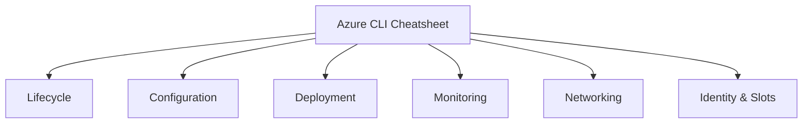

---
content_sources:
  diagrams:
    - id: reference-cli-cheatsheet-diagram-1
      type: flowchart
      source: self-generated
      justification: Self-generated reference diagram synthesized from official Azure App Service documentation for this guide.
      based_on:
        - https://learn.microsoft.com/en-us/azure/app-service/overview
        - https://learn.microsoft.com/en-us/azure/app-service/troubleshoot-diagnostic-logs
---
# Azure CLI App Service Cheatsheet

Language-agnostic quick reference for Azure App Service operations with long flags only.

## Overview

<!-- diagram-id: reference-cli-cheatsheet-diagram-1 -->

```mermaid
flowchart TD
    A[Azure CLI Cheatsheet] --> B[Lifecycle]
    A --> C[Configuration]
    A --> D[Deployment]
    A --> E[Monitoring]
    A --> F[Networking]
    A --> G[Identity & Slots]
```

## Prerequisites

```bash
az login
az account set --subscription <subscription-id>

RG="rg-myapp"
APP_NAME="app-myapp-prod"
PLAN_NAME="plan-myapp"
LOCATION="koreacentral"
```

## App Service Lifecycle

```bash
az group create --name $RG --location $LOCATION --output json
az appservice plan create --resource-group $RG --name $PLAN_NAME --location $LOCATION --sku P1V3 --is-linux --output json
az webapp create --resource-group $RG --plan $PLAN_NAME --name $APP_NAME --output json
az webapp show --resource-group $RG --name $APP_NAME --output json
az webapp stop --resource-group $RG --name $APP_NAME --output json
az webapp start --resource-group $RG --name $APP_NAME --output json
az webapp restart --resource-group $RG --name $APP_NAME --output json
az webapp delete --resource-group $RG --name $APP_NAME --output json
```

Masked output example:

```json
{
  "id": "/subscriptions/<subscription-id>/resourceGroups/rg-myapp/providers/Microsoft.Web/sites/app-myapp-prod",
  "name": "app-myapp-prod",
  "defaultHostName": "app-myapp-prod.azurewebsites.net",
  "identity": {
    "tenantId": "<tenant-id>",
    "principalId": "xxxxxxxx-xxxx-xxxx-xxxx-xxxxxxxxxxxx"
  }
}
```

## Configuration

```bash
az webapp config appsettings list --resource-group $RG --name $APP_NAME --output table
az webapp config appsettings set --resource-group $RG --name $APP_NAME --settings KEY1=VALUE1 KEY2=VALUE2 --output json
az webapp config appsettings delete --resource-group $RG --name $APP_NAME --setting-names KEY1 KEY2 --output json

az webapp config connection-string list --resource-group $RG --name $APP_NAME --output table
az webapp config connection-string set --resource-group $RG --name $APP_NAME --settings MainDb="Server=tcp:<server>.database.windows.net;Database=<db>;" --connection-string-type SQLAzure --output json
az webapp config connection-string delete --resource-group $RG --name $APP_NAME --setting-names MainDb --output json

az webapp config set --resource-group $RG --name $APP_NAME --always-on true --http20-enabled true --output json
```

## Deployment

```bash
az webapp deploy --resource-group $RG --name $APP_NAME --src-path ./deploy.zip --type zip --output json
az webapp deployment source config-local-git --resource-group $RG --name $APP_NAME --output json
az webapp deployment source show --resource-group $RG --name $APP_NAME --output json
az webapp log deployment list --resource-group $RG --name $APP_NAME --output table
az webapp deployment list-publishing-profiles --resource-group $RG --name $APP_NAME --xml --output json
```

## Monitoring

```bash
az webapp log config --resource-group $RG --name $APP_NAME --application-logging filesystem --detailed-error-messages true --failed-request-tracing true --web-server-logging filesystem --output json
az webapp log tail --resource-group $RG --name $APP_NAME
az webapp log download --resource-group $RG --name $APP_NAME --output json

WEBAPP_RESOURCE_ID=$(az webapp show --resource-group $RG --name $APP_NAME --query id --output tsv)
az monitor metrics list --resource $WEBAPP_RESOURCE_ID --metric "Requests" "Http5xx" "AverageResponseTime" --interval PT5M --aggregation Total Average --output table
```

!!! warning "Linux caveat for log download"
    `az webapp log download` may not work with web apps running on Linux.
    For Linux apps, use log streaming (`az webapp log tail`), the Diagnose and Solve Problems portal blade, or access logs via `/home/LogFiles`.

## Networking

```bash
az webapp vnet-integration add --resource-group $RG --name $APP_NAME --vnet <vnet-name> --subnet <subnet-name> --output json
az webapp vnet-integration list --resource-group $RG --name $APP_NAME --output table
az webapp vnet-integration remove --resource-group $RG --name $APP_NAME --vnet <vnet-name> --subnet <subnet-name> --output json

az webapp config access-restriction add --resource-group $RG --name $APP_NAME --rule-name AllowCorp --action Allow --ip-address <corp-cidr> --priority 100 --output json
az webapp config access-restriction show --resource-group $RG --name $APP_NAME --output json
az webapp config access-restriction remove --resource-group $RG --name $APP_NAME --rule-name AllowCorp --output json
```

## Managed Identity

```bash
az webapp identity assign --resource-group $RG --name $APP_NAME --output json
az webapp identity show --resource-group $RG --name $APP_NAME --output json
```

Masked output example:

```json
{
  "type": "SystemAssigned",
  "principalId": "xxxxxxxx-xxxx-xxxx-xxxx-xxxxxxxxxxxx",
  "tenantId": "<tenant-id>",
  "userAssignedIdentities": null
}
```

## Deployment Slots

```bash
az webapp deployment slot create --resource-group $RG --name $APP_NAME --slot staging --configuration-source $APP_NAME --output json
az webapp deployment slot list --resource-group $RG --name $APP_NAME --output table
az webapp deployment slot swap --resource-group $RG --name $APP_NAME --slot staging --target-slot production --action swap --output json
az webapp traffic-routing set --resource-group $RG --name $APP_NAME --distribution staging=20 --output json
az webapp traffic-routing clear --resource-group $RG --name $APP_NAME --output json
az webapp deployment slot delete --resource-group $RG --name $APP_NAME --slot staging --output json
```

Traffic not explicitly assigned to a non-production slot continues to go to production automatically.

## Cleanup

```bash
az group delete --name $RG --yes --no-wait
```

## Run It in the Portal

#### Portal view: Web App Overview blade (CLI command Portal counterparts)

![Azure portal Overview blade for `app-test-20251107` (Web App) with a command bar (`Browse`, `Stop`, `Swap`, `Restart`, `Delete`, `Refresh`, `Download publish profile`, `Reset publish profile`, `Share to mobile`, `Send us your feedback`) and an Essentials panel showing Resource group `rg-test-20251107`, Status `Running`, Location `Korea Central`, Subscription `Visual Studio Enterprise Subscription`, Subscription ID `00000000-0000-0000-0000-000000000000`, Default domain `app-test-20251107.azurewebsites.net`, App Service Plan `asp-test-20251107 (P0v3: 1)`, Operating System `Linux`, and Health Check `Not Configured`. The Properties tab is selected (next to Monitoring, Logs, Capabilities, Notifications (1), Recommendations) and surfaces Web app (`Publishing model: Code`, `Runtime Stack: Python - 3.11`, `Runtime status: Healthy`), Domains (`2 Domains View all`), Hosting (`Plan Type: App Service plan`, `Instance Count: 1`, `SKU and size: Premium0V3 (P0v3)` with `Scale up` link), Deployment Center (`Last deployment: Successful on Thursday, November 6, 10:58:01 PM`, `Deployment provider: None`), Application Insights (`Name: ai-test-20251107`, `Region: Korea Central`), and Networking (`Inbound IP addresses: <ip-redacted>, <ipv6-redacted>`, `Private endpoint connections: 0 private endpoints`, `Virtual network integration: Not configured`). Left nav under the search box lists Overview (selected), Activity log, Access control (IAM), Tags, Diagnose and solve problems, Microsoft Defender for Cloud, Events (preview), Log stream, AI (preview), Resource visualizer, with collapsed groups Deployment, Settings, Performance, App Service plan, Development Tools, API, Monitoring, Automation, and Support + troubleshooting.](../assets/platform/architecture/01-app-service-overview.png)

Most CLI verbs in this cheatsheet have a direct visual counterpart on this blade. The command bar `Stop`, `Restart`, and `Delete` map to `az webapp stop`, `az webapp restart`, and `az webapp delete`, while `Browse` aligns with the `Default domain` shown in Essentials and `Download publish profile` aligns with `az webapp deployment list-publishing-profiles`. The visible Essentials and Properties fields (`Status: Running`, `Operating System: Linux`, `App Service Plan`, `Runtime status: Healthy`, `Last deployment`) make this a practical post-command verification view after create, deploy, restart, or plan-change operations. Use this blade to confirm that the app is running on the expected plan and that the most recent deployment succeeded.

## See Also

- [KQL Queries](kql-queries.md)
- [Platform Limits](platform-limits.md)

## Sources

- [Azure CLI Web App Commands (Microsoft Learn)](https://learn.microsoft.com/en-us/cli/azure/webapp)
- [Azure CLI App Service Plan Commands (Microsoft Learn)](https://learn.microsoft.com/en-us/cli/azure/appservice/plan)
- [Azure Monitor Metrics CLI (Microsoft Learn)](https://learn.microsoft.com/en-us/cli/azure/monitor/metrics)
