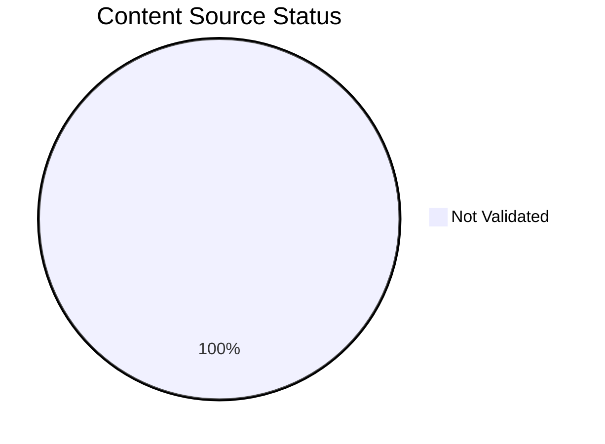
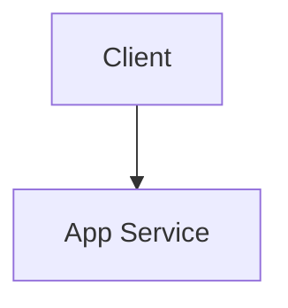

# Content Source Validation Status

This page tracks the source validation status of all documentation content, including diagrams and text content. All content must be traceable to official Microsoft Learn documentation.

## Summary

*Generated: 2026-04-10*

| Content Type | Total | ✅ MSLearn Sourced | ⚠️ Self-Generated | ❌ No Source |
|---|---:|---:|---:|---:|
| Mermaid Diagrams | 66 | 0 | 0 | 66 |
| Text Sections | — | — | — | — |

!!! warning "Validation Required"
    All 66 mermaid diagrams require source validation. Content without MSLearn sources must be either:
    
    1. Linked to an official MSLearn URL, OR
    2. Marked as `self-generated` with clear justification



## Validation Categories

### Source Types

| Type | Description | Allowed? |
|---|---|---|
| `mslearn` | Content directly from or based on Microsoft Learn | ✅ Yes |
| `mslearn-adapted` | MSLearn content adapted for this guide | ✅ Yes (with source URL) |
| `self-generated` | Original content created for this guide | ⚠️ Requires justification |
| `community` | From community sources (Stack Overflow, GitHub) | ❌ Not for core content |
| `unknown` | Source not documented | ❌ Must be validated |

### Diagram Validation Status

#### Platform Diagrams (36 total)

| File | Diagrams | Source Type | MSLearn URL | Status |
|---|---:|---|---|---|
| [how-app-service-works.md](../platform/how-app-service-works.md) | 8 | unknown | — | ❌ Not Validated |
| [authentication-architecture.md](../platform/authentication-architecture.md) | 6 | unknown | — | ❌ Not Validated |
| [security-architecture.md](../platform/security-architecture.md) | 6 | unknown | — | ❌ Not Validated |
| [networking.md](../platform/networking.md) | 6 | unknown | — | ❌ Not Validated |
| [resource-relationships.md](../platform/resource-relationships.md) | 3 | unknown | — | ❌ Not Validated |
| [scaling.md](../platform/scaling.md) | 3 | unknown | — | ❌ Not Validated |
| [request-lifecycle.md](../platform/request-lifecycle.md) | 2 | unknown | — | ❌ Not Validated |
| [index.md](../platform/index.md) | 1 | unknown | — | ❌ Not Validated |
| [hosting-models.md](../platform/hosting-models.md) | 1 | unknown | — | ❌ Not Validated |

#### Playbook Diagrams (30 total)

| File | Diagrams | Source Type | MSLearn URL | Status |
|---|---:|---|---|---|
| [cors-and-token-errors.md](../troubleshooting/playbooks/performance/cors-and-token-errors.md) | 3 | unknown | — | ❌ Not Validated |
| [auth-redirect-loop.md](../troubleshooting/playbooks/startup-availability/auth-redirect-loop.md) | 2 | unknown | — | ❌ Not Validated |
| [deployment-succeeded-startup-failed.md](../troubleshooting/playbooks/startup-availability/deployment-succeeded-startup-failed.md) | 1 | unknown | — | ❌ Not Validated |
| [container-didnt-respond-to-http-pings.md](../troubleshooting/playbooks/startup-availability/container-didnt-respond-to-http-pings.md) | 1 | unknown | — | ❌ Not Validated |
| [failed-to-forward-request.md](../troubleshooting/playbooks/startup-availability/failed-to-forward-request.md) | 1 | unknown | — | ❌ Not Validated |
| [slot-swap-failed-during-warmup.md](../troubleshooting/playbooks/startup-availability/slot-swap-failed-during-warmup.md) | 1 | unknown | — | ❌ Not Validated |
| [slot-swap-config-drift.md](../troubleshooting/playbooks/startup-availability/slot-swap-config-drift.md) | 1 | unknown | — | ❌ Not Validated |
| [warmup-vs-health-check.md](../troubleshooting/playbooks/startup-availability/warmup-vs-health-check.md) | 1 | unknown | — | ❌ Not Validated |
| [windows-iis-webconfig-startup.md](../troubleshooting/playbooks/startup-availability/windows-iis-webconfig-startup.md) | 1 | unknown | — | ❌ Not Validated |
| [windows-kudu-diagnostics.md](../troubleshooting/playbooks/startup-availability/windows-kudu-diagnostics.md) | 1 | unknown | — | ❌ Not Validated |
| [windows-container-health-probes.md](../troubleshooting/playbooks/startup-availability/windows-container-health-probes.md) | 1 | unknown | — | ❌ Not Validated |
| [no-space-left-on-device.md](../troubleshooting/playbooks/performance/no-space-left-on-device.md) | 1 | unknown | — | ❌ Not Validated |
| [slow-response-but-low-cpu.md](../troubleshooting/playbooks/performance/slow-response-but-low-cpu.md) | 1 | unknown | — | ❌ Not Validated |
| [memory-pressure-and-worker-degradation.md](../troubleshooting/playbooks/performance/memory-pressure-and-worker-degradation.md) | 1 | unknown | — | ❌ Not Validated |
| [windows-memory-pressure-worker-recycling.md](../troubleshooting/playbooks/performance/windows-memory-pressure-worker-recycling.md) | 1 | unknown | — | ❌ Not Validated |
| [windows-filesystem-quotas.md](../troubleshooting/playbooks/performance/windows-filesystem-quotas.md) | 1 | unknown | — | ❌ Not Validated |
| [intermittent-5xx-under-load.md](../troubleshooting/playbooks/performance/intermittent-5xx-under-load.md) | 1 | unknown | — | ❌ Not Validated |
| [slow-start-cold-start.md](../troubleshooting/playbooks/performance/slow-start-cold-start.md) | 1 | unknown | — | ❌ Not Validated |
| [snat-or-application-issue.md](../troubleshooting/playbooks/outbound-network/snat-or-application-issue.md) | 1 | unknown | — | ❌ Not Validated |
| [dns-resolution-vnet-integrated-app-service.md](../troubleshooting/playbooks/outbound-network/dns-resolution-vnet-integrated-app-service.md) | 1 | unknown | — | ❌ Not Validated |
| [private-endpoint-custom-dns-route-confusion.md](../troubleshooting/playbooks/outbound-network/private-endpoint-custom-dns-route-confusion.md) | 1 | unknown | — | ❌ Not Validated |
| Other playbooks | 7 | unknown | — | ❌ Not Validated |

## How to Validate Content

### Step 1: Add Source Metadata to Frontmatter

Add `content_sources` to the document's YAML frontmatter:

```yaml
---
title: How App Service Works
content_sources:
  diagrams:
    - id: architecture-overview
      type: flowchart
      source: mslearn
      mslearn_url: https://learn.microsoft.com/en-us/azure/app-service/overview-hosting-plans
      description: "App Service Plan architecture"
    - id: request-flow
      type: sequence
      source: self-generated
      justification: "Synthesized from multiple MSLearn articles for clarity"
      based_on:
        - https://learn.microsoft.com/en-us/azure/app-service/overview-hosting-plans
        - https://learn.microsoft.com/en-us/azure/app-service/networking-features
  text:
    - section: "## Summary"
      source: mslearn-adapted
      mslearn_url: https://learn.microsoft.com/en-us/azure/app-service/overview
---
```

### Step 2: Mark Diagram Blocks with IDs

Add an HTML comment before each mermaid block to identify it:

```markdown
<!-- diagram-id: architecture-overview -->

```

### Step 3: Run Validation Script

```bash
python3 scripts/validate_content_sources.py
```

### Step 4: Update This Page

```bash
python3 scripts/generate_content_validation_status.py
```

## Validation Rules

!!! danger "Mandatory Rules"
    1. **Platform diagrams** (`docs/platform/`) MUST have MSLearn sources
    2. **Architecture diagrams** MUST reference official Microsoft documentation
    3. **Troubleshooting flowcharts** MAY be self-generated if they synthesize MSLearn content
    4. **Self-generated content** MUST have `justification` field explaining the source basis

## Official MSLearn Architecture References

Use these official sources for diagram validation:

| Topic | MSLearn URL |
|---|---|
| App Service Overview | https://learn.microsoft.com/en-us/azure/app-service/overview |
| App Service Plans | https://learn.microsoft.com/en-us/azure/app-service/overview-hosting-plans |
| App Service Networking | https://learn.microsoft.com/en-us/azure/app-service/networking-features |
| App Service Authentication | https://learn.microsoft.com/en-us/azure/app-service/overview-authentication-authorization |
| App Service Security | https://learn.microsoft.com/en-us/azure/app-service/overview-security |
| App Service Diagnostics | https://learn.microsoft.com/en-us/azure/app-service/overview-diagnostics |
| Linux Containers | https://learn.microsoft.com/en-us/azure/app-service/configure-custom-container |
| Deployment | https://learn.microsoft.com/en-us/azure/app-service/deploy-best-practices |

## See Also

- [Tutorial Validation Status](validation-status.md)
- [CLI Cheatsheet](cli-cheatsheet.md)
