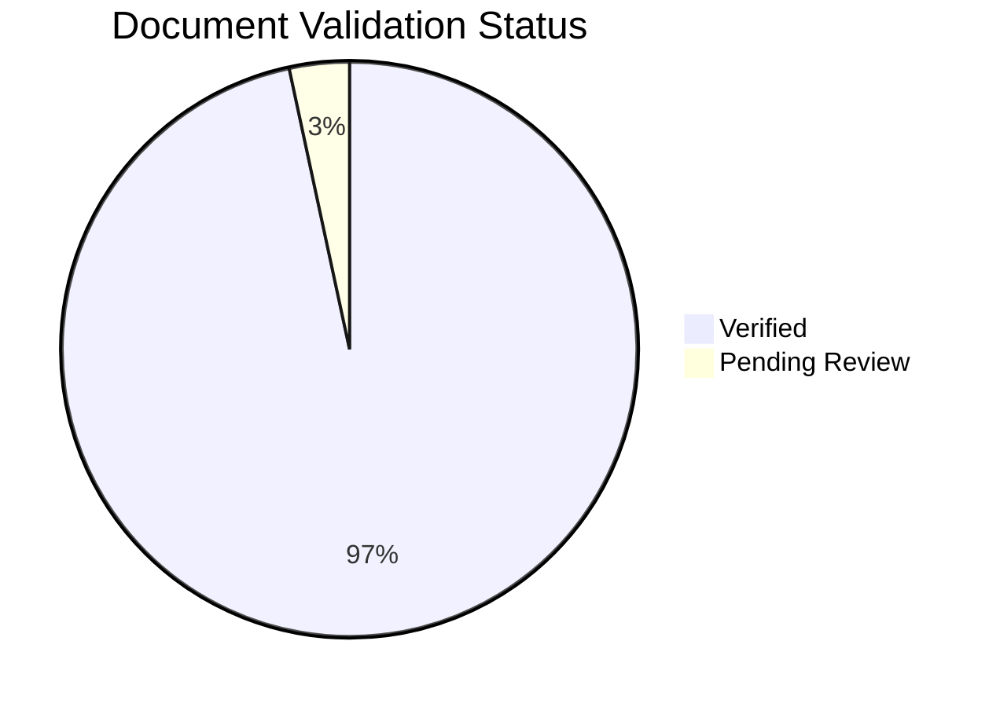

---
content_sources:
  - type: self-generated
    justification: Auto-generated dashboard tracking content validation status
---

# Content Validation Status

This page tracks the source validation status of all documentation content. All content must be traceable to official Microsoft Learn documentation.

## Summary

*Generated: 2026-04-26*

| Content Type | Total | Verified | Pending | Unverified | No Metadata |
|---|---:|---:|---:|---:|---:|
| Mermaid Diagrams | 340 | 340 | 0 | 0 | 0 |
| Text Documents | 89 | 86 | 3 | 0 | 0 |


<!-- diagram-id: content-validation-status-pie -->


## By Section

### Platform

| Document | Has Sources | Status | Claims | Last Reviewed |
|---|---|---|---|---|
| [Authentication Architecture](../platform/authentication-architecture.md) | ✅ | ✅ Verified | 5/5 | 2026-04-12 |
| [Deployment Scenarios](../platform/deployment-scenarios.md) | ✅ | ✅ Verified | 4/4 | 2026-04-12 |
| [Hosting Models](../platform/hosting-models.md) | ✅ | ✅ Verified | 5/5 | 2026-04-12 |
| [How App Service Works](../platform/how-app-service-works.md) | ✅ | ✅ Verified | 4/4 | 2026-04-12 |
| [Mtls](../platform/mtls.md) | ✅ | ⚠️ Pending Review | 4/4 | 2026-04-25 |
| [Networking](../platform/networking.md) | ✅ | ✅ Verified | 5/5 | 2026-04-12 |
| [Request Lifecycle](../platform/request-lifecycle.md) | ✅ | ✅ Verified | 5/5 | 2026-04-12 |
| [Resource Relationships](../platform/resource-relationships.md) | ✅ | ✅ Verified | 5/5 | 2026-04-12 |
| [Scaling](../platform/scaling.md) | ✅ | ✅ Verified | 4/4 | 2026-04-12 |
| [Security Architecture](../platform/security-architecture.md) | ✅ | ✅ Verified | 5/5 | 2026-04-12 |

### Best Practices

| Document | Has Sources | Status | Claims | Last Reviewed |
|---|---|---|---|---|
| [Common Anti Patterns](../best-practices/common-anti-patterns.md) | ✅ | ✅ Verified | 3/3 | 2026-04-12 |
| [Deployment](../best-practices/deployment.md) | ✅ | ✅ Verified | 3/3 | 2026-04-12 |
| [Mtls](../best-practices/mtls.md) | ✅ | ⚠️ Pending Review | 3/4 | 2026-04-25 |
| [Networking](../best-practices/networking.md) | ✅ | ✅ Verified | 4/4 | 2026-04-12 |
| [Production Baseline](../best-practices/production-baseline.md) | ✅ | ✅ Verified | 4/4 | 2026-04-12 |
| [Reliability](../best-practices/reliability.md) | ✅ | ✅ Verified | 4/4 | 2026-04-12 |
| [Scaling](../best-practices/scaling.md) | ✅ | ✅ Verified | 3/3 | 2026-04-12 |
| [Security](../best-practices/security.md) | ✅ | ✅ Verified | 4/4 | 2026-04-12 |

### Operations

| Document | Has Sources | Status | Claims | Last Reviewed |
|---|---|---|---|---|
| [Backup Restore](../operations/backup-restore.md) | ✅ | ✅ Verified | 3/3 | 2026-04-12 |
| [Container Deploy](../operations/deployment/container-deploy.md) | ✅ | ✅ Verified | 4/4 | 2026-04-12 |
| [Cost Optimization](../operations/cost-optimization.md) | ✅ | ✅ Verified | 3/3 | 2026-04-12 |
| [Deployment Slots](../operations/deployment-slots.md) | ✅ | ✅ Verified | 4/4 | 2026-04-12 |
| [Github Actions](../operations/deployment/github-actions.md) | ✅ | ✅ Verified | 3/3 | 2026-04-12 |
| [Health Recovery](../operations/health-recovery.md) | ✅ | ✅ Verified | 3/3 | 2026-04-12 |
| [Incoming Client Certificates](../operations/incoming-client-certificates.md) | ✅ | ✅ Verified | 4/4 | 2026-04-25 |
| [Networking](../operations/networking.md) | ✅ | ✅ Verified | 5/5 | 2026-04-12 |
| [Outbound Client Certificates](../operations/outbound-client-certificates.md) | ✅ | ✅ Verified | 4/4 | 2026-04-25 |
| [Scaling](../operations/scaling.md) | ✅ | ✅ Verified | 4/4 | 2026-04-12 |
| [Security](../operations/security.md) | ✅ | ✅ Verified | 5/5 | 2026-04-12 |
| [Slots And Swap](../operations/deployment/slots-and-swap.md) | ✅ | ✅ Verified | 4/4 | 2026-04-12 |
| [Zip Deploy](../operations/deployment/zip-deploy.md) | ✅ | ✅ Verified | 4/4 | 2026-04-12 |

### Troubleshooting

| Document | Has Sources | Status | Claims | Last Reviewed |
|---|---|---|---|---|
| [5Xx Trend Over Time](../troubleshooting/kql/http/5xx-trend-over-time.md) | ✅ | ✅ Verified | 4/4 | 2026-04-12 |
| [App Startup Failures](../troubleshooting/playbooks/app-startup-failures.md) | ✅ | ✅ Verified | 4/4 | 2026-04-12 |
| [Architecture Overview](../troubleshooting/architecture-overview.md) | ✅ | ✅ Verified | 2/2 | 2026-04-12 |
| [Auth Redirect Loop](../troubleshooting/playbooks/startup-availability/auth-redirect-loop.md) | ✅ | ✅ Verified | 2/2 | 2026-04-12 |
| [Authentication Failures](../troubleshooting/playbooks/authentication-failures.md) | ✅ | ✅ Verified | 5/5 | 2026-04-12 |
| [Cd Rbac Role Assignment Conflict](../troubleshooting/playbooks/cd-rbac-role-assignment-conflict.md) | ✅ | ✅ Verified | 3/3 | 2026-04-22 |
| [Cd Reconnect Rbac Conflict](../troubleshooting/lab-guides/cd-reconnect-rbac-conflict.md) | ✅ | ✅ Verified | 3/3 | 2026-04-22 |
| [Container Binding Errors](../troubleshooting/kql/console/container-binding-errors.md) | ✅ | ✅ Verified | 3/3 | 2026-04-12 |
| [Container Didnt Respond To Http Pings](../troubleshooting/playbooks/startup-availability/container-didnt-respond-to-http-pings.md) | ✅ | ✅ Verified | 3/3 | 2026-04-12 |
| [Container Http Pings](../troubleshooting/lab-guides/container-http-pings.md) | ✅ | ✅ Verified | 2/2 | 2026-04-12 |
| [Cors And Token Errors](../troubleshooting/playbooks/performance/cors-and-token-errors.md) | ✅ | ✅ Verified | 2/2 | 2026-04-12 |
| [Decision Tree](../troubleshooting/decision-tree.md) | ✅ | ✅ Verified | 2/2 | 2026-04-12 |
| [Deployment Failures](../troubleshooting/playbooks/deployment-failures.md) | ✅ | ✅ Verified | 4/4 | 2026-04-12 |
| [Deployment Succeeded Startup Failed](../troubleshooting/lab-guides/deployment-succeeded-startup-failed.md) | ✅ | ✅ Verified | 3/3 | 2026-04-12 |
| [Deployment Succeeded Startup Failed](../troubleshooting/playbooks/startup-availability/deployment-succeeded-startup-failed.md) | ✅ | ✅ Verified | 3/3 | 2026-04-12 |
| [Detector Map](../troubleshooting/methodology/detector-map.md) | ✅ | ✅ Verified | 2/2 | 2026-04-12 |
| [Dns Resolution Vnet Integrated App Service](../troubleshooting/playbooks/outbound-network/dns-resolution-vnet-integrated-app-service.md) | ✅ | ✅ Verified | 2/2 | 2026-04-12 |
| [Dns Vnet Resolution](../troubleshooting/lab-guides/dns-vnet-resolution.md) | ✅ | ✅ Verified | 3/3 | 2026-04-12 |
| [Evidence Map](../troubleshooting/evidence-map.md) | ✅ | ✅ Verified | 2/2 | 2026-04-12 |
| [Failed To Forward Request](../troubleshooting/lab-guides/failed-to-forward-request.md) | ✅ | ✅ Verified | 3/3 | 2026-04-12 |
| [Failed To Forward Request](../troubleshooting/playbooks/startup-availability/failed-to-forward-request.md) | ✅ | ✅ Verified | 3/3 | 2026-04-12 |
| [Intermittent 5Xx](../troubleshooting/lab-guides/intermittent-5xx.md) | ✅ | ✅ Verified | 3/3 | 2026-04-12 |
| [Intermittent 5Xx Under Load](../troubleshooting/playbooks/performance/intermittent-5xx-under-load.md) | ✅ | ✅ Verified | 2/2 | 2026-04-12 |
| [Latency Trend By Status Code](../troubleshooting/kql/http/latency-trend-by-status-code.md) | ✅ | ✅ Verified | 4/4 | 2026-04-12 |
| [Latency Vs Errors](../troubleshooting/kql/correlation/latency-vs-errors.md) | ✅ | ✅ Verified | 4/4 | 2026-04-12 |
| [Memory Pressure](../troubleshooting/lab-guides/memory-pressure.md) | ✅ | ✅ Verified | 3/3 | 2026-04-12 |
| [Memory Pressure And Worker Degradation](../troubleshooting/playbooks/performance/memory-pressure-and-worker-degradation.md) | ✅ | ✅ Verified | 2/2 | 2026-04-12 |
| [Mental Model](../troubleshooting/mental-model.md) | ✅ | ✅ Verified | 2/2 | 2026-04-12 |
| [Mtls Failures](../troubleshooting/playbooks/mtls-failures.md) | ✅ | ⚠️ Pending Review | 2/3 | 2026-04-25 |
| [No Space Left On Device](../troubleshooting/lab-guides/no-space-left-on-device.md) | ✅ | ✅ Verified | 2/2 | 2026-04-12 |
| [No Space Left On Device](../troubleshooting/playbooks/performance/no-space-left-on-device.md) | ✅ | ✅ Verified | 2/2 | 2026-04-12 |
| [Outbound Network](../troubleshooting/first-10-minutes/outbound-network.md) | ✅ | ✅ Verified | 2/2 | 2026-04-12 |
| [Performance](../troubleshooting/first-10-minutes/performance.md) | ✅ | ✅ Verified | 2/2 | 2026-04-12 |
| [Performance Degradation](../troubleshooting/playbooks/performance-degradation.md) | ✅ | ✅ Verified | 5/5 | 2026-04-12 |
| [Private Endpoint Custom Dns Route Confusion](../troubleshooting/playbooks/outbound-network/private-endpoint-custom-dns-route-confusion.md) | ✅ | ✅ Verified | 2/2 | 2026-04-12 |
| [Quick Diagnosis Cards](../troubleshooting/quick-diagnosis-cards.md) | ✅ | ✅ Verified | 2/2 | 2026-04-12 |
| [Repeated Startup Attempts](../troubleshooting/kql/restarts/repeated-startup-attempts.md) | ✅ | ✅ Verified | 3/3 | 2026-04-12 |
| [Restart Timing Correlation](../troubleshooting/kql/restarts/restart-timing-correlation.md) | ✅ | ✅ Verified | 4/4 | 2026-04-12 |
| [Restarts Vs Latency](../troubleshooting/kql/correlation/restarts-vs-latency.md) | ✅ | ✅ Verified | 4/4 | 2026-04-12 |
| [Slot Swap Config Drift](../troubleshooting/lab-guides/slot-swap-config-drift.md) | ✅ | ✅ Verified | 3/3 | 2026-04-12 |
| [Slot Swap Config Drift](../troubleshooting/playbooks/startup-availability/slot-swap-config-drift.md) | ✅ | ✅ Verified | 3/3 | 2026-04-12 |
| [Slot Swap Failed During Warmup](../troubleshooting/playbooks/startup-availability/slot-swap-failed-during-warmup.md) | ✅ | ✅ Verified | 3/3 | 2026-04-12 |
| [Slow Response But Low Cpu](../troubleshooting/playbooks/performance/slow-response-but-low-cpu.md) | ✅ | ✅ Verified | 2/2 | 2026-04-12 |
| [Slow Start Cold Start](../troubleshooting/lab-guides/slow-start-cold-start.md) | ✅ | ✅ Verified | 3/3 | 2026-04-12 |
| [Slow Start Cold Start](../troubleshooting/playbooks/performance/slow-start-cold-start.md) | ✅ | ✅ Verified | 2/2 | 2026-04-12 |
| [Slowest Requests By Path](../troubleshooting/kql/http/slowest-requests-by-path.md) | ✅ | ✅ Verified | 4/4 | 2026-04-12 |
| [Snat Exhaustion](../troubleshooting/lab-guides/snat-exhaustion.md) | ✅ | ✅ Verified | 3/3 | 2026-04-12 |
| [Snat Or Application Issue](../troubleshooting/playbooks/outbound-network/snat-or-application-issue.md) | ✅ | ✅ Verified | 2/2 | 2026-04-12 |
| [Ssl Certificate Issues](../troubleshooting/playbooks/ssl-certificate-issues.md) | ✅ | ✅ Verified | 5/5 | 2026-04-12 |
| [Startup Availability](../troubleshooting/first-10-minutes/startup-availability.md) | ✅ | ✅ Verified | 2/2 | 2026-04-12 |
| [Startup Errors](../troubleshooting/kql/console/startup-errors.md) | ✅ | ✅ Verified | 3/3 | 2026-04-12 |
| [Troubleshooting Method](../troubleshooting/methodology/troubleshooting-method.md) | ✅ | ✅ Verified | 2/2 | 2026-04-12 |
| [Warmup Vs Health Check](../troubleshooting/playbooks/startup-availability/warmup-vs-health-check.md) | ✅ | ✅ Verified | 3/3 | 2026-04-12 |
| [Windows Container Health Probes](../troubleshooting/playbooks/startup-availability/windows-container-health-probes.md) | ✅ | ✅ Verified | 3/3 | 2026-04-12 |
| [Windows Filesystem Quotas](../troubleshooting/playbooks/performance/windows-filesystem-quotas.md) | ✅ | ✅ Verified | 2/2 | 2026-04-12 |
| [Windows Iis Webconfig Startup](../troubleshooting/playbooks/startup-availability/windows-iis-webconfig-startup.md) | ✅ | ✅ Verified | 3/3 | 2026-04-12 |
| [Windows Kudu Diagnostics](../troubleshooting/playbooks/startup-availability/windows-kudu-diagnostics.md) | ✅ | ✅ Verified | 3/3 | 2026-04-12 |
| [Windows Memory Pressure Worker Recycling](../troubleshooting/playbooks/performance/windows-memory-pressure-worker-recycling.md) | ✅ | ✅ Verified | 2/2 | 2026-04-12 |

## Validation Categories

### Source Types

| Type | Description | Allowed? |
|---|---|---|
| `mslearn` | Content directly from or based on Microsoft Learn | Yes |
| `mslearn-adapted` | Microsoft Learn content adapted for this guide | Yes, with source URL |
| `self-generated` | Original content created for this guide | Requires justification |
| `community` | From community sources | Not for core content |
| `unknown` | Source not documented | Must be validated |

### Validation Status

| Status | Description |
|---|---|
| `verified` | All core claims traced to Microsoft Learn sources |
| `pending_review` | Document exists but claims need source verification |
| `unverified` | New document, no validation performed |

## How to Add Validation

Add a `content_validation` block to your document's frontmatter:

```yaml
---
content_sources:
  - type: mslearn-adapted
    url: https://learn.microsoft.com/azure/app-service/...
content_validation:
  status: verified
  last_reviewed: 2026-04-12
  reviewer: ai-agent
  core_claims:
    - claim: "App Service supports VNet integration"
      source: https://learn.microsoft.com/azure/app-service/overview-vnet-integration
      verified: true
---
```

Then regenerate this page:

```bash
python3 scripts/generate_content_validation_status.py
```

## See Also

- [CLI Cheatsheet](cli-cheatsheet.md)
- [Platform Limits](platform-limits.md)

