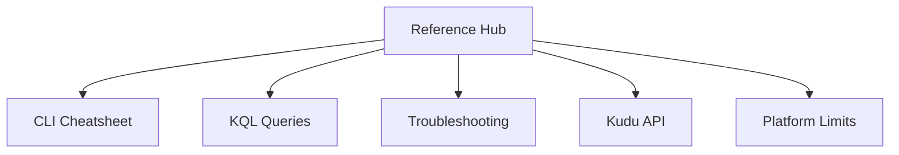

---
hide:
  - toc
content_sources:
  diagrams:
    - id: reference-index-diagram-1
      type: flowchart
      source: self-generated
      justification: "Self-generated reference diagram synthesized from official Azure App Service documentation for this guide."
      based_on:
        - https://learn.microsoft.com/en-us/azure/app-service/overview
        - https://learn.microsoft.com/en-us/azure/app-service/troubleshoot-diagnostic-logs
---
# Reference

Quick lookup documentation for Azure App Service platform operations and diagnostics.

## Overview

<!-- diagram-id: reference-index-diagram-1 -->

## Documents

| Document | Description |
|----------|-------------|
| [CLI Cheatsheet](cli-cheatsheet.md) | Common Azure CLI commands for app lifecycle, configuration, deployment, and scaling |
| [KQL Queries](kql-queries.md) | Reusable KQL queries for requests, traces, dependencies, exceptions, and platform metrics |
| [Troubleshooting](troubleshooting.md) | Platform-level triage steps for deployment, networking, diagnostics, and incident escalation |
| [Kudu API](kudu-queries.md) | Kudu (SCM) endpoints for process, file system, environment, and deployment diagnostics |
| [Platform Limits](platform-limits.md) | Platform quotas, request/timeout constraints, storage behavior, and scale boundaries |

## Quick Links

| URL | Purpose |
|-----|---------|
| `https://${APP_NAME}.azurewebsites.net` | Application endpoint |
| `https://${APP_NAME}.scm.azurewebsites.net` | Kudu/SCM endpoint |
| `https://${APP_NAME}.scm.azurewebsites.net/webssh/host` | Web SSH session |

## Common Variables

| Variable | Description |
|----------|-------------|
| `$RG` | Resource group name |
| `$APP_NAME` | App Service app name |
| `$PLAN_NAME` | App Service plan name |

## Language-Specific Details

This repository covers platform-level, language-agnostic reference material.
For runtime/framework-specific guidance, see:

- [Azure App Service Node.js Guide](../language-guides/nodejs/index.md)
- [Azure App Service Python Guide](../language-guides/python/index.md)
- [Azure App Service Java Guide](../language-guides/java/index.md)
- [Azure App Service .NET Guide](../language-guides/dotnet/index.md)

## See Also

- [Troubleshooting](../troubleshooting/index.md)
- [Operations](../operations/index.md)
- [Platform](../platform/index.md)
