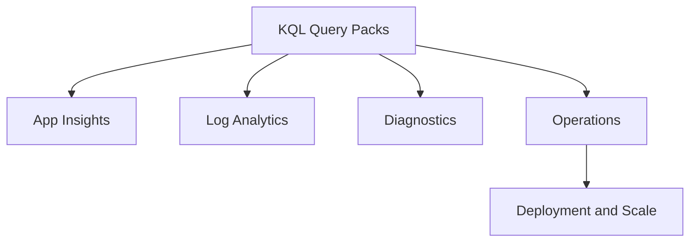
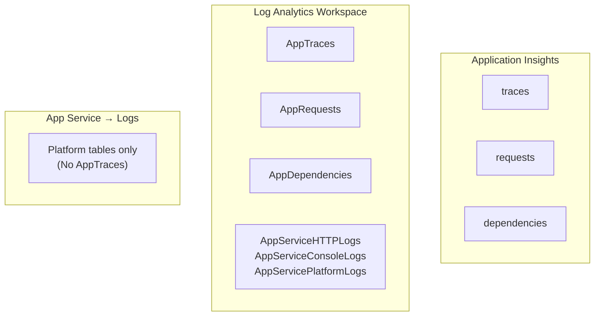

---
content_sources:
  diagrams:
    - id: reference-kql-queries-diagram-1
      type: flowchart
      source: self-generated
      justification: "Self-generated query workflow diagram synthesized from Azure Monitor Logs and Azure App Service diagnostics guidance on Microsoft Learn."
      based_on:
        - https://learn.microsoft.com/en-us/azure/azure-monitor/logs/get-started-queries
        - https://learn.microsoft.com/en-us/azure/app-service/troubleshoot-diagnostic-logs
    - id: reference-kql-queries-diagram-2
      type: flowchart
      source: self-generated
      justification: "Self-generated query workflow diagram synthesized from Azure Monitor Logs and Azure App Service diagnostics guidance on Microsoft Learn."
      based_on:
        - https://learn.microsoft.com/en-us/azure/azure-monitor/logs/get-started-queries
        - https://learn.microsoft.com/en-us/azure/app-service/troubleshoot-diagnostic-logs
---
# KQL Queries Reference

Language-agnostic KQL queries for Azure App Service monitoring, diagnostics, and operations.

## Overview

<!-- diagram-id: reference-kql-queries-diagram-1 -->


## Query Location and Table Names {#table-naming}

!!! warning "Table names differ by query location"
    The same data uses **different table names** depending on where you run the query:
    
    | Query Location | Table Names | Time Column |
    |---|---|---|
    | **Application Insights → Logs** | `traces`, `requests`, `dependencies`, `exceptions` | `timestamp` |
    | **Log Analytics Workspace → Logs** | `AppTraces`, `AppRequests`, `AppDependencies`, `AppExceptions` | `TimeGenerated` |
    | **App Service → Logs** | Platform tables only (`AppServiceHTTPLogs`, etc.) | `TimeGenerated` |

### Where to Run Each Query

<!-- diagram-id: reference-kql-queries-diagram-2 -->


### Example: Same Query, Different Location

**Application Insights → Logs:**
```kql
traces
| where timestamp > ago(30m)
| project timestamp, message, severityLevel
| order by timestamp desc
```

**Log Analytics Workspace → Logs:**
```kql
AppTraces
| where TimeGenerated > ago(30m)
| project TimeGenerated, Message, SeverityLevel
| order by TimeGenerated desc
```

!!! tip "Quick Rule"
    - Portal path includes "Application Insights" → use lowercase (`traces`, `requests`)
    - Portal path includes "Log Analytics" → use PascalCase (`AppTraces`, `AppRequests`)

## Application Insights Queries

### Request volume and success trend
Shows total requests and failures every 5 minutes.
```kql
AppRequests
| where timestamp > ago(6h)
| summarize totalRequests = count(), failedRequests = countif(success == false) by bin(timestamp, 5m)
| extend successRate = (totalRequests - failedRequests) * 100.0 / totalRequests
| order by timestamp asc
```

### Slow request investigation
Lists slow requests with operation IDs for drill-down.
```kql
AppRequests
| where timestamp > ago(2h)
| where duration > 2000
| project timestamp, operation_Id, name, resultCode, duration, cloud_RoleInstance
| order by duration desc
| take 100
```

### Exception trend by type
Tracks exception growth by type over time.
```kql
AppExceptions
| where timestamp > ago(24h)
| summarize exceptionCount = count() by type, bin(timestamp, 30m)
| order by timestamp asc
```

### Dependency failure hotspots
Finds failing outbound dependencies and latency impact.
```kql
AppDependencies
| where timestamp > ago(24h)
| where success == false
| summarize failures = count(), avgDuration = avg(duration), p95Duration = percentile(duration, 95) by type, target, name
| top 20 by failures desc
```

### Request-to-dependency correlation
Connects slow requests to dependency calls in the same operation.
```kql
AppRequests
| where timestamp > ago(2h)
| where duration > 1500
| join kind=leftouter (AppDependencies | project operation_Id, dependencyName = name, dependencyTarget = target, dependencyDuration = duration, dependencySuccess = success) on operation_Id
| project timestamp, operation_Id, requestName = name, requestDuration = duration, dependencyName, dependencyTarget, dependencyDuration, dependencySuccess
| order by requestDuration desc
```

### Error traces with request context
Shows error-level traces alongside related request metadata.
```kql
AppTraces
| where timestamp > ago(4h)
| where severityLevel >= 3
| join kind=leftouter (AppRequests | project operation_Id, requestName = name, resultCode, requestDuration = duration) on operation_Id
| project timestamp, severityLevel, message, requestName, resultCode, requestDuration, operation_Id
| order by timestamp desc
```

### Performance percentile summary
Builds p50/p95/p99 request latency by endpoint.
```kql
AppRequests
| where timestamp > ago(24h)
| summarize p50 = percentile(duration, 50), p95 = percentile(duration, 95), p99 = percentile(duration, 99), total = count() by name
| order by p95 desc
```

## Log Analytics Queries

### HTTP 5xx trend from App Service logs
Shows server error counts from platform HTTP logs.
```kql
AppServiceHTTPLogs
| where TimeGenerated > ago(24h)
| where ScStatus between (500 .. 599)
| summarize errors = count() by bin(TimeGenerated, 10m), ScStatus
| order by TimeGenerated asc
```

### Slow responses from HTTP logs
Finds requests with high processing time.
```kql
AppServiceHTTPLogs
| where TimeGenerated > ago(6h)
| where TimeTaken > 2000
| project TimeGenerated, CsMethod, CsUriStem, ScStatus, TimeTaken, CIp
| order by TimeTaken desc
| take 100
```

### Console error extraction
Surfaces error-like entries from app console logs.
```kql
AppServiceConsoleLogs
| where TimeGenerated > ago(12h)
| where Level has_any ("error", "critical") or ResultDescription has_any ("Exception", "Error", "Failed")
| project TimeGenerated, Level, ResultDescription, _ResourceId
| order by TimeGenerated desc
```

### Platform event timeline
Displays key platform events (startup, recycle, crash, health).
```kql
AppServicePlatformLogs
| where TimeGenerated > ago(24h)
| where Message has_any ("started", "recycled", "failed", "crash", "health")
| project TimeGenerated, Level, Message, _ResourceId
| order by TimeGenerated desc
```

## Diagnostic Queries

### Failed request drill-down
Aggregates failed requests by route and status code.
```kql
AppServiceHTTPLogs
| where TimeGenerated > ago(6h)
| where ScStatus >= 500
| summarize failedCount = count(), avgTimeTaken = avg(TimeTaken), p95TimeTaken = percentile(TimeTaken, 95) by CsUriStem, ScStatus
| order by failedCount desc
```

### Error spike detector
Compares current and previous hour 5xx volume.
```kql
let currentHour = AppServiceHTTPLogs | where TimeGenerated > ago(1h) | where ScStatus between (500 .. 599) | summarize currentCount = count();
let previousHour = AppServiceHTTPLogs | where TimeGenerated between (ago(2h) .. ago(1h)) | where ScStatus between (500 .. 599) | summarize previousCount = count();
currentHour
| extend previousCount = toscalar(previousHour)
| extend changePercent = iif(previousCount == 0, 100.0, (currentCount - previousCount) * 100.0 / previousCount)
```

## Operational Queries

### Deployment tracking
Shows deployment-related platform log events.
```kql
AppServicePlatformLogs
| where TimeGenerated > ago(7d)
| where Message has_any ("deployment", "deploy", "package", "zipdeploy")
| project TimeGenerated, Level, Message, _ResourceId
| order by TimeGenerated desc
```

### Scaling event timeline
Finds scale out/in and worker-count events.
```kql
AppServicePlatformLogs
| where TimeGenerated > ago(7d)
| where Message has_any ("scale", "instance", "worker", "autoscale")
| summarize events = count() by bin(TimeGenerated, 30m)
| order by TimeGenerated asc
```

### Health check failures
Finds non-success responses on health endpoints.
```kql
AppServiceHTTPLogs
| where TimeGenerated > ago(24h)
| where CsUriStem has "/health"
| where ScStatus >= 400
| project TimeGenerated, CsMethod, CsUriStem, ScStatus, TimeTaken, ComputerName
| order by TimeGenerated desc
```

## How to Run

Run queries in **Application Insights > Logs** or **Log Analytics Workspace > Logs**.

```bash
az monitor app-insights query --app $APP_NAME --resource-group $RG --analytics-query "AppRequests | where timestamp > ago(1h) | take 10"
```

## See Also

- [CLI Cheatsheet](cli-cheatsheet.md)
- [Troubleshooting Reference](troubleshooting.md)

## Sources

- [Kusto Query Language Overview](https://learn.microsoft.com/azure/data-explorer/kusto/query/)
- [Application Insights Data Model](https://learn.microsoft.com/azure/azure-monitor/app/data-model-complete)
- [App Service Diagnostics and Logging](https://learn.microsoft.com/azure/app-service/troubleshoot-diagnostic-logs)
