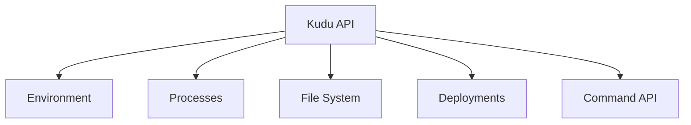

---
hide:
  - toc
content_sources:
  diagrams:
    - id: reference-kudu-queries-diagram-1
      type: flowchart
      source: self-generated
      justification: "Self-generated reference diagram synthesized from official Azure App Service documentation for this guide."
      based_on:
        - https://learn.microsoft.com/en-us/azure/app-service/resources-kudu
---
# Kudu API Reference

Quick reference for Kudu (SCM) endpoints used to diagnose and operate Azure App Service apps.

## Overview

<!-- diagram-id: reference-kudu-queries-diagram-1 -->


## Base URL and Authentication

Kudu endpoint format:

```text
https://$APP_NAME.scm.azurewebsites.net
```

Use deployment credentials (publishing profile/user-level deployment credentials) with Basic authentication.

```bash
KUDU_BASE="https://$APP_NAME.scm.azurewebsites.net"
AUTH_USER="<deployment-user>"
AUTH_PASS="<deployment-password>"
```

## Common Endpoints

All paths below are relative to `$KUDU_BASE/api/`.

| Endpoint | Method | Purpose |
| :--- | :--- | :--- |
| `environment` | GET | Environment variables and platform metadata |
| `processes` | GET | List running processes |
| `processes/{id}` | GET | Show single process details |
| `processes/{id}` | DELETE | Kill process |
| `processes/{id}/dump` | POST | Generate process dump |
| `vfs/{path}` | GET/PUT/DELETE | File operations in virtual file system |
| `zip/{path}` | GET/PUT | Download/upload folder as ZIP |
| `deployments` | GET | Deployment history |
| `deployments/latest` | GET | Latest deployment metadata |
| `deployments/{id}/log` | GET | Deployment log records |
| `command` | POST | Execute shell command |
| `settings` | GET | Kudu settings (including `scmType`) |

## Process and Environment Queries

### List processes

```bash
curl -s -u "$AUTH_USER:$AUTH_PASS" \
  "$KUDU_BASE/api/processes"
```

### Inspect a process

```bash
curl -s -u "$AUTH_USER:$AUTH_PASS" \
  "$KUDU_BASE/api/processes/<pid>"
```

### Dump process

```bash
curl -s -X POST -u "$AUTH_USER:$AUTH_PASS" \
  "$KUDU_BASE/api/processes/<pid>/dump"
```

### Read environment

```bash
curl -s -u "$AUTH_USER:$AUTH_PASS" \
  "$KUDU_BASE/api/environment"
```

## File System and Logs

### Browse persistent storage

```bash
curl -s -u "$AUTH_USER:$AUTH_PASS" \
  "$KUDU_BASE/api/vfs/home/"
```

### Browse logs

```bash
curl -s -u "$AUTH_USER:$AUTH_PASS" \
  "$KUDU_BASE/api/vfs/LogFiles/"
```

### Download log file

```bash
curl -L -u "$AUTH_USER:$AUTH_PASS" \
  "$KUDU_BASE/api/vfs/LogFiles/application/app.log" \
  --output app.log
```

## Deployment Diagnostics

### List deployments

```bash
curl -s -u "$AUTH_USER:$AUTH_PASS" \
  "$KUDU_BASE/api/deployments"
```

### Latest deployment

```bash
curl -s -u "$AUTH_USER:$AUTH_PASS" \
  "$KUDU_BASE/api/deployments/latest"
```

### Deployment logs

```bash
curl -s -u "$AUTH_USER:$AUTH_PASS" \
  "$KUDU_BASE/api/deployments/<deployment-id>/log"
```

## Command API

### Run command in app root

```bash
curl -s -u "$AUTH_USER:$AUTH_PASS" \
  -H "Content-Type: application/json" \
  -d '{"command":"ls -la","dir":"/home/site/wwwroot"}' \
  "$KUDU_BASE/api/command"
```

!!! warning "Credential safety"
    Do not commit deployment credentials into source control.
    Rotate publishing credentials after incidents or suspected exposure.

## Frequently Used Paths

| Path | Description |
| :--- | :--- |
| `/home/site/wwwroot` | Current deployed site content |
| `/home/LogFiles` | Application, platform, and deployment logs |
| `/home/data` | Persistent data directory |
| `/tmp` | Temporary storage (ephemeral) |

## See Also

- [Troubleshooting Reference](troubleshooting.md)
- [CLI Cheatsheet](cli-cheatsheet.md)

## Sources

- [Kudu in Azure App Service (Microsoft Learn)](https://learn.microsoft.com/azure/app-service/resources-kudu)
- [App Service Diagnostics Overview (Microsoft Learn)](https://learn.microsoft.com/azure/app-service/overview-diagnostics)

## Language-Specific Details

Kudu endpoint usage is platform-level and shared across stacks. For runtime-specific checks (for example, stack-specific startup artifacts), see:

- [Azure App Service Node.js Guide — Reference](../language-guides/nodejs/index.md)
- [Azure App Service Python Guide — Reference](../language-guides/python/index.md)
