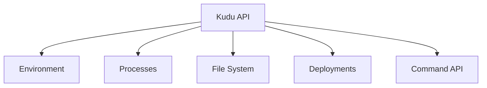

---
content_sources:
  diagrams:
  - id: reference-kudu-queries-diagram-1
    type: flowchart
    source: self-generated
    justification: Self-generated reference diagram synthesized from official Azure
      App Service documentation for this guide.
    based_on:
    - https://learn.microsoft.com/en-us/azure/app-service/resources-kudu
---
# Kudu API Reference

Quick reference for Kudu (SCM) endpoints used to diagnose and operate Azure App Service apps.

## Overview

<!-- diagram-id: reference-kudu-queries-diagram-1 -->

```mermaid
flowchart TD
    A[Kudu API] --> B[Environment]
    A --> C[Processes]
    A --> D[File System]
    A --> E[Deployments]
    A --> F[Command API]
```

## Base URL and Authentication

Kudu endpoint format:

```text
https://$APP_NAME.scm.azurewebsites.net
```

Use deployment credentials (publishing profile/user-level deployment credentials) with Basic authentication.

!!! warning "Linux custom container caveat"
    For Linux custom containers, the SCM/Kudu site runs in a separate container from the main app container. Kudu can still help with deployment metadata and shared log locations, but it cannot directly inspect the app container's live filesystem or running processes. Use SSH into the app container or application/container logs for runtime investigation.

```bash
KUDU_BASE="https://$APP_NAME.scm.azurewebsites.net"
AUTH_USER="<deployment-user>"
AUTH_PASS="<deployment-password>"
```

## Common Endpoints

All paths below are relative to `$KUDU_BASE/api/`.

| Endpoint | Method | Purpose |
| :--- | :--- | :--- |
| `environment` | GET | Environment variables and platform metadata |
| `processes` | GET | List running processes |
| `processes/{id}` | GET | Show single process details |
| `processes/{id}` | DELETE | Kill process |
| `processes/{id}/dump` | POST | Generate process dump |
| `vfs/{path}` | GET/PUT/DELETE | File operations in virtual file system |
| `zip/{path}` | GET/PUT | Download/upload folder as ZIP |
| `deployments` | GET | Deployment history |
| `deployments/latest` | GET | Latest deployment metadata |
| `deployments/{id}/log` | GET | Deployment log records |
| `command` | POST | Execute shell command |
| `settings` | GET | Kudu settings (including `scmType`) |

## Process and Environment Queries

### List processes

For Linux custom containers, this shows SCM-container processes, not the main app container process list.

```bash
curl -s -u "$AUTH_USER:$AUTH_PASS" \
  "$KUDU_BASE/api/processes"
```

### Inspect a process

```bash
curl -s -u "$AUTH_USER:$AUTH_PASS" \
  "$KUDU_BASE/api/processes/<pid>"
```

### Dump process

```bash
curl -s -X POST -u "$AUTH_USER:$AUTH_PASS" \
  "$KUDU_BASE/api/processes/<pid>/dump"
```

### Read environment

```bash
curl -s -u "$AUTH_USER:$AUTH_PASS" \
  "$KUDU_BASE/api/environment"
```

## File System and Logs

### Browse persistent storage

For Linux custom containers, treat this as SCM/shared storage inspection, not a full view into the app container filesystem.

```bash
curl -s -u "$AUTH_USER:$AUTH_PASS" \
  "$KUDU_BASE/api/vfs/home/"
```

### Browse logs

```bash
curl -s -u "$AUTH_USER:$AUTH_PASS" \
  "$KUDU_BASE/api/vfs/LogFiles/"
```

### Download log file

```bash
curl -L -u "$AUTH_USER:$AUTH_PASS" \
  "$KUDU_BASE/api/vfs/LogFiles/application/app.log" \
  --output app.log
```

## Deployment Diagnostics

### List deployments

```bash
curl -s -u "$AUTH_USER:$AUTH_PASS" \
  "$KUDU_BASE/api/deployments"
```

### Latest deployment

```bash
curl -s -u "$AUTH_USER:$AUTH_PASS" \
  "$KUDU_BASE/api/deployments/latest"
```

### Deployment logs

```bash
curl -s -u "$AUTH_USER:$AUTH_PASS" \
  "$KUDU_BASE/api/deployments/<deployment-id>/log"
```

## Command API

### Run command in app root

```bash
curl -s -u "$AUTH_USER:$AUTH_PASS" \
  -H "Content-Type: application/json" \
  -d '{"command":"ls -la","dir":"/home/site/wwwroot"}' \
  "$KUDU_BASE/api/command"
```

!!! warning "Credential safety"
    Do not commit deployment credentials into source control.
    Rotate publishing credentials after incidents or suspected exposure.

## Frequently Used Paths

| Path | Description |
| :--- | :--- |
| `/home/site/wwwroot` | Current deployed site content |
| `/home/LogFiles` | Application, platform, and deployment logs |
| `/home/data` | Persistent data directory |
| `/tmp` | Temporary storage (ephemeral) |

## Run It in the Portal

#### Portal view: Web App Overview blade (Kudu entry point in left nav)

![Azure portal Overview blade for `app-test-20251107` (Web App) with a command bar (`Browse`, `Stop`, `Swap`, `Restart`, `Delete`, `Refresh`, `Download publish profile`, `Reset publish profile`, `Share to mobile`, `Send us your feedback`) and an Essentials panel showing Resource group `rg-test-20251107`, Status `Running`, Location `Korea Central`, Subscription `Visual Studio Enterprise Subscription`, Subscription ID `00000000-0000-0000-0000-000000000000`, Default domain `app-test-20251107.azurewebsites.net`, App Service Plan `asp-test-20251107 (P0v3: 1)`, Operating System `Linux`, and Health Check `Not Configured`. The Properties tab is selected (next to Monitoring, Logs, Capabilities, Notifications (1), Recommendations) and surfaces Web app (`Publishing model: Code`, `Runtime Stack: Python - 3.11`, `Runtime status: Healthy`), Domains (`2 Domains View all`), Hosting (`Plan Type: App Service plan`, `Instance Count: 1`, `SKU and size: Premium0V3 (P0v3)` with `Scale up` link), Deployment Center (`Last deployment: Successful on Thursday, November 6, 10:58:01 PM`, `Deployment provider: None`), Application Insights (`Name: ai-test-20251107`, `Region: Korea Central`), and Networking (`Inbound IP addresses: 20.200.197.3, 2603:1040:f05:3::208`, `Private endpoint connections: 0 private endpoints`, `Virtual network integration: Not configured`). Left nav under the search box lists Overview (selected), Activity log, Access control (IAM), Tags, Diagnose and solve problems, Microsoft Defender for Cloud, Events (preview), Log stream, AI (preview), Resource visualizer, with collapsed groups Deployment, Settings, Performance, App Service plan, Development Tools, API, Monitoring, Automation, and Support + troubleshooting.](../assets/platform/architecture/01-app-service-overview.png)

Use this Overview blade to confirm the app identity before switching to the Kudu endpoints in this reference. The visible `Default domain` shows the app hostname, so the matching SCM hostname for this app is `app-test-20251107.scm.azurewebsites.net`, and the Properties tab confirms this is a Linux `Python - 3.11` code app on `asp-test-20251107 (P0v3: 1)`. The left nav also shows the collapsed `Development Tools` area associated with Kudu-based diagnostics, and the Deployment Center `Last deployment` field is a quick portal cross-check when you compare portal state with deployment-history API results. Use this blade as the confirmation point for app, plan, OS, and deployment state before moving into SCM-specific investigation.

## See Also

- [Troubleshooting Reference](troubleshooting.md)
- [CLI Cheatsheet](cli-cheatsheet.md)

## Sources

- [Kudu in Azure App Service (Microsoft Learn)](https://learn.microsoft.com/azure/app-service/resources-kudu)
- [App Service Diagnostics Overview (Microsoft Learn)](https://learn.microsoft.com/azure/app-service/overview-diagnostics)

## Language-Specific Details

Kudu endpoint usage is platform-level and shared across stacks. For runtime-specific checks (for example, stack-specific startup artifacts), see:

- [Azure App Service Node.js Guide — Reference](../language-guides/nodejs/index.md)
- [Azure App Service Python Guide — Reference](../language-guides/python/index.md)
