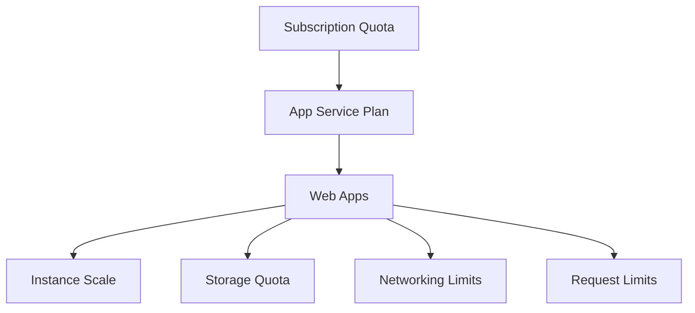

---
hide:
  - toc
---

# Platform Limits & Quotas

Quick reference for common Azure App Service platform limits and quota-related behaviors.

## Overview

## Request Limits

| Limit | Typical Value | Notes |
| :--- | :--- | :--- |
| **Frontend HTTP timeout** | **230 seconds** | Enforced by App Service frontend/load balancer for synchronous HTTP requests. |
| **Max request body** | **128 MB** | Applies to common HTTP request payloads on App Service. |
| **URL length** | **8192 characters** | Practical upper bound for request URL length. |

## Scale and Plan Limits

| Tier | Max Instances (Typical) | Deployment Slots (Typical) | Always On |
| :--- | :--- | :--- | :--- |
| **Free (F1)** | 1 | 0 | No |
| **Basic (B1)** | 3 | 0 | No |
| **Standard (S1)** | 10 | 5 | Yes |
| **Premium (P1V3 and above)** | 30+ | 20 | Yes |

!!! note "Regional and SKU variation"
    Effective limits can vary by region, subscription, and SKU generation.
    Validate current values in Microsoft Learn and in your subscription quotas.

## Storage and File System

| Area | Behavior | Notes |
| :--- | :--- | :--- |
| **`/home`** | Persistent | Survives restarts and redeployments |
| **`/tmp`** | Ephemeral | Reclaimed across restarts/reimages |
| **Logs (`/home/LogFiles`)** | Persistent and quota-counted | Large log volume can consume storage quota |

## Deployment and Configuration Limits

| Limit | Value | Notes |
| :--- | :--- | :--- |
| **Max app settings** | **10,000** | Environment variables and configuration entries |
| **ZIP deploy upload size** | **2048 MB** | CLI/Kudu ZIP deploy package limit |
| **Slot settings scope** | Per-slot | Mark sensitive values as slot settings |

## Networking and Connections

| Limit/Behavior | Value / Pattern | Notes |
| :--- | :--- | :--- |
| **SNAT ports per instance (common)** | **128** | Outbound-heavy apps can exhaust ports |
| **Outbound IPs** | Multiple, can change | Use `possibleOutboundIpAddresses` for allowlists |
| **WebSocket and long-lived connections** | Tier-dependent | Higher tiers support greater concurrency |

## Diagnostics and Retention

| Area | Typical Range | Notes |
| :--- | :--- | :--- |
| **Filesystem log retention** | 30–90 days | Depends on storage/log configuration |
| **Live log streaming session** | Time-limited | Streams may disconnect on inactivity |
| **Application Insights retention** | Configurable | Affects cost and forensic depth |

## Limit-Driven Symptoms

- Intermittent outbound failures under load (possible SNAT pressure)
- Sudden 5xx spikes with no code change (plan/resource saturation)
- Failed uploads or deployments due to artifact size
- Missing files due to writing into ephemeral paths
- Slow or dropped long-running HTTP requests over frontend timeout

## See Also

- [CLI Cheatsheet](cli-cheatsheet.md)
- [KQL Queries](kql-queries.md)

## Sources

- [Azure App Service Limits (Microsoft Learn)](https://learn.microsoft.com/azure/azure-resource-manager/management/azure-subscription-service-limits#app-service-limits)
- [App Service Plan Overview (Microsoft Learn)](https://learn.microsoft.com/azure/app-service/overview-hosting-plans)
- [Best Practices for App Service (Microsoft Learn)](https://learn.microsoft.com/azure/app-service/app-service-best-practices)

## Language-Specific Details

Language/runtime behavior (for example, worker model, memory profile, and startup semantics) can change how these limits are experienced in practice.
See:

- [Azure App Service Node.js Guide — Reference](../language-guides/nodejs/index.md)
- [Azure App Service Python Guide — Reference](../language-guides/python/index.md)
