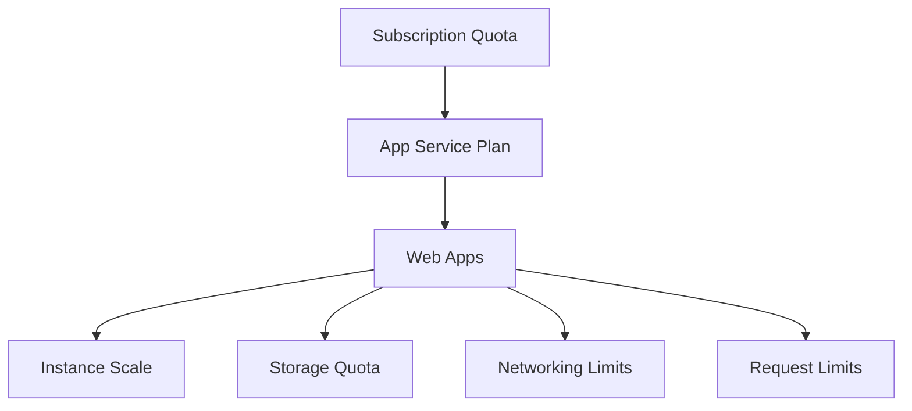

---
content_sources:
  diagrams:
    - id: reference-platform-limits-diagram-1
      type: graph
      source: self-generated
      justification: Self-generated reference diagram synthesized from official Azure App Service documentation for this guide.
      based_on:
        - https://learn.microsoft.com/en-us/azure/app-service/overview
        - https://learn.microsoft.com/en-us/azure/app-service/troubleshoot-diagnostic-logs
---
# Platform Limits & Quotas

Quick reference for common Azure App Service platform limits and quota-related behaviors.

## Overview

<!-- diagram-id: reference-platform-limits-diagram-1 -->

```mermaid
graph TD
    A[Subscription Quota] --> B[App Service Plan]
    B --> C[Web Apps]
    C --> D[Instance Scale]
    C --> E[Storage Quota]
    C --> F[Networking Limits]
    C --> G[Request Limits]
```

## Request Limits

| Limit | Typical Value | Notes | Source |
| :--- | :--- | :--- | :--- |
| **Frontend HTTP timeout** | **230 seconds** | Enforced by the App Service frontend for synchronous HTTP requests on Windows apps; Linux apps are documented as approximately 240 seconds. | [Web request times out in App Service](https://learn.microsoft.com/en-us/troubleshoot/azure/app-service/web-request-times-out-app-service) |
| **Max request body** | **128 MB** | [Requires verification] This guide does not currently have an App Service-specific Microsoft Learn source for a platform-wide 128 MB limit. Request body limits vary by runtime and web server. | [Request Limits &lt;requestLimits&gt; (IIS)](https://learn.microsoft.com/en-us/iis/configuration/system.webserver/security/requestfiltering/requestlimits/) [Stack-specific] |
| **URL length** | **8192 characters** | [Requires verification] No App Service-specific Microsoft Learn source was found for a universal 8192-character limit. URL limits vary by stack and front-end/server behavior. | [Request Limits &lt;requestLimits&gt; (IIS)](https://learn.microsoft.com/en-us/iis/configuration/system.webserver/security/requestfiltering/requestlimits/) [Stack-specific] |

## Scale and Plan Limits

| Tier | Max Instances (Typical) | Deployment Slots (Typical) | Always On | Source |
| :--- | :--- | :--- | :--- | :--- |
| **Free (F1)** | 1 | 0 | No | [Azure App Service limits](https://learn.microsoft.com/en-us/azure/azure-resource-manager/management/azure-subscription-service-limits#app-service-limits) |
| **Basic (B1)** | 3 | 0 | No | [Azure App Service limits](https://learn.microsoft.com/en-us/azure/azure-resource-manager/management/azure-subscription-service-limits#app-service-limits) |
| **Standard (S1)** | 10 | 5 | Yes | [Azure App Service limits](https://learn.microsoft.com/en-us/azure/azure-resource-manager/management/azure-subscription-service-limits#app-service-limits) |
| **Premium (P1V3 and above)** | 30+ | 20 | Yes | [Azure App Service limits](https://learn.microsoft.com/en-us/azure/azure-resource-manager/management/azure-subscription-service-limits#app-service-limits) |

!!! note "Regional and SKU variation"
    Effective limits can vary by region, subscription, and SKU generation.
    Validate current values in Microsoft Learn and in your subscription quotas.

## Storage and File System

| Area | Behavior | Notes |
| :--- | :--- | :--- |
| **`/home`** | Persistent | Survives restarts and redeployments |
| **`/tmp`** | Ephemeral | Reclaimed across restarts/reimages |
| **Logs (`/home/LogFiles`)** | Persistent and quota-counted | Large log volume can consume storage quota |

## Deployment and Configuration Limits

| Limit | Value | Notes | Source |
| :--- | :--- | :--- | :--- |
| **Max app settings** | **10,000** | [Requires verification] This guide does not currently have a Microsoft Learn source that documents a hard App Service limit of 10,000 settings. Environment block and runtime constraints can be stack-specific. | [Configure an App Service app](https://learn.microsoft.com/en-us/azure/app-service/configure-common) [Requires verification] |
| **ZIP deploy upload size** | **2048 MB** | CLI/Kudu ZIP deploy package limit. | [Deploy files to Azure App Service](https://learn.microsoft.com/en-us/azure/app-service/deploy-zip) |
| **Slot settings scope** | Per-slot | Mark sensitive values as slot settings. | [Configure an App Service app](https://learn.microsoft.com/en-us/azure/app-service/configure-common#configure-app-settings) |

## Networking and Connections

| Limit/Behavior | Value / Pattern | Notes | Source |
| :--- | :--- | :--- | :--- |
| **SNAT ports per instance (common)** | **128** | Outbound-heavy apps can exhaust ports. | [Troubleshoot intermittent outbound connection errors](https://learn.microsoft.com/en-us/azure/app-service/troubleshoot-intermittent-outbound-connection-errors) |
| **Outbound IPs** | Multiple, can change | Use `possibleOutboundIpAddresses` for allowlists. | [Azure App Service limits](https://learn.microsoft.com/en-us/azure/azure-resource-manager/management/azure-subscription-service-limits#app-service-limits) |
| **WebSocket and long-lived connections** | Tier-dependent | Higher tiers support greater concurrency. | [Azure App Service limits](https://learn.microsoft.com/en-us/azure/azure-resource-manager/management/azure-subscription-service-limits#app-service-limits) |

## Diagnostics and Retention

| Area | Typical Range | Notes | Source |
| :--- | :--- | :--- | :--- |
| **Filesystem log retention** | 30–90 days | [Requires verification] Retention depends on storage usage and log configuration; no single App Service platform default was verified for this range. | [Enable diagnostic logging for apps in Azure App Service](https://learn.microsoft.com/en-us/azure/app-service/troubleshoot-diagnostic-logs) [Requires verification] |
| **Live log streaming session** | Time-limited | Streams may disconnect on inactivity. | [Enable diagnostic logging for apps in Azure App Service](https://learn.microsoft.com/en-us/azure/app-service/troubleshoot-diagnostic-logs) |
| **Application Insights retention** | Configurable | Affects cost and forensic depth. | [Manage usage and costs for Application Insights](https://learn.microsoft.com/en-us/azure/azure-monitor/app/pricing) |

## Limit-Driven Symptoms

- Intermittent outbound failures under load (possible SNAT pressure)
- Sudden 5xx spikes with no code change (plan/resource saturation)
- Failed uploads or deployments due to artifact size
- Missing files due to writing into ephemeral paths
- Slow or dropped long-running HTTP requests over frontend timeout

## Run It in the Portal

#### Portal view: Scale up (App Service plan) blade

[[[ shot("platform--scaling--02-scale-up") ]]]

The `Scale up (App Service plan)` blade is where you compare the plan SKUs that drive most of the limits in the Scale and Plan Limits table above. This capture shows the `Hardware view` table grouped into `Dev/Test`, `Production`, and `Legacy`, with the selected `Premium v3 P0V3` row exposing the per-plan fields that matter operationally: `vCPU`, `Memory (GB)`, `Remote Storage (GB)`, `Scale (instance)`, and SLA. Because the blade is scoped to the App Service plan rather than the individual web app, it is the right place to confirm whether plan tier and per-instance capacity are part of a saturation or quota problem. Use this view to verify the current plan family and worker size before concluding that a symptom is application-only.

## See Also

- [CLI Cheatsheet](cli-cheatsheet.md)
- [KQL Queries](kql-queries.md)

## Sources

- [Azure App Service Limits (Microsoft Learn)](https://learn.microsoft.com/en-us/azure/azure-resource-manager/management/azure-subscription-service-limits#app-service-limits)
- [App Service Plan Overview (Microsoft Learn)](https://learn.microsoft.com/en-us/azure/app-service/overview-hosting-plans)
- [Best Practices for App Service (Microsoft Learn)](https://learn.microsoft.com/en-us/azure/app-service/app-service-best-practices)

## Language-Specific Details

Language/runtime behavior (for example, worker model, memory profile, and startup semantics) can change how these limits are experienced in practice.
See:

- [Azure App Service Node.js Guide — Reference](../language-guides/nodejs/index.md)
- [Azure App Service Python Guide — Reference](../language-guides/python/index.md)
