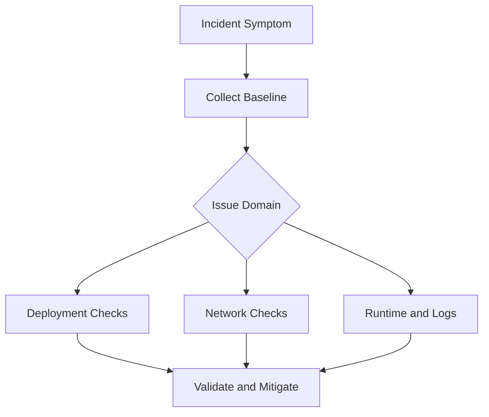

---
content_sources:
  diagrams:
  - id: reference-troubleshooting-diagram-1
    type: flowchart
    source: self-generated
    justification: Self-generated troubleshooting diagram synthesized from Microsoft
      Learn diagnostics and Azure App Service incident guidance for this guide.
    based_on:
    - https://learn.microsoft.com/en-us/azure/app-service/troubleshoot-diagnostic-logs
    - https://learn.microsoft.com/en-us/azure/app-service/troubleshoot-http-502-http-503
content_validation:
  status: verified
  last_reviewed: '2026-05-23'
  reviewer: agent
  core_claims:
  - claim: This page uses Microsoft Learn as the primary source basis for its Azure-specific
      guidance.
    source: https://learn.microsoft.com/en-us/azure/app-service/troubleshoot-diagnostic-logs
    verified: true
---
# Troubleshooting

Platform-level troubleshooting reference for Azure App Service across runtimes.

## Overview

<!-- diagram-id: reference-troubleshooting-diagram-1 -->

```mermaid
flowchart TD
    A[Incident Symptom] --> B[Collect Baseline]
    B --> C{Issue Domain}
    C --> D[Deployment Checks]
    C --> E[Network Checks]
    C --> F[Runtime and Logs]
    D --> G[Validate and Mitigate]
    E --> G
    F --> G
```

## Diagnostic Tools Overview

| Tool | Purpose | Access |
| :--- | :--- | :--- |
| **Kudu (SCM)** | File system, process, environment, deployment diagnostics | `https://${APP_NAME}.scm.azurewebsites.net` |
| **Log Stream** | Real-time application and container logs | Azure Portal or CLI |
| **Application Insights** | Requests, traces, dependencies, exceptions | Azure Portal |
| **Diagnose and solve problems** | Built-in detectors and recommendations | Azure Portal > Web App |

!!! note "Language-specific debugging"
    This document focuses on App Service platform diagnostics.
    For runtime/framework-specific startup and debugging issues, see the language-specific guides linked in
    [Language-Specific Details](#language-specific-details).

## Fast Triage Commands

```bash
az webapp show --resource-group $RG --name $APP_NAME --output table
az webapp log tail --resource-group $RG --name $APP_NAME
az webapp config appsettings list --resource-group $RG --name $APP_NAME --output table
az webapp deployment slot list --resource-group $RG --name $APP_NAME --output table
```

> **Note:** `az webapp log tail` may not work reliably for Linux App Service. Use the Azure Portal Log stream or `/home/LogFiles` as alternatives.

!!! warning "Linux custom container SCM caveat"
    For Linux custom containers, the SCM/Kudu site runs in a separate container from the app container. That means Kudu cannot directly inspect the app container's live filesystem or running processes. Prefer SSH into the app container, Log stream, or application/container logs when investigating runtime behavior inside a custom container.

## Common Platform Issues

| Symptom | Likely Cause | Action |
| :--- | :--- | :--- |
| **503 Service Unavailable** | Worker process failed or app is restarting | Check log stream, deployment logs, and latest restart events |
| **502 Bad Gateway** | App failed to start or failed health probe | Verify startup command and health check path |
| **Slow responses / timeouts** | Long-running requests, dependency latency, plan saturation | Check request duration, dependency latency, CPU/memory metrics |
| **Disk quota reached** | Logs or generated files filling persistent storage | Clean unnecessary files in `/home/LogFiles` and app data |
| **Intermittent outbound failures** | SNAT port pressure or firewall allowlist mismatch | Reuse connections, review outbound IPs, add NAT Gateway if needed |
| **DNS resolution failures for private endpoints** | Private DNS Zone linkage issue | Verify Private DNS Zone links to integration VNet |

## Deployment Troubleshooting

### Check deployment history

```bash
az webapp log deployment list \
  --resource-group $RG \
  --name $APP_NAME \
  --output table
```

### Check latest deployment details

```bash
az webapp log deployment show \
  --resource-group $RG \
  --name $APP_NAME \
  --deployment-id latest \
  --output json
```

### Validate build-on-deploy setting

```bash
az webapp config appsettings list \
  --resource-group $RG \
  --name $APP_NAME \
  --query "[?name=='SCM_DO_BUILD_DURING_DEPLOYMENT']"
```

## Networking Troubleshooting

### VNet integration status

```bash
az webapp vnet-integration list \
  --resource-group $RG \
  --name $APP_NAME \
  --output table
```

### Route-all check

```bash
az webapp config appsettings list \
  --resource-group $RG \
  --name $APP_NAME \
  --query "[?name=='WEBSITE_VNET_ROUTE_ALL']"
```

Set route-all when required:

```bash
az webapp config appsettings set \
  --resource-group $RG \
  --name $APP_NAME \
  --settings WEBSITE_VNET_ROUTE_ALL=1
```

### Outbound IP allowlist checks

```bash
az webapp show \
  --resource-group $RG \
  --name $APP_NAME \
  --query "{outbound: properties.outboundIpAddresses, possible: properties.possibleOutboundIpAddresses}" \
  --output json
```

!!! warning "Allowlist all possible outbound IPs"
    The active outbound IP set can change as the app scales or moves.
    Add all addresses from `possibleOutboundIpAddresses` to external allowlists.

## Kudu-Based Checks

- Open Kudu: `https://${APP_NAME}.scm.azurewebsites.net`
- Check environment: `/api/environment`
- Check running processes: `/api/processes`
- Review logs under `/home/LogFiles`

For Linux custom containers, use those Kudu checks mainly for deployment context, environment snapshots, and shared logs. Do not assume `/api/processes` or Kudu file browsing reflects the main app container runtime state.

See [Kudu API Reference](./kudu-queries.md) for endpoint details.

## Data to Collect Before Escalation

- UTC time window and affected endpoint(s)
- Correlation/operation ID (if available)
- Recent deployment ID and timestamp
- Plan SKU and current instance count
- Relevant error snippets (PII removed)

## Run It in the Portal

#### Portal view: Diagnose and solve problems blade

![Azure portal Diagnose and solve problems blade for app-test-20251107 with the Common Solutions tab selected (AI-powered Diagnostics (preview) tab also visible) and a top toolbar showing a Search for common problems or tools search box, Refresh, and Feedback. A Risk alerts section shows a single Availability card with 2 Critical alerts and a View more details link. Seven Troubleshooting categories follow. A Popular troubleshooting tools list at the bottom shows Application Logs, App Down Workflow, Web App Down, Web App Slow, and Process Full List. Left nav highlights Diagnose and solve problems.](../assets/troubleshooting/diagnose-and-solve/01-overview.png)

The `Diagnose and solve problems` blade is the Portal counterpart to the Diagnostic Tools Overview table above - it is the one labelled `Built-in detectors and recommendations` and is what the table's `Access` column means by `Azure Portal > Web App`. The visible seven `Troubleshooting categories` map directly to the `## Common Platform Issues` table: `Availability and Performance` covers `503 Service Unavailable` and `Slow responses / timeouts`, `Configuration and Management` covers app-setting and scaling misconfiguration, `Networking` covers `Intermittent outbound failures` and `DNS resolution failures for private endpoints`, and `Deployment` covers deployment-history checks otherwise reached via the `az webapp log deployment list` snippet in `## Deployment Troubleshooting`. The `Risk alerts` panel surfaces `Availability 2 Critical` items that act as the initial signal feeding the `## Fast Triage Commands` workflow - clicking `View more details` is the GUI equivalent of running `az webapp show` and `az webapp log tail` in parallel. The `Popular troubleshooting tools` row (`Application Logs`, `App Down Workflow`, `Web App Down`, `Web App Slow`, `Process Full List`) gives one-click access to the detectors most often needed when `## Data to Collect Before Escalation` is being prepared.

## See Also

- [KQL Queries](kql-queries.md)
- [Kudu Queries](kudu-queries.md)

## Sources

- [Diagnose and Solve Problems in App Service (Microsoft Learn)](https://learn.microsoft.com/azure/app-service/overview-diagnostics)
- [Troubleshoot Diagnostic Logs in App Service (Microsoft Learn)](https://learn.microsoft.com/azure/app-service/troubleshoot-diagnostic-logs)
- [Networking Features in App Service (Microsoft Learn)](https://learn.microsoft.com/azure/app-service/networking-features)

## Language-Specific Details

Runtime-specific startup failures, package/import issues, framework worker tuning, and language-level exception handling are documented in:

- [Azure App Service Node.js Guide — Troubleshooting](../language-guides/nodejs/index.md)
- [Azure App Service Python Guide — Troubleshooting](../language-guides/python/index.md)
