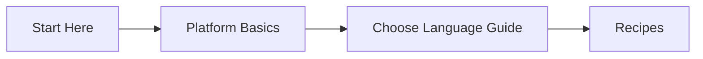
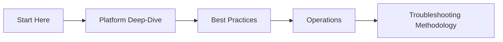
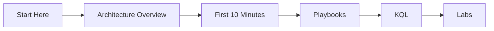

---
hide:
  - toc
content_sources:
  diagrams:
    - id: start-here-learning-paths-diagram-1
      type: graph
      source: self-generated
      justification: "Self-generated navigation diagram synthesized from official Azure App Service overview documentation for this guide."
      based_on:
        - https://learn.microsoft.com/en-us/azure/app-service/overview
    - id: start-here-learning-paths-diagram-2
      type: graph
      source: self-generated
      justification: "Self-generated navigation diagram synthesized from official Azure App Service overview documentation for this guide."
      based_on:
        - https://learn.microsoft.com/en-us/azure/app-service/overview
    - id: start-here-learning-paths-diagram-3
      type: graph
      source: self-generated
      justification: "Self-generated navigation diagram synthesized from official Azure App Service overview documentation for this guide."
      based_on:
        - https://learn.microsoft.com/en-us/azure/app-service/overview
---
# Learning Paths

Choose a role-based path to get productive quickly on Azure App Service. Each path is sequenced from fundamentals to execution so you can move from understanding to validated outcomes.

## Path Selection

| Path | Best For | Outcome |
|---|---|---|
| Developer Path | Application engineers shipping features | Reliable deployment and runtime practices for one stack |
| Operator Path | SREs and platform operators | Production operations model for scale, recovery, and governance |
| Troubleshooter Path | Incident responders and escalation engineers | Faster symptom-to-root-cause workflow with evidence |

## Developer Path

<!-- diagram-id: start-here-learning-paths-diagram-1 -->

Read in order:

1. [Overview](./overview.md)
2. [How App Service Works](../platform/how-app-service-works.md)
3. [Hosting Models](../platform/hosting-models.md)
4. [Best Practices: Production Baseline](../best-practices/production-baseline.md)
5. Choose one language guide:
    - [Python (Flask)](../language-guides/python/index.md)
    - [Node.js (Express)](../language-guides/nodejs/index.md)
    - [Java (Spring Boot)](../language-guides/java/index.md)
    - [.NET (ASP.NET Core)](../language-guides/dotnet/index.md)
6. Continue with stack recipes:
    - [Python Recipes](../language-guides/python/recipes/index.md)
    - [Node.js Recipes](../language-guides/nodejs/recipes/index.md)
    - [Java Recipes](../language-guides/java/recipes/index.md)
    - [.NET Recipes](../language-guides/dotnet/recipes/index.md)

## Operator Path

<!-- diagram-id: start-here-learning-paths-diagram-2 -->

Read in order:

1. [Overview](./overview.md)
2. Platform deep-dive sequence:
    - [Request Lifecycle](../platform/request-lifecycle.md)
    - [Scaling](../platform/scaling.md)
    - [Networking](../platform/networking.md)
    - [Resource Relationships](../platform/resource-relationships.md)
3. Best Practices sequence:
    - [Production Baseline](../best-practices/production-baseline.md)    - [Scaling](../best-practices/scaling.md)    - [Reliability](../best-practices/reliability.md)    - [Common Anti-Patterns](../best-practices/common-anti-patterns.md)4. Operations sequence:
    - [Operations Index](../operations/index.md)
    - [Scaling Operations](../operations/scaling.md)
    - [Health and Recovery](../operations/health-recovery.md)
    - [Security](../operations/security.md)
5. [Troubleshooting Methodology](../troubleshooting/methodology/troubleshooting-method.md)

## Troubleshooter Path

<!-- diagram-id: start-here-learning-paths-diagram-3 -->

Read in order:

1. [Overview](./overview.md)
2. [Architecture Overview](../troubleshooting/architecture-overview.md)
3. [First 10 Minutes](../troubleshooting/first-10-minutes/index.md)
4. [Playbooks](../troubleshooting/playbooks/index.md)
5. [KQL Query Packs](../troubleshooting/kql/index.md)
6. [Hands-on Lab Guides](../troubleshooting/lab-guides/index.md)

## See Also

- [Azure App Service Practical Guide](./overview.md)
- [Repository Map](./repository-map.md)
- [Platform](../platform/index.md)
- [Language Guides](../language-guides/index.md)
- [Best Practices](../best-practices/index.md)
- [Operations](../operations/index.md)
- [Troubleshooting](../troubleshooting/index.md)

## Sources

- [Get started with Azure App Service (Microsoft Learn)](https://learn.microsoft.com/azure/app-service/getting-started)
- [Deploy your app to Azure App Service (Microsoft Learn)](https://learn.microsoft.com/azure/app-service/quickstart)
- [Azure App Service documentation hub (Microsoft Learn)](https://learn.microsoft.com/azure/app-service/)
