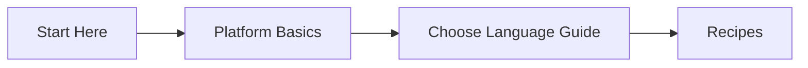
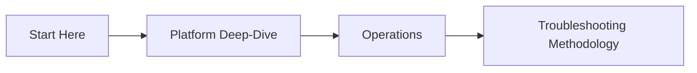
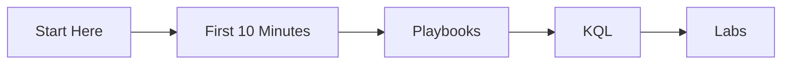

# Learning Paths

Choose a role-based path to get productive quickly on Azure App Service. Each path is sequenced from fundamentals to execution so you can move from understanding to validated outcomes.

## Path Selection

| Path | Best For | Outcome |
|---|---|---|
| Developer Path | Application engineers shipping features | Reliable deployment and runtime practices for one stack |
| Operator Path | SREs and platform operators | Production operations model for scale, recovery, and governance |
| Troubleshooter Path | Incident responders and escalation engineers | Faster symptom-to-root-cause workflow with evidence |

## Developer Path

Read in order:

1. [Overview](./overview.md)
2. [How App Service Works](../platform/how-app-service-works.md)
3. [Hosting Models](../platform/hosting-models.md)
4. Choose one language guide:
   - [Python (Flask)](../language-guides/python/index.md)
   - [Node.js (Express)](../language-guides/nodejs/index.md)
   - [Java (Spring Boot)](../language-guides/java/index.md)
   - [.NET (ASP.NET Core)](../language-guides/dotnet/index.md)
5. Continue with stack recipes:
   - [Python Recipes](../language-guides/python/recipes/)
   - [Node.js Recipes](../language-guides/nodejs/recipes/)
   - [Java Recipes](../language-guides/java/recipes/)
   - [.NET Recipes](../language-guides/dotnet/recipes/)

## Operator Path

Read in order:

1. [Overview](./overview.md)
2. Platform deep-dive sequence:
   - [Request Lifecycle](../platform/request-lifecycle.md)
   - [Scaling](../platform/scaling.md)
   - [Networking](../platform/networking.md)
   - [Resource Relationships](../platform/resource-relationships.md)
3. Operations sequence:
   - [Operations Index](../operations/index.md)
   - [Scaling Operations](../operations/scaling.md)
   - [Health and Recovery](../operations/health-recovery.md)
   - [Security](../operations/security.md)
4. [Troubleshooting Methodology](../troubleshooting/methodology/troubleshooting-method.md)

## Troubleshooter Path

Read in order:

1. [Overview](./overview.md)
2. [First 10 Minutes](../troubleshooting/first-10-minutes/index.md)
3. [Playbooks](../troubleshooting/playbooks/index.md)
4. [KQL Query Packs](../troubleshooting/kql/index.md)
5. [Hands-on Lab Guides](../troubleshooting/lab-guides/index.md)

## See Also

- [Azure App Service Field Guide](./overview.md)
- [Repository Map](./repository-map.md)
- [Platform](../platform/)
- [Language Guides](../language-guides/)
- [Operations](../operations/)
- [Troubleshooting](../troubleshooting/)

## References

- [Get started with Azure App Service (Microsoft Learn)](https://learn.microsoft.com/azure/app-service/getting-started)
- [Deploy your app to Azure App Service (Microsoft Learn)](https://learn.microsoft.com/azure/app-service/quickstart)
- [Azure App Service documentation hub (Microsoft Learn)](https://learn.microsoft.com/azure/app-service/)
