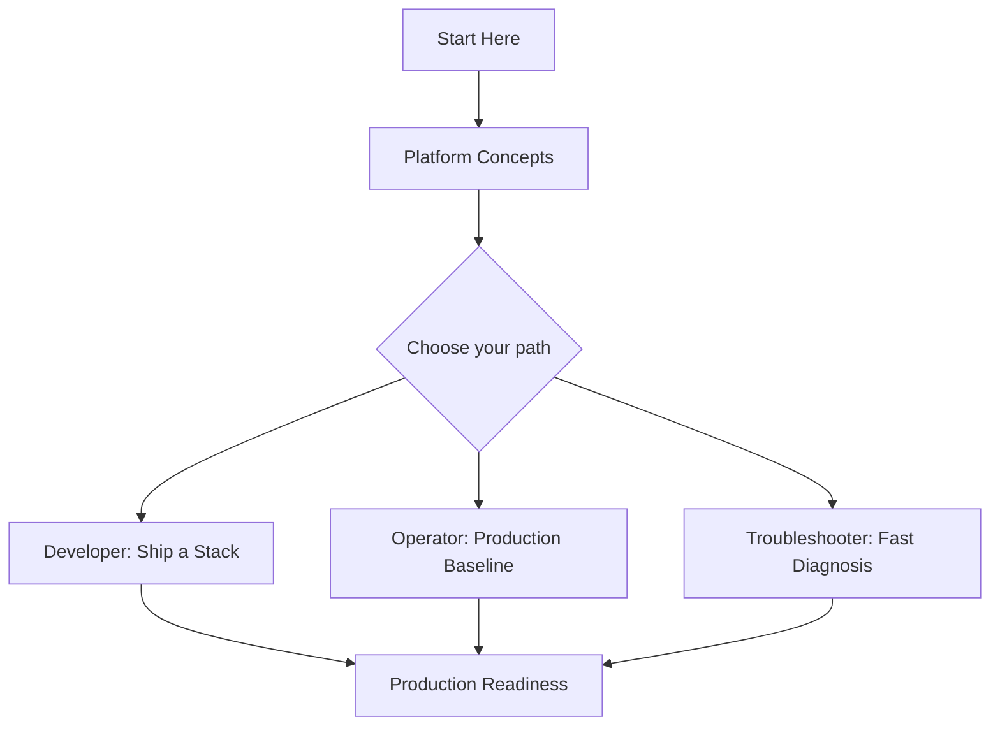
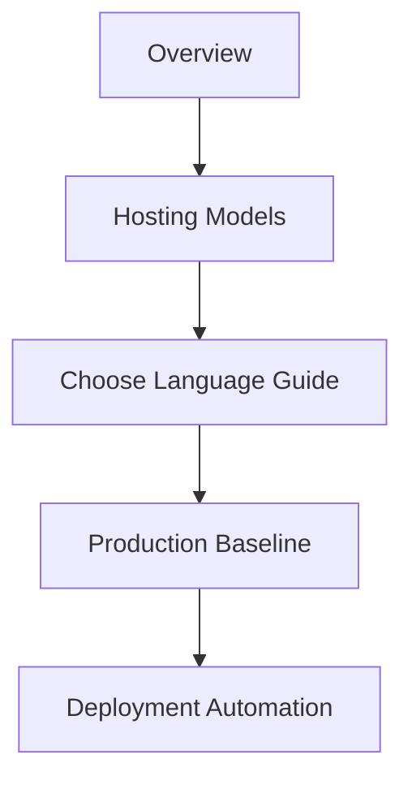
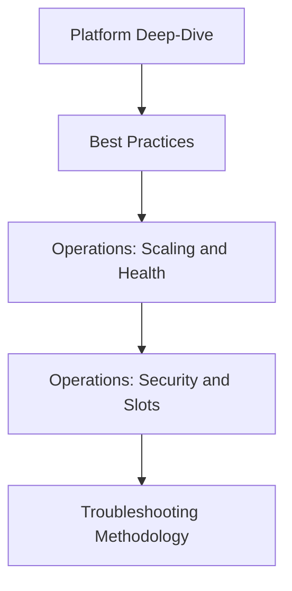
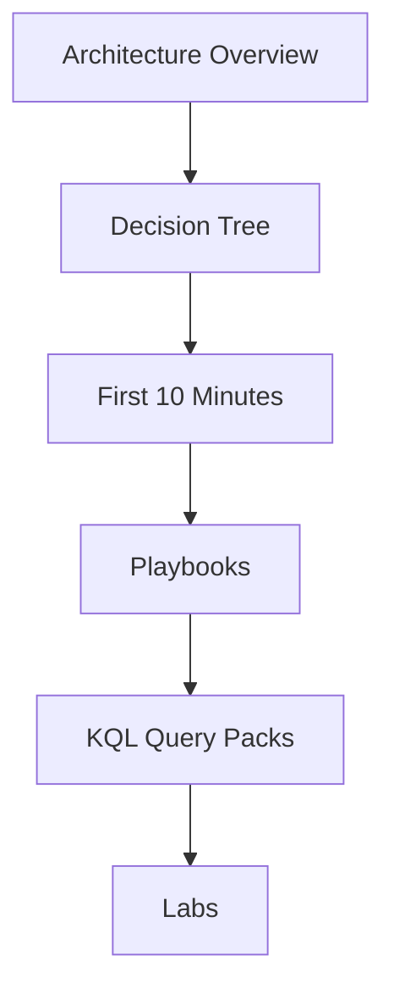

# Learning Paths

Use this page to choose a reading path based on your role and goal. Each path is numbered, so read the pages in order for the best result. Every path ends with a checklist of concrete outcomes you should be able to demonstrate.

!!! tip "Pick one primary path first"
    If you fit multiple roles, pick the one that matches your current goal, complete that path, then read a second path opportunistically. Trying to follow every path in parallel dilutes progress.

## Choose Your Path

| Role | Goal | Time Budget | Start With |
|---|---|---|---|
| **Developer** | Ship a web app on App Service with a chosen stack | 2-3 hours | [Overview](overview.md), [Platform Hub](../platform/index.md) |
| **Operator** | Run App Service in production with scale, recovery, and guardrails | 3-5 hours | [Platform Hub](../platform/index.md), [Operations Hub](../operations/index.md) |
| **Troubleshooter** | Diagnose startup, 5xx, and networking failures fast | 2-4 hours + on-call reference | [Troubleshooting Hub](../troubleshooting/index.md) |

## Recommended Sequence

<!-- diagram-id: appsvc-learning-paths-overview -->

```mermaid
flowchart TD
    A[Start Here] --> B[Platform Concepts]
    B --> C{Choose your path}
    C --> D[Developer: Ship a Stack]
    C --> E[Operator: Production Baseline]
    C --> F[Troubleshooter: Fast Diagnosis]
    D --> G[Production Readiness]
    E --> G
    F --> G
```

## Developer Path

Build and ship a web app on App Service for a chosen runtime. Focuses on hosting choice, per-language ergonomics, and deployment pipelines.

**Time**: 2-3 hours

<!-- diagram-id: appsvc-learning-paths-developer -->

```mermaid
flowchart TD
    A[Overview] --> B[Hosting Models]
    B --> C[Choose Language Guide]
    C --> D[Production Baseline]
    D --> E[Deployment Automation]
```

Read in order:

1. [Overview](overview.md)
2. [Platform: How App Service Works](../platform/architecture/index.md)
3. [Platform: Hosting Models](../platform/hosting-models.md)
4. Choose one language guide:
    - [Python (Flask)](../language-guides/python/index.md)
    - [Node.js (Express)](../language-guides/nodejs/index.md)
    - [Java (Spring Boot)](../language-guides/java/index.md)
    - [.NET (ASP.NET Core)](../language-guides/dotnet/index.md)
5. [Best Practices: Production Baseline](../best-practices/production-baseline.md)
6. [Operations: Deployment](../operations/deployment/index.md) — pick zip-deploy, container-deploy, or GitHub Actions

### Outcomes

- You can deploy a web app in your chosen stack to App Service with the right hosting model.
- You can wire a CI/CD pipeline that promotes through a deployment slot.
- You can read platform logs and diagnostics for your app.
- You know where per-language recipes and runtime notes live.

### Microsoft Learn anchors

- [App Service overview](https://learn.microsoft.com/en-us/azure/app-service/overview)
- [Deploy your app to Azure App Service](https://learn.microsoft.com/en-us/azure/app-service/deploy-continuous-deployment)
- [App Service hosting plans overview](https://learn.microsoft.com/en-us/azure/app-service/overview-hosting-plans)

## Operator Path

Run App Service in production: capacity planning, deployment slots, security posture, and day-2 operations across a portfolio of apps.

**Time**: 3-5 hours

<!-- diagram-id: appsvc-learning-paths-operator -->

```mermaid
flowchart TD
    A[Platform Deep-Dive] --> B[Best Practices]
    B --> C[Operations: Scaling and Health]
    C --> D[Operations: Security and Slots]
    D --> E[Troubleshooting Methodology]
```

Read in order:

1. [Overview](overview.md)
2. Platform deep-dive sequence:
    - [Platform Hub](../platform/index.md)
    - [Request Lifecycle](../platform/request-lifecycle.md)
    - [Scaling](../platform/scaling.md)
    - [Networking](../platform/networking.md)
    - [Resource Relationships](../platform/resource-relationships.md)
3. Best Practices sequence:
    - [Best Practices Hub](../best-practices/index.md)
    - [Production Baseline](../best-practices/production-baseline.md)
    - [Scaling](../best-practices/scaling.md)
    - [Reliability](../best-practices/reliability.md)
    - [Common Anti-Patterns](../best-practices/common-anti-patterns.md)
4. Operations sequence:
    - [Operations Hub](../operations/index.md)
    - [Scaling](../operations/scaling.md)
    - [Health and Recovery](../operations/health-recovery.md)
    - [Deployment Slots](../operations/deployment-slots.md)
    - [Security](../operations/security.md)
    - [Backup and Restore](../operations/backup-restore.md)
5. [Troubleshooting Methodology](../troubleshooting/methodology/troubleshooting-method.md)

### Outcomes

- You can pick a Service Plan tier and scale-out policy that matches a workload profile.
- You can run a slot swap safely and roll back if health degrades.
- You can validate outbound networking and identity configuration for a production app.
- You can define an alert set for the top App Service failure modes.

### Microsoft Learn anchors

- [App Service hosting plans](https://learn.microsoft.com/en-us/azure/app-service/overview-hosting-plans)
- [Scale up an app in Azure App Service](https://learn.microsoft.com/en-us/azure/app-service/manage-scale-up)
- [Set up staging environments in Azure App Service](https://learn.microsoft.com/en-us/azure/app-service/deploy-staging-slots)

## Troubleshooter Path

Diagnose fast during a live incident. Focuses on symptom-to-playbook mapping, evidence collection, and reproducible labs.

**Time**: 2-4 hours + on-call reference

<!-- diagram-id: appsvc-learning-paths-troubleshooter -->

```mermaid
flowchart TD
    A[Architecture Overview] --> B[Decision Tree]
    B --> C[First 10 Minutes]
    C --> D[Playbooks]
    D --> E[KQL Query Packs]
    E --> F[Labs]
```

Read in order:

1. [Troubleshooting Hub](../troubleshooting/index.md)
2. [Architecture Overview](../troubleshooting/architecture-overview.md) and [Mental Model](../troubleshooting/mental-model.md)
3. [Decision Tree](../troubleshooting/decision-tree.md) and [Quick Diagnosis Cards](../troubleshooting/quick-diagnosis-cards.md)
4. First 10 Minutes runbooks:
    - [Startup and Availability](../troubleshooting/first-10-minutes/startup-availability.md)
    - [Outbound Network](../troubleshooting/first-10-minutes/outbound-network.md)
    - [Performance](../troubleshooting/first-10-minutes/performance.md)
5. [Playbooks Hub](../troubleshooting/playbooks/index.md) — startup, deployment, performance, authentication, mTLS, SSL, and more
6. [KQL Query Packs](../troubleshooting/kql/index.md)
7. [Lab Guides](../troubleshooting/lab-guides/index.md) — reproduce and validate failure modes

### Outcomes

- You can run the First 10 Minutes runbook for a common App Service symptom.
- You can select the right playbook from a symptom description without guessing.
- You can write a KQL query that isolates a failure window and its top offenders.
- You can reproduce a lab scenario, apply the fix, and validate falsification evidence.

### Microsoft Learn anchors

- [Overview of diagnostics for Azure App Service](https://learn.microsoft.com/en-us/azure/app-service/overview-diagnostics)
- [Troubleshoot HTTP 502 and 503 errors](https://learn.microsoft.com/en-us/azure/app-service/troubleshoot-http-502-http-503)
- [Enable diagnostics logging](https://learn.microsoft.com/en-us/azure/app-service/troubleshoot-diagnostic-logs)

## Track Selection Matrix

| Situation | Start with | Then continue to |
|---|---|---|
| New engineer onboarding | Developer Path | Operator Path |
| Migrating an existing app to App Service | Developer Path | Operator Path |
| Preparing for launch | Operator Path | Troubleshooter Path |
| Active incident | Troubleshooter Path | Operator Path (hardening) |

!!! tip "Live incident? Skip the path."
    If you are actively responding to a page, jump straight to [Troubleshooting Hub](../troubleshooting/index.md), the [Decision Tree](../troubleshooting/decision-tree.md), and the First 10 Minutes runbooks.

## See Also

- [Overview](overview.md)
- [Scenario Router](scenario-router.md)
- [Repository Map](repository-map.md)
- [Platform Hub](../platform/index.md)
- [Language Guides Hub](../language-guides/index.md)
- [Best Practices Hub](../best-practices/index.md)
- [Operations Hub](../operations/index.md)
- [Troubleshooting Hub](../troubleshooting/index.md)

## Sources

- [Azure App Service overview](https://learn.microsoft.com/en-us/azure/app-service/overview)
- [Get started with Azure App Service](https://learn.microsoft.com/en-us/azure/app-service/getting-started)
- [App Service hosting plans overview](https://learn.microsoft.com/en-us/azure/app-service/overview-hosting-plans)
- [Set up staging environments in Azure App Service](https://learn.microsoft.com/en-us/azure/app-service/deploy-staging-slots)
- [Overview of diagnostics for Azure App Service](https://learn.microsoft.com/en-us/azure/app-service/overview-diagnostics)
