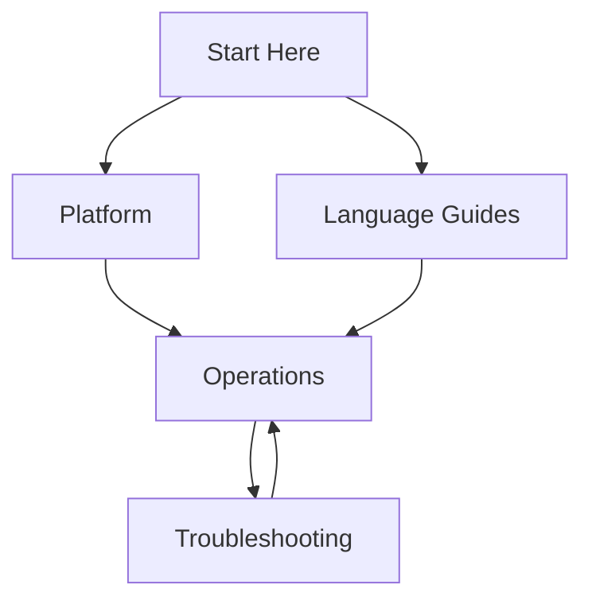

# Azure App Service Field Guide

This repository is a comprehensive field guide for building, deploying, operating, and troubleshooting web applications on Azure App Service. Use this Start Here section to understand the guide layout and choose the right path for your role.

## Guide Scope and Audience

This guide is built for:

- Developers deploying web applications to Azure App Service
- SREs and operators running production workloads
- Troubleshooting engineers resolving incidents under pressure

This is an independent community project. Not affiliated with or endorsed by Microsoft.

## Guide Structure

The documentation is organized into five core sections:

| Section | Purpose | Entry Link |
|---|---|---|
| Start Here | Orientation, learning paths, and repository map | [Start Here](../index.md) |
| Platform | Core App Service architecture and platform behavior | [Platform](../platform/) |
| Language Guides | End-to-end implementation guides by stack | [Language Guides](../language-guides/) |
| Operations | Day-2 operational execution for production | [Operations](../operations/) |
| Troubleshooting | Methodology, playbooks, KQL, and lab scenarios | [Troubleshooting](../troubleshooting/) |

## How to Use This Guide

1. Begin with this section to understand navigation and scope.
2. Read Platform before deep implementation or production hardening.
3. Select one Language Guide for your runtime stack.
4. Move to Operations to establish reliability, security, and scale practices.
5. Use Troubleshooting during incident response and for preventive learning.

## See Also

- [Learning Paths](./learning-paths.md)
- [Repository Map](./repository-map.md)
- [Platform](../platform/)
- [Operations](../operations/)
- [Troubleshooting](../troubleshooting/)
- [Reference](../reference/)

## References

- [Azure App Service overview (Microsoft Learn)](https://learn.microsoft.com/azure/app-service/overview)
- [Azure App Service documentation hub (Microsoft Learn)](https://learn.microsoft.com/azure/app-service/)
