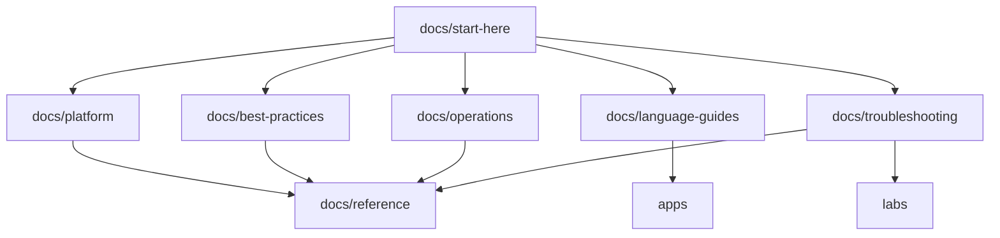

# Repository Map

This page maps the unified repository layout so you can quickly locate architecture guidance, runtime-specific tutorials, operational runbooks, and hands-on labs. Use it as a navigation reference while moving across docs and sample workloads.

## Repository Layout

```text
azure-app-service-practical-guide/
├── docs/
│   ├── start-here/                          # Entry point, orientation, and learning paths
│   ├── platform/                            # Platform architecture and design decisions
│   ├── best-practices/                      # Production patterns and anti-patterns
│   ├── operations/                          # Day-2 operational execution guides
│   ├── language-guides/
│   │   ├── python/                          # Python (Flask) tutorial and recipes
│   │   ├── nodejs/                          # Node.js (Express) tutorial and recipes
│   │   ├── java/                            # Java (Spring Boot) tutorial and recipes
│   │   └── dotnet/                          # .NET (ASP.NET Core) tutorial and recipes
│   ├── troubleshooting/                     # Methodology, first-10-minutes, playbooks, KQL, labs
│   └── reference/                           # CLI cheatsheet, KQL queries, limits, diagnostics reference
├── apps/
│   ├── python-flask/                        # Python reference application
│   ├── nodejs/                              # Node.js reference application
│   ├── java-springboot/                     # Java reference application
│   └── dotnet-aspnetcore/                   # .NET reference application
└── labs/                                    # Troubleshooting lab infrastructure and scenarios (Bicep-based)
```

## Section Responsibilities

- `docs/platform/` — Platform architecture (design decisions)
- `docs/best-practices/` — Production patterns, anti-patterns, and practical guidance
- `docs/operations/` — Day-2 operations (operational execution)
- `docs/language-guides/{python,nodejs,java,dotnet}/` — Language-specific tutorials + recipes
- `docs/troubleshooting/` — Playbooks, checklists, KQL, methodology, lab guides
- `docs/reference/` — CLI cheatsheet, KQL queries, platform limits
- `apps/` — Reference applications (python-flask, nodejs, java-springboot, dotnet-aspnetcore)
- `labs/` — Hands-on troubleshooting labs with Bicep templates



## Navigation Guidance

1. Start in [Start Here](../index.md) to choose role-based learning flow.
2. Use [Platform](../platform/index.md), [Best Practices](../best-practices/index.md), and [Language Guides](../language-guides/index.md) for implementation design.
3. Use [Operations](../operations/index.md) and [Troubleshooting](../troubleshooting/index.md) for production execution.
4. Use [Reference](../reference/index.md) for quick command and query lookups.

## See Also

- [Azure App Service Practical Guide](./overview.md)
- [Learning Paths](./learning-paths.md)
- [Platform](../platform/index.md)
- [Best Practices](../best-practices/index.md)
- [Operations](../operations/index.md)
- [Troubleshooting](../troubleshooting/index.md)
- [Reference](../reference/index.md)

## Sources

- [Azure App Service documentation hub (Microsoft Learn)](https://learn.microsoft.com/azure/app-service/)
- [App Service architecture center (Microsoft Learn)](https://learn.microsoft.com/azure/architecture/web-apps/app-service/)
- [Azure App Service diagnostics overview (Microsoft Learn)](https://learn.microsoft.com/azure/app-service/overview-diagnostics)
