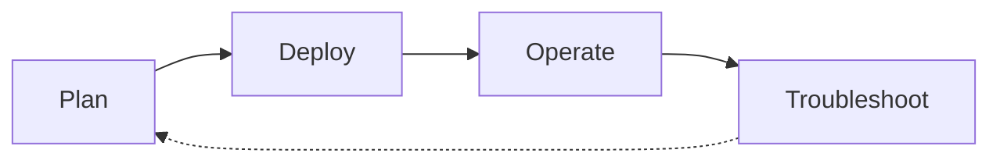

# Scenario Router

Use this page when you have a specific situation and want to jump straight to the page that answers it. This is a breadth-first index across four lifecycle phases — Plan, Deploy, Operate, Troubleshoot — that complements the depth-first [Learning Paths](learning-paths.md) and the symptom-first [Decision Tree](../troubleshooting/decision-tree.md).

!!! tip "Start with Learning Paths if you're new to App Service"
    This page assumes you already know what you're trying to do. If you're still deciding what to learn first, start with [Learning Paths](learning-paths.md) — it sequences a role-based tour of the guide. Use this Scenario Router when you have a specific question and want to jump to the exact page that answers it.

## How to Use This Router

- Pick the table for the lifecycle phase you're in — Plan, Deploy, Operate, or Troubleshoot.
- Scan the left column for the situation that matches yours; open the destination on the right.
- If two rows fit, prefer the row from the phase you're actually in — the same platform concept often appears in more than one phase.
- If your situation spans two phases (a design choice today that will become an incident later), check [Cross-Phase Scenarios](#cross-phase-scenarios) first.
- Every destination is a real page in this guide, not an external link and not an aspirational page.
- Rows are intentionally short. Follow the link for the depth; this table is a switchboard, not a summary.
- If your situation is missing, [open an issue](https://github.com/yeongseon/azure-app-service-practical-guide/issues) — the router is meant to grow.

## Lifecycle Overview

<!-- diagram-id: appsvc-scenario-router-lifecycle -->

## I'm Planning

| Situation | Where to go |
|---|---|
| I'm choosing which learning path to follow | [Learning Paths](learning-paths.md) — role-based reading paths |
| I want to understand App Service platform architecture | [Platform Architecture](../platform/architecture/index.md) — request lifecycle and resource model |
| I'm picking a hosting plan (Basic, Premium, Isolated) | [Hosting Models](../platform/hosting-models.md) — plan tiers and workload fit |
| I'm choosing a deployment option (zip, container, GitHub Actions) | [Deployment Options](../platform/deployment-options.md) — supported deployment methods |
| I'm designing VNet integration, private endpoints, and egress | [Platform Networking](../platform/networking.md) — inbound and outbound topology |
| I'm designing the production baseline (security, slots, health) | [Production Baseline](../best-practices/production-baseline.md) — hardening checklist |
| I'm planning mTLS between clients and the app | [mTLS Best Practices](../best-practices/mtls.md) — client cert design and validation |
| I want to avoid common App Service anti-patterns | [Common Anti-Patterns](../best-practices/common-anti-patterns.md) — what to not do and why |
| I'm picking a language track for a new app | [Language Guides Hub](../language-guides/index.md) — Python, Node.js, Java, .NET |

## I'm Deploying

| Situation | Where to go |
|---|---|
| I want the quickest possible first deploy | [Language Guides Hub](../language-guides/index.md) — pick Python, Node.js, Java, or .NET tutorial |
| I want to see end-to-end deployment topologies | [Deployment Scenarios](../platform/deployment-scenarios.md) — public, VNet-integrated, private-endpoint |
| I'm deploying with zip deploy | [Zip Deploy](../operations/deployment/zip-deploy.md) — CLI, ARM, and pipeline flows |
| I'm wiring GitHub Actions CI/CD | [GitHub Actions Deployment](../operations/deployment/github-actions.md) — federated identity and pipeline templates |
| I'm deploying a container image (Web App for Containers) | [Container Deploy](../operations/deployment/container-deploy.md) — ACR wiring and image update |
| I need deployment slots and slot swap | [Slots and Swap](../operations/deployment/slots-and-swap.md) — pre-warm and swap-with-preview flows |
| I need to configure incoming client certificates | [Incoming Client Certificates](../operations/incoming-client-certificates.md) — mTLS ingress configuration |

## I'm Operating in Production

| Situation | Where to go |
|---|---|
| I need day-2 operational procedures | [Operations Hub](../operations/index.md) — production runbooks |
| I want to follow production best practices | [Best Practices Hub](../best-practices/index.md) — hardening and design guidance |
| I need to scale up or scale out | [Scaling Operations](../operations/scaling.md) — plan tier changes and autoscale rules |
| I need to configure health checks and auto-recovery | [Health and Recovery](../operations/health-recovery.md) — health path, Auto-Heal, and slot swap |
| I need to configure backup and restore | [Backup and Restore](../operations/backup-restore.md) — scheduled backups and recovery |
| I need to manage networking (VNet, PE, DNS) | [Operations: Networking](../operations/networking.md) — day-2 network changes |
| I'm hardening security posture | [Operations: Security](../operations/security.md) — identity, TLS, and Key Vault |
| I need to trust an outbound client certificate | [Outbound Client Certificates](../operations/outbound-client-certificates.md) — mTLS egress configuration |
| I need to control cost across a portfolio | [Cost Optimization](../operations/cost-optimization.md) — right-size plans and slot usage |

## I'm Troubleshooting

| Situation | Where to go |
|---|---|
| I need to systematically diagnose an issue | [Decision Tree](../troubleshooting/decision-tree.md) — hypothesis-driven triage flow |
| I need to know what evidence to collect | [Evidence Map](../troubleshooting/evidence-map.md) — question → KQL + CLI artifact index |
| I want quick pattern-match cards for common symptoms | [Quick Diagnosis Cards](../troubleshooting/quick-diagnosis-cards.md) — one-page symptom cards |
| An incident just started and I have 10 minutes | [First 10 Minutes](../troubleshooting/first-10-minutes/index.md) — ordered triage checklist |
| I need a first-principles method for a novel symptom | [Troubleshooting Method](../troubleshooting/methodology/troubleshooting-method.md) — competing hypotheses framework |
| My app fails to start after deploy | [App Startup Failures](../troubleshooting/playbooks/app-startup-failures.md) — startup log, container port, and warmup |
| My app returns intermittent 5xx under load | [Intermittent 5xx Under Load](../troubleshooting/playbooks/performance/intermittent-5xx-under-load.md) — worker exhaustion and thread starvation |
| My app is under memory pressure or workers keep recycling | [Memory Pressure and Worker Degradation](../troubleshooting/playbooks/performance/memory-pressure-and-worker-degradation.md) — plan tier and GC behavior |
| Outbound calls fail with DNS or private-endpoint routing issues | [PE Custom DNS Route Confusion](../troubleshooting/playbooks/outbound-network/private-endpoint-custom-dns-route-confusion.md) — VNet integration DNS |
| Outbound calls fail with SNAT port exhaustion | [SNAT or Application Issue](../troubleshooting/playbooks/outbound-network/snat-or-application-issue.md) — connection pooling and SNAT limits |

## Cross-Phase Scenarios

Some situations straddle two phases — the design choice you make while planning determines the failure mode you eventually debug. These rows link the two together so you can see the pattern *and* the drill in one place. If you're only in one phase today, still skim this table: it's the cheapest way to preview which decisions will hurt later.

| Situation | Where to go |
|---|---|
| I'm designing deployment slots and want to preview the config-drift failure mode | [Deployment Best Practices](../best-practices/deployment.md) then [Slot Swap Config Drift](../troubleshooting/playbooks/startup-availability/slot-swap-config-drift.md) — plan + incident |
| I'm designing VNet integration and want to see the DNS failure mode | [Networking Best Practices](../best-practices/networking.md) then [DNS Resolution VNet-Integrated](../troubleshooting/playbooks/outbound-network/dns-resolution-vnet-integrated-app-service.md) — plan + drill |
| I'm designing scaling policy and want to see the memory-pressure failure mode | [Scaling Best Practices](../best-practices/scaling.md) then [Memory Pressure and Worker Degradation](../troubleshooting/playbooks/performance/memory-pressure-and-worker-degradation.md) — plan + incident |
| I'm designing mTLS and want to see the failure mode it prevents | [mTLS Best Practices](../best-practices/mtls.md) then [mTLS Failures](../troubleshooting/playbooks/mtls-failures.md) — plan + drill |

## When This Router Isn't the Right Entry Point

- You're brand new to App Service → start with [Learning Paths](learning-paths.md) instead.
- You already have a symptom (startup failure, 5xx, DNS error) and don't know which lifecycle phase you're in → jump to [Decision Tree](../troubleshooting/decision-tree.md) or [Quick Diagnosis Cards](../troubleshooting/quick-diagnosis-cards.md).
- You're picking a stack for a brand-new app → use [Language Guides Hub](../language-guides/index.md).

## See Also

- [Learning Paths](learning-paths.md) — depth-first, role-based reading order
- [Overview](overview.md) — what App Service is and who this guide is for
- [Repository Map](repository-map.md) — full section map
- [Language Guides Hub](../language-guides/index.md) — Python, Node.js, Java, .NET tutorials
- [Decision Tree](../troubleshooting/decision-tree.md) — symptom-first troubleshooting router
- [Evidence Map](../troubleshooting/evidence-map.md) — evidence-collection index
