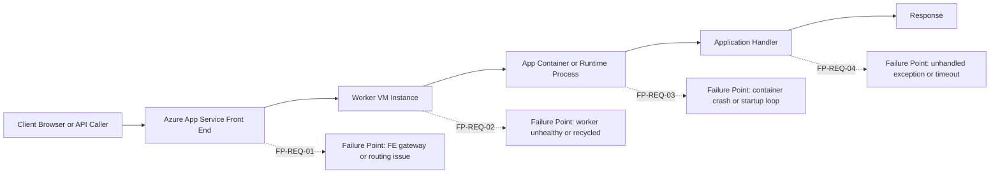
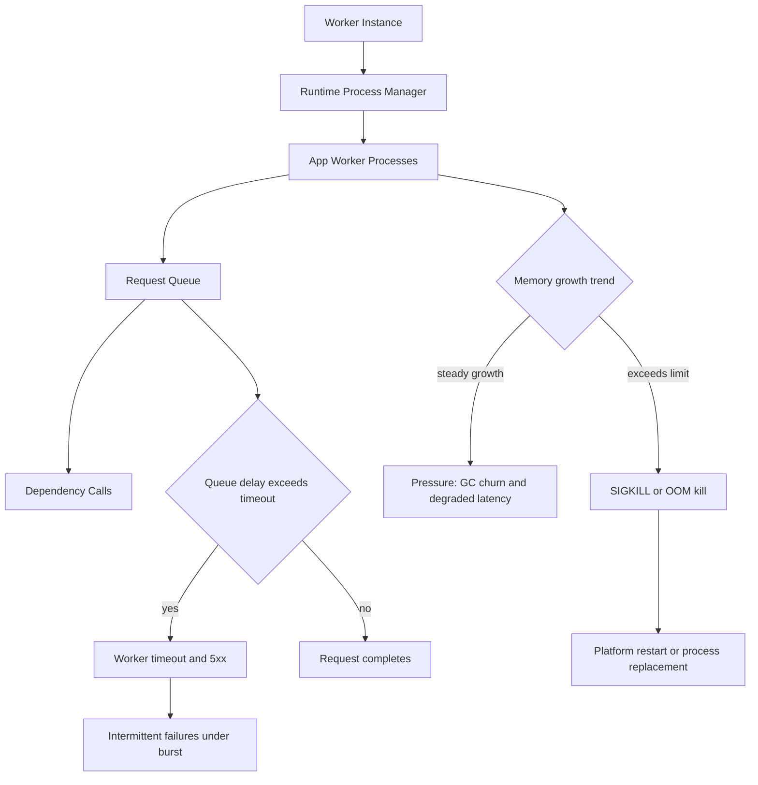
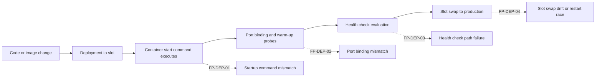
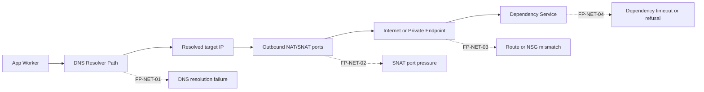
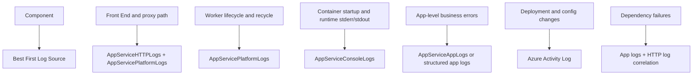

# Troubleshooting Architecture Overview

This page answers one practical question first: **where can this fail?**

Before deep debugging, map the symptom to a platform segment (Front End, Worker, app container, outbound path, or deployment pipeline). That classification tells you which logs to query first and which playbook to open.

## Why this page exists

Playbooks are symptom-driven and detailed. During active incidents, engineers usually need one faster artifact:

1. A request-path view with failure points
2. A runtime model that explains timeout, OOM, and recycle behavior
3. A deployment path showing where startup and config drift failures happen
4. A network path showing DNS/SNAT/private routing issues

Use this architecture map to route quickly to the right playbook.

## 1) Request Path Architecture (where 5xx can originate)



### Typical interpretation

- **HTTP 5xx is not one thing**.
- A 5xx can originate at Front End, Worker, Container startup, or app code.
- Treat each layer as a competing hypothesis until logs disprove it.

### Request-path failure points and playbooks

| Failure Point | Typical Symptom | First Evidence | Playbook |
|---|---|---|---|
| FP-REQ-01 Front End | 502/503 bursts, request forwarding issues | `AppServicePlatformLogs` + HTTP status trend | [Failed to Forward Request](playbooks/startup-availability/failed-to-forward-request.md) |
| FP-REQ-02 Worker | Intermittent 5xx during load, restart overlap | restart timing, platform recycle events | [Intermittent 5xx Under Load](playbooks/performance/intermittent-5xx-under-load.md) |
| FP-REQ-03 Container | app marked up/down, ping failures, cold start failures | console startup logs + health probe messages | [Container Didn't Respond to HTTP Pings](playbooks/startup-availability/container-didnt-respond-to-http-pings.md) |
| FP-REQ-04 Application code | 500 with stack traces or long latency before error | app/console logs + endpoint-level HTTP logs | [Slow Response but Low CPU](playbooks/performance/slow-response-but-low-cpu.md) |

## 2) Runtime / Worker Model (memory pressure, SIGKILL, timeout)



### Runtime failure mapping

| Failure Point | Why it happens | What to check first | Playbook |
|---|---|---|---|
| FP-RUN-01 Memory pressure | Memory leak, large object churn, excess workers | memory trend + console logs for kill/restart | [Memory Pressure and Worker Degradation](playbooks/performance/memory-pressure-and-worker-degradation.md) |
| FP-RUN-02 SIGKILL/OOM | process exceeded practical memory envelope | platform/console kill messages, restart cadence | [Memory Pressure and Worker Degradation](playbooks/performance/memory-pressure-and-worker-degradation.md) |
| FP-RUN-03 Worker timeout | backlog + slow dependencies + low worker throughput | high `TimeTaken`, timeout signatures | [Intermittent 5xx Under Load](playbooks/performance/intermittent-5xx-under-load.md) |
| FP-RUN-04 Disk pressure impact | temp/log growth blocks runtime operations | `No space left on device` in console | [No Space Left on Device](playbooks/performance/no-space-left-on-device.md) |

## 3) Deployment Path (startup failures and config drift)



### Deployment path failure mapping

| Failure Point | Typical signal | Primary playbook |
|---|---|---|
| FP-DEP-01 Startup command mismatch | deployment green but app never healthy | [Deployment Succeeded but Startup Failed](playbooks/startup-availability/deployment-succeeded-startup-failed.md) |
| FP-DEP-02 Port mismatch | container runs but does not answer expected port | [Container Didn't Respond to HTTP Pings](playbooks/startup-availability/container-didnt-respond-to-http-pings.md) |
| FP-DEP-03 Warm-up/health confusion | swap warm-up passes/fails unexpectedly | [Warm-up vs Health Check](playbooks/startup-availability/warmup-vs-health-check.md) |
| FP-DEP-04 Swap/config drift | slot swap introduces config regression | [Slot Swap Config Drift](playbooks/startup-availability/slot-swap-config-drift.md) |

## 4) Outbound / Network Path (SNAT, DNS, private routing)



### Outbound path failure mapping

| Failure Point | Symptom pattern | Primary playbook |
|---|---|---|
| FP-NET-01 DNS failure | intermittent/constant name lookup failures | [DNS Resolution (VNet-Integrated)](playbooks/outbound-network/dns-resolution-vnet-integrated-app-service.md) |
| FP-NET-02 SNAT pressure | connect timeout spikes under parallel outbound load | [SNAT or Application Issue?](playbooks/outbound-network/snat-or-application-issue.md) |
| FP-NET-03 Private route confusion | endpoint unreachable despite private endpoint setup | [Private Endpoint / Custom DNS Route Confusion](playbooks/outbound-network/private-endpoint-custom-dns-route-confusion.md) |
| FP-NET-04 Dependency failures | outbound errors isolated to one backend service | [SNAT or Application Issue?](playbooks/outbound-network/snat-or-application-issue.md) |

## 5) Observability Coverage Map



### Quick evidence commands by component

```bash
az webapp log show --resource-group <resource-group> --name <app-name>
az monitor activity-log list --resource-group <resource-group> --offset 24h
az monitor metrics list --resource <app-resource-id> --metric "Http5xx,Requests,AverageResponseTime,MemoryWorkingSet" --interval PT1M
az webapp config show --resource-group <resource-group> --name <app-name>
az webapp config appsettings list --resource-group <resource-group> --name <app-name>
```

```kusto
AppServiceHTTPLogs
| where TimeGenerated > ago(2h)
| summarize total=count(), errors5xx=countif(ScStatus >= 500 and ScStatus < 600), p95=percentile(TimeTaken,95) by bin(TimeGenerated, 5m)
| order by TimeGenerated asc
```

```kusto
AppServicePlatformLogs
| where TimeGenerated > ago(24h)
| where ResultDescription has_any ("restart", "recycle", "health", "container", "start", "stop")
| project TimeGenerated, OperationName, ResultDescription
| order by TimeGenerated desc
```

```kusto
AppServiceConsoleLogs
| where TimeGenerated > ago(6h)
| where ResultDescription has_any ("Exception", "timed out", "No space left", "OOM", "killed", "could not bind")
| project TimeGenerated, ResultDescription
| order by TimeGenerated desc
```

## 6) Fast routing examples

- **Example A**: 5xx appears only during bursts.
    - Start with runtime/worker model (FP-RUN-03), then outbound pressure (FP-NET-02).    - Open: [Intermittent 5xx Under Load](playbooks/performance/intermittent-5xx-under-load.md) and [SNAT or Application Issue?](playbooks/outbound-network/snat-or-application-issue.md).
- **Example B**: deployment says success, app unavailable.
    - Start with deployment path (FP-DEP-01/02/03).    - Open: [Deployment Succeeded but Startup Failed](playbooks/startup-availability/deployment-succeeded-startup-failed.md) and [Container Didn't Respond to HTTP Pings](playbooks/startup-availability/container-didnt-respond-to-http-pings.md).
- **Example C**: outbound calls fail but only for private endpoint targets.
    - Start with outbound path (FP-NET-01/03).    - Open: [Private Endpoint / Custom DNS Route Confusion](playbooks/outbound-network/private-endpoint-custom-dns-route-confusion.md).
!!! note "How to use this architecture page during incidents"
    Do not treat any single metric as proof.
    Use this page to identify the most likely failure layer, then validate with time-correlated evidence.
    Move to the linked playbook only after you identify which layer best matches the symptom timing.

## 7) See Also

- [Troubleshooting Method](methodology/troubleshooting-method.md)
- [Detector Map](methodology/detector-map.md)
- [Checklists Index](first-10-minutes/index.md)
- [Playbooks Index](playbooks/index.md)
- [KQL Query Library](kql/index.md)
- [Evidence Map](evidence-map.md)
- [Decision Tree](decision-tree.md)
- [Troubleshooting Mental Model](mental-model.md)

## Sources

- [Azure App Service diagnostics overview](https://learn.microsoft.com/en-us/azure/app-service/overview-diagnostics)
- [Monitor Azure App Service](https://learn.microsoft.com/en-us/azure/app-service/monitor-app-service)
- [Enable diagnostic logging for apps in Azure App Service](https://learn.microsoft.com/en-us/azure/app-service/troubleshoot-diagnostic-logs)
- [Troubleshoot HTTP 502 and 503 in Azure App Service](https://learn.microsoft.com/en-us/azure/app-service/troubleshoot-http-502-http-503)
- [Configure health checks in Azure App Service](https://learn.microsoft.com/en-us/azure/app-service/monitor-instances-health-check)
- [Configure staging environments in Azure App Service](https://learn.microsoft.com/en-us/azure/app-service/deploy-staging-slots)
