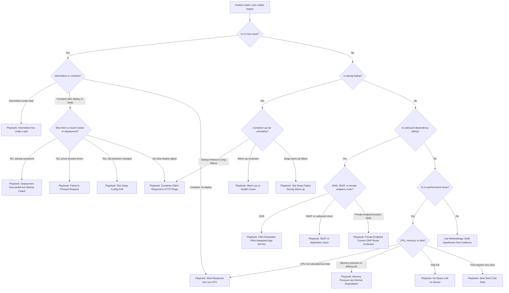
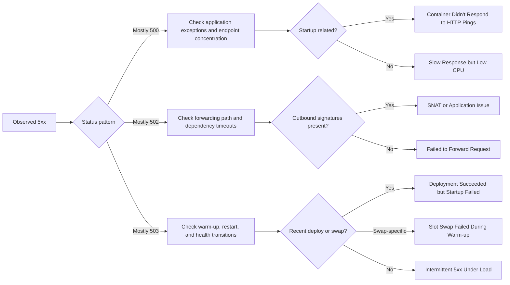

# Troubleshooting Decision Tree

Use this page when you need to triage quickly from symptom to likely failure category and then open the right playbook.

The tree is intentionally symptom-first and optimized for the first 10–15 minutes of incident response.

## Main triage decision tree



## 5xx branch deep-dive tree



## Playbook leaves (direct links)

- [Intermittent 5xx Under Load](playbooks/performance/intermittent-5xx-under-load.md)
- [Slow Response but Low CPU](playbooks/performance/slow-response-but-low-cpu.md)
- [Memory Pressure and Worker Degradation](playbooks/performance/memory-pressure-and-worker-degradation.md)
- [No Space Left on Device](playbooks/performance/no-space-left-on-device.md)
- [Slow Start / Cold Start](playbooks/performance/slow-start-cold-start.md)
- [Container Didn't Respond to HTTP Pings](playbooks/startup-availability/container-didnt-respond-to-http-pings.md)
- [Warm-up vs Health Check](playbooks/startup-availability/warmup-vs-health-check.md)
- [Slot Swap Failed During Warm-up](playbooks/startup-availability/slot-swap-failed-during-warmup.md)
- [Deployment Succeeded but Startup Failed](playbooks/startup-availability/deployment-succeeded-startup-failed.md)
- [Failed to Forward Request](playbooks/startup-availability/failed-to-forward-request.md)
- [Slot Swap Config Drift](playbooks/startup-availability/slot-swap-config-drift.md)
- [SNAT or Application Issue?](playbooks/outbound-network/snat-or-application-issue.md)
- [DNS Resolution (VNet-Integrated)](playbooks/outbound-network/dns-resolution-vnet-integrated-app-service.md)
- [Private Endpoint / Custom DNS Route Confusion](playbooks/outbound-network/private-endpoint-custom-dns-route-confusion.md)

## Quick reference matrix

| Symptom Pattern | Most Likely Cause Category | Playbook Link |
|---|---|---|
| 5xx spikes only during traffic bursts | worker saturation, timeout queueing, or outbound pressure | [Intermittent 5xx Under Load](playbooks/performance/intermittent-5xx-under-load.md) |
| 503 after deployment or restart | startup/warm-up sequence instability | [Deployment Succeeded but Startup Failed](playbooks/startup-availability/deployment-succeeded-startup-failed.md) |
| 502 with proxy-forward messages | front-end to worker forwarding path issue | [Failed to Forward Request](playbooks/startup-availability/failed-to-forward-request.md) |
| Container appears running but no responses | binding mismatch or app not listening correctly | [Container Didn't Respond to HTTP Pings](playbooks/startup-availability/container-didnt-respond-to-http-pings.md) |
| Swap operation fails during warm-up | warm-up endpoint mismatch or timeout | [Slot Swap Failed During Warm-up](playbooks/startup-availability/slot-swap-failed-during-warmup.md) |
| App became unstable after swap | slot config drift or restart race | [Slot Swap Config Drift](playbooks/startup-availability/slot-swap-config-drift.md) |
| High latency with low CPU | dependency wait, lock contention, sync blocking | [Slow Response but Low CPU](playbooks/performance/slow-response-but-low-cpu.md) |
| Gradual slowdown then recycle | memory growth and worker degradation | [Memory Pressure and Worker Degradation](playbooks/performance/memory-pressure-and-worker-degradation.md) |
| Intermittent outbound timeout/reset | SNAT pressure or outbound connection churn | [SNAT or Application Issue?](playbooks/outbound-network/snat-or-application-issue.md) |
| Name resolution failures in VNet integration | DNS resolver path or custom DNS mismatch | [DNS Resolution (VNet-Integrated)](playbooks/outbound-network/dns-resolution-vnet-integrated-app-service.md) |
| Private endpoint dependency unreachable | private DNS zone/routing configuration mismatch | [Private Endpoint / Custom DNS Route Confusion](playbooks/outbound-network/private-endpoint-custom-dns-route-confusion.md) |
| Errors include `No space left on device` | local filesystem exhaustion | [No Space Left on Device](playbooks/performance/no-space-left-on-device.md) |
| First request after idle/deploy is very slow | cold start behavior or startup regression | [Slow Start / Cold Start](playbooks/performance/slow-start-cold-start.md) |
| Health check reports unhealthy while app path works | warm-up vs health-check semantics confusion | [Warm-up vs Health Check](playbooks/startup-availability/warmup-vs-health-check.md) |

## Triage prompts to ask in order

1. Is it a 5xx issue? If yes, is it intermittent or constant?
2. Was there a recent restart or deployment in the incident window?
3. Is startup failing (container not ready, ping failure, warm-up timeout)?
4. Is outbound dependency failing (DNS, SNAT, private endpoint route)?
5. Is it a performance issue (CPU, memory, disk, or cold start)?

## Minimal evidence before choosing a branch

- 15-minute HTTP status trend (`AppServiceHTTPLogs`)
- platform event timeline for restarts/deployments (`AppServicePlatformLogs` + Activity Log)
- console signatures for startup and outbound failures (`AppServiceConsoleLogs`)

```kusto
AppServiceHTTPLogs
| where TimeGenerated > ago(2h)
| summarize total=count(), err5xx=countif(ScStatus >= 500 and ScStatus < 600), p95=percentile(TimeTaken,95) by bin(TimeGenerated, 5m)
| order by TimeGenerated asc
```

```kusto
AppServicePlatformLogs
| where TimeGenerated > ago(24h)
| where ResultDescription has_any ("restart", "recycle", "health", "swap", "deploy", "container")
| project TimeGenerated, OperationName, ResultDescription
| order by TimeGenerated desc
```

```kusto
AppServiceConsoleLogs
| where TimeGenerated > ago(6h)
| where ResultDescription has_any ("timeout", "failed", "could not bind", "No space left", "DNS", "ConnectTimeout")
| project TimeGenerated, ResultDescription
| order by TimeGenerated desc
```

## CLI triage bundle

```bash
az monitor activity-log list --resource-group <resource-group> --offset 24h
az monitor metrics list --resource <app-resource-id> --metric "Http5xx,Requests,AverageResponseTime,CpuPercentage,MemoryWorkingSet" --interval PT1M
az webapp log show --resource-group <resource-group> --name <app-name>
az webapp config show --resource-group <resource-group> --name <app-name>
```

!!! warning "Avoid branch bias"
    Do not choose a branch only because it matches a familiar past issue.
    If the first branch is disproven by timestamps, return to the top and re-classify.
    Decision trees accelerate triage, but evidence still decides root cause.

## Decision Tree Limits

- This tree is optimized for App Service Linux OSS workloads.
- Multi-cause incidents can map to more than one branch.
- If no branch matches cleanly, use [Troubleshooting Method](methodology/troubleshooting-method.md) and build explicit competing hypotheses.

## Branch-specific first checks

### If you choose the startup branch

- Confirm expected port and startup command alignment.
- Check whether health check path depends on unavailable dependencies.
- Validate slot-specific settings when swap is part of the timeline.

### If you choose the outbound branch

- Verify whether only one dependency host fails.
- Compare failure windows against outbound-heavy endpoints.
- Test DNS resolution and route behavior from the running app context.

### If you choose the runtime degradation branch

- Compare memory trend with restart cadence.
- Check for `No space left on device` and temporary filesystem growth.
- Identify whether high latency leads 5xx or follows it.

## Practical triage examples

1. **Intermittent 502 + connect timeout logs + burst traffic**
   - Decision tree branch: 5xx → intermittent → outbound candidate.
   - Start with [SNAT or Application Issue?](playbooks/outbound-network/snat-or-application-issue.md).

2. **Deployment succeeded + immediate 503 + ping failures**
   - Decision tree branch: restart/deployment → startup failing.
   - Start with [Deployment Succeeded but Startup Failed](playbooks/startup-availability/deployment-succeeded-startup-failed.md).

3. **Latency grows over hours + recycle + memory climb**
   - Decision tree branch: performance → memory.
   - Start with [Memory Pressure and Worker Degradation](playbooks/performance/memory-pressure-and-worker-degradation.md).

## See Also

- [Troubleshooting Method](methodology/troubleshooting-method.md)
- [Detector Map](methodology/detector-map.md)
- [Architecture Overview](architecture-overview.md)
- [Evidence Map](evidence-map.md)
- [Troubleshooting Mental Model](mental-model.md)
- [First 10 Minutes: Performance](first-10-minutes/performance.md)
- [First 10 Minutes: Outbound Network](first-10-minutes/outbound-network.md)
- [First 10 Minutes: Startup Availability](first-10-minutes/startup-availability.md)

## References

- [Azure App Service diagnostics overview](https://learn.microsoft.com/en-us/azure/app-service/overview-diagnostics)
- [Monitor Azure App Service](https://learn.microsoft.com/en-us/azure/app-service/monitor-app-service)
- [Troubleshoot HTTP 502 and 503 in Azure App Service](https://learn.microsoft.com/en-us/azure/app-service/troubleshoot-http-502-http-503)
- [Troubleshoot intermittent outbound connection errors in Azure App Service](https://learn.microsoft.com/en-us/azure/app-service/troubleshoot-intermittent-outbound-connection-errors)
- [Configure health checks in Azure App Service](https://learn.microsoft.com/en-us/azure/app-service/monitor-instances-health-check)
