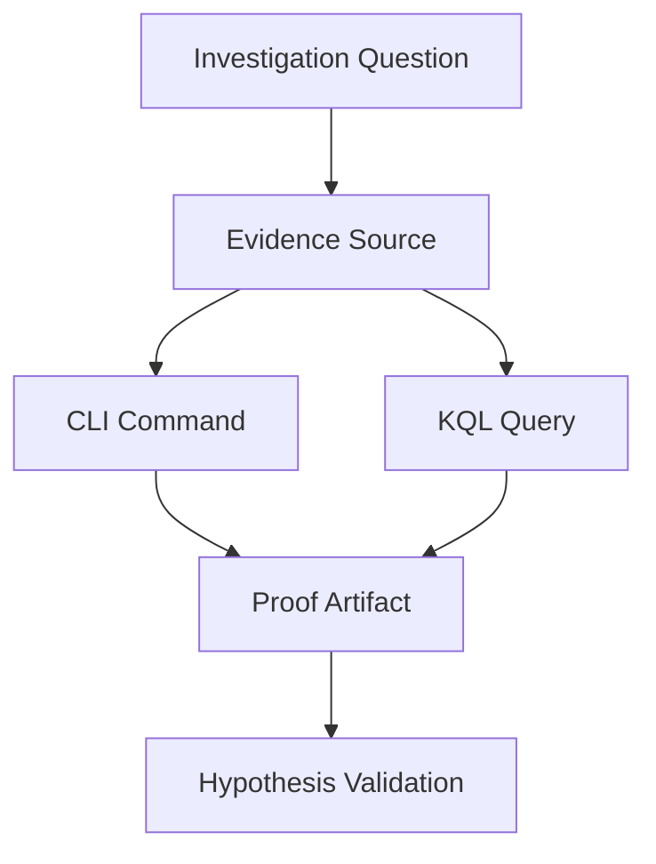

# Evidence Map for App Service Troubleshooting

This page maps common investigation questions to the best evidence source, the CLI command to run, and the KQL table/query to use.

Use it when you know **what you need to answer** but not **where to collect proof**.

<!-- diagram-id: troubleshooting-evidence-map-diagram-1 -->


## Why an evidence map

During incidents, teams lose time by checking the wrong signal first.

- HTTP errors are checked in CPU charts
- startup issues are checked only in app code
- DNS/SNAT issues are diagnosed without outbound evidence

An evidence map reduces this by pairing each question with a reproducible command and query.

!!! note "Use CLI and query artifacts for reproducible investigations"
    Since log result capture from the browser is awkward and difficult to maintain, use CLI queries and example outputs.
    This makes investigation reproducible, easier to copy, and easier to interpret.

## Quick Map (Question → Source → Command → Table)

| Question | Best Source | CLI Command | KQL Table |
|---|---|---|---|
| Was the app restarting? | Platform logs + Activity Log | `az monitor activity-log list --resource-group <resource-group> --offset 24h` | `AppServicePlatformLogs` |
| Were requests failing? | HTTP logs | `az monitor metrics list --resource <app-resource-id> --metric "Http5xx,Requests" --interval PT1M` | `AppServiceHTTPLogs` |
| Was startup failing? | Console logs | `az webapp log tail --resource-group <resource-group> --name <app-name>` | `AppServiceConsoleLogs` |
| Was a dependency slow? | App logs + latency trend | `az monitor metrics list --resource <app-resource-id> --metric "AverageResponseTime" --interval PT1M` | `AppServiceAppLogs` |
| Was DNS failing? | Console/app logs + runtime test output | `az webapp ssh --resource-group <resource-group> --name <app-name>` | `AppServiceConsoleLogs` |
| Was scale involved? | Metrics + platform events | `az monitor metrics list --resource <app-resource-id> --metric "CpuPercentage,MemoryWorkingSet" --interval PT1M` | `AppServicePlatformLogs` |
| Was disk full? | Console logs + filesystem command output | `az webapp log tail --resource-group <resource-group> --name <app-name>` | `AppServiceConsoleLogs` |
| Was memory exhausted? | Process/platform signals | `az monitor metrics list --resource <app-resource-id> --metric "MemoryWorkingSet" --interval PT1M` | `AppServicePlatformLogs` |
| Was SNAT exhausted? | Outbound diagnostics + errors | `az monitor metrics list --resource <app-resource-id> --metric "Http5xx,Requests" --interval PT1M` | `AppServiceConsoleLogs` |
| Was there a deployment? | Activity Log | `az monitor activity-log list --resource-group <resource-group> --offset 24h --status Succeeded` | `AppServicePlatformLogs` |
| Was health check failing? | Platform health signals | `az webapp show --resource-group <resource-group> --name <app-name>` | `AppServicePlatformLogs` |
| Was slot swap involved? | Activity Log + swap events | `az webapp deployment slot list --resource-group <resource-group> --name <app-name>` | `AppServicePlatformLogs` |
| Was there a config change? | Activity Log + app settings snapshot | `az webapp config appsettings list --resource-group <resource-group> --name <app-name>` | `AppServicePlatformLogs` |
| Was the container killed? | Platform + console kill messages | `az webapp log tail --resource-group <resource-group> --name <app-name>` | `AppServicePlatformLogs` |
| Were there network errors? | Console logs | `az webapp log tail --resource-group <resource-group> --name <app-name>` | `AppServiceConsoleLogs` |
| Did warm-up fail during swap? | swap diagnostics + startup logs | `az monitor activity-log list --resource-group <resource-group> --offset 6h` | `AppServicePlatformLogs` |

## Detailed Evidence Recipes

## 1) Was the app restarting?

### CLI

```bash
az monitor activity-log list --resource-group <resource-group> --offset 24h
```

### KQL

```kusto
AppServicePlatformLogs
| where TimeGenerated > ago(24h)
| where ResultDescription has_any ("restart", "recycle", "container", "stopped", "started")
| project TimeGenerated, OperationName, ResultDescription, Host
| order by TimeGenerated desc
```

## 2) Were requests failing?

### CLI

```bash
az monitor metrics list --resource <app-resource-id> --metric "Http5xx,Requests" --interval PT1M
```

### KQL

```kusto
AppServiceHTTPLogs
| where TimeGenerated > ago(6h)
| summarize total=count(), err5xx=countif(ScStatus >= 500 and ScStatus < 600) by bin(TimeGenerated, 5m)
| extend errPct=todouble(err5xx)*100.0/iif(total==0,1,total)
| order by TimeGenerated asc
```

## 3) Was startup failing?

### CLI

```bash
az webapp log tail --resource-group <resource-group> --name <app-name>
```

### KQL

```kusto
AppServiceConsoleLogs
| where TimeGenerated > ago(6h)
| where ResultDescription has_any ("failed to start", "could not bind", "listen", "startup", "didn't respond")
| project TimeGenerated, ResultDescription, Host
| order by TimeGenerated desc
```

## 4) Was a dependency slow?

### CLI

```bash
az monitor metrics list --resource <app-resource-id> --metric "AverageResponseTime" --interval PT1M
```

### KQL

```kusto
AppServiceAppLogs
| where TimeGenerated > ago(6h)
| where ResultDescription has_any ("timeout", "dependency", "upstream", "database", "redis", "key vault")
| summarize hits=count() by bin(TimeGenerated, 5m)
| order by TimeGenerated asc
```

## 5) Was DNS failing?

### CLI

```bash
az webapp ssh --resource-group <resource-group> --name <app-name>
```

Inside the session, run:

```bash
nslookup <dependency-hostname>
```

### KQL

```kusto
AppServiceConsoleLogs
| where TimeGenerated > ago(6h)
| where ResultDescription has_any ("Name or service not known", "Temporary failure in name resolution", "getaddrinfo", "DNS")
| project TimeGenerated, ResultDescription
| order by TimeGenerated desc
```

## 6) Was scale involved?

### CLI

```bash
az monitor metrics list --resource <app-resource-id> --metric "CpuPercentage,MemoryWorkingSet,Http5xx,AverageResponseTime" --interval PT1M
```

### KQL

```kusto
AppServicePlatformLogs
| where TimeGenerated > ago(24h)
| where ResultDescription has_any ("scale", "instance", "restart", "recycle")
| project TimeGenerated, OperationName, ResultDescription
| order by TimeGenerated asc
```

## 7) Was disk full?

### CLI

```bash
az webapp log tail --resource-group <resource-group> --name <app-name>
```

Use SSH to confirm with:

```bash
df -h
```

### KQL

```kusto
AppServiceConsoleLogs
| where TimeGenerated > ago(24h)
| where ResultDescription has_any ("No space left on device", "ENOSPC", "disk full")
| project TimeGenerated, ResultDescription
| order by TimeGenerated desc
```

## 8) Was memory exhausted?

### CLI

```bash
az monitor metrics list --resource <app-resource-id> --metric "MemoryWorkingSet" --interval PT1M
```

### KQL

```kusto
AppServicePlatformLogs
| where TimeGenerated > ago(24h)
| where ResultDescription has_any ("OOM", "killed", "memory", "SIGKILL")
| project TimeGenerated, OperationName, ResultDescription, Host
| order by TimeGenerated desc
```

## 9) Was SNAT exhausted?

### CLI

```bash
az monitor metrics list --resource <app-resource-id> --metric "Http5xx,Requests,AverageResponseTime" --interval PT1M
```

### KQL

```kusto
AppServiceConsoleLogs
| where TimeGenerated > ago(6h)
| where ResultDescription has_any ("connect timed out", "ReadTimeout", "ConnectTimeout", "socket", "ECONNRESET")
| summarize errors=count() by bin(TimeGenerated, 5m)
| order by TimeGenerated asc
```

## 10) Was there a deployment?

### CLI

```bash
az monitor activity-log list --resource-group <resource-group> --offset 24h --status Succeeded
```

### KQL

```kusto
AppServicePlatformLogs
| where TimeGenerated > ago(24h)
| where OperationName has_any ("Deploy", "Publish", "SiteConfig", "Container")
| project TimeGenerated, OperationName, ResultDescription
| order by TimeGenerated desc
```

## 11) Was health check failing?

### CLI

```bash
az webapp show --resource-group <resource-group> --name <app-name>
```

### KQL

```kusto
AppServicePlatformLogs
| where TimeGenerated > ago(24h)
| where ResultDescription has_any ("health check", "unhealthy", "warmup", "probe")
| project TimeGenerated, OperationName, ResultDescription, Host
| order by TimeGenerated desc
```

## 12) Was slot swap involved?

### CLI

```bash
az webapp deployment slot list --resource-group <resource-group> --name <app-name>
```

### KQL

```kusto
AppServicePlatformLogs
| where TimeGenerated > ago(24h)
| where ResultDescription has_any ("swap", "slot", "warm-up", "warmed up")
| project TimeGenerated, OperationName, ResultDescription
| order by TimeGenerated desc
```

## 13) Was there a config change?

### CLI

```bash
az webapp config appsettings list --resource-group <resource-group> --name <app-name>
az monitor activity-log list --resource-group <resource-group> --offset 24h
```

### KQL

```kusto
AppServicePlatformLogs
| where TimeGenerated > ago(24h)
| where OperationName has_any ("Update Site", "Update App Settings", "Update Configuration")
| project TimeGenerated, OperationName, ResultDescription
| order by TimeGenerated desc
```

## 14) Was the container killed?

### CLI

```bash
az webapp log tail --resource-group <resource-group> --name <app-name>
```

### KQL

```kusto
AppServicePlatformLogs
| where TimeGenerated > ago(24h)
| where ResultDescription has_any ("killed", "SIGKILL", "exit code", "container stopped", "OOM")
| project TimeGenerated, OperationName, ResultDescription, Host
| order by TimeGenerated desc
```

## 15) Were there network errors?

### CLI

```bash
az webapp log tail --resource-group <resource-group> --name <app-name>
```

### KQL

```kusto
AppServiceConsoleLogs
| where TimeGenerated > ago(6h)
| where ResultDescription has_any ("connection refused", "connection reset", "ENETUNREACH", "EHOSTUNREACH", "timed out")
| project TimeGenerated, ResultDescription
| order by TimeGenerated desc
```

## 16) Did warm-up fail during slot swap?

### CLI

```bash
az monitor activity-log list --resource-group <resource-group> --offset 6h
```

### KQL

```kusto
AppServicePlatformLogs
| where TimeGenerated > ago(6h)
| where ResultDescription has_any ("swap", "warm-up", "did not respond", "health check")
| project TimeGenerated, OperationName, ResultDescription
| order by TimeGenerated desc
```

## Evidence Quality Checklist

- Keep all evidence in one incident time window.
- Correlate HTTP, console, and platform signals before selecting a root cause.
- Preserve query text used during the incident for post-incident review.
- Capture command outputs in ticket notes with sensitive identifiers removed.

## See Also

- [Troubleshooting Method](methodology/troubleshooting-method.md)
- [Detector Map](methodology/detector-map.md)
- [Architecture Overview](architecture-overview.md)
- [Decision Tree](decision-tree.md)
- [Troubleshooting Mental Model](mental-model.md)
- [5xx Trend Over Time](kql/http/5xx-trend-over-time.md)
- [Restart Timing Correlation](kql/restarts/restart-timing-correlation.md)
- [Startup Errors](kql/console/startup-errors.md)

## Sources

- [Monitor Azure App Service](https://learn.microsoft.com/en-us/azure/app-service/monitor-app-service)
- [Enable diagnostic logging for apps in Azure App Service](https://learn.microsoft.com/en-us/azure/app-service/troubleshoot-diagnostic-logs)
- [Azure Monitor metrics overview](https://learn.microsoft.com/en-us/azure/azure-monitor/essentials/data-platform-metrics)
- [Azure Activity Log overview](https://learn.microsoft.com/en-us/azure/azure-monitor/essentials/activity-log)
- [Troubleshoot intermittent outbound connection errors in Azure App Service](https://learn.microsoft.com/en-us/azure/app-service/troubleshoot-intermittent-outbound-connection-errors)
- [App Service diagnostics overview](https://learn.microsoft.com/en-us/azure/app-service/overview-diagnostics)
