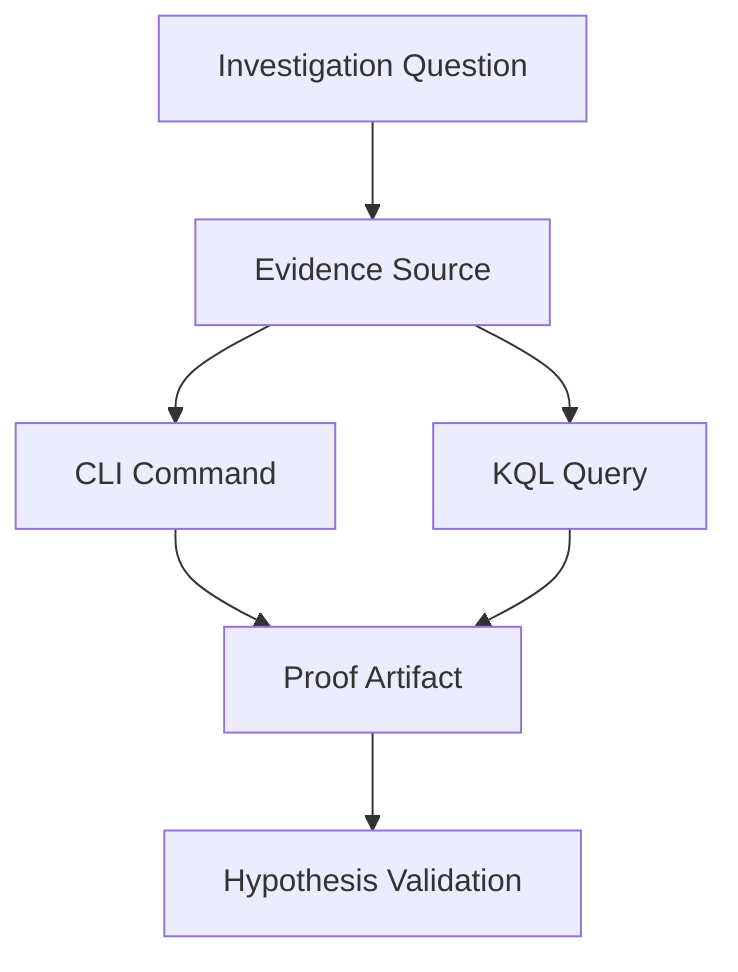

# Evidence Map for App Service Troubleshooting

This page maps common investigation questions to the best evidence source, the CLI command to run, and the KQL table/query to use.

Use it when you know **what you need to answer** but not **where to collect proof**.

<!-- diagram-id: troubleshooting-evidence-map-diagram-1 -->

```mermaid
flowchart TD
    Q[Investigation Question] --> S[Evidence Source]
    S --> CLI[CLI Command]
    S --> KQL[KQL Query]
    CLI --> P[Proof Artifact]
    KQL --> P
    P --> H[Hypothesis Validation]
```

## Why an evidence map

During incidents, teams lose time by checking the wrong signal first.

- HTTP errors are checked in CPU charts
- startup issues are checked only in app code
- DNS/SNAT issues are diagnosed without outbound evidence

An evidence map reduces this by pairing each question with a reproducible command and query.

!!! note "Use CLI and query artifacts for reproducible investigations"
    Since log result capture from the browser is awkward and difficult to maintain, use CLI queries and example outputs.
    This makes investigation reproducible, easier to copy, and easier to interpret.

#### Portal view: Application Insights Logs query editor

![Application Insights Logs blade for the `ai-test-20251107` workspace-based resource, opened from Microsoft Azure (Preview) with breadcrumb `Home > ai-test-20251107`. The left navigation shows Overview, Activity log, Access control (IAM), Tags, Diagnose and solve problems, Resource visualizer, and an expanded Monitoring section containing Alerts, Metrics, Diagnostic settings, Logs (highlighted as the current blade), Workbooks, and Dashboards with Grafana, plus collapsed sections for Investigate, Usage, Configure, Settings, Automation, and Help. The query workspace shows a `New Query 1` tab with a `+` button to open additional tabs, a toolbar with `Observability agent` (New badge), `Save`, `Share`, an overflow menu, and `Queries hub`. The query control row contains a blue `Run` button, `Time range: Last 24 hours`, `Show: 1000 results`, and a `KQL mode` dropdown on the far right. The KQL editor is empty with placeholder text `Type your query here or click one of the queries to start`. A `Query history` panel at the bottom shows an empty state `No queries history` with the hint `You haven't run any queries yet. To start, go to Queries on the side pane or type a query in the query editor.`](../assets/troubleshooting/log-analytics/01-logs.png)

The Logs blade is the canonical entry point for every KQL snippet in this evidence map. The `Time range: Last 24 hours` selector is the first control to adjust during an incident — most queries below scope to `ago(6h)` or `ago(24h)`, so widening or narrowing the blade-level window must match the `| where TimeGenerated > ago(...)` clause to avoid empty results from a stale time filter. The `KQL mode` dropdown distinguishes raw Kusto from `Simple mode`; all queries on this page assume `KQL mode`. The empty `Query history` panel here means a fresh workspace — during real incidents this panel becomes the reproducibility artifact you preserve in the ticket alongside CLI output.

## Quick Map (Question → Source → Command → Table)

| Question | Best Source | CLI Command | KQL Table |
|---|---|---|---|
| Was the app restarting? | Platform logs + Activity Log | `az monitor activity-log list --resource-group <resource-group> --offset 24h` | `AppServicePlatformLogs` |
| Were requests failing? | HTTP logs | `az monitor metrics list --resource <app-resource-id> --metric "Http5xx,Requests" --interval PT1M` | `AppServiceHTTPLogs` |
| Was startup failing? | Console logs | `az webapp log tail --resource-group <resource-group> --name <app-name>` | `AppServiceConsoleLogs` |
| Was a dependency slow? | App logs + latency trend | `az monitor metrics list --resource <app-resource-id> --metric "AverageResponseTime" --interval PT1M` | `AppServiceAppLogs` |
| Was DNS failing? | Console/app logs + runtime test output | `az webapp ssh --resource-group <resource-group> --name <app-name>` | `AppServiceConsoleLogs` |
| Was scale involved? | Metrics + platform events | `az monitor metrics list --resource <app-resource-id> --metric "CpuPercentage,MemoryWorkingSet" --interval PT1M` | `AppServicePlatformLogs` |
| Was disk full? | Console logs + filesystem command output | `az webapp log tail --resource-group <resource-group> --name <app-name>` | `AppServiceConsoleLogs` |
| Was memory exhausted? | Process/platform signals | `az monitor metrics list --resource <app-resource-id> --metric "MemoryWorkingSet" --interval PT1M` | `AppServicePlatformLogs` |
| Was SNAT exhausted? | Outbound diagnostics + errors | `az monitor metrics list --resource <app-resource-id> --metric "Http5xx,Requests" --interval PT1M` | `AppServiceConsoleLogs` |
| Was there a deployment? | Activity Log | `az monitor activity-log list --resource-group <resource-group> --offset 24h --status Succeeded` | `AppServicePlatformLogs` |
| Was health check failing? | Platform health signals | `az webapp show --resource-group <resource-group> --name <app-name>` | `AppServicePlatformLogs` |
| Was slot swap involved? | Activity Log + swap events | `az webapp deployment slot list --resource-group <resource-group> --name <app-name>` | `AppServicePlatformLogs` |
| Was there a config change? | Activity Log + app settings snapshot | `az webapp config appsettings list --resource-group <resource-group> --name <app-name>` | `AppServicePlatformLogs` |
| Was the container killed? | Platform + console kill messages | `az webapp log tail --resource-group <resource-group> --name <app-name>` | `AppServicePlatformLogs` |
| Were there network errors? | Console logs | `az webapp log tail --resource-group <resource-group> --name <app-name>` | `AppServiceConsoleLogs` |
| Did warm-up fail during swap? | swap diagnostics + startup logs | `az monitor activity-log list --resource-group <resource-group> --offset 6h` | `AppServicePlatformLogs` |

## Detailed Evidence Recipes

## 1) Was the app restarting?

### CLI

```bash
az monitor activity-log list --resource-group <resource-group> --offset 24h
```

### KQL

```kusto
AppServicePlatformLogs
| where TimeGenerated > ago(24h)
| where ResultDescription has_any ("restart", "recycle", "container", "stopped", "started")
| project TimeGenerated, OperationName, ResultDescription, Host
| order by TimeGenerated desc
```

## 2) Were requests failing?

### CLI

```bash
az monitor metrics list --resource <app-resource-id> --metric "Http5xx,Requests" --interval PT1M
```

### KQL

```kusto
AppServiceHTTPLogs
| where TimeGenerated > ago(6h)
| summarize total=count(), err5xx=countif(ScStatus >= 500 and ScStatus < 600) by bin(TimeGenerated, 5m)
| extend errPct=todouble(err5xx)*100.0/iif(total==0,1,total)
| order by TimeGenerated asc
```

## 3) Was startup failing?

#### Portal view: Log stream blade streaming runtime logs

![Log stream blade for the `app-test-20251107` Web App. The left navigation shows Overview, Activity log, Access control (IAM), Tags, Diagnose and solve problems, Microsoft Defender for Cloud, Events (preview), and Log stream (highlighted as the current blade), with AI (preview), Resource visualizer, a Favorites group (Networking, API definition), and collapsed Deployment, Settings, Performance, App Service plan, Development Tools, API, Monitoring, Automation, and Support + troubleshooting groups below. The command bar has Log Level dropdown, Stop, Copy, and Clear actions. A Logs radio selector shows `Runtime` selected and `Platform` unselected. The Instances dropdown shows a single worker instance ID and a Refresh icon, and the Lookback period dropdown is set to `Last 30 minutes`. The streaming console pane shows live INFO-level entries with ISO-8601 timestamps prefixed `2026-06-07T12:32:07` and `2026-06-07T12:32:08`, including repeated `azure.core.pipeline.policies.http_logging_policy:Request URL: 'https://koreacentral-0.in.applicationinsights.azure.com//v2.1/track'` lines, `Request method: 'POST'`, request/response headers (`Content-Type`, `Content-Length`, `Accept`, `Server: Microsoft-HTTPAPI/2.0`), `x-ms-client-request-id: '00000000-0000-0000-0000-000000000000'`, and `azure.monitor.opentelemetry.exporter.export._base:Transmission succeeded: Item received: 3. Items accepted: 3` confirmation messages.](../assets/troubleshooting/log-stream/01-log-stream.png)

The Log stream blade is the fastest way to confirm whether startup is **silent** (no logs at all) versus **failing** (errors visible in real time). The `Runtime` radio selects application logs from your container's stdout/stderr — this is where Python tracebacks, Node.js `Error: listen EADDRINUSE`, and Java `BindException` will surface. Switch to `Platform` when investigating whether App Service itself is restarting the container or printing health-check failures. The `Instances` dropdown matters during multi-instance incidents because each worker streams independently — if startup is failing on only one instance, you must rotate through each instance ID to find the failing one. The CLI command below produces the same stream without the browser-side UI lag.

### CLI

```bash
az webapp log tail --resource-group <resource-group> --name <app-name>
```

### KQL

```kusto
AppServiceConsoleLogs
| where TimeGenerated > ago(6h)
| where ResultDescription has_any ("failed to start", "could not bind", "listen", "startup", "didn't respond")
| project TimeGenerated, ResultDescription, Host
| order by TimeGenerated desc
```

## 4) Was a dependency slow?

#### Portal view: Application Insights Overview dashboard

![Application Insights Overview blade for the `ai-test-20251107` resource. The command bar exposes `Application Dashboard`, `Getting started`, `Search`, `Logs`, `Monitor resource group`, `Feedback`, `Favorites`, `Rename`, and `Delete`. The Essentials panel shows `Resource group: rg-test-20251107`, `Location: Korea Central`, `Subscription: Visual Studio Enterprise Subscription`, `Subscription ID: 00000000-0000-0000-0000-000000000000`, `Instrumentation key: 00000000-0000-0000-0000-000000000000`, `Connection string: InstrumentationKey=00000000-0000-0000-0000-000000000000;IngestionEnd...`, `Logs workspace: DefaultWorkspace-00000000-0000-0000-0000-000000000000-SE`, and `OTLP connection info: Turn on OTLP support`. `View Cost` and `JSON View` links sit on the right. A `Show data for last:` tab strip offers 30 minutes / 1 hour (selected) / 6 hours / 12 hours / 1 day / 3 days / 7 days / 30 days. Four pinned tiles render below: `Failed requests` (pink area chart spiking to 6, value `10`), `Server response time` (blue dashed line near 1ms, value `1.07ms`), `Server requests` (blue line with spikes to 8, value `15`), and `Availability` (flat green line at 0%, value `--`). All x-axes display UTC+09:00 timestamps from 9:15 PM to 9:45 PM.](../assets/troubleshooting/app-insights/01-overview.png)

The Application Insights Overview is the right starting point when the question is "is a dependency slow?" because `Server response time` is the primary signal — values much greater than the historical baseline indicate downstream latency. Pair this with `Failed requests` to distinguish slow-but-succeeding calls from outright dependency failures. The `Logs` button in the command bar opens the same KQL editor used by the query below, but you should also check `Application Dashboard` for the curated dependency view. The `1 hour` window is the right scope for active incidents; widen to `1 day` to see whether the latency pattern is recurring (e.g., scheduled batch jobs or noisy neighbors). Note `Logs workspace` shows this is a workspace-based Application Insights resource — required for `AppDependencies` and `AppRequests` tables in the KQL below.

### CLI

```bash
az monitor metrics list --resource <app-resource-id> --metric "AverageResponseTime" --interval PT1M
```

### KQL

```kusto
AppServiceAppLogs
| where TimeGenerated > ago(6h)
| where ResultDescription has_any ("timeout", "dependency", "upstream", "database", "redis", "key vault")
| summarize hits=count() by bin(TimeGenerated, 5m)
| order by TimeGenerated asc
```

## 5) Was DNS failing?

### CLI

```bash
az webapp ssh --resource-group <resource-group> --name <app-name>
```

Inside the session, run:

```bash
nslookup <dependency-hostname>
```

### KQL

```kusto
AppServiceConsoleLogs
| where TimeGenerated > ago(6h)
| where ResultDescription has_any ("Name or service not known", "Temporary failure in name resolution", "getaddrinfo", "DNS")
| project TimeGenerated, ResultDescription
| order by TimeGenerated desc
```

## 6) Was scale involved?

#### Portal view: Metrics blade empty state with metric selector

![Metrics blade for the `app-test-20251107` Web App in its initial empty state. The command bar shows `+ New chart`, `Refresh`, and a `Share` dropdown on the left, and a `Local Time: Last 24 hours (Automatic)` time selector on the right. A `Chart Title` field with edit icon sits above the chart toolbar, which contains `+ Add metric` (with split dropdown), `Add filter` (disabled), `Apply splitting` (disabled), `Line chart` selected on the right, `Drill into Logs`, `New alert rule`, and `Save to dashboard`. The metric configuration row shows four required fields: `Scope: app-test-20251107`, `Metric Namespace: App Service standard...` (truncated), `Metric: Select metric` (empty placeholder), and `Aggregation: Select aggregation` (grayed out until a metric is chosen). An empty Y-axis (0-100) and X-axis (Jun 07, 6 AM, 12 PM, 6 PM, UTC+09:00) frame the chart. A floating callout reads `Select a metric above to see data appear on this chart or learn more below:` with three help cards — `Filter + Split` ("Apply filters and splits to identify outlying segments"), `Plot multiple metrics` ("Create charts with multiple metrics and resources"), and `Build custom dashboards` ("Pin charts to your dashboards").](../assets/troubleshooting/metrics/01-metrics-empty.png)

The Metrics blade is the visual companion to the `az monitor metrics list` CLI command below. The required fields are the same: `Scope` (the App Service resource), `Metric Namespace` (App Service standard metrics), `Metric` (e.g., `CpuPercentage`, `MemoryWorkingSet`, `Http5xx`), and `Aggregation` (Avg, Max, Sum, Count). For "was scale involved?" the canonical chart pairs `CpuPercentage` Max with `Requests` Sum over the same window — a Cpu spike that precedes a Requests drop indicates autoscale lag, while spikes that align indicate normal capacity tracking. Use `Apply splitting` to split a single metric by `Instance` to see whether one worker is hot — a critical signal for diagnosing noisy-neighbor or sticky-session imbalance. The `Drill into Logs` button is the bridge from the chart to the matching KQL query.

### CLI

```bash
az monitor metrics list --resource <app-resource-id> --metric "CpuPercentage,MemoryWorkingSet,Http5xx,AverageResponseTime" --interval PT1M
```

### KQL

```kusto
AppServicePlatformLogs
| where TimeGenerated > ago(24h)
| where ResultDescription has_any ("scale", "instance", "restart", "recycle")
| project TimeGenerated, OperationName, ResultDescription
| order by TimeGenerated asc
```

## 7) Was disk full?

### CLI

```bash
az webapp log tail --resource-group <resource-group> --name <app-name>
```

Use SSH to confirm with:

```bash
df -h
```

### KQL

```kusto
AppServiceConsoleLogs
| where TimeGenerated > ago(24h)
| where ResultDescription has_any ("No space left on device", "ENOSPC", "disk full")
| project TimeGenerated, ResultDescription
| order by TimeGenerated desc
```

## 8) Was memory exhausted?

### CLI

```bash
az monitor metrics list --resource <app-resource-id> --metric "MemoryWorkingSet" --interval PT1M
```

### KQL

```kusto
AppServicePlatformLogs
| where TimeGenerated > ago(24h)
| where ResultDescription has_any ("OOM", "killed", "memory", "SIGKILL")
| project TimeGenerated, OperationName, ResultDescription, Host
| order by TimeGenerated desc
```

## 9) Was SNAT exhausted?

### CLI

```bash
az monitor metrics list --resource <app-resource-id> --metric "Http5xx,Requests,AverageResponseTime" --interval PT1M
```

### KQL

```kusto
AppServiceConsoleLogs
| where TimeGenerated > ago(6h)
| where ResultDescription has_any ("connect timed out", "ReadTimeout", "ConnectTimeout", "socket", "ECONNRESET")
| summarize errors=count() by bin(TimeGenerated, 5m)
| order by TimeGenerated asc
```

## 10) Was there a deployment?

#### Portal view: Activity log blade for the Web App

![Activity log blade for the `app-test-20251107` Web App. The command bar exposes `Activity`, `Edit columns`, `Refresh`, `Export Activity Logs`, `Download as CSV`, `Insights`, `Feedback`, `Pin current filters`, and `Reset filters`. An info banner reads `Looking for Log Analytics? In Log Analytics you can search for performance, diagnostics, health logs, and more. Visit Log Analytics`. A `Search` box and `Quick Insights` link sit above six active filter chips: `Management Group: None`, `Subscription: Visual Studio Enterprise Subscription`, `Event severity: All`, `Timespan: Last 6 hours`, `Resource group: rg-test-20251107`, `Resource: app-test-20251107`, with an `+ Add Filter` button. An `11 items.` count appears above a table with columns `Operation name`, `Status`, `Time`, `Time stamp`, `Subscription`, and `Event initiated by`. Visible rows include `ValidateUpgradePath`, multiple `Get Web App Publishing Profile`, `Get Web App Slots Differences`, and two `List Web App Slot Security Sensitive Settings` entries — all with `Succeeded` status, relative times ranging from `an hour ago` to `4 hours ago`, absolute timestamps `Sun Jun 07 ...`, `Visual Studio Enterprise Subscription`, and `user@example.com` as the initiator.](../assets/troubleshooting/activity-log/01-activity-log.png)

The Activity log is the authoritative record of every control-plane operation against this Web App — deployments, configuration changes, slot swaps, and scale operations all appear as discrete `Operation name` entries with the initiating principal. For "was there a deployment?" the operations to grep are `Microsoft.Web/sites/publish/Action`, `Update Site`, `Update Configuration`, and `Update App Settings`. The `Event initiated by` column distinguishes user-driven deployments from automated CI/CD service principals — critical for separating intentional deploys from third-party automation. The `Timespan: Last 6 hours` chip should match the incident window; the `Add Filter` button lets you scope further by operation name. Use `Export Activity Logs` to set up continuous export to Log Analytics so the same data is available as the KQL query below.

### CLI

```bash
az monitor activity-log list --resource-group <resource-group> --offset 24h --status Succeeded
```

### KQL

```kusto
AppServicePlatformLogs
| where TimeGenerated > ago(24h)
| where OperationName has_any ("Deploy", "Publish", "SiteConfig", "Container")
| project TimeGenerated, OperationName, ResultDescription
| order by TimeGenerated desc
```

## 11) Was health check failing?

### CLI

```bash
az webapp show --resource-group <resource-group> --name <app-name>
```

### KQL

```kusto
AppServicePlatformLogs
| where TimeGenerated > ago(24h)
| where ResultDescription has_any ("health check", "unhealthy", "warmup", "probe")
| project TimeGenerated, OperationName, ResultDescription, Host
| order by TimeGenerated desc
```

## 12) Was slot swap involved?

### CLI

```bash
az webapp deployment slot list --resource-group <resource-group> --name <app-name>
```

### KQL

```kusto
AppServicePlatformLogs
| where TimeGenerated > ago(24h)
| where ResultDescription has_any ("swap", "slot", "warm-up", "warmed up")
| project TimeGenerated, OperationName, ResultDescription
| order by TimeGenerated desc
```

## 13) Was there a config change?

### CLI

```bash
az webapp config appsettings list --resource-group <resource-group> --name <app-name>
az monitor activity-log list --resource-group <resource-group> --offset 24h
```

### KQL

```kusto
AppServicePlatformLogs
| where TimeGenerated > ago(24h)
| where OperationName has_any ("Update Site", "Update App Settings", "Update Configuration")
| project TimeGenerated, OperationName, ResultDescription
| order by TimeGenerated desc
```

## 14) Was the container killed?

### CLI

```bash
az webapp log tail --resource-group <resource-group> --name <app-name>
```

### KQL

```kusto
AppServicePlatformLogs
| where TimeGenerated > ago(24h)
| where ResultDescription has_any ("killed", "SIGKILL", "exit code", "container stopped", "OOM")
| project TimeGenerated, OperationName, ResultDescription, Host
| order by TimeGenerated desc
```

## 15) Were there network errors?

### CLI

```bash
az webapp log tail --resource-group <resource-group> --name <app-name>
```

### KQL

```kusto
AppServiceConsoleLogs
| where TimeGenerated > ago(6h)
| where ResultDescription has_any ("connection refused", "connection reset", "ENETUNREACH", "EHOSTUNREACH", "timed out")
| project TimeGenerated, ResultDescription
| order by TimeGenerated desc
```

## 16) Did warm-up fail during slot swap?

### CLI

```bash
az monitor activity-log list --resource-group <resource-group> --offset 6h
```

### KQL

```kusto
AppServicePlatformLogs
| where TimeGenerated > ago(6h)
| where ResultDescription has_any ("swap", "warm-up", "did not respond", "health check")
| project TimeGenerated, OperationName, ResultDescription
| order by TimeGenerated desc
```

## Evidence Quality Checklist

- Keep all evidence in one incident time window.
- Correlate HTTP, console, and platform signals before selecting a root cause.
- Preserve query text used during the incident for post-incident review.
- Capture command outputs in ticket notes with sensitive identifiers removed.

## See Also

- [Troubleshooting Method](methodology/troubleshooting-method.md)
- [Detector Map](methodology/detector-map.md)
- [Architecture Overview](architecture-overview.md)
- [Decision Tree](decision-tree.md)
- [Troubleshooting Mental Model](mental-model.md)
- [5xx Trend Over Time](kql/http/5xx-trend-over-time.md)
- [Restart Timing Correlation](kql/restarts/restart-timing-correlation.md)
- [Startup Errors](kql/console/startup-errors.md)

## Sources

- [Monitor Azure App Service](https://learn.microsoft.com/en-us/azure/app-service/monitor-app-service)
- [Enable diagnostic logging for apps in Azure App Service](https://learn.microsoft.com/en-us/azure/app-service/troubleshoot-diagnostic-logs)
- [Azure Monitor metrics overview](https://learn.microsoft.com/en-us/azure/azure-monitor/essentials/data-platform-metrics)
- [Azure Activity Log overview](https://learn.microsoft.com/en-us/azure/azure-monitor/essentials/activity-log)
- [Troubleshoot intermittent outbound connection errors in Azure App Service](https://learn.microsoft.com/en-us/azure/app-service/troubleshoot-intermittent-outbound-connection-errors)
- [App Service diagnostics overview](https://learn.microsoft.com/en-us/azure/app-service/overview-diagnostics)
