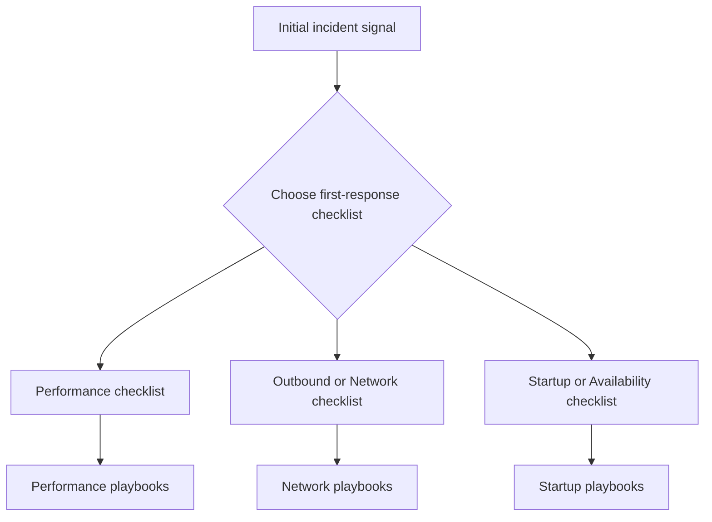

---
content_sources:
  diagrams:
    - id: troubleshooting-first-10-minutes-index-diagram-1
      type: graph
      source: self-generated
      justification: "Self-generated troubleshooting diagram synthesized from Microsoft Learn diagnostics and Azure App Service incident guidance for this guide."
      based_on:
        - https://learn.microsoft.com/en-us/azure/app-service/troubleshoot-diagnostic-logs
        - https://learn.microsoft.com/en-us/azure/app-service/troubleshoot-http-502-http-503
---
# Checklists

Fast triage guides for the first 10 minutes of an investigation.

These checklists help you quickly narrow down the problem category and identify which playbook to follow for deeper analysis.

<!-- diagram-id: troubleshooting-first-10-minutes-index-diagram-1 -->

| Checklist | When to Use |
|-----------|-------------|
| [Performance](performance.md) | Slow responses, high latency, elevated error rates |
| [Outbound / Network](outbound-network.md) | Outbound connection failures, DNS issues, SNAT |
| [Startup / Availability](startup-availability.md) | Container won't start, site down, deployment failures |

## See Also

- [Performance Checklist](performance.md)
- [Outbound / Network Checklist](outbound-network.md)
- [Startup / Availability Checklist](startup-availability.md)
