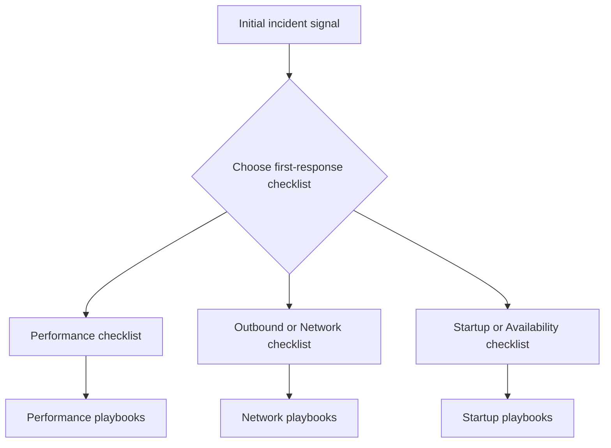

---
content_sources:
  diagrams:
    - id: troubleshooting-first-10-minutes-index-diagram-1
      type: graph
      source: self-generated
      justification: Self-generated troubleshooting diagram synthesized from Microsoft Learn diagnostics and Azure App Service incident guidance for this guide.
      based_on:
        - https://learn.microsoft.com/en-us/azure/app-service/troubleshoot-diagnostic-logs
        - https://learn.microsoft.com/en-us/azure/app-service/troubleshoot-http-502-http-503
---
# Checklists

Fast triage guides for the first 10 minutes of an investigation.

These checklists help you quickly narrow down the problem category and identify which playbook to follow for deeper analysis.

<!-- diagram-id: troubleshooting-first-10-minutes-index-diagram-1 -->

```mermaid
graph TD
    A[Initial incident signal] --> B{Choose first-response checklist}
    B --> C[Performance checklist]
    B --> D[Outbound or Network checklist]
    B --> E[Startup or Availability checklist]
    C --> F[Performance playbooks]
    D --> G[Network playbooks]
    E --> H[Startup playbooks]
```

| Checklist | When to Use |
|-----------|-------------|
| [Performance](performance.md) | Slow responses, high latency, elevated error rates |
| [Outbound / Network](outbound-network.md) | Outbound connection failures, DNS issues, SNAT |
| [Startup / Availability](startup-availability.md) | Container won't start, site down, deployment failures |

## Portal views

Each checklist row above has a corresponding entry surface in the Azure Portal. The following blades render rows that overlap with the checklist's "When to Use" wording without leaving the Portal navigation.

### Portal view: Performance checklist

**[Observed]** `app-test-20251107 | Metrics` `Web App` `New chart` `Refresh` `Share` `Local Time: Last 24 hours (Automatic)` `Chart Title` `Add metric` `Add filter` `Apply splitting` `Line chart` `Drill into Logs` `New alert rule` `Save to dashboard` `Scope` `app-test-20251107` `Metric Namespace` `App Service standard...` `Metric` `Select metric` `Aggregation` `Select aggregation` `Select a metric above to see data appear on this chart or learn more below:` `Filter + Split` `Apply filters and splits to identify outlying segments` `Plot multiple metrics` `Create charts with multiple metrics and resources` `Build custom dashboards` `Pin charts to your dashboards` `Jun 07` `6 AM` `12 PM` `6 PM` `UTC+09:00`.

**[Inferred]** The metric-definition row labels `Scope`, `Metric Namespace`, `Metric`, and `Aggregation` are consistent with the per-chart configuration steps suggested by the [Performance](performance.md) checklist row above ("Slow responses, high latency, elevated error rates"). The `Local Time: Last 24 hours (Automatic)` time range chip is consistent with the first-10-minutes triage window scope of this index page.

**[Not Proven]** Additional metric value detail, data series detail, and historical detail are not visible on this view.

### Portal view: Outbound / Network checklist

![app-test-20251107 | Networking | Web App | Refresh | Troubleshoot | Send us your feedback | Inbound traffic configuration | Public network access | Enabled with no access restrictions | App assigned address | Not configured | Private endpoints | 0 private endpoints | Inbound IPv4 addresses | <ip-redacted> | Inbound IPv6 addresses | <ipv6-redacted> | Outbound traffic configuration | Virtual network integration | Not configured | Hybrid connections | Not configured | Outbound DNS | Default (Azure-provided) | Integration subnet configuration | NAT gateway | N/A | Network security group | N/A | User defined route | N/A](../../assets/troubleshooting/networking/01-networking-hub.png)

**[Observed]** `app-test-20251107 | Networking` `Web App` `Refresh` `Troubleshoot` `Send us your feedback` `Check your network configuration. Select any of the features listed below to change your network setup.` `Learn more` `Inbound traffic configuration` `Public network access` `Enabled with no access restrictions` `Using default behavior` `App assigned address` `Not configured` `Private endpoints` `0 private endpoints` `Inbound IPv4 addresses` `<ip-redacted>` `Inbound IPv6 addresses` `<ipv6-redacted>` `Outbound traffic configuration` `Virtual network integration` `Not configured` `Hybrid connections` `Not configured` `Outbound DNS` `Default (Azure-provided)` `Outbound IPv4 addresses` `Outbound IPv6 addresses` `Integration subnet configuration` `NAT gateway` `N/A` `Network security group` `N/A` `User defined route` `N/A`.

**[Inferred]** The `Outbound traffic configuration` section labels `Virtual network integration`, `Hybrid connections`, `Outbound DNS`, and the `Outbound IPv4 addresses` list are consistent with the outbound-related topics listed in the [Outbound / Network](outbound-network.md) checklist row above ("Outbound connection failures, DNS issues, SNAT"). The `Integration subnet configuration` section with its `NAT gateway`, `Network security group`, and `User defined route` rows all showing `N/A` is consistent with the `Virtual network integration` row showing `Not configured` directly above.

**[Not Proven]** Additional outbound-configuration detail beyond the visible summary is not shown on this view.

### Portal view: Startup / Availability checklist

![app-test-20251107 | Diagnose and solve problems | Web App | Search for common problems or tools | Refresh | Feedback | Common Solutions | AI-powered Diagnostics (preview) | Risk alerts | Availability | 2 Critical | View more details | Troubleshooting categories | Availability and Performance | Application Logs | App Down Workflow | Web App Down | Configuration and Management | Investigate EasyAuth errors | IP Address Configuration | All Scaling Operations | Risk Assessments | Availability risks | Configuration risks | Deployment | Troubleshoot | Networking | Diagnostic Tools | Auto-Heal | Network Troubleshooter | Advanced Application Restart | Load Test your App | Create Load Test | Popular troubleshooting tools | Application Logs | App Down Workflow | Web App Down | Web App Slow | Process Full List](../../assets/troubleshooting/diagnose-and-solve/01-overview.png)

**[Observed]** `app-test-20251107 | Diagnose and solve problems` `Web App` `Search for common problems or tools` `Refresh` `Feedback` `Common Solutions` `AI-powered Diagnostics (preview)` `Risk alerts` `Availability` `2 Critical` `View more details` `Troubleshooting categories` `Availability and Performance` `Check your app's health and discover app or platform issues.` `Application Logs` `App Down Workflow` `Web App Down` `Configuration and Management` `Find out if your app service features are misconfigured.` `Investigate EasyAuth errors` `IP Address Configuration` `All Scaling Operations` `Risk Assessments` `Analyze your app for optimal performance and configurations.` `Availability risks` `Configuration risks` `Deployment` `Discover and resolve issues with your application code deployments.` `Troubleshoot` `Networking` `Discover and resolve any networking related issues with your resources.` `Diagnostic Tools` `Run proactive tools to automatically mitigate the app.` `Auto-Heal` `Network Troubleshooter` `Advanced Application Restart` `Load Test your App` `Generate high-scale load on your application to identify performance bottlenecks.` `Create Load Test` `Popular troubleshooting tools` `Application Logs` `App Down Workflow` `Web App Down` `Web App Slow` `Process Full List`.

**[Inferred]** The `Availability and Performance` category card lists the links `Application Logs`, `App Down Workflow`, and `Web App Down`. The `Popular troubleshooting tools` section at the bottom repeats `App Down Workflow` and `Web App Down`, and additionally lists `Web App Slow` and `Process Full List`. These link names are consistent with the topics listed in the [Startup / Availability](startup-availability.md) checklist row above ("Container won't start, site down, deployment failures") and the [Performance](performance.md) checklist row ("Slow responses").

**[Not Proven]** Additional alert detail and detector detail beyond the visible summaries is not shown on this view.

## See Also

- [Performance Checklist](performance.md)
- [Outbound / Network Checklist](outbound-network.md)
- [Startup / Availability Checklist](startup-availability.md)

## Sources

- [Microsoft Learn source 1](https://learn.microsoft.com/en-us/azure/app-service/troubleshoot-diagnostic-logs)
- [Microsoft Learn source 2](https://learn.microsoft.com/en-us/azure/app-service/troubleshoot-http-502-http-503)
